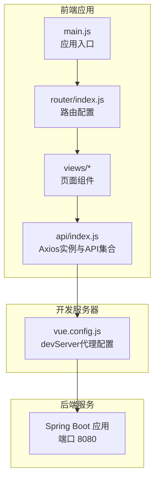
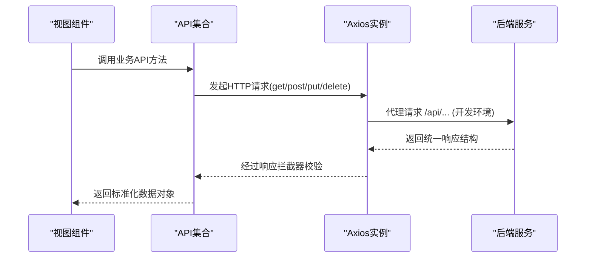
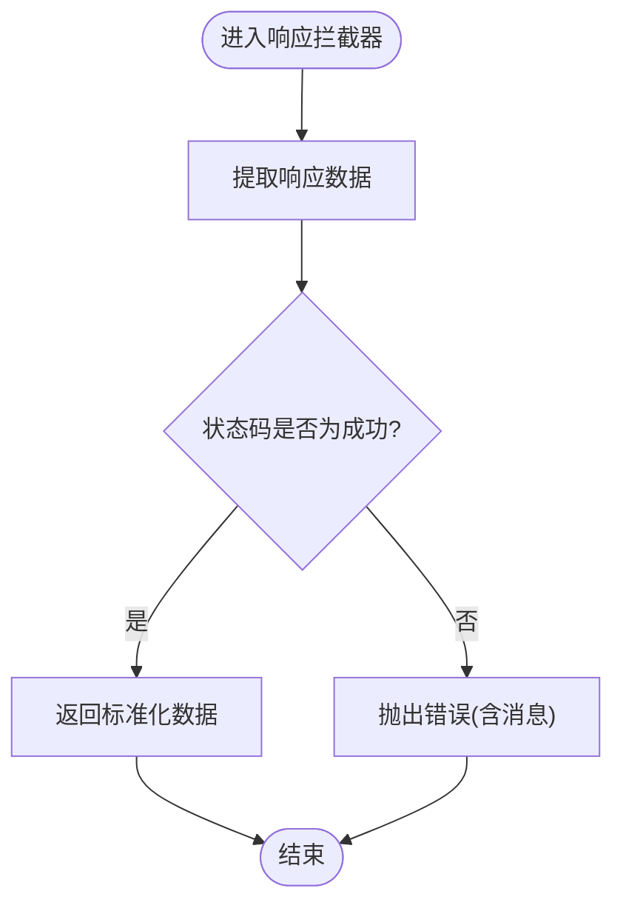
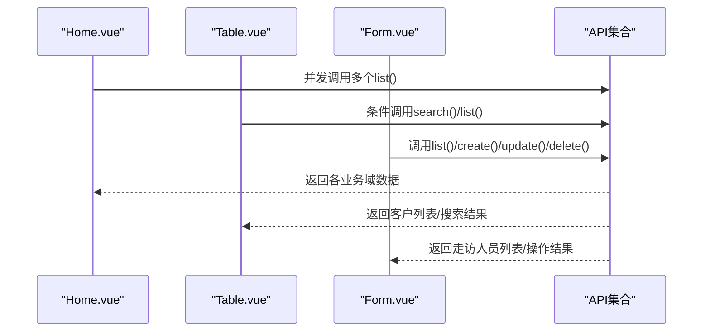
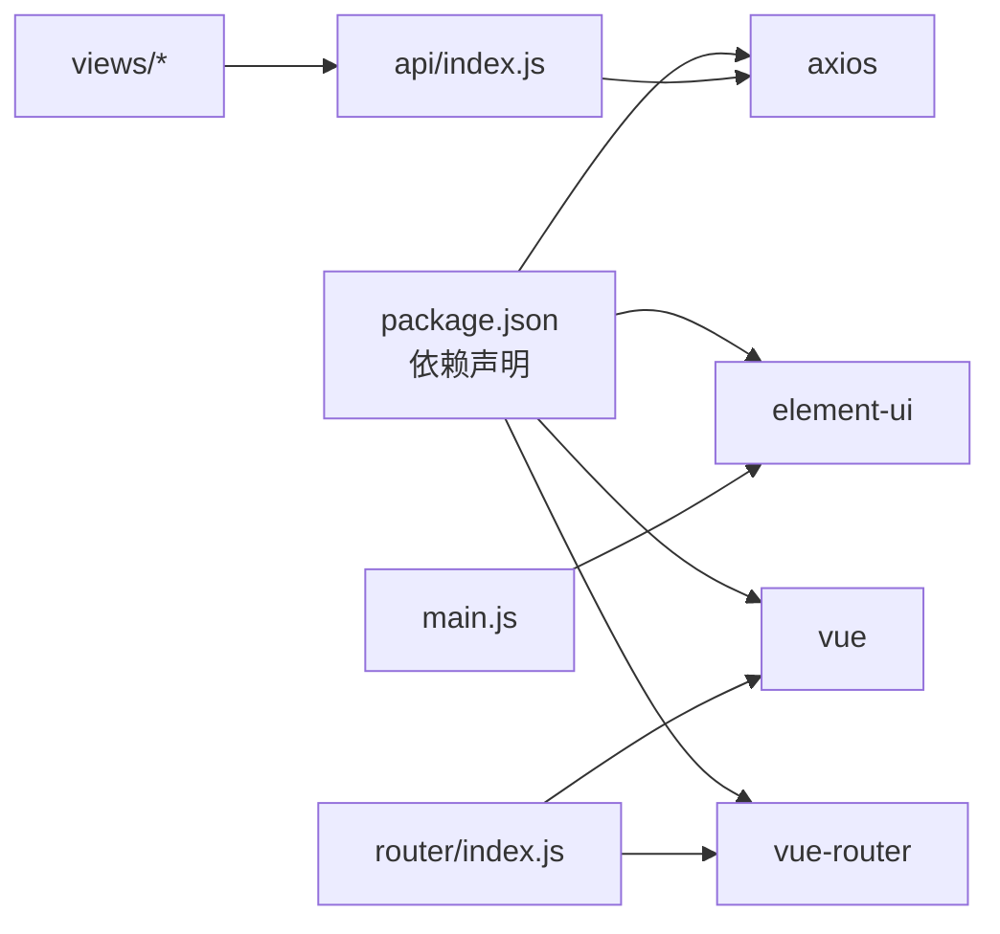

# API服务层

<cite>
**本文引用的文件**
- [src/api/index.js](file://src/api/index.js)
- [src/main.js](file://src/main.js)
- [package.json](file://package.json)
- [vue.config.js](file://vue.config.js)
- [src/router/index.js](file://src/router/index.js)
- [src/views/Home.vue](file://src/views/Home.vue)
- [src/views/Table.vue](file://src/views/Table.vue)
- [src/views/Form.vue](file://src/views/Form.vue)
</cite>

## 目录
1. [简介](#简介)
2. [项目结构](#项目结构)
3. [核心组件](#核心组件)
4. [架构总览](#架构总览)
5. [详细组件分析](#详细组件分析)
6. [依赖关系分析](#依赖关系分析)
7. [性能考量](#性能考量)
8. [故障排查指南](#故障排查指南)
9. [结论](#结论)
10. [附录](#附录)

## 简介
本文件面向Vue.js后台管理系统，聚焦于API服务层的技术文档。内容涵盖HTTP请求封装设计模式、Axios客户端配置与拦截器实现、API接口组织结构与调用约定、错误处理机制、请求重试策略与响应数据格式化、具体接口定义与参数说明、最佳实践、性能优化建议以及安全注意事项。同时解释前端与后端服务的集成方式与数据同步策略。

## 项目结构
API服务层位于前端工程的src/api目录下，采用按业务域分组的模块化组织方式，统一通过Axios实例进行HTTP请求封装，并在开发环境下通过webpack devServer代理到后端服务。

图表来源
- [src/main.js:1-14](file://src/main.js#L1-L14)
- [src/router/index.js:1-32](file://src/router/index.js#L1-L32)
- [src/api/index.js:1-110](file://src/api/index.js#L1-L110)
- [vue.config.js:1-13](file://vue.config.js#L1-L13)

章节来源
- [src/api/index.js:1-110](file://src/api/index.js#L1-L110)
- [vue.config.js:1-13](file://vue.config.js#L1-L13)

## 核心组件
- Axios实例与拦截器
  - 基础URL：统一前缀“/api”
  - 超时时间：15秒
  - 请求拦截器：当前为空实现，便于后续扩展（如注入认证头）
  - 响应拦截器：统一校验响应体中的状态码字段，非成功状态抛出错误
- API集合导出
  - 用户管理：list/getById/search/create/update/delete/batchDelete
  - 客户管理：list/getById/getByNo/search/create/update/delete/batchDelete
  - 公司管理：list/getById/search/create/update/delete/batchDelete
  - 公司走访：list/getByCompanyId/getById/create/update/delete/batchDelete
  - 客户走访：list/getByCustomerId/getById/create/update/delete/batchDelete
  - 走访人员：list/getById/create/update/delete/batchDelete
  - 网格员：list/getById/create/update/delete/batchDelete
  - 默认导出：Axios实例本身

章节来源
- [src/api/index.js:1-110](file://src/api/index.js#L1-L110)

## 架构总览
前端通过Axios实例发起HTTP请求，开发环境由webpack devServer代理转发至后端服务；响应拦截器对后端返回的统一结构进行校验，保证上层组件只接收标准化的数据对象。

图表来源
- [src/api/index.js:1-110](file://src/api/index.js#L1-L110)
- [vue.config.js:1-13](file://vue.config.js#L1-L13)

## 详细组件分析

### Axios实例与拦截器
- 设计要点
  - 单一实例：集中配置基础URL与超时，避免分散配置带来的不一致
  - 请求拦截器：预留扩展点，可用于注入Token、追踪ID等
  - 响应拦截器：统一校验后端返回的状态码字段，非成功状态统一抛错，简化上层错误处理
- 数据流
  - 请求阶段：拦截器可修改请求配置（如headers），随后发送
  - 响应阶段：拦截器提取data并校验状态码，成功透传，失败抛出错误
- 错误处理
  - 响应拦截器会根据后端返回的错误信息构造错误对象
  - 上层组件通过Promise链或async/await捕获错误并展示

图表来源
- [src/api/index.js:19-31](file://src/api/index.js#L19-L31)

章节来源
- [src/api/index.js:1-31](file://src/api/index.js#L1-L31)

### API接口组织与命名规范
- 组织方式
  - 按业务域分组导出API对象，如用户管理、客户管理、公司管理等
  - 每个域包含标准的CRUD方法与特定查询方法（如search、getByNo、getByCompanyId等）
- 命名规范
  - 方法名遵循REST风格：list、getById、search、create、update、delete、batchDelete
  - 参数传递：查询参数使用params，请求体使用data
- 调用约定
  - 所有API均返回Axios响应对象（包含data、status等），上层组件通常使用data字段
  - 批量删除以请求体形式传递数组

章节来源
- [src/api/index.js:33-107](file://src/api/index.js#L33-L107)

### 页面组件中的API使用
- Home页：并发拉取多个业务域的列表数据，使用Promise.all并为每个请求添加兜底，避免单点失败影响整体加载
- Table页：支持搜索与分页，搜索时使用search接口，分页通过本地切片模拟
- Form页：用于走访人员的增删改查，使用list、create、update、delete

图表来源
- [src/views/Home.vue:134-139](file://src/views/Home.vue#L134-L139)
- [src/views/Table.vue:136-144](file://src/views/Table.vue#L136-L144)
- [src/views/Form.vue:81-85](file://src/views/Form.vue#L81-L85)
- [src/api/index.js:33-107](file://src/api/index.js#L33-L107)

章节来源
- [src/views/Home.vue:108-156](file://src/views/Home.vue#L108-L156)
- [src/views/Table.vue:98-208](file://src/views/Table.vue#L98-L208)
- [src/views/Form.vue:56-137](file://src/views/Form.vue#L56-L137)

### 开发代理与后端集成
- 开发代理
  - 将所有以“/api”开头的请求代理到后端服务地址
  - 代理目标：http://localhost:8080
  - 改写源：开启跨域支持
- 集成方式
  - 前端通过Axios实例直接调用“/api/...”路径，无需关心后端真实地址
  - 代理确保前后端分离开发时的连通性

章节来源
- [vue.config.js:1-13](file://vue.config.js#L1-L13)
- [src/api/index.js:4-7](file://src/api/index.js#L4-L7)

## 依赖关系分析
- 外部依赖
  - axios：HTTP客户端库
  - element-ui：UI组件库
  - vue、vue-router：前端框架与路由
- 内部依赖
  - main.js引入Element UI并挂载应用
  - 各页面组件按需从API集合导入所需方法
  - 路由配置控制页面跳转

图表来源
- [package.json:10-16](file://package.json#L10-L16)
- [src/main.js:1-14](file://src/main.js#L1-L14)
- [src/router/index.js:1-32](file://src/router/index.js#L1-L32)
- [src/api/index.js:1-110](file://src/api/index.js#L1-L110)

章节来源
- [package.json:1-29](file://package.json#L1-L29)
- [src/main.js:1-14](file://src/main.js#L1-L14)
- [src/router/index.js:1-32](file://src/router/index.js#L1-L32)
- [src/api/index.js:1-110](file://src/api/index.js#L1-L110)

## 性能考量
- 请求合并与并发
  - 在首页使用Promise.all并发拉取多个列表，减少总等待时间
  - 注意：并发数量不宜过大，避免对后端造成瞬时压力
- 本地分页与搜索
  - 表格页在前端进行分页与搜索，降低后端压力；当数据量增大时建议改为后端分页/搜索
- 超时与重试
  - 当前Axios实例设置了统一超时，未实现自动重试；可在请求拦截器中按需增加指数退避重试逻辑
- 缓存策略
  - 对于不频繁变动的数据，可在组件内缓存响应结果，避免重复请求
- 图标与样式
  - 使用Element UI图标与样式，保持一致性与可维护性

章节来源
- [src/views/Home.vue:134-139](file://src/views/Home.vue#L134-L139)
- [src/views/Table.vue:136-144](file://src/views/Table.vue#L136-L144)
- [src/api/index.js:4-7](file://src/api/index.js#L4-L7)

## 故障排查指南
- 常见问题
  - 404/代理失败：确认vue.config.js代理配置与后端端口一致
  - 401/403：检查请求拦截器是否注入了必要的认证信息
  - 504/超时：调整Axios超时时间或优化后端接口性能
  - 响应非成功：响应拦截器会抛出错误，检查后端返回的状态码与消息
- 排查步骤
  - 打开浏览器开发者工具Network标签，观察请求与响应
  - 在组件中为API调用添加catch并打印错误信息
  - 确认后端服务已启动且可访问
- 错误处理建议
  - 组件层统一捕获错误并提示用户
  - 对批量操作与危险操作增加二次确认

章节来源
- [vue.config.js:1-13](file://vue.config.js#L1-L13)
- [src/api/index.js:19-31](file://src/api/index.js#L19-L31)
- [src/views/Home.vue:144-146](file://src/views/Home.vue#L144-L146)
- [src/views/Table.vue:149-153](file://src/views/Table.vue#L149-L153)
- [src/views/Form.vue:86-90](file://src/views/Form.vue#L86-L90)

## 结论
该API服务层以Axios为核心，采用统一实例与拦截器设计，结合按业务域的API集合导出，实现了清晰的职责划分与良好的可扩展性。配合开发代理与组件层的错误处理与性能优化策略，能够满足后台管理系统的典型需求。后续可在请求拦截器中增强认证与日志能力，在组件层完善重试与缓存策略，进一步提升稳定性与用户体验。

## 附录

### API接口定义与调用约定
- 用户管理
  - 列表：GET /api/user/list
  - 获取详情：GET /api/user/{id}
  - 搜索：GET /api/user/search?...
  - 新增：POST /api/user
  - 更新：PUT /api/user
  - 删除：DELETE /api/user/{id}
  - 批量删除：DELETE /api/user/batch（请求体为ID数组）
- 客户管理
  - 列表：GET /api/customer/list
  - 获取详情：GET /api/customer/{id}
  - 通过编号获取：GET /api/customer/no/{customerNo}
  - 搜索：GET /api/customer/search?...
  - 新增/更新/删除/批量删除：同用户管理
- 公司管理
  - 列表：GET /api/company/list
  - 获取详情：GET /api/company/{id}
  - 搜索：GET /api/company/search?...
  - 新增/更新/删除/批量删除：同用户管理
- 公司走访
  - 列表：GET /api/company-visit/list
  - 按公司筛选：GET /api/company-visit/list?companyId=...
  - 获取详情：GET /api/company-visit/{id}
  - 新增/更新/删除/批量删除：同用户管理
- 客户走访
  - 列表：GET /api/customer-visit/list
  - 按客户筛选：GET /api/customer-visit/list?customerId=...
  - 获取详情：GET /api/customer-visit/{id}
  - 新增/更新/删除/批量删除：同用户管理
- 走访人员
  - 列表：GET /api/visit-person/list
  - 获取详情：GET /api/visit-person/{id}
  - 新增/更新/删除/批量删除：同用户管理
- 网格员
  - 列表：GET /api/grid-member/list?companyId=...
  - 获取详情：GET /api/grid-member/{id}
  - 新增/更新/删除/批量删除：同用户管理

章节来源
- [src/api/index.js:33-107](file://src/api/index.js#L33-L107)

### 最佳实践
- 统一错误处理：在组件中对API调用进行try/catch，并结合Element UI的消息组件反馈
- 幂等性：对删除与更新操作增加二次确认
- 分页与搜索：小数据量可用前端分页，大数据量迁移至后端分页/搜索
- 代理配置：开发环境使用代理，生产环境通过反向代理或CDN统一转发
- 安全：在请求拦截器中注入认证信息，避免敏感信息出现在URL中

章节来源
- [src/views/Home.vue:134-156](file://src/views/Home.vue#L134-L156)
- [src/views/Table.vue:173-206](file://src/views/Table.vue#L173-L206)
- [src/views/Form.vue:98-135](file://src/views/Form.vue#L98-L135)
- [vue.config.js:6-11](file://vue.config.js#L6-L11)