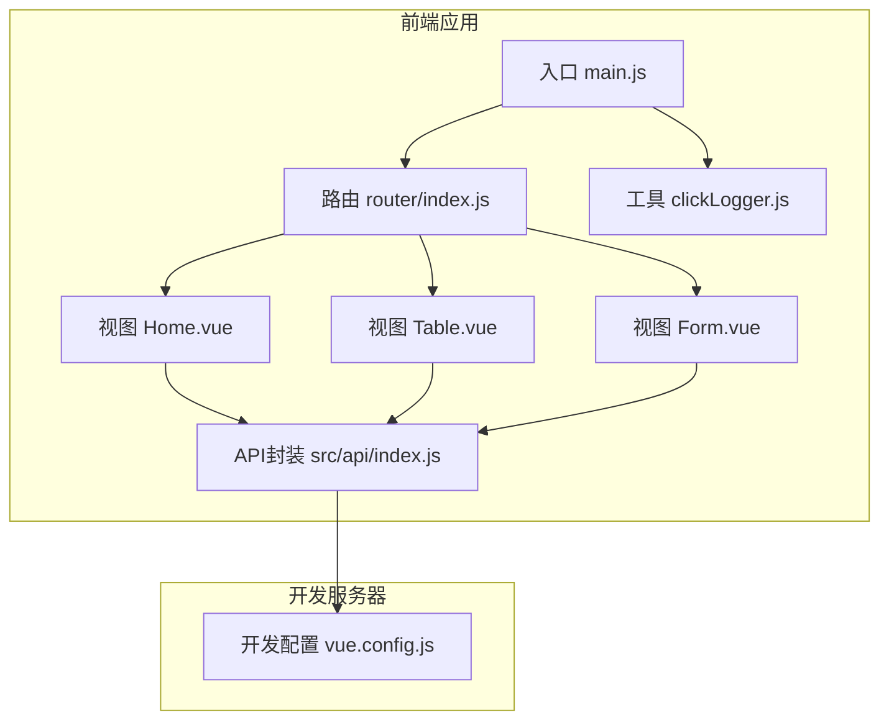
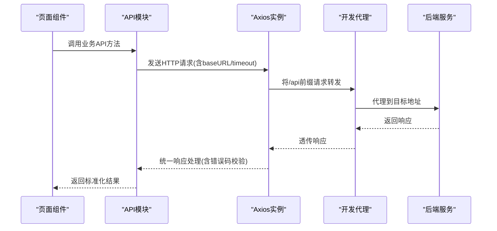
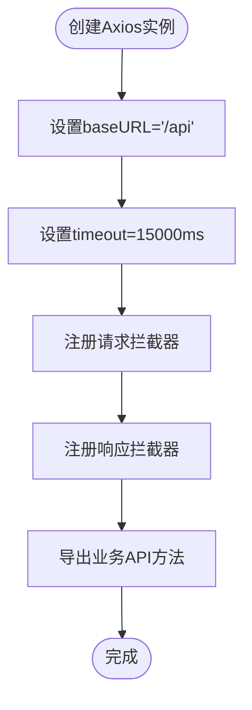
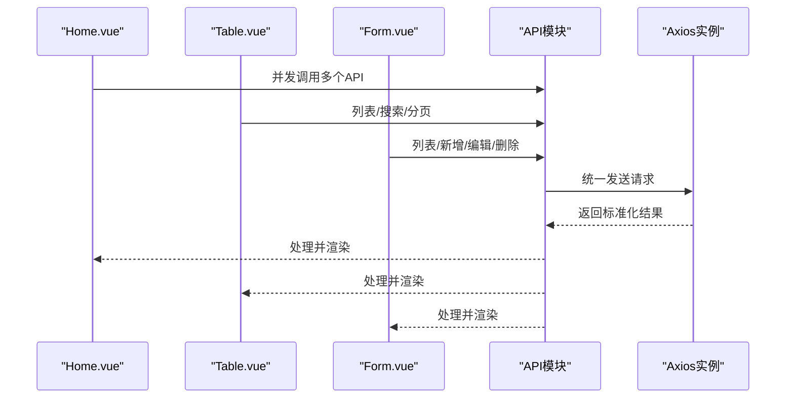
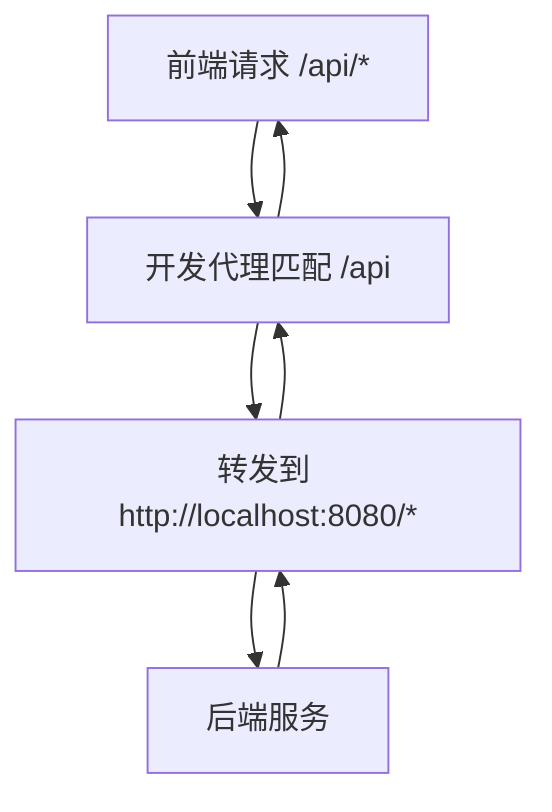
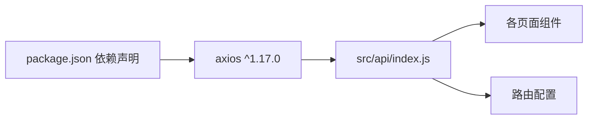

# Axios配置与实例

<cite>
**本文引用的文件**
- [src/api/index.js](file://src/api/index.js)
- [vue.config.js](file://vue.config.js)
- [package.json](file://package.json)
- [src/views/Home.vue](file://src/views/Home.vue)
- [src/views/Table.vue](file://src/views/Table.vue)
- [src/views/Form.vue](file://src/views/Form.vue)
- [src/router/index.js](file://src/router/index.js)
- [src/main.js](file://src/main.js)
- [src/utils/clickLogger.js](file://src/utils/clickLogger.js)
</cite>

## 目录
1. [引言](#引言)
2. [项目结构](#项目结构)
3. [核心组件](#核心组件)
4. [架构总览](#架构总览)
5. [详细组件分析](#详细组件分析)
6. [依赖关系分析](#依赖关系分析)
7. [性能考量](#性能考量)
8. [故障排查指南](#故障排查指南)
9. [结论](#结论)
10. [附录](#附录)

## 引言
本文件围绕Vue.js项目中的Axios配置与实例展开，系统性解析axios实例的创建流程、baseURL与timeout等关键配置的作用机制，梳理HTTP客户端初始化参数、默认配置与全局设置，并结合项目实际给出性能优化、安全注意事项与调试技巧。同时提供开发与生产环境的差异化配置建议，帮助读者在保证功能正确性的前提下提升稳定性与可维护性。

## 项目结构
该项目采用典型的Vue 2单页应用结构，Axios相关逻辑集中在统一的API模块中，前端通过开发服务器代理访问后端服务，页面组件按需调用API模块导出的方法完成业务交互。

图表来源
- [src/main.js:1-18](file://src/main.js#L1-L18)
- [src/router/index.js:1-32](file://src/router/index.js#L1-L32)
- [src/views/Home.vue:108-156](file://src/views/Home.vue#L108-L156)
- [src/views/Table.vue:99-208](file://src/views/Table.vue#L99-L208)
- [src/views/Form.vue:57-137](file://src/views/Form.vue#L57-L137)
- [src/api/index.js:1-110](file://src/api/index.js#L1-L110)
- [vue.config.js:1-14](file://vue.config.js#L1-L14)
- [src/utils/clickLogger.js:1-70](file://src/utils/clickLogger.js#L1-L70)

章节来源
- [src/main.js:1-18](file://src/main.js#L1-L18)
- [src/router/index.js:1-32](file://src/router/index.js#L1-L32)
- [src/api/index.js:1-110](file://src/api/index.js#L1-L110)
- [vue.config.js:1-14](file://vue.config.js#L1-L14)

## 核心组件
- Axios实例与拦截器
  - 在API模块中创建axios实例并设置基础配置（baseURL、timeout），随后注册请求/响应拦截器，统一处理业务错误码与异常分支。
  - 该实例作为各业务API方法的底层客户端，确保请求路径、超时控制与错误处理策略的一致性。
- 开发代理与跨域
  - 通过开发服务器配置将/api前缀转发到本地后端地址，避免开发阶段的跨域问题，简化联调流程。
- 页面组件与API调用
  - 首页与表格、表单页面分别导入API模块中的方法，发起GET/POST/PUT/DELETE等请求，实现数据展示与CRUD操作。
- 依赖与版本
  - 项目依赖axios指定版本，确保拦截器与配置行为稳定一致。

章节来源
- [src/api/index.js:1-110](file://src/api/index.js#L1-L110)
- [vue.config.js:1-14](file://vue.config.js#L1-L14)
- [src/views/Home.vue:108-156](file://src/views/Home.vue#L108-L156)
- [src/views/Table.vue:99-208](file://src/views/Table.vue#L99-L208)
- [src/views/Form.vue:57-137](file://src/views/Form.vue#L57-L137)
- [package.json:10-16](file://package.json#L10-L16)

## 架构总览
下图展示了从页面组件到Axios实例再到开发代理的整体调用链路，体现请求如何被规范化地发送与接收。

图表来源
- [src/views/Home.vue:134-147](file://src/views/Home.vue#L134-L147)
- [src/views/Table.vue:136-154](file://src/views/Table.vue#L136-L154)
- [src/views/Form.vue:81-91](file://src/views/Form.vue#L81-L91)
- [src/api/index.js:34-42](file://src/api/index.js#L34-L42)
- [src/api/index.js:20-31](file://src/api/index.js#L20-L31)
- [vue.config.js:6-11](file://vue.config.js#L6-L11)

## 详细组件分析

### Axios实例创建与配置
- 实例创建
  - 使用axios.create传入基础配置，形成独立的客户端实例，便于集中管理拦截器与默认行为。
- 关键配置
  - baseURL：统一前缀为/api，使后续API方法无需重复拼接完整路径，降低出错概率。
  - timeout：设置为15000毫秒，平衡网络波动与用户体验；过短可能导致弱网抖动失败，过长会拉长用户等待时间。
- 拦截器设计
  - 请求拦截器：允许在发送前注入通用字段（如鉴权令牌、traceId等），当前实现为空，便于扩展。
  - 响应拦截器：统一读取响应数据并校验业务状态码，非200时抛出错误，便于上层统一处理。
- 导出规范
  - 将各业务API方法绑定到同一实例，形成清晰的命名空间式导出，便于按模块复用。

图表来源
- [src/api/index.js:4-7](file://src/api/index.js#L4-L7)
- [src/api/index.js:9-17](file://src/api/index.js#L9-L17)
- [src/api/index.js:19-31](file://src/api/index.js#L19-L31)
- [src/api/index.js:34-107](file://src/api/index.js#L34-L107)

章节来源
- [src/api/index.js:1-110](file://src/api/index.js#L1-L110)

### 页面组件中的API调用
- 首页统计
  - 使用Promise.all并发请求多个业务接口，失败时降级返回空数组，避免单一接口异常影响整体渲染。
- 表格与表单
  - 列表加载、分页与搜索均通过API模块方法实现；新增/编辑/删除操作在提交前进行表单校验，成功后刷新列表。
- 错误处理
  - 组件内对API调用进行try/catch与消息提示，保证用户反馈及时且界面不崩溃。

图表来源
- [src/views/Home.vue:134-147](file://src/views/Home.vue#L134-L147)
- [src/views/Table.vue:136-154](file://src/views/Table.vue#L136-L154)
- [src/views/Form.vue:81-91](file://src/views/Form.vue#L81-L91)
- [src/api/index.js:34-107](file://src/api/index.js#L34-L107)

章节来源
- [src/views/Home.vue:108-156](file://src/views/Home.vue#L108-L156)
- [src/views/Table.vue:99-208](file://src/views/Table.vue#L99-L208)
- [src/views/Form.vue:57-137](file://src/views/Form.vue#L57-L137)
- [src/api/index.js:34-107](file://src/api/index.js#L34-L107)

### 开发代理与跨域处理
- 代理规则
  - 将/api前缀的请求转发至本地后端地址，解决开发阶段的跨域限制，简化前后端联调。
- 端口与自动打开
  - 开发服务器端口与自动打开浏览器等配置便于快速启动与体验。
- 生产环境
  - 生产构建通常由后端统一暴露静态资源与接口，无需额外代理；若仍需代理，可在部署层或反向代理处统一处理。

图表来源
- [vue.config.js:6-11](file://vue.config.js#L6-L11)

章节来源
- [vue.config.js:1-14](file://vue.config.js#L1-L14)

## 依赖关系分析
- 组件耦合
  - 页面组件仅依赖API模块导出的方法，不直接接触Axios实例，降低耦合度，便于替换或升级底层HTTP库。
- 外部依赖
  - axios版本在package.json中明确声明，确保团队成员与CI环境一致。
- 可能的改进点
  - 若未来引入鉴权体系，可在请求拦截器中注入令牌；若需要统一错误提示，可在响应拦截器中映射错误码到用户可读消息。

图表来源
- [package.json:10-16](file://package.json#L10-L16)
- [src/api/index.js:1-110](file://src/api/index.js#L1-L110)
- [src/router/index.js:1-32](file://src/router/index.js#L1-L32)

章节来源
- [package.json:10-16](file://package.json#L10-L16)
- [src/api/index.js:1-110](file://src/api/index.js#L1-L110)
- [src/router/index.js:1-32](file://src/router/index.js#L1-L32)

## 性能考量
- 超时设置
  - 15000ms的timeout在弱网环境下具备一定韧性，但可能增加用户等待时间。建议根据业务场景与网络质量动态调整，或针对长耗时接口单独放宽。
- 并发与批处理
  - 首页使用并发请求聚合统计，减少总等待时间；但需注意后端是否支持高并发与限流策略，避免触发限速。
- 缓存与去重
  - 对于高频查询且短期内稳定的接口，可在业务层引入缓存或请求去重，降低重复请求次数。
- 体积与懒加载
  - API模块按需导入，页面组件仅在进入对应路由时加载，有助于首屏性能。
- 传输优化
  - 合理使用分页与筛选参数，避免一次性拉取大量数据；必要时启用压缩与CDN加速。

## 故障排查指南
- 常见问题定位
  - 404/路径错误：检查API方法的相对路径与baseURL是否匹配，确认开发代理是否正确转发。
  - 504/超时：检查timeout设置与网络状况，适当提高超时阈值或优化后端接口性能。
  - 401/鉴权失败：确认请求拦截器中是否注入了正确的认证信息。
  - 业务错误码：响应拦截器会对非200状态进行拒绝，需根据后端约定完善错误提示与重试策略。
- 调试技巧
  - 使用浏览器开发者工具Network面板观察请求与响应，核对URL、Headers与Body。
  - 在请求拦截器中打印关键上下文（如URL、参数、时间戳）辅助定位。
  - 对于复杂页面，可临时关闭并发请求，逐一验证每个接口的稳定性。
  - 结合全局点击日志工具，记录用户操作轨迹，辅助复现问题场景。

章节来源
- [src/api/index.js:20-31](file://src/api/index.js#L20-L31)
- [vue.config.js:6-11](file://vue.config.js#L6-L11)
- [src/utils/clickLogger.js:1-70](file://src/utils/clickLogger.js#L1-L70)

## 结论
本项目通过统一的Axios实例与拦截器，实现了请求路径标准化、错误码统一处理与可扩展的中间件能力。配合开发代理与页面组件的合理调用，形成了清晰、可维护的HTTP通信架构。建议在保持现有配置的基础上，逐步引入鉴权、错误映射与缓存策略，持续优化性能与稳定性。

## 附录

### 不同环境下的配置要点
- 开发环境
  - 使用开发服务器代理/api到后端地址，便于联调；可开启自动打开浏览器与热更新。
- 测试/预发布环境
  - 保持与开发一致的代理策略；如后端域名变更，需同步调整代理target。
- 生产环境
  - 前端静态资源由后端统一托管；如需跨域，应在后端或反向代理层统一处理，前端无需代理。

章节来源
- [vue.config.js:1-14](file://vue.config.js#L1-L14)

### 最佳实践清单
- 明确baseURL与相对路径的组合策略，避免硬编码全路径。
- 在请求拦截器中集中注入通用头与上下文信息，保持一致性。
- 在响应拦截器中统一错误处理与业务状态码校验，减少重复代码。
- 对高频接口引入缓存与去重，降低请求压力。
- 为长耗时接口设置合理的timeout与重试策略，兼顾用户体验与可靠性。
- 使用并发请求聚合统计与批量操作，提升页面交互效率。