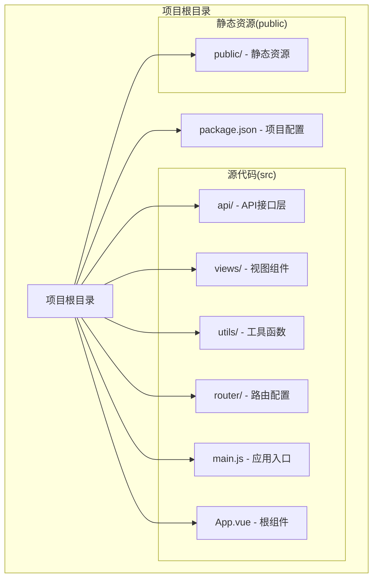
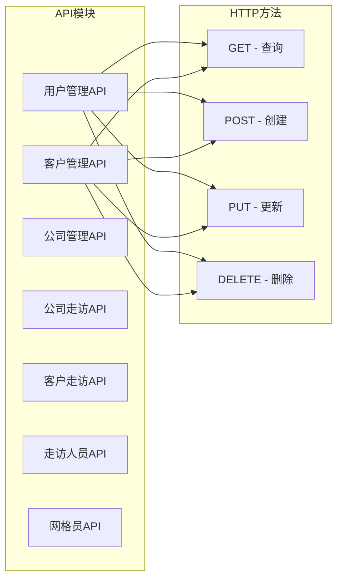
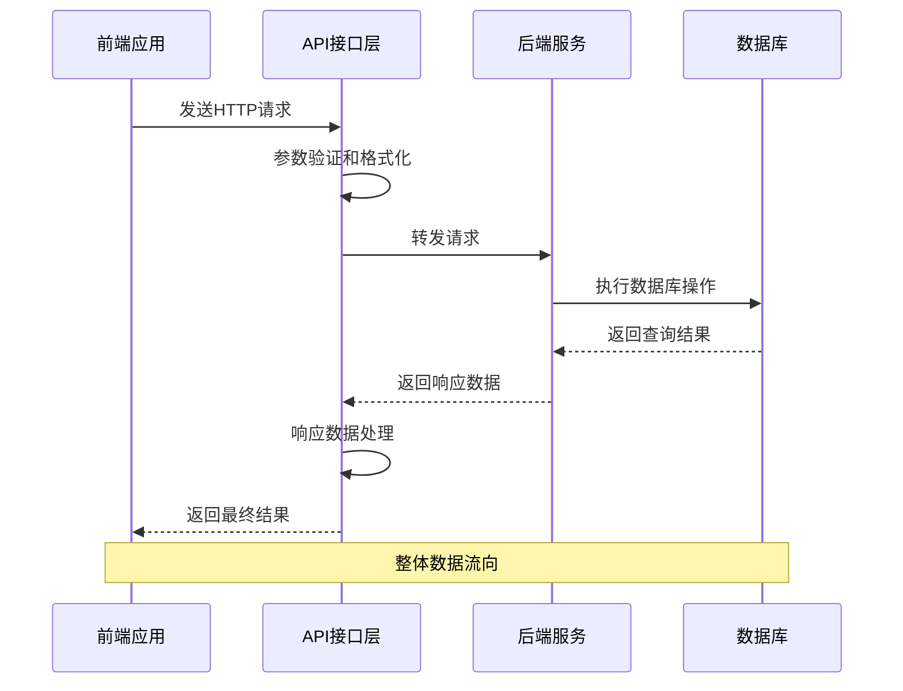
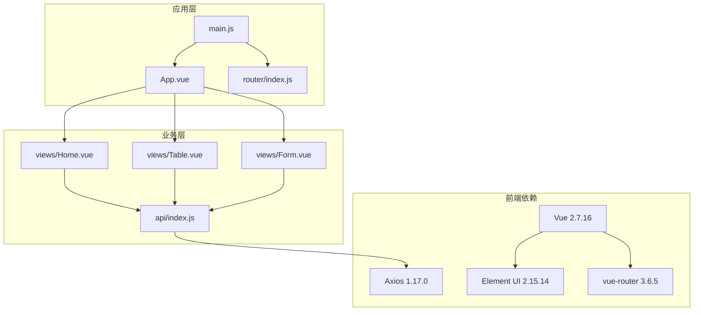
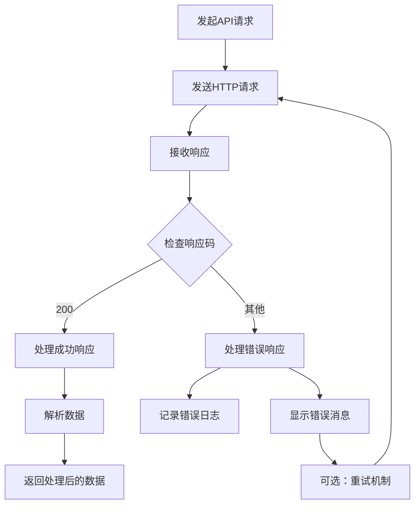

# 业务API接口

<cite>
**本文档引用的文件**
- [src/api/index.js](file://src/api/index.js)
- [src/main.js](file://src/main.js)
- [src/router/index.js](file://src/router/index.js)
- [src/views/Home.vue](file://src/views/Home.vue)
- [src/views/Table.vue](file://src/views/Table.vue)
- [src/views/Form.vue](file://src/views/Form.vue)
- [src/App.vue](file://src/App.vue)
- [package.json](file://package.json)
</cite>

## 目录
1. [简介](#简介)
2. [项目结构](#项目结构)
3. [核心组件](#核心组件)
4. [架构概览](#架构概览)
5. [详细组件分析](#详细组件分析)
6. [依赖关系分析](#依赖关系分析)
7. [性能考虑](#性能考虑)
8. [故障排除指南](#故障排除指南)
9. [结论](#结论)

## 简介

本项目是一个基于Vue.js的后台管理系统，采用前后端分离架构设计。系统通过Axios客户端与后端服务进行通信，实现了用户管理、客户管理、公司管理、走访管理等多个业务模块的API接口。系统使用Element UI作为UI框架，提供了现代化的管理界面和良好的用户体验。

## 项目结构

项目采用标准的Vue CLI项目结构，主要目录组织如下：

**图表来源**
- [src/api/index.js:1-110](file://src/api/index.js#L1-L110)
- [src/main.js:1-18](file://src/main.js#L1-L18)
- [src/router/index.js:1-32](file://src/router/index.js#L1-L32)

**章节来源**
- [src/api/index.js:1-110](file://src/api/index.js#L1-L110)
- [src/main.js:1-18](file://src/main.js#L1-L18)
- [src/router/index.js:1-32](file://src/router/index.js#L1-L32)

## 核心组件

### Axios实例配置

系统通过Axios创建统一的HTTP客户端实例，配置了基础URL和超时时间：

- **基础URL**: `/api` - 所有API请求的基础路径
- **超时时间**: 15秒 - 防止请求长时间挂起
- **拦截器**: 统一处理请求和响应

### API模块化设计

系统将不同业务模块的API接口按照功能进行模块化封装：

**图表来源**
- [src/api/index.js:34-107](file://src/api/index.js#L34-L107)

**章节来源**
- [src/api/index.js:1-32](file://src/api/index.js#L1-L32)

## 架构概览

系统采用前后端分离架构，前端Vue应用通过Axios与后端服务通信：

**图表来源**
- [src/api/index.js:1-110](file://src/api/index.js#L1-L110)

## 详细组件分析

### 用户管理API

用户管理模块提供了完整的CRUD操作接口：

| 接口名称 | HTTP方法 | URL路径 | 功能描述 |
|---------|---------|--------|----------|
| 用户列表 | GET | `/user/list` | 获取用户列表 |
| 用户详情 | GET | `/user/:id` | 根据ID获取用户详情 |
| 用户搜索 | GET | `/user/search` | 搜索用户（支持查询参数） |
| 创建用户 | POST | `/user` | 创建新用户 |
| 更新用户 | PUT | `/user` | 更新用户信息 |
| 删除用户 | DELETE | `/user/:id` | 删除指定用户 |
| 批量删除 | DELETE | `/user/batch` | 批量删除用户 |

**章节来源**
- [src/api/index.js:34-42](file://src/api/index.js#L34-L42)

### 客户管理API

客户管理模块实现了客户信息的完整生命周期管理：

| 接口名称 | HTTP方法 | URL路径 | 功能描述 |
|---------|---------|--------|----------|
| 客户列表 | GET | `/customer/list` | 获取客户列表 |
| 客户详情 | GET | `/customer/:id` | 根据ID获取客户详情 |
| 客户编号查询 | GET | `/customer/no/:customerNo` | 根据客户编号查询 |
| 客户搜索 | GET | `/customer/search` | 搜索客户（支持查询参数） |
| 创建客户 | POST | `/customer` | 创建新客户 |
| 更新客户 | PUT | `/customer` | 更新客户信息 |
| 删除客户 | DELETE | `/customer/:id` | 删除指定客户 |
| 批量删除 | DELETE | `/customer/batch` | 批量删除客户 |

**章节来源**
- [src/api/index.js:45-54](file://src/api/index.js#L45-L54)

### 公司管理API

公司管理模块提供企业客户的管理功能：

| 接口名称 | HTTP方法 | URL路径 | 功能描述 |
|---------|---------|--------|----------|
| 公司列表 | GET | `/company/list` | 获取公司列表 |
| 公司详情 | GET | `/company/:id` | 根据ID获取公司详情 |
| 公司搜索 | GET | `/company/search` | 搜索公司（支持查询参数） |
| 创建公司 | POST | `/company` | 创建新公司 |
| 更新公司 | PUT | `/company` | 更新公司信息 |
| 删除公司 | DELETE | `/company/:id` | 删除指定公司 |
| 批量删除 | DELETE | `/company/batch` | 批量删除公司 |

**章节来源**
- [src/api/index.js:57-65](file://src/api/index.js#L57-L65)

### 公司走访API

公司走访模块管理公司的走访记录：

| 接口名称 | HTTP方法 | URL路径 | 功能描述 |
|---------|---------|--------|----------|
| 走访列表 | GET | `/company-visit/list` | 获取公司走访列表 |
| 按公司查询 | GET | `/company-visit/list?companyId=:companyId` | 根据公司ID查询走访记录 |
| 走访详情 | GET | `/company-visit/:id` | 根据ID获取走访详情 |
| 创建走访 | POST | `/company-visit` | 创建新的公司走访记录 |
| 更新走访 | PUT | `/company-visit` | 更新走访信息 |
| 删除走访 | DELETE | `/company-visit/:id` | 删除指定走访记录 |
| 批量删除 | DELETE | `/company-visit/batch` | 批量删除走访记录 |

**章节来源**
- [src/api/index.js:68-76](file://src/api/index.js#L68-L76)

### 客户走访API

客户走访模块管理客户走访记录：

| 接口名称 | HTTP方法 | URL路径 | 功能描述 |
|---------|---------|--------|----------|
| 走访列表 | GET | `/customer-visit/list` | 获取客户走访列表 |
| 按客户查询 | GET | `/customer-visit/list?customerId=:customerId` | 根据客户ID查询走访记录 |
| 走访详情 | GET | `/customer-visit/:id` | 根据ID获取走访详情 |
| 创建走访 | POST | `/customer-visit` | 创建新的客户走访记录 |
| 更新走访 | PUT | `/customer-visit` | 更新走访信息 |
| 删除走访 | DELETE | `/customer-visit/:id` | 删除指定走访记录 |
| 批量删除 | DELETE | `/customer-visit/batch` | 批量删除走访记录 |

**章节来源**
- [src/api/index.js:79-87](file://src/api/index.js#L79-L87)

### 走访人员API

走访人员模块管理走访人员信息：

| 接口名称 | HTTP方法 | URL路径 | 功能描述 |
|---------|---------|--------|----------|
| 人员列表 | GET | `/visit-person/list` | 获取走访人员列表 |
| 人员详情 | GET | `/visit-person/:id` | 根据ID获取人员详情 |
| 创建人员 | POST | `/visit-person` | 创建新走访人员 |
| 更新人员 | PUT | `/visit-person` | 更新人员信息 |
| 删除人员 | DELETE | `/visit-person/:id` | 删除指定人员 |
| 批量删除 | DELETE | `/visit-person/batch` | 批量删除人员 |

**章节来源**
- [src/api/index.js:90-97](file://src/api/index.js#L90-L97)

### 网格员API

网格员模块管理网格员信息：

| 接口名称 | HTTP方法 | URL路径 | 功能描述 |
|---------|---------|--------|----------|
| 网格员列表 | GET | `/grid-member/list?companyId=:companyId` | 根据公司ID获取网格员列表 |
| 网格员详情 | GET | `/grid-member/:id` | 根据ID获取网格员详情 |
| 创建网格员 | POST | `/grid-member` | 创建新网格员 |
| 更新网格员 | PUT | `/grid-member` | 更新网格员信息 |
| 删除网格员 | DELETE | `/grid-member/:id` | 删除指定网格员 |
| 批量删除 | DELETE | `/grid-member/batch` | 批量删除网格员 |

**章节来源**
- [src/api/index.js:100-107](file://src/api/index.js#L100-L107)

## 依赖关系分析

系统的主要依赖关系如下：

**图表来源**
- [package.json:10-16](file://package.json#L10-L16)
- [src/main.js:1-18](file://src/main.js#L1-L18)
- [src/App.vue:1-50](file://src/App.vue#L1-L50)

**章节来源**
- [package.json:1-29](file://package.json#L1-L29)
- [src/main.js:1-18](file://src/main.js#L1-L18)

## 性能考虑

### 前端性能优化

1. **懒加载路由**: 使用动态导入实现页面级懒加载
2. **组件复用**: 通过Vue组件化提高代码复用率
3. **状态管理**: 合理使用Vue响应式数据系统
4. **虚拟滚动**: 对于大数据量表格可考虑虚拟滚动优化

### API性能优化

1. **批量操作**: 提供批量删除接口减少请求次数
2. **分页查询**: 支持分页查询避免一次性加载大量数据
3. **缓存策略**: 合理利用浏览器缓存和服务器缓存
4. **请求合并**: 对并发请求进行合并处理

### 响应时间优化

- **超时控制**: 设置合理的请求超时时间
- **错误重试**: 实现智能的错误重试机制
- **进度反馈**: 提供用户友好的加载状态反馈

## 故障排除指南

### 常见问题及解决方案

#### API请求失败

**问题**: API请求返回错误状态码
**解决方案**: 
1. 检查网络连接状态
2. 验证后端服务是否正常运行
3. 查看浏览器开发者工具中的网络请求

#### 数据格式错误

**问题**: 接口返回的数据格式不符合预期
**解决方案**:
1. 检查后端API的响应格式
2. 验证前端数据解析逻辑
3. 确认JSON序列化/反序列化过程

#### 权限认证问题

**问题**: 访问受保护的API接口被拒绝
**解决方案**:
1. 检查用户登录状态
2. 验证访问令牌的有效性
3. 确认用户权限级别

### 错误处理机制

系统实现了统一的错误处理机制：

**图表来源**
- [src/api/index.js:20-31](file://src/api/index.js#L20-L31)

**章节来源**
- [src/api/index.js:19-31](file://src/api/index.js#L19-L31)

## 结论

本Vue.js后台管理系统通过模块化的API设计和清晰的架构组织，实现了完整的业务管理功能。系统具有以下特点：

1. **模块化设计**: 每个业务模块都有独立的API接口，便于维护和扩展
2. **标准化接口**: 统一的CRUD操作模式，降低学习成本
3. **前后端分离**: 清晰的职责划分，提高开发效率
4. **用户体验**: 基于Element UI的现代化界面设计
5. **性能优化**: 合理的请求管理和错误处理机制

该系统为后续的功能扩展和维护奠定了良好的基础，建议在实际部署时重点关注后端服务的稳定性和安全性保障。