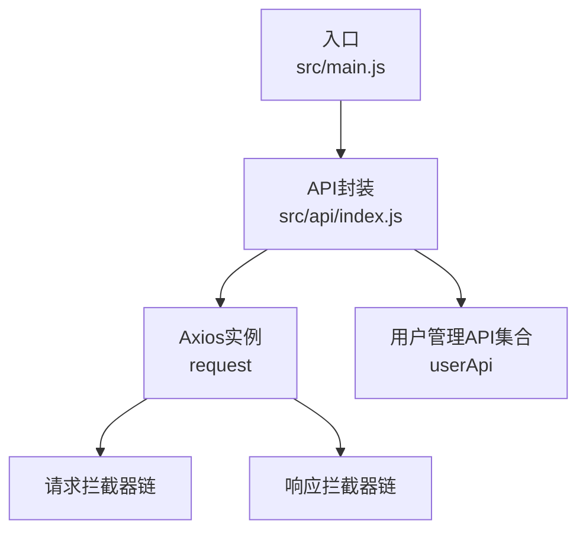
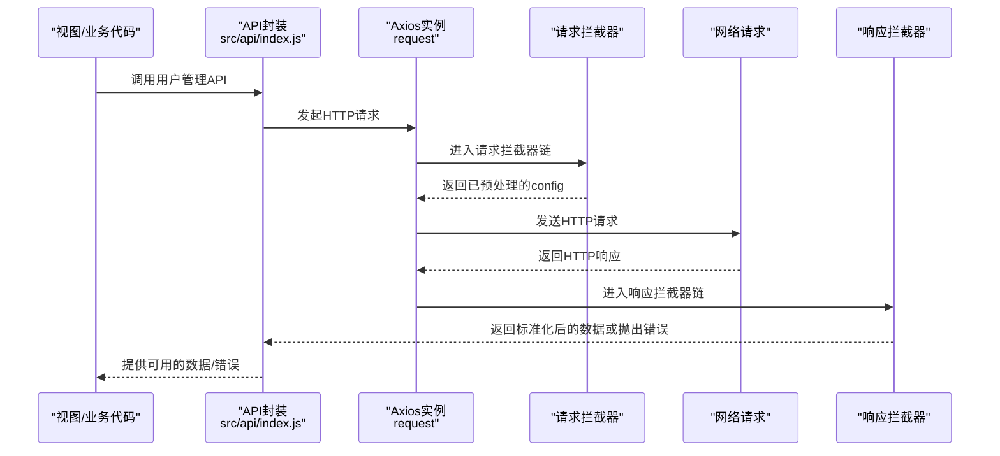
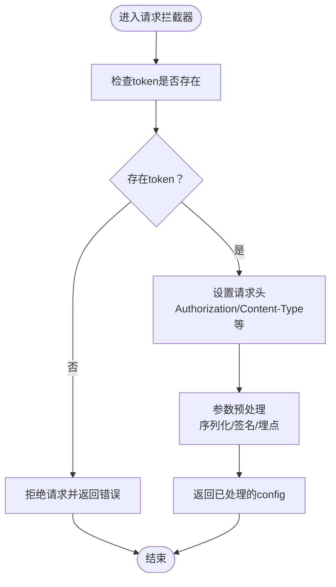
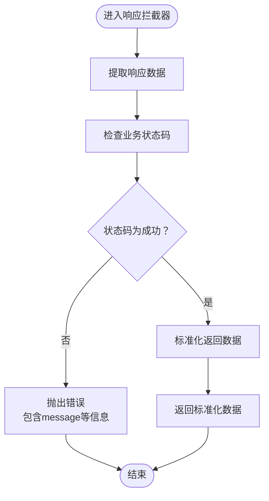
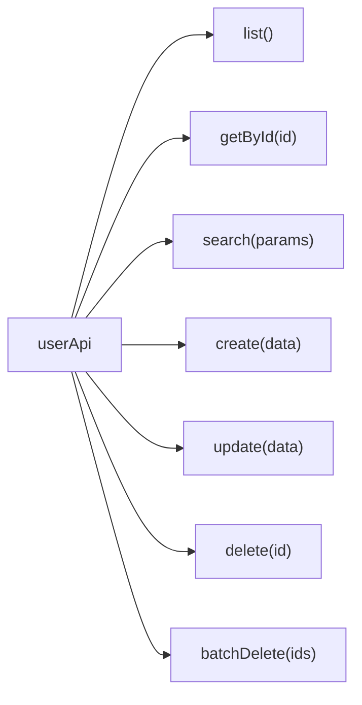
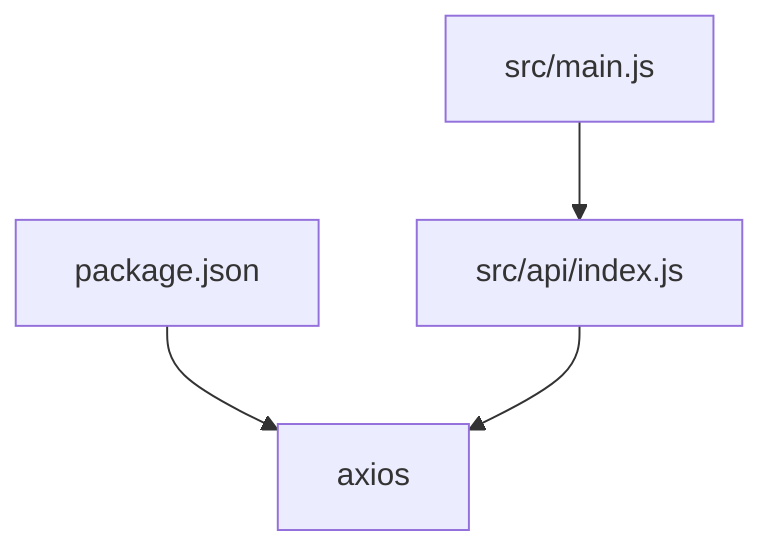

# 拦截器系统

<cite>
**本文引用的文件**
- [src/api/index.js](file://src/api/index.js)
- [src/main.js](file://src/main.js)
- [package.json](file://package.json)
</cite>

## 目录
1. [简介](#简介)
2. [项目结构](#项目结构)
3. [核心组件](#核心组件)
4. [架构总览](#架构总览)
5. [详细组件分析](#详细组件分析)
6. [依赖分析](#依赖分析)
7. [性能考虑](#性能考虑)
8. [故障排查指南](#故障排查指南)
9. [结论](#结论)
10. [附录](#附录)

## 简介
本文件面向Vue.js项目的HTTP拦截器系统，围绕请求拦截器与响应拦截器展开，系统性说明其工作原理、执行时机、处理流程与最佳实践。重点覆盖以下方面：
- 请求拦截器：token验证、请求头设置、请求预处理逻辑
- 响应拦截器：数据格式化、错误处理、状态码判断机制
- 执行顺序、异常处理策略与调试方法
- 扩展拦截器时的注意事项与常见问题解决思路

## 项目结构
本项目采用典型的前端单页应用结构，HTTP拦截器集中定义在API封装模块中，通过Axios实例统一管理请求与响应拦截器，并向业务层暴露简洁的API接口。

图表来源
- [src/main.js](file://src/main.js)
- [src/api/index.js](file://src/api/index.js)

章节来源
- [src/api/index.js:1-42](file://src/api/index.js#L1-L42)
- [src/main.js](file://src/main.js)

## 核心组件
- Axios实例与拦截器注册
  - 在API模块中创建Axios实例并配置基础参数（如基础路径、超时），随后分别注册请求与响应拦截器。
  - 请求拦截器用于对即将发出的请求进行统一预处理（例如注入认证信息、统一头部、参数清洗等）。
  - 响应拦截器用于对返回结果进行统一处理（例如状态码校验、错误提示、数据脱壳等）。

- 用户管理API集合
  - 将常用REST操作抽象为函数式API，内部统一使用Axios实例发起请求，从而自动触发拦截器链。

章节来源
- [src/api/index.js:1-42](file://src/api/index.js#L1-L42)

## 架构总览
下图展示了从调用API到最终返回数据的完整链路，以及拦截器在其中的介入点。

图表来源
- [src/api/index.js:10-31](file://src/api/index.js#L10-L31)

## 详细组件分析

### 请求拦截器
- 执行时机
  - 在每次HTTP请求发送前执行，允许修改请求配置、注入认证信息、统一头部、参数预处理等。
- 典型职责
  - Token验证与注入：从安全存储读取token，若存在则写入请求头；若缺失则可阻断请求或跳转登录。
  - 请求头设置：统一Content-Type、Accept、Authorization等头部字段。
  - 请求预处理：统一参数格式、序列化、签名、埋点等。
- 异常处理
  - 若预处理阶段发现非法或不合规请求，可在拦截器内直接reject，避免无效网络开销。
- 扩展建议
  - 将通用逻辑抽取为独立工具函数，便于复用与测试。
  - 对不同环境（开发/生产）采用差异化策略（如仅在生产环境注入token）。

图表来源
- [src/api/index.js:10-17](file://src/api/index.js#L10-L17)

章节来源
- [src/api/index.js:10-17](file://src/api/index.js#L10-L17)

### 响应拦截器
- 执行时机
  - 在收到HTTP响应后执行，负责对响应数据进行统一处理与错误判定。
- 典型职责
  - 数据格式化：从响应体中提取业务数据（如脱壳）、统一字段命名。
  - 错误处理：根据业务状态码或约定字段判断请求是否成功，失败时抛出可识别的错误。
  - 状态码判断：结合HTTP状态码与业务状态码，决定后续处理分支。
- 异常处理
  - 当业务状态码非成功时，拦截器应reject一个携带明确信息的错误对象，便于上层统一捕获与提示。
- 扩展建议
  - 将“成功”与“失败”的判定规则抽象为可配置策略，支持多接口风格的兼容。
  - 对于分页/列表场景，统一处理元数据与数据分离。

图表来源
- [src/api/index.js:19-31](file://src/api/index.js#L19-L31)

章节来源
- [src/api/index.js:19-31](file://src/api/index.js#L19-L31)

### 用户管理API集合
- 设计目标
  - 将常见的增删改查操作以函数形式暴露，屏蔽底层HTTP细节，降低调用复杂度。
- 使用方式
  - 业务组件直接调用userApi下的方法，内部统一经由Axios实例与拦截器链处理。
- 注意事项
  - 参数传递遵循Axios规范；对于批量删除等特殊场景，注意data与params的正确使用。

图表来源
- [src/api/index.js:34-42](file://src/api/index.js#L34-L42)

章节来源
- [src/api/index.js:34-42](file://src/api/index.js#L34-L42)

## 依赖分析
- 外部依赖
  - Axios：提供HTTP客户端能力与拦截器机制，是拦截器系统的核心载体。
- 内部依赖
  - API封装模块集中管理拦截器与业务API，其他模块仅需引入API集合即可使用统一的HTTP能力。
- 版本与安装
  - 项目通过npm管理依赖，Axios版本在package.json中声明。

图表来源
- [package.json](file://package.json)
- [src/main.js](file://src/main.js)
- [src/api/index.js](file://src/api/index.js)

章节来源
- [package.json](file://package.json)
- [src/main.js](file://src/main.js)
- [src/api/index.js](file://src/api/index.js)

## 性能考虑
- 合理的超时设置：在Axios实例层面设置合理的timeout，避免长时间挂起影响用户体验。
- 减少不必要的重试：拦截器内避免无条件重试，应在幂等请求或明确支持重试的场景下谨慎使用。
- 避免重复处理：在请求拦截器中完成必要的预处理，减少响应拦截器内的重复计算。
- 日志与监控：在开发环境可开启轻量日志，在生产环境避免泄露敏感信息。

## 故障排查指南
- 常见问题
  - token缺失导致请求被拦截器拒绝：检查token存储位置与读取逻辑，确认拦截器中token注入流程。
  - 响应状态码非成功但未被捕获：核对响应拦截器的状态码判断逻辑与业务约定。
  - 参数传递错误：区分params与data的使用场景，确保符合后端接口要求。
- 调试方法
  - 在请求拦截器中输出关键配置（如headers、params），定位头部与参数问题。
  - 在响应拦截器中输出响应摘要（如状态码、message），快速定位业务错误。
  - 利用浏览器开发者工具Network面板查看实际请求与响应，比对拦截器处理前后差异。
- 异常处理策略
  - 统一reject错误对象，包含可读的message与上下文信息，便于上层UI展示与日志记录。
  - 对网络异常与业务异常进行区分处理，避免同质化提示。

章节来源
- [src/api/index.js:10-31](file://src/api/index.js#L10-L31)

## 结论
本项目的HTTP拦截器系统以Axios实例为核心，通过请求与响应拦截器实现了统一的认证、头部、参数与数据处理能力。该设计降低了业务代码的复杂度，提升了可维护性与一致性。建议在扩展时遵循“单一职责、可配置、可测试”的原则，并配合完善的日志与监控体系，持续优化拦截器的性能与稳定性。

## 附录
- 最佳实践
  - 将拦截器逻辑模块化，按功能拆分为独立文件，便于维护与单元测试。
  - 对外暴露统一的错误类型与错误码映射，便于前端统一处理。
  - 在开发与生产环境采用不同的拦截器策略（如开发环境允许跨域、生产环境严格校验）。
- 常见问题
  - token过期：在响应拦截器中识别特定错误码，触发登出或刷新token流程。
  - 跨域与CORS：确保请求拦截器中设置正确的Origin与凭证策略。
  - 大文件上传：在请求拦截器中设置合适的Content-Type与进度回调。