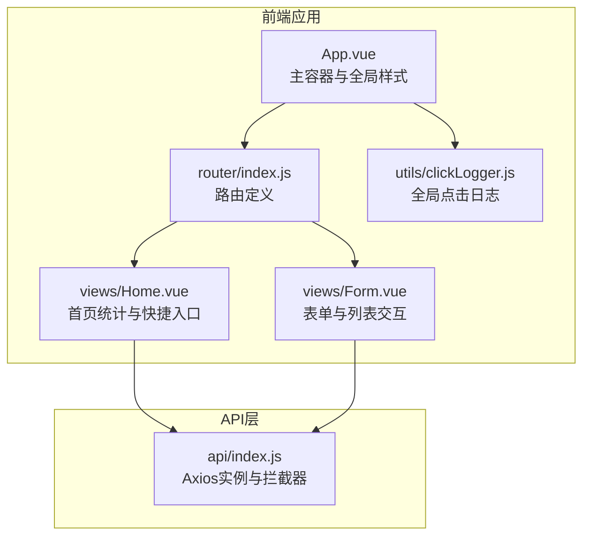
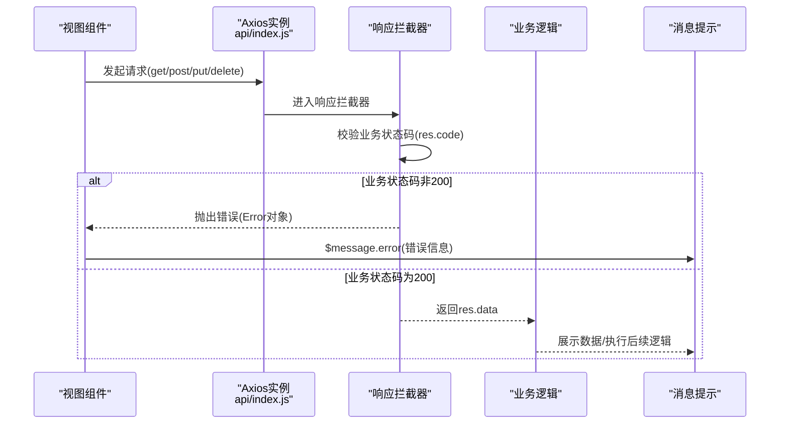
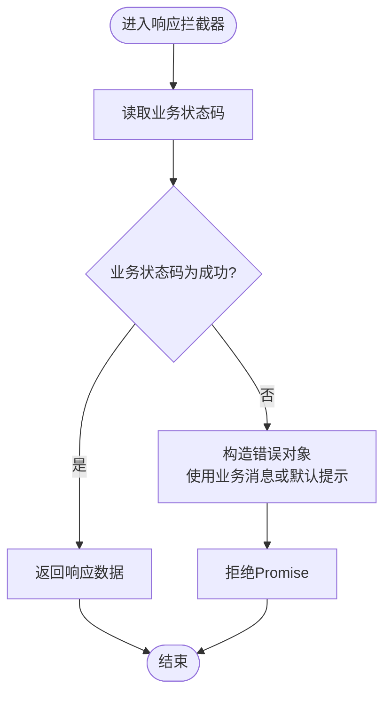
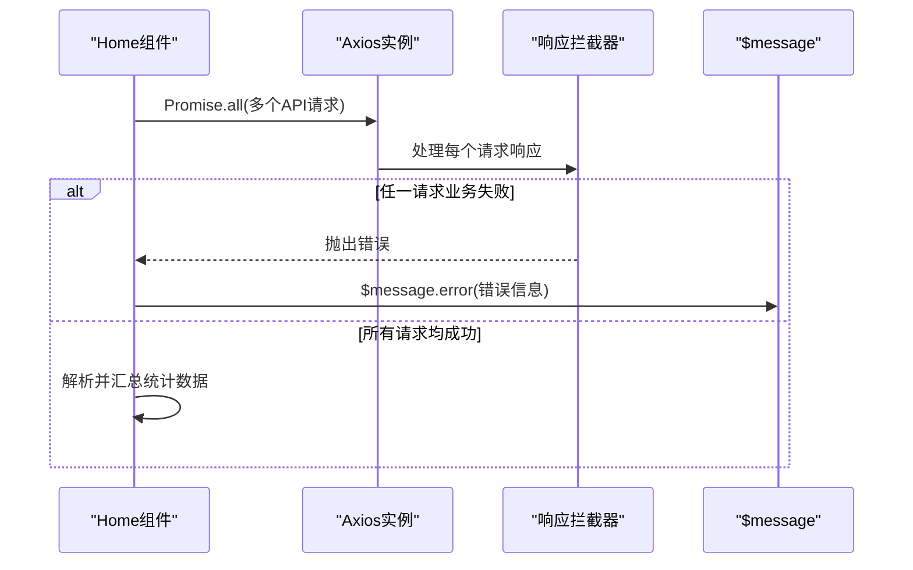
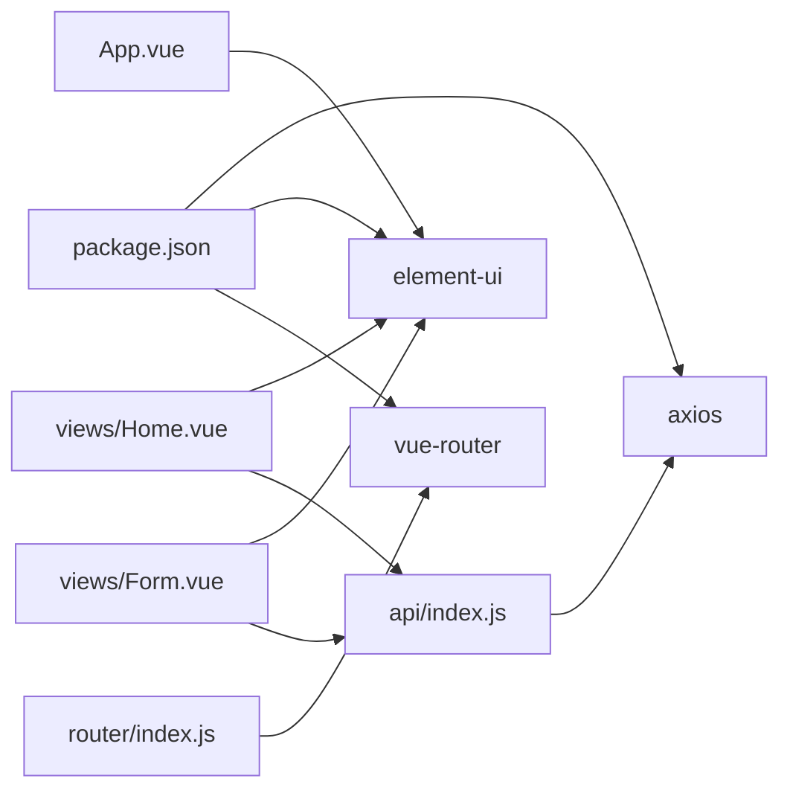

# 错误处理机制

<cite>
**本文引用的文件**
- [src/api/index.js](file://src/api/index.js)
- [src/main.js](file://src/main.js)
- [src/views/Form.vue](file://src/views/Form.vue)
- [src/views/Home.vue](file://src/views/Home.vue)
- [src/router/index.js](file://src/router/index.js)
- [src/App.vue](file://src/App.vue)
- [src/utils/clickLogger.js](file://src/utils/clickLogger.js)
- [package.json](file://package.json)
</cite>

## 目录
1. [引言](#引言)
2. [项目结构](#项目结构)
3. [核心组件](#核心组件)
4. [架构总览](#架构总览)
5. [详细组件分析](#详细组件分析)
6. [依赖分析](#依赖分析)
7. [性能考虑](#性能考虑)
8. [故障排查指南](#故障排查指南)
9. [结论](#结论)
10. [附录](#附录)

## 引言
本文件面向Vue.js前端工程，聚焦于API错误处理机制的专业技术文档。围绕响应拦截器中的错误识别、分类与处理策略，系统阐述HTTP状态码与业务状态码的映射关系、错误消息的统一格式化与用户友好提示机制，并扩展到Promise错误处理、异步错误捕获与恢复策略。同时给出网络错误、服务器错误与业务逻辑错误的差异化处理建议，以及错误日志记录、监控告警与调试诊断的最佳实践。

## 项目结构
本项目采用典型的Vue CLI脚手架结构，API封装集中在独立模块中，视图组件按功能划分，路由负责页面导航。错误处理的关键实现位于API层（Axios实例与拦截器），并在各业务组件中进行消费与展示。

图表来源
- [src/App.vue:1-258](file://src/App.vue#L1-L258)
- [src/router/index.js:1-32](file://src/router/index.js#L1-L32)
- [src/views/Home.vue:1-175](file://src/views/Home.vue#L1-L175)
- [src/views/Form.vue:1-143](file://src/views/Form.vue#L1-L143)
- [src/utils/clickLogger.js:1-71](file://src/utils/clickLogger.js#L1-L71)
- [src/api/index.js:1-110](file://src/api/index.js#L1-L110)

章节来源
- [src/App.vue:1-258](file://src/App.vue#L1-L258)
- [src/router/index.js:1-32](file://src/router/index.js#L1-L32)
- [src/views/Home.vue:1-175](file://src/views/Home.vue#L1-L175)
- [src/views/Form.vue:1-143](file://src/views/Form.vue#L1-L143)
- [src/utils/clickLogger.js:1-71](file://src/utils/clickLogger.js#L1-L71)
- [src/api/index.js:1-110](file://src/api/index.js#L1-L110)

## 核心组件
- Axios实例与拦截器：在API入口集中定义基础配置、请求/响应拦截器，统一处理业务状态码与错误传播。
- 视图组件：在业务方法中使用async/await调用API，通过try/catch捕获错误并以消息提示反馈给用户；部分场景使用Promise.all并发请求时采用catch兜底。
- 工具与配置：Element UI用于消息提示与对话框；全局点击日志用于辅助调试与审计。

章节来源
- [src/api/index.js:1-110](file://src/api/index.js#L1-L110)
- [src/views/Form.vue:1-143](file://src/views/Form.vue#L1-L143)
- [src/views/Home.vue:1-175](file://src/views/Home.vue#L1-L175)
- [src/utils/clickLogger.js:1-71](file://src/utils/clickLogger.js#L1-L71)
- [package.json:1-29](file://package.json#L1-L29)

## 架构总览
下图展示了从视图组件发起请求，经由Axios实例与拦截器，最终返回业务数据或抛出错误的整体流程。

图表来源
- [src/api/index.js:19-31](file://src/api/index.js#L19-L31)
- [src/views/Form.vue:80-112](file://src/views/Form.vue#L80-L112)
- [src/views/Home.vue:132-147](file://src/views/Home.vue#L132-L147)

## 详细组件分析

### 响应拦截器：错误识别、分类与处理策略
- 业务状态码映射：拦截器读取响应体中的业务字段，当业务状态码不等于约定的成功值时，构造错误并拒绝Promise，使上层调用可捕获。
- 错误传播：拦截器对网络异常等底层错误同样走reject路径，保持统一的错误形态，便于上层统一处理。
- 统一错误消息：优先使用响应体中的业务消息字段，若缺失则回退到通用“请求失败”提示，确保用户可见的错误信息。

图表来源
- [src/api/index.js:20-31](file://src/api/index.js#L20-L31)

章节来源
- [src/api/index.js:19-31](file://src/api/index.js#L19-L31)

### HTTP状态码与业务状态码的映射关系
- 当前实现仅依据业务状态码进行判断，未直接解析HTTP状态码。这意味着：
  - HTTP 2xx但业务状态码非成功时，仍视为业务错误并抛错；
  - HTTP 5xx或网络异常时，拦截器会将错误透传至调用方。
- 建议：在生产环境中，可在拦截器中增加HTTP状态码分支，结合业务状态码进行更细粒度的错误分类与提示。

章节来源
- [src/api/index.js:20-31](file://src/api/index.js#L20-L31)

### 错误消息的统一格式化与用户友好提示
- 统一格式化：拦截器返回的错误对象携带明确的消息文本，便于上层统一处理。
- 用户提示：视图组件通过Element UI的消息组件展示错误信息，保证一致性与可读性。
- 并发场景：在首页统计加载中，使用Promise.all并发请求并为每个子请求添加catch兜底，避免单点失败导致整体失败。

图表来源
- [src/views/Home.vue:132-147](file://src/views/Home.vue#L132-L147)
- [src/api/index.js:20-31](file://src/api/index.js#L20-L31)

章节来源
- [src/views/Home.vue:132-147](file://src/views/Home.vue#L132-L147)
- [src/views/Form.vue:80-112](file://src/views/Form.vue#L80-L112)

### Promise错误处理、异步错误捕获与恢复策略
- 单请求：视图组件普遍采用async/await + try/catch，确保错误被捕获并提示。
- 并发请求：使用Promise.all并为每个子请求添加catch兜底，保证部分失败不影响其余结果。
- 错误恢复：当前实现主要以提示为主，未见自动重试或降级逻辑。建议在拦截器或上层封装中引入指数退避重试与降级策略。

章节来源
- [src/views/Form.vue:80-112](file://src/views/Form.vue#L80-L112)
- [src/views/Home.vue:132-147](file://src/views/Home.vue#L132-L147)

### 不同类型错误的处理方式
- 网络错误：拦截器将底层网络异常统一reject，上层通过catch提示“网络异常/请求失败”，并引导用户重试。
- 服务器错误：HTTP 5xx类错误由拦截器透传，上层可据此区分“服务不可用”并提示用户稍后再试。
- 业务逻辑错误：基于业务状态码的错误，拦截器将其转换为可读错误消息，上层根据消息进行针对性提示或引导修复。

章节来源
- [src/api/index.js:20-31](file://src/api/index.js#L20-L31)
- [src/views/Form.vue:80-112](file://src/views/Form.vue#L80-L112)
- [src/views/Home.vue:132-147](file://src/views/Home.vue#L132-L147)

### 错误日志记录、监控告警与调试诊断
- 全局点击日志：提供结构化的点击事件日志，便于定位用户操作路径与问题复现。
- 控制台输出：拦截器与组件均保留console输出，便于开发期快速定位问题。
- 建议增强：
  - 在拦截器中集成错误上报（如上报错误栈、URL、参数摘要、时间戳）；
  - 结合路由与组件名，形成统一的错误上下文标签；
  - 对高频错误进行采样上报，配合监控平台告警。

章节来源
- [src/utils/clickLogger.js:1-71](file://src/utils/clickLogger.js#L1-L71)
- [src/api/index.js:20-31](file://src/api/index.js#L20-L31)

## 依赖分析
- Axios：作为HTTP客户端，提供请求/响应拦截器能力，是错误处理的核心载体。
- Element UI：提供消息提示、对话框等UI组件，用于向用户反馈错误信息。
- Vue Router：承载页面导航，与错误处理无直接耦合，但在路由切换时可能影响错误上下文。

图表来源
- [package.json:1-29](file://package.json#L1-L29)
- [src/api/index.js:1-110](file://src/api/index.js#L1-L110)
- [src/views/Home.vue:1-175](file://src/views/Home.vue#L1-L175)
- [src/views/Form.vue:1-143](file://src/views/Form.vue#L1-L143)
- [src/App.vue:1-258](file://src/App.vue#L1-L258)
- [src/router/index.js:1-32](file://src/router/index.js#L1-L32)

章节来源
- [package.json:1-29](file://package.json#L1-L29)
- [src/api/index.js:1-110](file://src/api/index.js#L1-L110)
- [src/views/Home.vue:1-175](file://src/views/Home.vue#L1-L175)
- [src/views/Form.vue:1-143](file://src/views/Form.vue#L1-L143)
- [src/App.vue:1-258](file://src/App.vue#L1-L258)
- [src/router/index.js:1-32](file://src/router/index.js#L1-L32)

## 性能考虑
- 拦截器开销：拦截器链路简单，对性能影响极小；建议避免在拦截器中进行复杂计算。
- 并发请求：使用Promise.all提升首屏数据加载效率，但需注意错误隔离与降级策略。
- UI渲染：消息提示与表格加载状态的切换应避免频繁重绘，必要时合并更新批次。

## 故障排查指南
- 快速定位
  - 查看控制台错误栈与拦截器抛出的错误对象，确认来源与消息。
  - 使用全局点击日志定位用户操作路径，复现问题场景。
- 常见问题
  - 业务状态码非200但HTTP 200：检查后端返回结构与拦截器判断逻辑。
  - 并发请求部分失败：确认每个子请求的catch兜底是否生效。
  - 网络异常：检查代理配置、跨域与超时设置。
- 建议改进
  - 在拦截器中补充错误上报与上下文标签；
  - 对重复错误进行去重与限流，避免刷屏；
  - 提供“复制错误详情”能力，便于研发快速定位。

章节来源
- [src/utils/clickLogger.js:1-71](file://src/utils/clickLogger.js#L1-L71)
- [src/api/index.js:20-31](file://src/api/index.js#L20-L31)
- [src/views/Home.vue:132-147](file://src/views/Home.vue#L132-L147)
- [src/views/Form.vue:80-112](file://src/views/Form.vue#L80-L112)

## 结论
本项目在API层实现了统一的业务状态码校验与错误传播，在视图层通过Element UI完成一致性的用户提示。响应拦截器是错误处理的核心，建议在此基础上进一步完善HTTP状态码分支、错误上报与重试策略，以提升系统的稳定性与可观测性。同时，结合全局点击日志与控制台输出，可有效缩短问题定位周期。

## 附录
- 术语说明
  - 业务状态码：后端返回的业务逻辑状态标识，如“200表示成功”。
  - HTTP状态码：浏览器/服务器遵循的标准状态码，如“200/404/500”。
- 最佳实践清单
  - 在拦截器中统一处理业务与网络错误，保持上层调用的一致性。
  - 为并发请求提供兜底策略，避免单点失败影响整体体验。
  - 增强错误上报与监控，建立告警与复盘机制。
  - 优化用户提示文案，提供可操作的修复建议或重试入口。