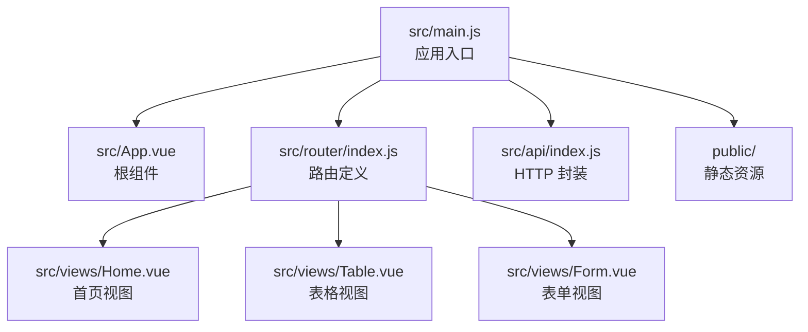
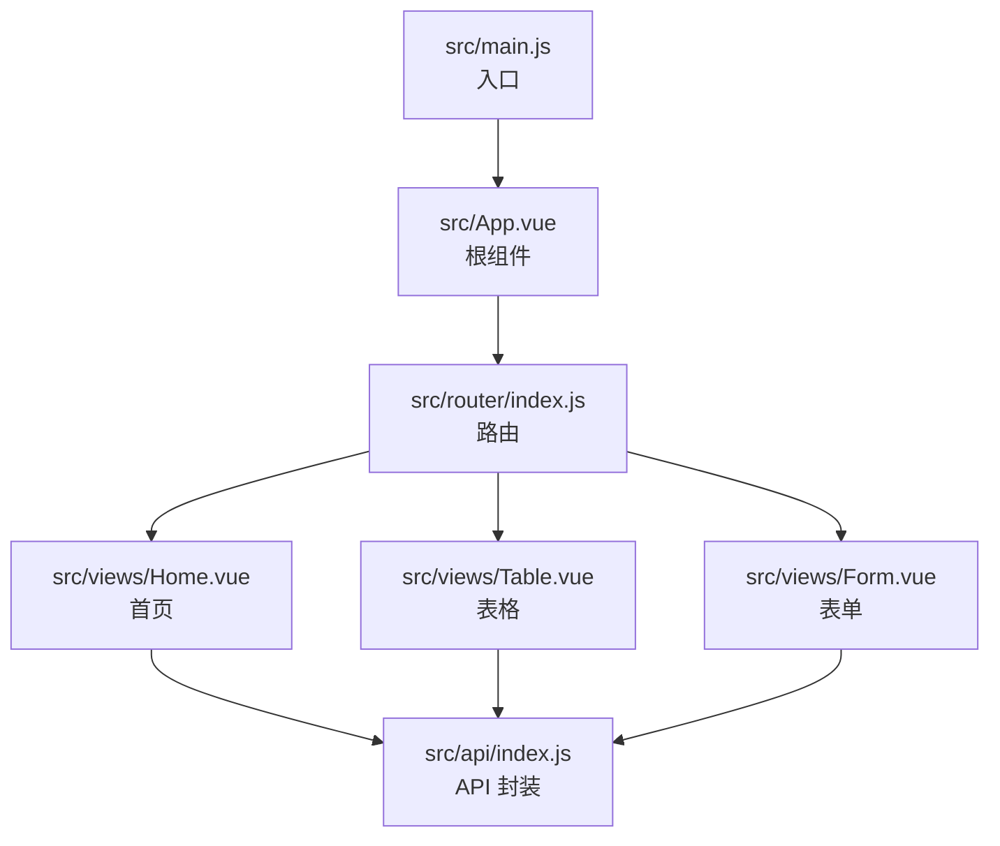
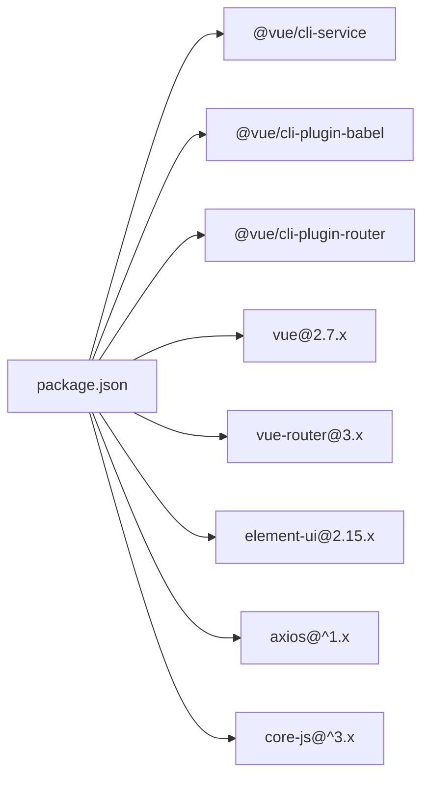

# 代码规范与质量

<cite>
**本文引用的文件**
- [babel.config.js](file://babel.config.js)
- [package.json](file://package.json)
- [vue.config.js](file://vue.config.js)
- [src/main.js](file://src/main.js)
- [src/App.vue](file://src/App.vue)
- [src/router/index.js](file://src/router/index.js)
- [src/views/Home.vue](file://src/views/Home.vue)
- [src/views/Table.vue](file://src/views/Table.vue)
- [src/views/Form.vue](file://src/views/Form.vue)
- [src/api/index.js](file://src/api/index.js)
</cite>

## 目录
1. [引言](#引言)
2. [项目结构](#项目结构)
3. [核心组件](#核心组件)
4. [架构总览](#架构总览)
5. [详细组件分析](#详细组件分析)
6. [依赖分析](#依赖分析)
7. [性能考虑](#性能考虑)
8. [故障排查指南](#故障排查指南)
9. [结论](#结论)
10. [附录](#附录)

## 引言
本文件为该 Vue.js 项目的代码规范与质量标准文档，面向前端开发团队与质量保障人员，旨在统一 JavaScript/ES6+ 编码风格、Vue 组件编写规范、CSS 样式组织原则，并明确构建与质量工具（Babel、ESLint、格式化）的配置建议与使用方式。文档同时给出组件设计原则、文件组织结构、注释规范以及代码审查流程与质量检查工具的落地实践。

## 项目结构
该项目采用 Vue CLI 生成的基础结构，按功能模块划分目录，核心入口与路由、视图组件、API 封装清晰分离。整体结构如下：

图表来源
- [src/main.js:1-18](file://src/main.js#L1-L18)
- [src/App.vue:1-258](file://src/App.vue#L1-L258)
- [src/router/index.js:1-32](file://src/router/index.js#L1-L32)
- [src/views/Home.vue:1-175](file://src/views/Home.vue#L1-L175)
- [src/views/Table.vue:1-214](file://src/views/Table.vue#L1-L214)
- [src/views/Form.vue:1-143](file://src/views/Form.vue#L1-L143)
- [src/api/index.js:1-110](file://src/api/index.js#L1-L110)

章节来源
- [src/main.js:1-18](file://src/main.js#L1-L18)
- [src/router/index.js:1-32](file://src/router/index.js#L1-L32)
- [src/App.vue:1-258](file://src/App.vue#L1-L258)
- [src/views/Home.vue:1-175](file://src/views/Home.vue#L1-L175)
- [src/views/Table.vue:1-214](file://src/views/Table.vue#L1-L214)
- [src/views/Form.vue:1-143](file://src/views/Form.vue#L1-L143)
- [src/api/index.js:1-110](file://src/api/index.js#L1-L110)

## 核心组件
- 应用入口与初始化
  - 在入口中完成 UI 框架引入、全局配置、挂载实例与全局能力启动。
  - 参考路径：[src/main.js:1-18](file://src/main.js#L1-L18)
- 根组件与布局
  - 根组件负责侧边菜单、头部下拉、主内容区与路由出口，统一暗色主题样式。
  - 参考路径：[src/App.vue:1-258](file://src/App.vue#L1-L258)
- 路由与导航
  - 使用 hash 模式，按需加载视图组件，保持首屏体积与交互体验。
  - 参考路径：[src/router/index.js:1-32](file://src/router/index.js#L1-L32)
- 视图组件
  - 首页：统计卡片、快捷操作、系统信息展示。
  - 表格页：客户列表、分页、搜索、对话框增删改查。
  - 表单页：走访人员新增/编辑、列表展示与删除。
  - 参考路径：
    - [src/views/Home.vue:1-175](file://src/views/Home.vue#L1-L175)
    - [src/views/Table.vue:1-214](file://src/views/Table.vue#L1-L214)
    - [src/views/Form.vue:1-143](file://src/views/Form.vue#L1-L143)
- API 层
  - 基于 Axios 的统一请求实例，含请求/响应拦截器与业务错误处理。
  - 参考路径：[src/api/index.js:1-110](file://src/api/index.js#L1-L110)

章节来源
- [src/main.js:1-18](file://src/main.js#L1-L18)
- [src/App.vue:1-258](file://src/App.vue#L1-L258)
- [src/router/index.js:1-32](file://src/router/index.js#L1-L32)
- [src/views/Home.vue:1-175](file://src/views/Home.vue#L1-L175)
- [src/views/Table.vue:1-214](file://src/views/Table.vue#L1-L214)
- [src/views/Form.vue:1-143](file://src/views/Form.vue#L1-L143)
- [src/api/index.js:1-110](file://src/api/index.js#L1-L110)

## 架构总览
下图展示了从入口到视图组件的数据流与交互关系，以及 API 层在其中的作用。

图表来源
- [src/main.js:1-18](file://src/main.js#L1-L18)
- [src/App.vue:1-258](file://src/App.vue#L1-L258)
- [src/router/index.js:1-32](file://src/router/index.js#L1-L32)
- [src/views/Home.vue:1-175](file://src/views/Home.vue#L1-L175)
- [src/views/Table.vue:1-214](file://src/views/Table.vue#L1-L214)
- [src/views/Form.vue:1-143](file://src/views/Form.vue#L1-L143)
- [src/api/index.js:1-110](file://src/api/index.js#L1-L110)

## 详细组件分析

### 组件设计原则
- 单一职责：每个视图组件聚焦单一页面功能，避免“上帝组件”。
- 数据驱动：优先通过 data/props/computed/state 管理状态，减少副作用。
- 生命周期合理使用：created/mounted 中进行数据加载与订阅，避免在模板中执行复杂逻辑。
- 可测试性：将异步调用与业务逻辑抽离，便于单元测试与集成测试。
- 可维护性：组件内部方法命名语义化，事件回调职责清晰，避免跨组件强耦合。

### 文件组织与命名约定
- 视图组件以页面维度命名，如 Home.vue、Table.vue、Form.vue。
- 路由文件集中管理，按页面拆分导入，支持懒加载。
- API 模块按业务域聚合导出，便于按需引入。
- 样式采用 scoped 并按页面作用域组织，避免全局污染。

### JavaScript/ES6+ 编码规范
- 语法与特性
  - 使用 ES6+ 语法：const/let、解构赋值、模板字符串、箭头函数、类、模块化等。
  - Promise/async-await 用于异步流程控制，避免回调地狱。
  - 数组/对象方法：map/filter/reduce/find 等，保持不可变与纯函数倾向。
- 命名约定
  - 变量与函数：小驼峰命名；常量全大写蛇形；类名帕斯卡命名。
  - 文件：页面组件使用帕斯卡命名，工具函数使用小驼峰，API 模块按业务域命名。
- 代码风格
  - 一致的缩进与换行；语句末尾加分号；对象属性与数组元素逗号后空格。
  - 避免魔法数字与字符串，统一抽取为常量或配置。
  - 注释：公共接口与复杂逻辑添加注释，保持简洁明了。

### Vue 组件编写规范
- 组件结构
  - template/script/style 分层清晰，避免内联样式与内联脚本过多。
  - script 中使用 export default 对象形式，明确 name、data、methods、computed、watch 等。
- 事件与状态
  - 通过 $emit/$on 或 props 回调实现父子通信；避免直接修改父组件状态。
  - 使用计算属性与侦听器处理派生状态，减少重复计算。
- 生命周期与副作用
  - 在 created 中发起数据请求；在 mounted 中绑定 DOM 事件；在 beforeDestroy 解绑。
- 错误处理
  - 统一捕获异常并提示用户，避免静默失败；对网络错误与业务错误区分处理。

### CSS 样式组织原则
- 作用域
  - 页面级样式使用 scoped，避免影响其他组件。
  - 全局样式集中在根组件或独立样式文件，按主题变量组织。
- 主题与可维护性
  - 使用 CSS 变量或预设颜色体系，统一主题色与辅助色。
  - 组件样式按功能区块拆分，命名语义化，避免深层嵌套。
- 性能
  - 减少选择器复杂度，避免过度使用通配符与深层后代选择器。
  - 合理使用动画与阴影，避免影响滚动性能。

### Babel 配置与兼容性
- 当前配置
  - 使用 @vue/cli-plugin-babel/preset，自动适配 Vue 生态与目标浏览器。
  - 浏览器兼容范围由 browserslist 指定：> 1%、最近两个版本、非 dead。
- 建议
  - 如需自定义 polyfill，可在入口引入 core-js，按需加载。
  - 若目标环境较老，可考虑手动调整 preset 选项或引入额外插件。

章节来源
- [babel.config.js:1-6](file://babel.config.js#L1-L6)
- [package.json:23-27](file://package.json#L23-L27)
- [src/views/Home.vue:107-156](file://src/views/Home.vue#L107-L156)
- [src/views/Table.vue:98-208](file://src/views/Table.vue#L98-L208)
- [src/views/Form.vue:56-137](file://src/views/Form.vue#L56-L137)
- [src/App.vue:58-257](file://src/App.vue#L58-L257)

## 依赖分析
- 运行时依赖
  - Vue 2.7、Vue Router、Element UI、Axios、core-js。
- 开发依赖
  - @vue/cli-service、@vue/cli-plugin-babel、@vue/cli-plugin-router、vue-template-compiler。
- 构建与运行
  - 通过 vue-cli-service 提供 serve/build/lint 脚本；devServer 支持代理与端口配置。

图表来源
- [package.json:10-22](file://package.json#L10-L22)

章节来源
- [package.json:10-28](file://package.json#L10-L28)

## 性能考虑
- 路由懒加载
  - 使用动态 import 按需加载视图组件，降低首屏包体。
  - 参考路径：[src/router/index.js:16-21](file://src/router/index.js#L16-L21)
- 列表渲染优化
  - 为 v-for 提供稳定 key；对大数据集使用虚拟滚动或分页。
  - 参考路径：[src/views/Home.vue:65-70](file://src/views/Home.vue#L65-L70)
- 异步请求节流
  - 对频繁触发的搜索/筛选增加防抖；批量操作合并请求。
  - 参考路径：[src/views/Table.vue:14-16](file://src/views/Table.vue#L14-L16)
- 图标与图片
  - 使用矢量图标与按需加载图片，避免阻塞主线程。
- 样式与动画
  - 控制动画数量与复杂度，避免强制同步布局与重绘。

章节来源
- [src/router/index.js:16-21](file://src/router/index.js#L16-L21)
- [src/views/Home.vue:65-70](file://src/views/Home.vue#L65-L70)
- [src/views/Table.vue:14-16](file://src/views/Table.vue#L14-L16)

## 故障排查指南
- 构建与本地调试
  - 端口冲突：修改 vue.config.js 中 devServer.port。
  - 代理未生效：确认 /api 前缀与后端地址一致。
  - 参考路径：
    - [vue.config.js:3-12](file://vue.config.js#L3-L12)
- Lint 与格式化
  - 当前配置关闭了保存时校验，建议在 CI 中开启 lint 脚本。
  - 参考路径：[package.json:8](file://package.json#L8)
- API 请求失败
  - 检查 baseURL、拦截器返回值与业务错误码；确保响应拦截器正确处理。
  - 参考路径：[src/api/index.js:4-31](file://src/api/index.js#L4-L31)
- UI 主题不一致
  - 暗色主题样式集中在根组件样式中，若出现偏差检查 scoped 与覆盖优先级。
  - 参考路径：[src/App.vue:58-257](file://src/App.vue#L58-L257)

章节来源
- [vue.config.js:1-14](file://vue.config.js#L1-L14)
- [package.json:8](file://package.json#L8)
- [src/api/index.js:4-31](file://src/api/index.js#L4-L31)
- [src/App.vue:58-257](file://src/App.vue#L58-L257)

## 结论
本规范以现有项目为基础，结合 Vue 2 生态与 Element UI 的使用习惯，制定了统一的编码风格、组件设计原则与质量保障流程。建议在后续迭代中逐步引入 ESLint/Prettier、自动化测试与 CI 质检，持续提升代码一致性与可维护性。

## 附录

### 代码审查流程建议
- 提交前
  - 运行 lint 与格式化；修复告警与错误；保证无未处理异常。
  - 自测关键路径：路由跳转、数据加载、表单提交、分页与搜索。
- 评审要点
  - 组件职责是否单一；命名与注释是否清晰；是否存在重复逻辑；错误处理是否完善。
- 合入策略
  - 通过评审后合并至主分支；大改动建议分批提交，便于回溯。

### 质量检查工具使用建议
- ESLint
  - 推荐使用 @vue/eslint-config-standard 或社区推荐配置，统一规则。
  - 在 package.json 中新增 lint 脚本并在 CI 中执行。
- Prettier
  - 与 ESLint 配合，统一代码风格；在 pre-commit 钩子中自动格式化。
- 单元测试与端到端测试
  - 为关键组件与工具函数补充测试；对路由与 API 调用进行模拟。
- 构建与部署
  - 在 CI 中执行 lint、测试与打包；上传产物并生成报告。