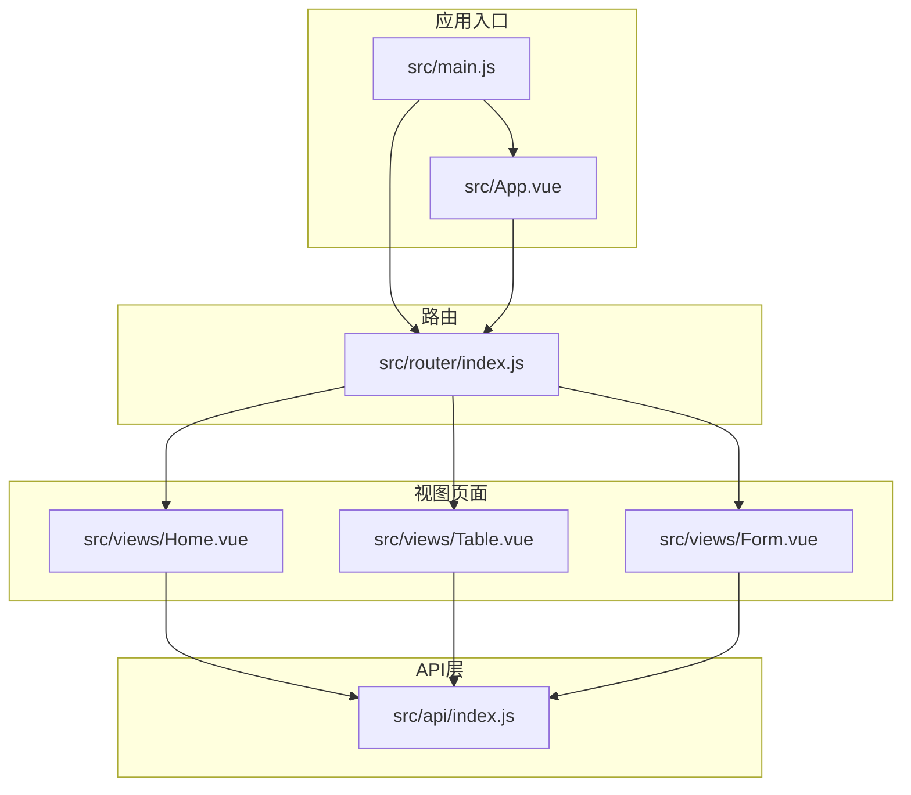
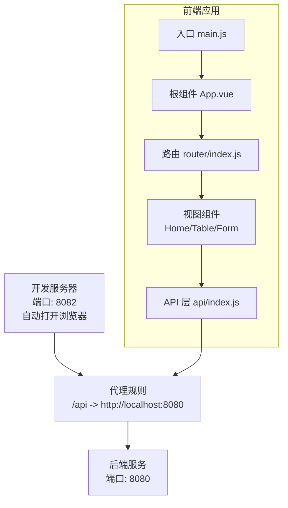
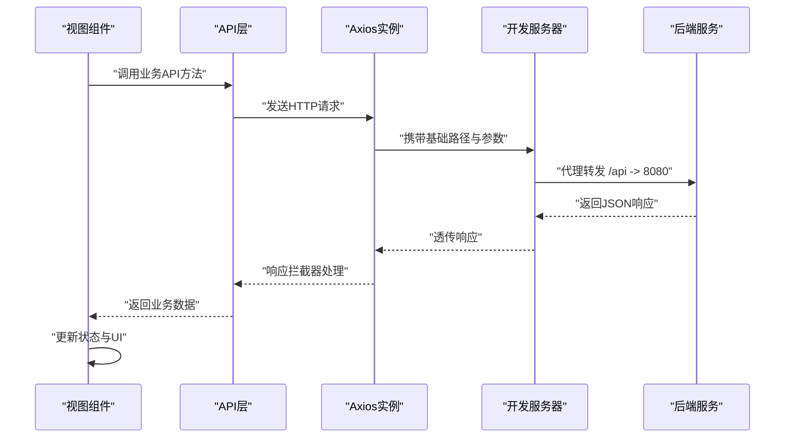
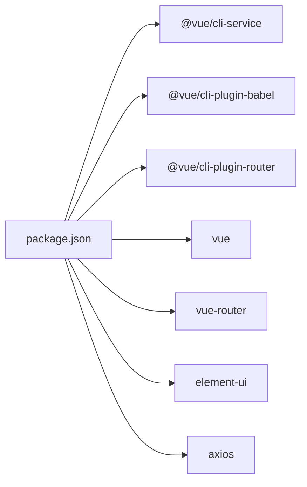

# 开发指南

<cite>
**本文引用的文件**
- [package.json](file://package.json)
- [vue.config.js](file://vue.config.js)
- [babel.config.js](file://babel.config.js)
- [src/main.js](file://src/main.js)
- [src/App.vue](file://src/App.vue)
- [src/router/index.js](file://src/router/index.js)
- [src/api/index.js](file://src/api/index.js)
- [src/views/Home.vue](file://src/views/Home.vue)
- [src/views/Table.vue](file://src/views/Table.vue)
- [src/views/Form.vue](file://src/views/Form.vue)
- [.gitignore](file://.gitignore)
</cite>

## 目录
1. [简介](#简介)
2. [项目结构](#项目结构)
3. [核心组件](#核心组件)
4. [架构总览](#架构总览)
5. [详细组件分析](#详细组件分析)
6. [依赖关系分析](#依赖关系分析)
7. [性能考虑](#性能考虑)
8. [故障排查指南](#故障排查指南)
9. [结论](#结论)
10. [附录](#附录)

## 简介
本指南面向Vue.js后台管理系统开发者，围绕开发环境配置与优化（开发服务器、热重载、代理）、Babel转译、ESLint代码规范、构建优化策略、组件开发规范、样式编写指南、代码组织原则、调试技巧、性能监控与错误排查、Git工作流与发布流程等维度，结合当前仓库的实际配置与实现进行系统化说明，帮助团队高效协作、稳定交付。

## 项目结构
该项目采用典型的Vue CLI 2.x + Element UI 的后台管理前端工程，采用Hash路由，使用Axios封装统一API访问层，页面按功能模块拆分在views目录中，整体结构清晰、职责明确。

图表来源
- [src/main.js:1-14](file://src/main.js#L1-L14)
- [src/App.vue:1-258](file://src/App.vue#L1-L258)
- [src/router/index.js:1-32](file://src/router/index.js#L1-L32)
- [src/api/index.js:1-110](file://src/api/index.js#L1-L110)
- [src/views/Home.vue:1-175](file://src/views/Home.vue#L1-L175)
- [src/views/Table.vue:1-214](file://src/views/Table.vue#L1-L214)
- [src/views/Form.vue:1-143](file://src/views/Form.vue#L1-L143)

章节来源
- [src/main.js:1-14](file://src/main.js#L1-L14)
- [src/router/index.js:1-32](file://src/router/index.js#L1-L32)
- [src/api/index.js:1-110](file://src/api/index.js#L1-L110)
- [src/views/Home.vue:1-175](file://src/views/Home.vue#L1-L175)
- [src/views/Table.vue:1-214](file://src/views/Table.vue#L1-L214)
- [src/views/Form.vue:1-143](file://src/views/Form.vue#L1-L143)

## 核心组件
- 应用入口与全局配置
  - 在入口文件中引入Element UI并挂载到根实例，关闭生产提示，确保运行时体积最小化。
  - 入口文件负责初始化路由与渲染根组件。
- 根组件与布局
  - 根组件采用Element UI容器布局，包含侧边菜单、头部导航与主内容区，支持暗色主题与下拉菜单交互。
- 路由系统
  - 使用Hash路由模式，定义首页、表格页、表单页的路由映射；表格页采用动态导入以提升首屏加载性能。
- API层
  - 基于Axios创建实例，统一设置基础路径与超时；通过响应拦截器统一处理业务状态码与错误提示；按领域划分导出多个API模块，便于复用与维护。
- 视图组件
  - 首页：统计卡片、快捷操作、系统信息展示，使用并发请求加载多类统计数据。
  - 表格页：搜索、分页、新增/编辑弹窗、删除确认，集成Element UI表单校验与消息提示。
  - 表单页：走访人员新增与列表展示，支持状态切换与分页加载。

章节来源
- [src/main.js:1-14](file://src/main.js#L1-L14)
- [src/App.vue:1-258](file://src/App.vue#L1-L258)
- [src/router/index.js:1-32](file://src/router/index.js#L1-L32)
- [src/api/index.js:1-110](file://src/api/index.js#L1-L110)
- [src/views/Home.vue:1-175](file://src/views/Home.vue#L1-L175)
- [src/views/Table.vue:1-214](file://src/views/Table.vue#L1-L214)
- [src/views/Form.vue:1-143](file://src/views/Form.vue#L1-L143)

## 架构总览
该系统采用“入口 -> 路由 -> 页面 -> API”的典型单页应用架构，配合Element UI提供丰富的后台管理组件能力。开发服务器通过Vue CLI内置DevServer提供热重载与代理能力，构建阶段由CLI插件完成打包与优化。

图表来源
- [vue.config.js:1-14](file://vue.config.js#L1-L14)
- [src/main.js:1-14](file://src/main.js#L1-L14)
- [src/App.vue:1-258](file://src/App.vue#L1-L258)
- [src/router/index.js:1-32](file://src/router/index.js#L1-L32)
- [src/api/index.js:1-110](file://src/api/index.js#L1-L110)

## 详细组件分析

### 开发服务器与代理配置
- 端口与自动打开
  - 开发服务器默认监听端口为8082，并在启动时自动打开浏览器窗口，提升开发效率。
- 代理设置
  - 将所有以“/api”开头的请求转发至本地后端服务地址（默认8080），解决跨域问题，简化联调。
- 保存时校验
  - 关闭保存时的代码质量检查，避免频繁触发校验影响开发节奏；如需开启可调整配置。

章节来源
- [vue.config.js:1-14](file://vue.config.js#L1-L14)

### Babel转译配置
- 预设
  - 使用Vue CLI提供的Babel预设，确保现代语法与目标浏览器兼容性，满足项目browserslist要求。
- 扩展建议
  - 如需引入实验性语法或Polyfill，可在现有预设基础上扩展，但需评估包体增长与兼容性。

章节来源
- [babel.config.js:1-6](file://babel.config.js#L1-L6)
- [package.json:23-27](file://package.json#L23-L27)

### ESLint代码规范与构建优化
- 代码规范
  - 项目提供脚本命令用于执行ESLint检查；建议在CI中强制执行，保证代码风格一致。
- 构建优化
  - 使用Vue CLI内置的构建链路，结合Hash路由与按需加载，减少首屏资源体积。
  - 可根据需要进一步引入压缩、Tree Shaking、SplitChunks等策略（在CLI层面可通过配置扩展）。

章节来源
- [package.json:5-8](file://package.json#L5-L8)

### 组件开发规范
- 单文件组件结构
  - 模板、脚本、样式分离，模板使用语义化标签，脚本导出默认对象，样式使用scoped作用域避免污染。
- 数据与生命周期
  - 在created钩子中发起数据请求，避免在模板中直接进行复杂逻辑；使用loading状态与错误提示增强用户体验。
- 事件与交互
  - 使用Element UI提供的按钮、对话框、分页、表单校验等组件，统一交互体验；对删除等危险操作使用确认对话框。
- 动态导入
  - 对非首屏页面采用动态导入，降低首屏包体，提升加载速度。

章节来源
- [src/views/Home.vue:107-156](file://src/views/Home.vue#L107-L156)
- [src/views/Table.vue:98-208](file://src/views/Table.vue#L98-L208)
- [src/views/Form.vue:56-136](file://src/views/Form.vue#L56-L136)
- [src/router/index.js:16-21](file://src/router/index.js#L16-L21)

### 样式编写指南
- 全局样式
  - 在根组件中定义全局暗色主题变量，覆盖Element UI组件的默认颜色，保持界面一致性。
- 组件内样式
  - 使用scoped样式隔离组件样式，避免全局污染；对常用布局与交互元素定义通用类名。
- 主题适配
  - 针对表格、卡片、输入框、分页等高频组件，补充暗色模式下的边框、背景与悬停效果，提升可读性与可用性。

章节来源
- [src/App.vue:58-257](file://src/App.vue#L58-L257)
- [src/views/Home.vue:159-174](file://src/views/Home.vue#L159-L174)
- [src/views/Table.vue:211-213](file://src/views/Table.vue#L211-L213)
- [src/views/Form.vue:140-142](file://src/views/Form.vue#L140-L142)

### 代码组织原则
- 目录结构
  - 按功能模块划分：api、router、views，入口文件集中初始化第三方库与全局配置。
- API层设计
  - 按业务域拆分API模块，统一通过Axios实例访问，集中处理请求与响应拦截，便于扩展与维护。
- 路由设计
  - Hash路由模式简单可靠，适合后台管理场景；页面级路由采用动态导入，优化首屏性能。
- 组件职责
  - 页面组件负责数据与交互，复用Element UI组件；避免在组件中直接拼接URL，统一通过API层。

章节来源
- [src/api/index.js:1-110](file://src/api/index.js#L1-L110)
- [src/router/index.js:1-32](file://src/router/index.js#L1-L32)
- [src/main.js:1-14](file://src/main.js#L1-L14)

### API调用流程（序列图）

图表来源
- [src/api/index.js:1-110](file://src/api/index.js#L1-L110)
- [vue.config.js:6-11](file://vue.config.js#L6-L11)

## 依赖关系分析
- 运行时依赖
  - Vue 2.7、Vue Router、Element UI、Axios为核心运行时依赖，提供视图渲染、路由导航、UI组件与网络请求能力。
- 开发时依赖
  - @vue/cli-service、@vue/cli-plugin-babel、@vue/cli-plugin-router等，提供构建、转译与路由支持。
- 浏览器兼容
  - browserslist配置确保目标浏览器范围，Babel预设自动处理语法转换。

图表来源
- [package.json:10-22](file://package.json#L10-L22)
- [package.json:23-27](file://package.json#L23-L27)

章节来源
- [package.json:10-22](file://package.json#L10-L22)
- [package.json:23-27](file://package.json#L23-L27)

## 性能考虑
- 首屏优化
  - 使用Hash路由与动态导入，减少首屏依赖；避免在入口处加载重型资源。
- 网络请求
  - 合理使用并发请求与分页加载，避免一次性请求大量数据；在表格页中对搜索与分页进行节流与防抖。
- 样式体积
  - 仅在必要处覆盖Element UI样式，避免全局大范围重写；使用scoped样式减少选择器层级。
- 构建优化
  - 在生产构建中启用压缩与Tree Shaking；根据需要拆分公共代码块，提升缓存命中率。

[本节为通用指导，无需列出章节来源]

## 故障排查指南
- 开发服务器无法访问
  - 检查端口占用与防火墙设置；确认代理目标地址与端口正确。
- 接口跨域问题
  - 确认代理规则已生效且匹配前缀；检查后端CORS配置。
- 请求失败或状态异常
  - 查看响应拦截器中的业务状态判断与错误提示；在视图组件中捕获并反馈用户。
- 样式不生效或冲突
  - 检查scoped作用域与选择器优先级；确认覆盖样式未被更高权重规则覆盖。
- 路由跳转无效
  - 检查路由配置与菜单索引；确认菜单项与路由名称一致。

章节来源
- [vue.config.js:1-14](file://vue.config.js#L1-L14)
- [src/api/index.js:19-31](file://src/api/index.js#L19-L31)
- [src/views/Table.vue:136-154](file://src/views/Table.vue#L136-L154)
- [src/App.vue:58-257](file://src/App.vue#L58-L257)
- [src/router/index.js:7-23](file://src/router/index.js#L7-L23)

## 结论
本项目以Vue CLI为基础，结合Element UI与Axios，构建了简洁高效的后台管理系统前端骨架。通过合理的开发服务器配置、代理设置、API层封装与组件化设计，能够快速迭代并保持良好的开发体验与运行性能。建议在后续迭代中逐步引入ESLint强制校验、更细粒度的构建优化与测试体系，持续提升代码质量与稳定性。

[本节为总结性内容，无需列出章节来源]

## 附录

### 开发环境配置清单
- 启动开发服务器
  - 使用脚本命令启动本地服务，自动打开浏览器窗口。
- 代理配置
  - 所有以“/api”开头的请求将被转发至后端服务地址。
- Babel与ESLint
  - 使用CLI提供的预设与脚本命令，按需在CI中启用严格校验。

章节来源
- [package.json:5-8](file://package.json#L5-L8)
- [vue.config.js:1-14](file://vue.config.js#L1-L14)
- [babel.config.js:1-6](file://babel.config.js#L1-L6)

### Git工作流程与发布流程
- 版本控制
  - 忽略node_modules目录，避免将依赖纳入版本控制。
- 工作流程建议
  - 分支命名规范：feature/xxx、fix/xxx、docs/xxx；提交信息遵循约定式提交；合并前进行代码审查。
- 发布流程
  - 在CI中执行安装依赖、ESLint检查、构建与测试；通过后生成产物并部署至静态托管或CDN。

章节来源
- [.gitignore:1-2](file://.gitignore#L1-L2)
- [package.json:5-8](file://package.json#L5-L8)