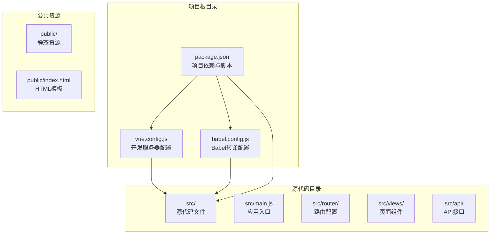
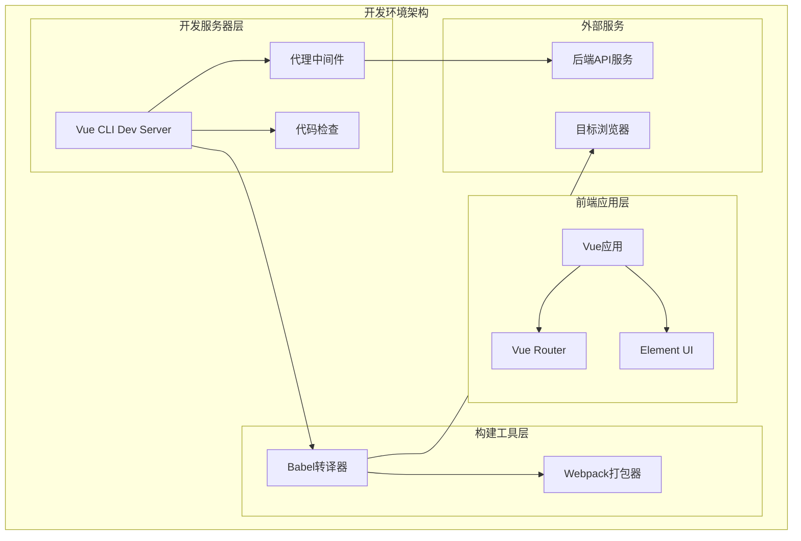
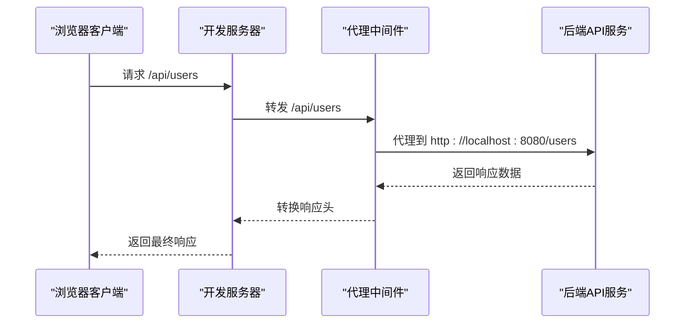
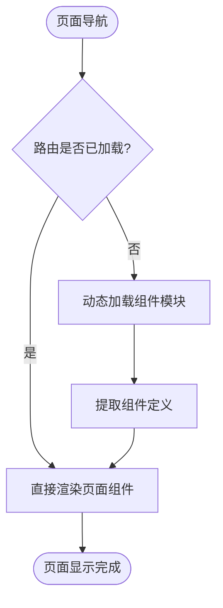

# 开发环境配置

<cite>
**本文档引用的文件**
- [vue.config.js](file://vue.config.js)
- [babel.config.js](file://babel.config.js)
- [package.json](file://package.json)
- [src/main.js](file://src/main.js)
- [src/router/index.js](file://src/router/index.js)
- [public/index.html](file://public/index.html)
</cite>

## 目录
1. [简介](#简介)
2. [项目结构](#项目结构)
3. [核心组件](#核心组件)
4. [架构概览](#架构概览)
5. [详细组件分析](#详细组件分析)
6. [依赖关系分析](#依赖关系分析)
7. [性能考虑](#性能考虑)
8. [故障排除指南](#故障排除指南)
9. [结论](#结论)

## 简介

本文件详细介绍了Vue.js开发环境的配置与使用，重点涵盖Vue CLI开发服务器的各项配置选项、Babel转译配置、开发体验优化以及常见问题的排查与解决方案。该Vue.js项目采用Vue CLI 5.0构建，使用Vue 2.7.16和Element UI组件库，通过热重载机制实现快速开发迭代。

## 项目结构

该项目采用标准的Vue.js项目结构，主要配置文件集中在根目录：



**图表来源**
- [vue.config.js:1-14](file://vue.config.js#L1-L14)
- [babel.config.js:1-6](file://babel.config.js#L1-L6)
- [package.json:1-29](file://package.json#L1-L29)

**章节来源**
- [vue.config.js:1-14](file://vue.config.js#L1-L14)
- [babel.config.js:1-6](file://babel.config.js#L1-L6)
- [package.json:1-29](file://package.json#L1-L29)

## 核心组件

### 开发服务器配置

项目的核心开发服务器配置位于`vue.config.js`文件中，包含以下关键配置项：

- **端口设置**: 开发服务器监听8082端口
- **自动打开浏览器**: 启用开发时自动打开浏览器功能
- **代理配置**: 配置了/api路径的请求代理到本地后端服务
- **代码检查**: 关闭了保存时的代码检查功能

### Babel转译配置

Babel配置采用默认的Vue CLI预设，确保现代JavaScript语法能够正确转译为兼容性更好的代码格式。

### 路由系统

项目使用Vue Router实现单页应用的路由管理，支持哈希模式和动态导入功能。

**章节来源**
- [vue.config.js:1-14](file://vue.config.js#L1-L14)
- [babel.config.js:1-6](file://babel.config.js#L1-L6)
- [src/router/index.js:1-32](file://src/router/index.js#L1-L32)

## 架构概览



**图表来源**
- [vue.config.js:3-12](file://vue.config.js#L3-L12)
- [babel.config.js:1-6](file://babel.config.js#L1-L6)
- [package.json:17-22](file://package.json#L17-L22)

## 详细组件分析

### Vue CLI开发服务器配置

#### 端口配置分析

开发服务器默认监听8082端口，这一配置避免了与常见的开发端口冲突：
- 端口选择考虑了开发效率和系统兼容性
- 8082端口在大多数开发环境中未被占用
- 支持自定义端口以适应不同开发环境需求

#### 自动打开浏览器功能

配置中的`open: true`选项提供了便捷的开发体验：
- 开发服务器启动后自动在默认浏览器中打开应用
- 提高了开发效率，减少了手动操作步骤
- 支持多浏览器环境下的自动检测

#### 代理配置详解

项目配置了完整的API代理机制：



**图表来源**
- [vue.config.js:6-11](file://vue.config.js#L6-L11)

代理配置的关键特性：
- **路径前缀匹配**: 所有以`/api`开头的请求都会被代理
- **跨域处理**: `changeOrigin: true`解决跨域访问问题
- **目标地址**: 指向本地8080端口的后端服务
- **透明转发**: 保持原始请求头和方法不变

#### 代码检查配置

`lintOnSave: false`配置对开发体验的影响：
- **提升开发速度**: 关闭保存时的代码检查，减少等待时间
- **降低学习门槛**: 新开发者无需立即满足严格的代码规范
- **潜在风险**: 可能导致代码质量下降
- **替代方案**: 建议在提交前进行集中式代码检查

**章节来源**
- [vue.config.js:1-14](file://vue.config.js#L1-L14)

### Babel转译配置

#### 预设配置分析

项目使用Vue CLI提供的默认Babel预设：
- **现代化语法支持**: 支持最新的JavaScript特性
- **浏览器兼容性**: 自动处理目标浏览器的兼容性问题
- **性能优化**: 仅转译必要的语法转换
- **维护成本低**: 使用官方推荐的配置方案

#### 浏览器目标配置

`browserslist`配置定义了目标浏览器范围：
- **市场份额**: 覆盖1%以上的用户群体
- **版本更新**: 支持最近两个版本的浏览器
- **生命周期**: 排除已停止维护的浏览器
- **国际化支持**: 针对中文用户的浏览器环境优化

**章节来源**
- [babel.config.js:1-6](file://babel.config.js#L1-L6)
- [package.json:23-27](file://package.json#L23-L27)

### 路由系统配置

#### 路由结构设计

项目采用标准的Vue Router配置：
- **路由模式**: 使用哈希模式确保静态部署的兼容性
- **动态导入**: 页面组件支持懒加载，提升首屏加载性能
- **基础路径**: 使用环境变量作为路由基础路径
- **路由守卫**: 支持添加全局或局部的路由守卫

#### 组件懒加载机制



**图表来源**
- [src/router/index.js:16-22](file://src/router/index.js#L16-L22)

**章节来源**
- [src/router/index.js:1-32](file://src/router/index.js#L1-L32)

### 应用入口配置

#### 主应用初始化

`src/main.js`负责应用的主要初始化工作：
- **Vue实例创建**: 初始化Vue应用实例
- **插件集成**: 集成Element UI等第三方插件
- **全局配置**: 设置Vue的全局配置选项
- **挂载点**: 将应用挂载到DOM元素上

#### 全局功能扩展

应用还集成了额外的功能：
- **点击日志记录**: 提供用户交互行为的追踪能力
- **生产提示关闭**: 减少不必要的控制台警告信息

**章节来源**
- [src/main.js:1-18](file://src/main.js#L1-L18)

## 依赖关系分析

```mermaid
graph TB
subgraph "运行时依赖"
VUE[Vue 2.7.16]
AXIOS[Axios 1.17.0]
ELEMENT[Element UI 2.15.14]
ROUTER[Vue Router 3.6.5]
COREJS[Core JS 3.8.3]
end
subgraph "开发时依赖"
CLI_SERVICE[@vue/cli-service 5.0.0]
CLI_BABEL[@vue/cli-plugin-babel 5.0.0]
CLI_ROUTER[@vue/cli-plugin-router 5.0.0]
COMPILER[vue-template-compiler 2.7.16]
end
subgraph "构建工具"
BABEL[Babel]
WEBPACK[Webpack]
ESLINT[ESLint]
end
VUE --> ROUTER
VUE --> ELEMENT
AXIOS --> VUE
CLI_SERVICE --> WEBPACK
CLI_BABEL --> BABEL
CLI_ROUTER --> ROUTER
BABEL --> VUE
WEBPACK --> VUE
```

**图表来源**
- [package.json:10-22](file://package.json#L10-L22)

**章节来源**
- [package.json:1-29](file://package.json#L1-L29)

## 性能考虑

### 开发服务器性能优化

1. **端口选择策略**
   - 避免使用常用端口（如8080、3000）
   - 考虑网络环境中的端口占用情况
   - 在团队开发中统一端口配置

2. **代理配置优化**
   - 合理设置代理路径前缀
   - 避免不必要的代理规则
   - 考虑使用通配符代理简化配置

3. **代码检查配置**
   - 在开发阶段可以关闭保存时检查
   - 使用专门的CI/CD流程进行代码质量检查
   - 考虑使用增量检查提高效率

### 构建性能优化

1. **Babel转译优化**
   - 利用缓存机制提升转译速度
   - 选择合适的浏览器目标范围
   - 避免过度转译影响性能

2. **路由懒加载**
   - 合理划分代码分割点
   - 避免过度分割导致HTTP请求过多
   - 考虑关键路径的组件优先加载

3. **静态资源优化**
   - 使用CDN加速静态资源加载
   - 启用压缩和缓存策略
   - 优化图片和字体资源

## 故障排除指南

### 常见开发环境问题

#### 端口冲突问题

**问题描述**: 开发服务器无法启动，提示端口已被占用

**解决方案**:
1. 修改`vue.config.js`中的端口号配置
2. 检查系统中其他进程占用情况
3. 使用系统命令查找占用端口的进程

#### 代理配置问题

**问题描述**: API请求无法正确代理到后端服务

**排查步骤**:
1. 验证代理目标URL的正确性
2. 检查后端服务的可用性和响应状态
3. 确认跨域设置是否正确配置

#### 代码检查错误

**问题描述**: 保存时出现代码检查错误

**解决方法**:
1. 暂时关闭保存时检查功能
2. 使用命令行进行集中式代码检查
3. 配置ESLint规则以适应团队规范

#### 热重载失效问题

**问题描述**: 修改代码后页面不自动刷新

**排查要点**:
1. 检查开发服务器是否正常运行
2. 验证文件监听机制是否工作
3. 确认浏览器缓存是否需要清理

### 环境变量配置

虽然当前项目没有使用环境变量文件，但可以通过以下方式添加：

1. 创建`.env.development`文件用于开发环境
2. 创建`.env.production`文件用于生产环境
3. 在代码中通过`process.env.VARIABLE_NAME`访问

### 性能监控

建议实施以下监控措施：
- 使用浏览器开发者工具监控页面加载性能
- 定期检查代码分割效果
- 监控第三方库的加载时间和体积

**章节来源**
- [vue.config.js:1-14](file://vue.config.js#L1-L14)
- [package.json:1-29](file://package.json#L1-L29)

## 结论

本Vue.js开发环境配置文档详细介绍了项目的各项配置选项及其对开发体验的影响。通过合理的开发服务器配置、Babel转译设置和路由系统设计，项目实现了高效的开发流程和良好的用户体验。

关键配置要点总结：
- 开发服务器采用8082端口，自动打开浏览器，提供便捷的开发体验
- API代理配置解决了前后端分离开发中的跨域问题
- Babel配置确保了现代JavaScript语法的兼容性
- 路由系统的懒加载机制提升了应用性能
- 代码检查配置平衡了开发效率和代码质量

建议在实际开发中根据具体需求调整这些配置，以获得最佳的开发体验和应用性能。