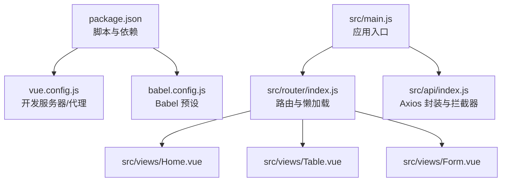
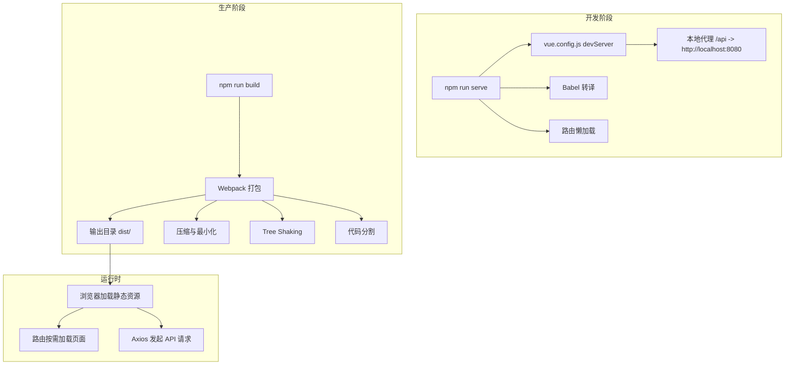
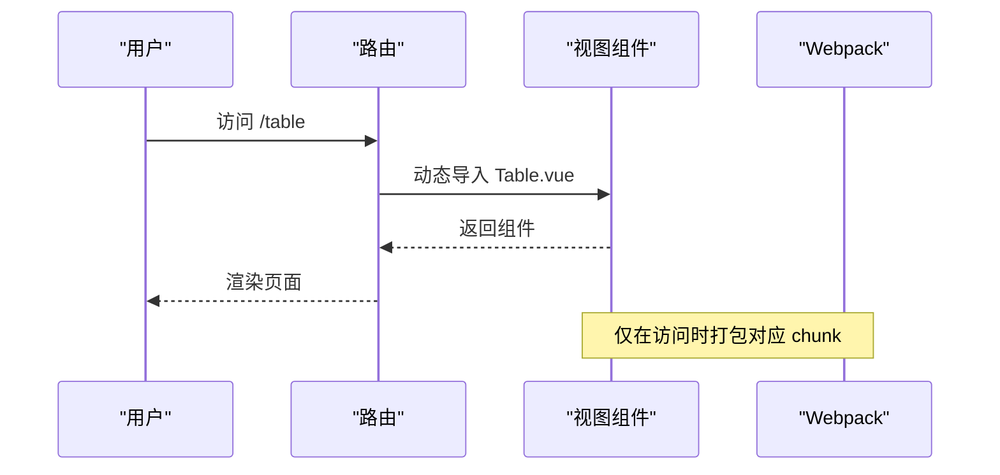
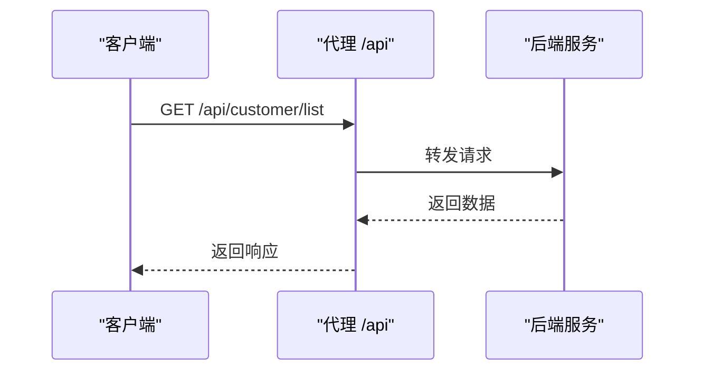
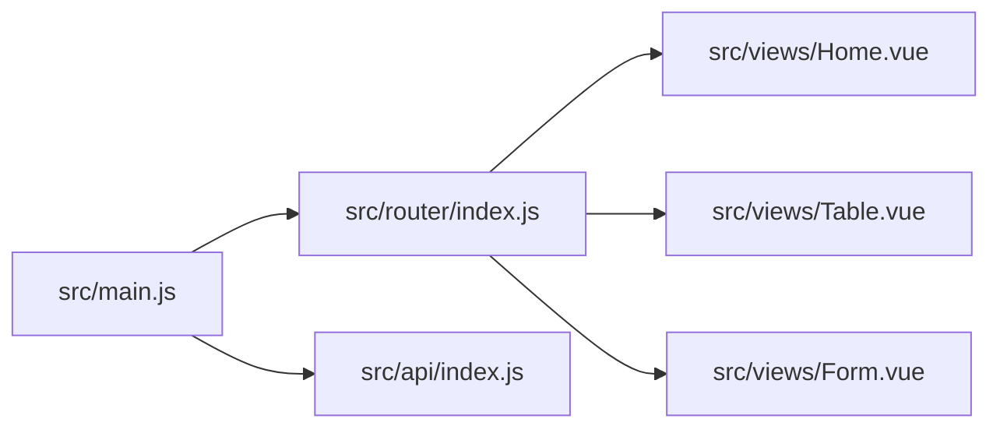

# 构建与优化

<cite>
**本文引用的文件**
- [vue.config.js](file://vue.config.js)
- [package.json](file://package.json)
- [babel.config.js](file://babel.config.js)
- [src/main.js](file://src/main.js)
- [src/router/index.js](file://src/router/index.js)
- [src/api/index.js](file://src/api/index.js)
- [src/views/Home.vue](file://src/views/Home.vue)
- [src/views/Table.vue](file://src/views/Table.vue)
- [src/views/Form.vue](file://src/views/Form.vue)
</cite>

## 目录
1. [简介](#简介)
2. [项目结构](#项目结构)
3. [核心组件](#核心组件)
4. [架构总览](#架构总览)
5. [详细组件分析](#详细组件分析)
6. [依赖关系分析](#依赖关系分析)
7. [性能考量](#性能考量)
8. [故障排查指南](#故障排查指南)
9. [结论](#结论)
10. [附录](#附录)

## 简介
本指南面向使用 Vue CLI 的前端团队，围绕构建与性能优化展开，结合当前仓库的配置与代码现状，系统讲解以下内容：
- Vue CLI 构建配置项（输出目录、资源路径、压缩设置）
- 开发与生产环境的构建策略差异
- 代码分割、懒加载与 Tree Shaking 的落地实践
- 静态资源优化、缓存策略与 CDN 集成思路
- 构建性能优化、Bundle 分析与体积控制技巧
- 部署前最终检查清单与性能基准测试方法

## 项目结构
该仓库采用标准 Vue CLI 项目布局，关键目录与文件如下：
- 根级配置：vue.config.js（开发服务器、代理等）、package.json（脚本与依赖）、babel.config.js（Babel 预设）
- 应用入口：src/main.js（挂载根实例、引入路由与 UI 组件）
- 路由与页面：src/router/index.js（定义路由与懒加载）、src/views 下的页面组件
- 网络层：src/api/index.js（Axios 实例封装与拦截器）

图表来源
- [package.json:1-29](file://package.json#L1-L29)
- [vue.config.js:1-14](file://vue.config.js#L1-L14)
- [babel.config.js:1-6](file://babel.config.js#L1-L6)
- [src/main.js:1-18](file://src/main.js#L1-L18)
- [src/router/index.js:1-32](file://src/router/index.js#L1-L32)
- [src/api/index.js:1-110](file://src/api/index.js#L1-L110)

章节来源
- [package.json:1-29](file://package.json#L1-L29)
- [vue.config.js:1-14](file://vue.config.js#L1-L14)
- [babel.config.js:1-6](file://babel.config.js#L1-L6)
- [src/main.js:1-18](file://src/main.js#L1-L18)
- [src/router/index.js:1-32](file://src/router/index.js#L1-L32)
- [src/api/index.js:1-110](file://src/api/index.js#L1-L110)

## 核心组件
- 构建与运行脚本：通过 package.json 中的 serve/build/lint 脚本驱动 Vue CLI 服务与打包。
- 开发服务器与代理：vue.config.js 提供 devServer 配置，含端口、自动打开浏览器与本地代理到后端服务。
- Babel 转译：babel.config.js 使用 @vue/cli-plugin-babel/preset，确保现代语法在目标浏览器兼容。
- 应用入口与路由：src/main.js 引入 Element UI 并挂载根实例；路由采用 hash 模式并使用动态导入实现懒加载。
- 网络层：src/api/index.js 基于 Axios 创建实例，统一设置基础路径与超时，并通过拦截器处理响应校验。

章节来源
- [package.json:5-8](file://package.json#L5-L8)
- [vue.config.js:3-12](file://vue.config.js#L3-L12)
- [babel.config.js:1-6](file://babel.config.js#L1-L6)
- [src/main.js:1-18](file://src/main.js#L1-L18)
- [src/router/index.js:16-22](file://src/router/index.js#L16-L22)
- [src/api/index.js:4-7](file://src/api/index.js#L4-L7)

## 架构总览
下图展示从开发到生产的典型流程，以及关键优化点的落位位置。

图表来源
- [package.json:5-8](file://package.json#L5-L8)
- [vue.config.js:3-12](file://vue.config.js#L3-L12)
- [src/router/index.js:16-22](file://src/router/index.js#L16-L22)
- [src/api/index.js:4-7](file://src/api/index.js#L4-L7)

## 详细组件分析

### 构建配置与输出
- 输出目录：默认为 dist/，可通过扩展 vue.config.js 的 configureWebpack 或 chainWebpack 自定义输出路径与产物命名策略。
- 资源路径：public 目录下的静态资源会原样复制到输出目录根路径；应用内资源由 Webpack 处理，默认使用相对路径或可配置的 publicPath。
- 压缩与最小化：生产构建默认启用 JS/CSS 压缩与 HTML 压缩；如需更细粒度控制，可在链式配置中调整压缩参数或替换插件。

章节来源
- [package.json:5-8](file://package.json#L5-L8)
- [vue.config.js:1-14](file://vue.config.js#L1-L14)

### 开发与生产环境策略
- 开发环境：热更新、SourceMap、未启用 ESLint 校验（lintOnSave=false），便于快速迭代。
- 生产环境：关闭开发工具提示、启用压缩与 Tree Shaking、移除调试代码、生成独立的 vendor 包以提升缓存命中率。

章节来源
- [vue.config.js:2-2](file://vue.config.js#L2-L2)
- [src/main.js:8-9](file://src/main.js#L8-L9)

### 代码分割与懒加载
- 路由级懒加载：在路由配置中使用动态导入，实现按需加载页面模块，减少首屏包体。
- 组件级懒加载：在需要时再引入重型组件，避免一次性加载所有功能模块。
- 第三方库拆分：将 Element UI 等大体量依赖单独抽离，配合 CDN 可进一步降低首屏体积。

图表来源
- [src/router/index.js:16-22](file://src/router/index.js#L16-L22)
- [src/views/Table.vue:1-214](file://src/views/Table.vue#L1-L214)

章节来源
- [src/router/index.js:16-22](file://src/router/index.js#L16-L22)

### Tree Shaking 与副作用
- Tree Shaking：确保依赖以 ES Module 导出，避免直接 require 或默认导出导致摇树失效；生产构建默认开启。
- 副作用：在 package.json 的 sideEffects 字段声明无副作用模块，有助于更彻底地移除未使用代码。
- 代码组织：将纯函数与工具方法拆分为独立模块，便于按需引入，减少冗余代码进入主包。

章节来源
- [package.json:1-29](file://package.json#L1-L29)

### 静态资源优化与缓存策略
- 图片与字体：压缩图片、使用现代格式（WebP）并提供回退；字体文件按需加载。
- CSS：提取公共样式、去除未使用样式；对第三方 UI 库样式进行按需引入。
- 缓存：通过文件名指纹（hash）实现强缓存；vendor 与业务代码分离，提升缓存复用率。
- CDN：将静态资源托管至 CDN，缩短首字节时间；对第三方库可考虑 CDN 加速。

章节来源
- [src/views/Home.vue:1-175](file://src/views/Home.vue#L1-L175)
- [src/views/Table.vue:1-214](file://src/views/Table.vue#L1-L214)
- [src/views/Form.vue:1-143](file://src/views/Form.vue#L1-L143)

### CDN 集成方案
- 外部依赖：将 Vue、Element UI、Axios 等稳定库指向 CDN，减少打包体积。
- 版本锁定：固定 CDN 版本，避免升级带来的不兼容风险。
- 回退策略：当 CDN 不可用时回退到本地打包，保证可用性。

章节来源
- [src/main.js:4-6](file://src/main.js#L4-L6)
- [src/api/index.js:1-1](file://src/api/index.js#L1-L1)

### 网络层优化与代理
- 本地代理：vue.config.js 的 devServer.proxy 将 /api 前缀转发到后端服务，避免跨域问题。
- Axios 实例：统一设置 baseURL、超时与拦截器，集中处理错误与鉴权逻辑。
- 请求合并与并发：在页面中使用 Promise.all 并发请求，减少等待时间。

图表来源
- [vue.config.js:6-11](file://vue.config.js#L6-L11)
- [src/api/index.js:4-7](file://src/api/index.js#L4-L7)

章节来源
- [vue.config.js:6-11](file://vue.config.js#L6-L11)
- [src/api/index.js:4-7](file://src/api/index.js#L4-L7)

### 页面与交互优化
- 首屏渲染：将非关键路径的组件延迟加载，优先保证核心页面的渲染速度。
- 列表分页与虚拟滚动：在大数据量场景下采用分页或虚拟滚动，降低 DOM 压力。
- 表单校验与防抖：在输入类组件上使用防抖，减少无效请求与渲染。

章节来源
- [src/views/Home.vue:128-156](file://src/views/Home.vue#L128-L156)
- [src/views/Table.vue:136-162](file://src/views/Table.vue#L136-L162)
- [src/views/Form.vue:81-135](file://src/views/Form.vue#L81-L135)

## 依赖关系分析
- 应用入口依赖路由与 UI 组件，路由依赖各页面组件，页面组件依赖 API 层。
- 开发与生产均依赖 Vue CLI 服务与 Babel 转译，生产构建依赖 Webpack 进行打包与优化。

图表来源
- [src/main.js:1-18](file://src/main.js#L1-L18)
- [src/router/index.js:1-32](file://src/router/index.js#L1-L32)
- [src/api/index.js:1-110](file://src/api/index.js#L1-L110)

章节来源
- [src/main.js:1-18](file://src/main.js#L1-L18)
- [src/router/index.js:1-32](file://src/router/index.js#L1-L32)
- [src/api/index.js:1-110](file://src/api/index.js#L1-L110)

## 性能考量
- 构建性能
  - 启用缓存：使用 cache-loader 或 babel-loader 缓存，加速二次构建。
  - 并行构建：合理拆分任务，避免单任务过长阻塞。
  - 减少无关文件参与构建：通过 .gitignore 与 webpack 排除规则过滤。
- Bundle 分析
  - 使用 webpack-bundle-analyzer 生成可视化报告，定位大体积模块与重复依赖。
  - 关注第三方库体积占比，优先优化体积最大的依赖。
- 体积控制
  - 按需引入：UI 组件库按需加载，避免整包引入。
  - 移除冗余：清理未使用代码与样式，利用 Tree Shaking。
  - 压缩与分包：启用压缩与代码分割，合理划分 vendor 与业务包。
- 运行时性能
  - 懒加载与虚拟滚动：减少首屏渲染压力。
  - 防抖与节流：在高频事件中降低计算与渲染开销。
  - 缓存策略：合理设置 HTTP 缓存头与文件指纹，提升二次访问速度。

## 故障排查指南
- 构建失败
  - 检查依赖版本与 Node 版本是否满足 Vue CLI 要求。
  - 查看构建日志中的报错信息，定位具体模块与行号。
- 开发代理异常
  - 确认 vue.config.js 中的代理配置与后端服务地址一致。
  - 检查 CORS 设置与跨域策略。
- 运行时错误
  - 在 src/api/index.js 的响应拦截器中统一处理错误，避免未捕获异常。
  - 对异步请求使用 try/catch 与错误提示，提升用户体验。

章节来源
- [vue.config.js:6-11](file://vue.config.js#L6-L11)
- [src/api/index.js:19-31](file://src/api/index.js#L19-L31)

## 结论
本指南基于现有仓库配置与代码，给出了从构建到运行的全链路优化建议。通过合理的代码分割、懒加载与 Tree Shaking，配合静态资源优化与 CDN 集成，可显著降低首屏体积与加载时间。同时，借助 Bundle 分析与缓存策略，持续监控与迭代性能表现，确保应用在不同环境下保持稳定高效的用户体验。

## 附录
- 部署前最终检查清单
  - 本地构建通过，dist 目录产物完整。
  - 生产环境脚本可正常执行，无警告与错误。
  - 代理配置与 API 地址已切换为线上域名。
  - CDN 与缓存策略已生效，第三方库可正常加载。
  - 性能指标达标：首屏时间、TTFB、TTI、CLS 等。
- 性能基准测试方法
  - 使用 Lighthouse 或 WebPageTest 进行端到端测试。
  - 在真实设备与网络条件下进行 A/B 对比，验证优化效果。
  - 建立自动化流水线，每次构建后自动生成报告并对比历史数据。