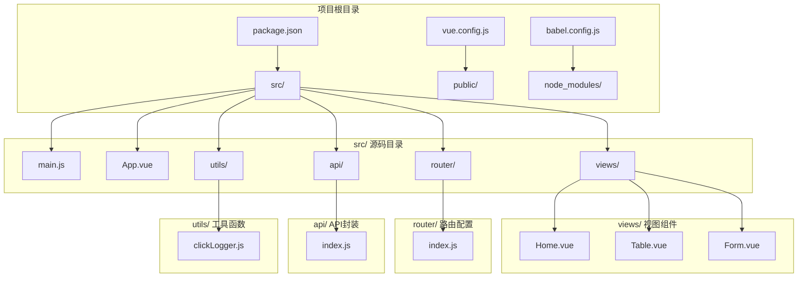
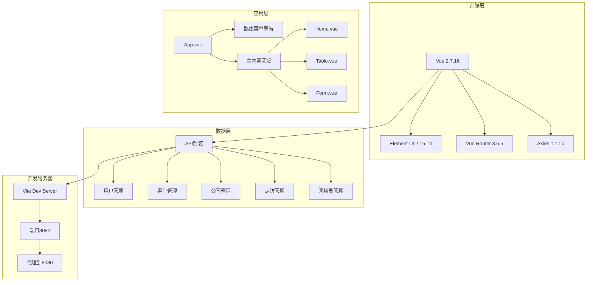
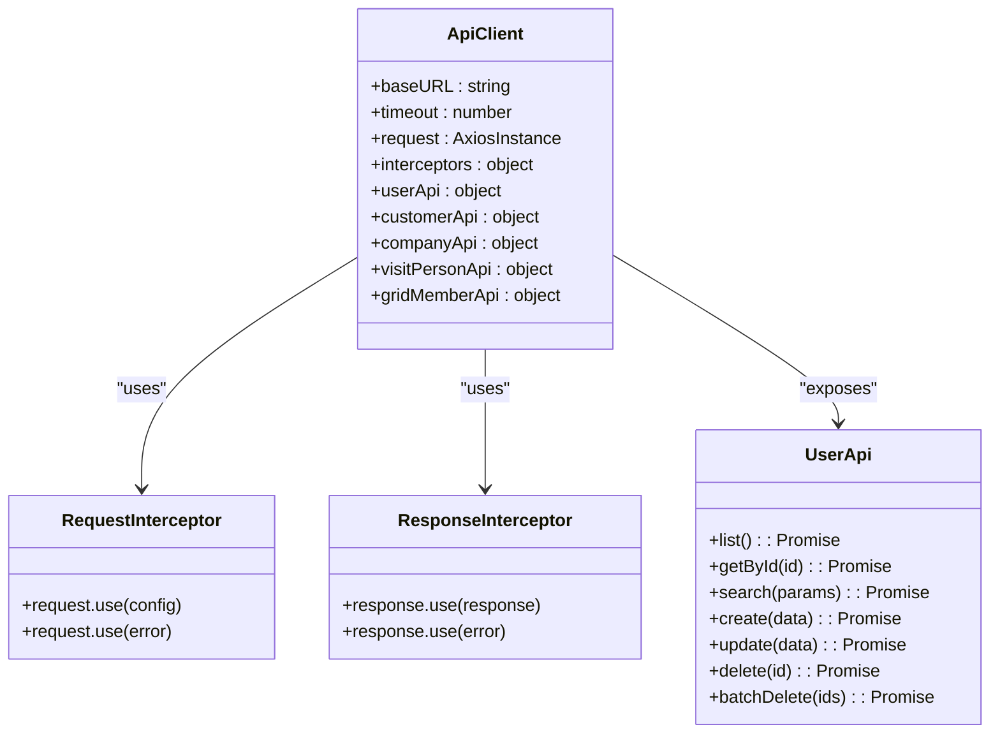
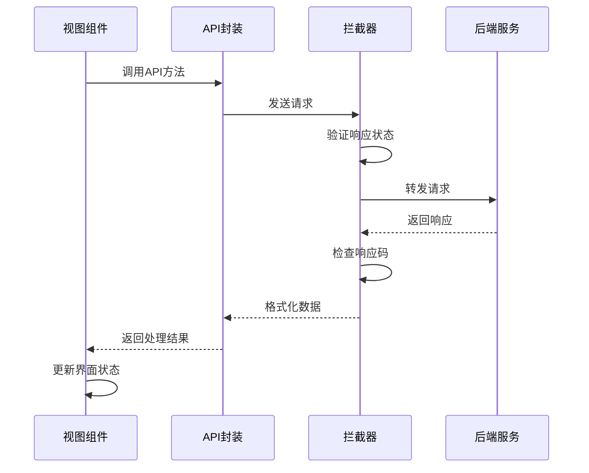
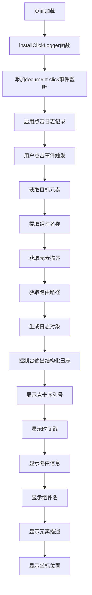
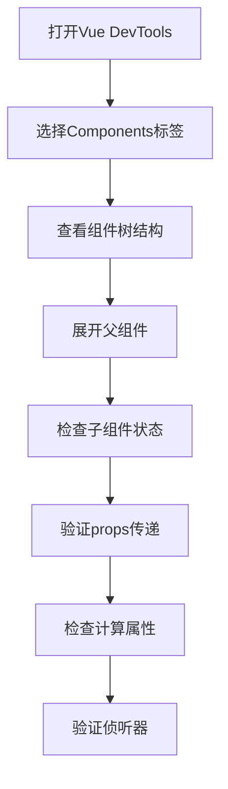
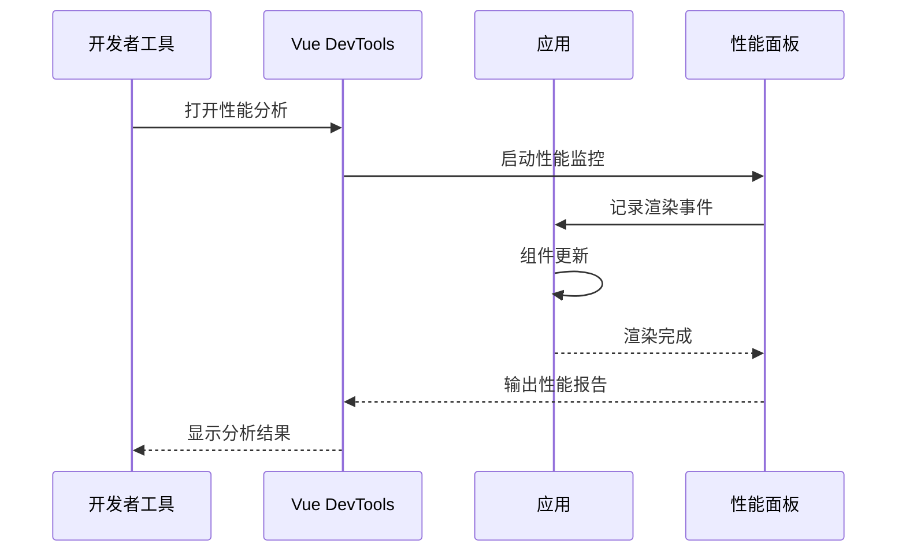
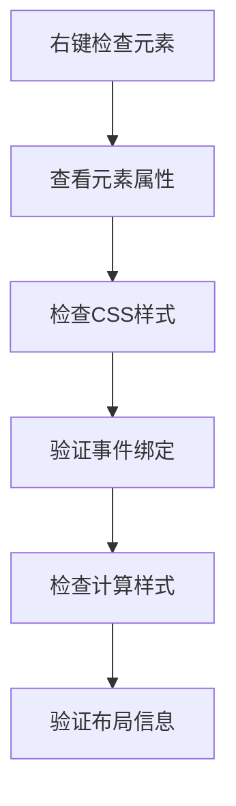
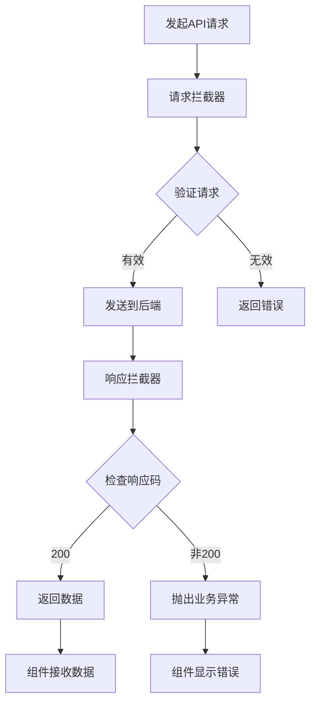
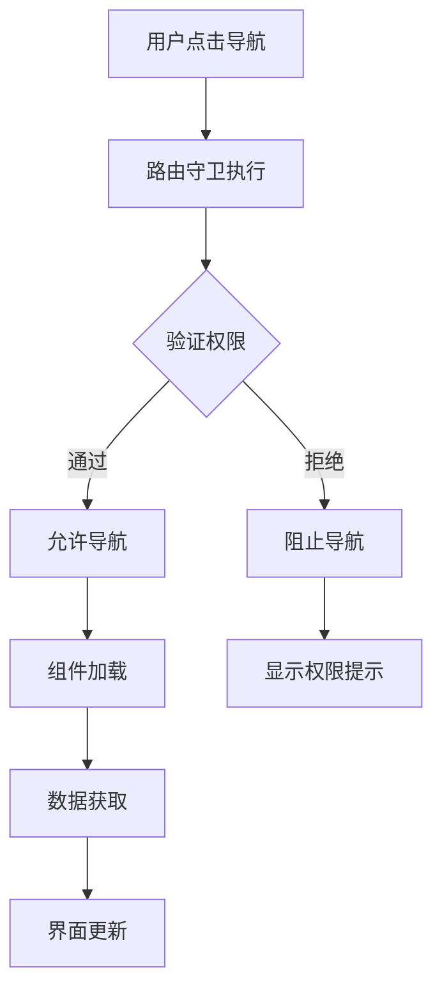

# 调试与测试

<cite>
**本文档引用的文件**
- [package.json](file://package.json)
- [main.js](file://src/main.js)
- [App.vue](file://src/App.vue)
- [router/index.js](file://src/router/index.js)
- [Home.vue](file://src/views/Home.vue)
- [Table.vue](file://src/views/Table.vue)
- [Form.vue](file://src/views/Form.vue)
- [api/index.js](file://src/api/index.js)
- [vue.config.js](file://vue.config.js)
- [babel.config.js](file://babel.config.js)
- [utils/clickLogger.js](file://src/utils/clickLogger.js)
</cite>

## 目录
1. [简介](#简介)
2. [项目结构](#项目结构)
3. [核心组件](#核心组件)
4. [架构概览](#架构概览)
5. [详细组件分析](#详细组件分析)
6. [依赖关系分析](#依赖关系分析)
7. [性能考虑](#性能考虑)
8. [故障排除指南](#故障排除指南)
9. [结论](#结论)

## 简介

本指南专注于Vue.js应用的调试与测试实践，涵盖Vue DevTools使用、浏览器开发者工具调试技巧、API接口调试、网络请求监控以及常见bug定位方法。该Vue 2.7.16应用采用Element UI 2.15.14组件库，通过Vue Router实现路由管理，使用Axios进行HTTP通信，并集成了自定义的全局点击日志记录工具。

## 项目结构

该项目采用标准的Vue CLI项目结构，主要包含以下核心目录：



**图表来源**
- [main.js:1-18](file://src/main.js#L1-L18)
- [App.vue:1-258](file://src/App.vue#L1-L258)
- [router/index.js:1-32](file://src/router/index.js#L1-L32)
- [api/index.js:1-110](file://src/api/index.js#L1-L110)

**章节来源**
- [package.json:1-29](file://package.json#L1-L29)
- [main.js:1-18](file://src/main.js#L1-L18)
- [vue.config.js:1-14](file://vue.config.js#L1-L14)

## 核心组件

### 应用入口与初始化

应用通过main.js进行初始化，主要包含以下关键步骤：

1. **Vue实例创建**：导入Vue核心库和应用组件
2. **插件安装**：集成Element UI组件库和路由系统
3. **全局配置**：设置生产提示关闭
4. **实例挂载**：渲染根组件到DOM节点
5. **工具初始化**：启动全局点击日志记录

### 主要视图组件

应用包含三个核心业务视图组件：

- **Home.vue**：首页统计面板，展示客户和公司统计数据
- **Table.vue**：客户管理表格，支持搜索、分页、增删改查
- **Form.vue**：走访人员管理表单，支持数据录入和列表展示

**章节来源**
- [main.js:1-18](file://src/main.js#L1-L18)
- [App.vue:52-56](file://src/App.vue#L52-L56)
- [Home.vue:107-156](file://src/views/Home.vue#L107-L156)
- [Table.vue:98-208](file://src/views/Table.vue#L98-L208)
- [Form.vue:56-137](file://src/views/Form.vue#L56-L137)

## 架构概览

应用采用经典的Vue单页应用架构，结合Element UI组件库和Vue Router路由系统：



**图表来源**
- [package.json:10-21](file://package.json#L10-L21)
- [App.vue:1-50](file://src/App.vue#L1-L50)
- [router/index.js:7-29](file://src/router/index.js#L7-L29)
- [api/index.js:33-97](file://src/api/index.js#L33-L97)
- [vue.config.js:3-12](file://vue.config.js#L3-L12)

## 详细组件分析

### API封装层设计

API模块采用统一的Axios实例配置，提供完整的RESTful API封装：



**图表来源**
- [api/index.js:3-31](file://src/api/index.js#L3-L31)
- [api/index.js:34-97](file://src/api/index.js#L34-L97)

#### API调用流程



**图表来源**
- [api/index.js:10-31](file://src/api/index.js#L10-L31)
- [Home.vue:132-147](file://src/views/Home.vue#L132-L147)
- [Table.vue:136-154](file://src/views/Table.vue#L136-L154)

**章节来源**
- [api/index.js:1-110](file://src/api/index.js#L1-L110)
- [Home.vue:108-156](file://src/views/Home.vue#L108-L156)
- [Table.vue:99-208](file://src/views/Table.vue#L99-L208)
- [Form.vue:57-137](file://src/views/Form.vue#L57-L137)

### 路由系统设计

应用使用Vue Router实现多页面导航，采用hash模式确保兼容性：

```mermaid
flowchart TD
A[应用启动] --> B[创建Vue Router实例]
B --> C[定义路由配置]
C --> D[配置hash模式]
D --> E[注册路由守卫]
E --> F[初始化路由]
C --> G[/ 路由 -> Home组件]
C --> H[/table 路由 -> Table组件]
C --> I[/form 路由 -> Form组件]
G --> J[懒加载异步组件]
H --> J
I --> J
```

**图表来源**
- [router/index.js:1-32](file://src/router/index.js#L1-L32)

**章节来源**
- [router/index.js:1-32](file://src/router/index.js#L1-L32)

### 全局点击日志记录

应用集成了自定义的全局点击日志记录工具，用于调试用户交互行为：



**图表来源**
- [utils/clickLogger.js:36-60](file://src/utils/clickLogger.js#L36-L60)

**章节来源**
- [utils/clickLogger.js:1-70](file://src/utils/clickLogger.js#L1-L70)
- [main.js:6](file://src/main.js#L6)
- [main.js:17](file://src/main.js#L17)

## 依赖关系分析

应用的核心依赖关系如下：

```mermaid
graph LR
subgraph "运行时依赖"
A[Vue 2.7.16] --> B[Element UI 2.15.14]
A --> C[Vue Router 3.6.5]
A --> D[Axios 1.17.0]
A --> E[Core-js 3.8.3]
end
subgraph "开发时依赖"
F[@vue/cli-service ~5.0.0] --> G[Babel预设]
F --> H[Vue模板编译器]
F --> I[路由插件]
F --> J[Webpack构建]
end
subgraph "应用代码"
K[main.js] --> A
K --> C
K --> B
L[App.vue] --> A
M[API封装] --> D
end
A --> L
C --> M
B --> N[视图组件]
D --> M
```

**图表来源**
- [package.json:10-22](file://package.json#L10-L22)
- [main.js:1-8](file://src/main.js#L1-L8)

**章节来源**
- [package.json:1-29](file://package.json#L1-L29)
- [babel.config.js:1-6](file://babel.config.js#L1-L6)

## 性能考虑

### 开发服务器配置

应用使用Vue CLI的开发服务器，配置了代理功能以支持前后端分离开发：

- **端口配置**：开发服务器运行在8082端口
- **自动打开**：启动时自动打开浏览器窗口
- **代理设置**：将/api前缀的请求转发到本地8080端口

### 组件性能优化

1. **懒加载路由**：Table和Form组件采用动态导入实现按需加载
2. **条件渲染**：使用v-if/v-show控制组件显示状态
3. **事件防抖**：对高频事件进行节流处理
4. **虚拟滚动**：大数据量场景下考虑使用虚拟滚动组件

### 网络请求优化

1. **请求拦截器**：统一处理请求头和认证信息
2. **响应拦截器**：统一处理错误状态和业务逻辑
3. **超时控制**：设置合理的请求超时时间
4. **缓存策略**：对静态数据实现客户端缓存

**章节来源**
- [vue.config.js:1-14](file://vue.config.js#L1-L14)
- [router/index.js:16](file://src/router/index.js#L16)
- [api/index.js:4-7](file://src/api/index.js#L4-L7)

## 故障排除指南

### Vue DevTools使用指南

#### 安装与配置

1. **浏览器扩展安装**
   - Chrome: 在Chrome Web Store中搜索"Vue DevTools"
   - Firefox: 在Firefox附加组件商店中搜索"Vue.js devtools"
   - Edge: 在Microsoft Store中搜索"Vue.js devtools"

2. **启用Vue DevTools**
   - 打开Vue应用页面
   - 按F12打开开发者工具
   - 查找"Vue"标签页

#### 组件检查



#### 状态监控

1. **数据流追踪**
   - 使用"Vuex"标签监控全局状态
   - 检查组件本地状态变化
   - 监控响应式数据更新

2. **生命周期监控**
   - 观察组件创建和销毁过程
   - 检查渲染次数和性能指标
   - 监控内存泄漏情况

#### 性能分析



### 浏览器开发者工具调试

#### 控制台调试技巧

1. **断点调试**
   - 在源码中设置断点
   - 使用条件断点过滤特定情况
   - 利用断点组组织调试流程

2. **网络请求监控**
   - 查看XHR/Fetch请求详情
   - 分析请求头和响应体
   - 监控请求耗时和成功率

3. **性能分析**
   - 使用Performance面板记录运行时
   - 分析CPU使用情况
   - 识别内存泄漏问题

#### DOM检查



### API接口调试

#### 请求拦截器调试



#### 错误处理策略

1. **网络错误**：检查连接状态和代理配置
2. **业务错误**：验证响应格式和错误码
3. **超时错误**：调整超时时间和重试机制
4. **跨域错误**：配置正确的CORS头

**章节来源**
- [api/index.js:9-31](file://src/api/index.js#L9-L31)
- [Home.vue:144](file://src/views/Home.vue#L144)
- [Table.vue:150](file://src/views/Table.vue#L150)
- [Form.vue:87](file://src/views/Form.vue#L87)

### 常见Bug定位方法

#### 组件状态问题

1. **数据不更新**
   - 检查响应式数据定义
   - 验证数据变更触发机制
   - 确认组件重新渲染条件

2. **事件处理异常**
   - 使用Vue DevTools检查事件绑定
   - 验证事件处理器参数
   - 检查事件冒泡和阻止默认行为

#### 路由导航问题



#### 网络请求问题

1. **请求失败排查**
   - 检查API端点和参数
   - 验证认证状态和令牌
   - 确认代理配置正确

2. **响应数据异常**
   - 验证数据格式一致性
   - 检查空值和边界条件
   - 确认数据转换逻辑

**章节来源**
- [router/index.js:25-29](file://src/router/index.js#L25-L29)
- [Home.vue:148-154](file://src/views/Home.vue#L148-L154)
- [Table.vue:173-190](file://src/views/Table.vue#L173-L190)

## 结论

本指南提供了Vue.js应用调试与测试的完整实践方案。通过合理利用Vue DevTools、浏览器开发者工具和自定义调试工具，可以有效提升开发效率和应用质量。建议在实际开发中：

1. **建立标准化的调试流程**：从组件检查到性能分析的完整链路
2. **完善错误处理机制**：统一的错误捕获和用户反馈
3. **持续监控应用性能**：定期进行性能评估和优化
4. **文档化调试经验**：积累团队内部的最佳实践

这些实践不仅适用于当前项目，也可以推广到其他Vue.js应用的开发和维护中。