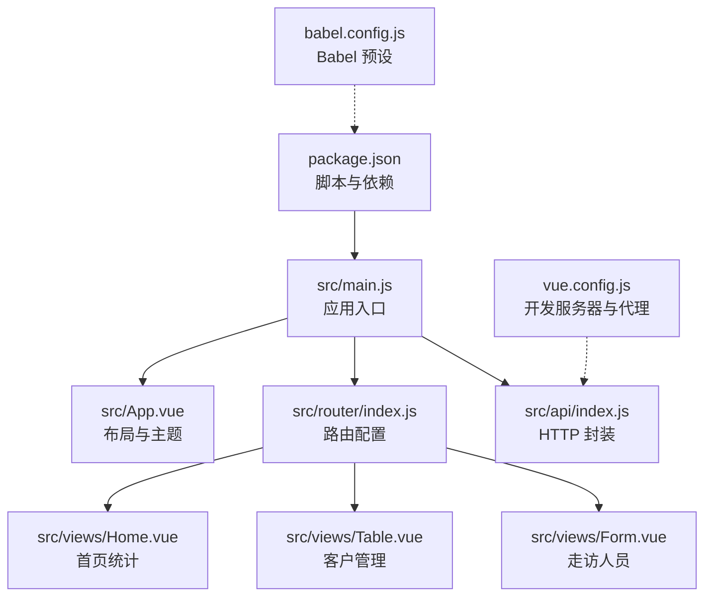
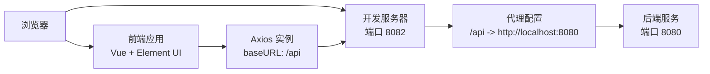
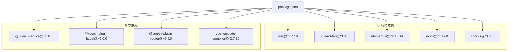

# 快速开始

<cite>
**本文引用的文件**
- [package.json](file://package.json)
- [vue.config.js](file://vue.config.js)
- [babel.config.js](file://babel.config.js)
- [src/main.js](file://src/main.js)
- [src/App.vue](file://src/App.vue)
- [src/router/index.js](file://src/router/index.js)
- [src/views/Home.vue](file://src/views/Home.vue)
- [src/views/Table.vue](file://src/views/Table.vue)
- [src/views/Form.vue](file://src/views/Form.vue)
- [src/api/index.js](file://src/api/index.js)
- [.gitignore](file://.gitignore)
</cite>

## 目录
1. [简介](#简介)
2. [项目结构](#项目结构)
3. [核心组件](#核心组件)
4. [架构总览](#架构总览)
5. [详细组件分析](#详细组件分析)
6. [依赖分析](#依赖分析)
7. [性能考虑](#性能考虑)
8. [故障排查指南](#故障排查指南)
9. [结论](#结论)
10. [附录](#附录)

## 简介
本指南面向新加入的开发者，帮助你在最短时间内完成开发环境准备、项目安装与启动，并掌握常用的 npm scripts 与开发流程。该 Vue.js 后台管理系统基于 Vue CLI 5.x 构建，采用 Element UI 组件库，内置开发服务器与代理配置，支持暗色主题界面与基础的客户、公司、走访等业务页面。

## 项目结构
项目采用典型的 Vue CLI 单页应用结构，核心入口为 src/main.js，路由在 src/router/index.js 中定义，页面组件位于 src/views 下，全局 API 封装在 src/api/index.js，开发服务器与代理通过 vue.config.js 配置。

**图表来源**
- [package.json:1-29](file://package.json#L1-L29)
- [src/main.js:1-14](file://src/main.js#L1-L14)
- [src/App.vue:1-258](file://src/App.vue#L1-L258)
- [src/router/index.js:1-32](file://src/router/index.js#L1-L32)
- [src/views/Home.vue:1-175](file://src/views/Home.vue#L1-L175)
- [src/views/Table.vue:1-214](file://src/views/Table.vue#L1-L214)
- [src/views/Form.vue:1-143](file://src/views/Form.vue#L1-L143)
- [src/api/index.js:1-110](file://src/api/index.js#L1-L110)
- [vue.config.js:1-14](file://vue.config.js#L1-L14)
- [babel.config.js:1-6](file://babel.config.js#L1-L6)

**章节来源**
- [package.json:1-29](file://package.json#L1-L29)
- [vue.config.js:1-14](file://vue.config.js#L1-L14)
- [babel.config.js:1-6](file://babel.config.js#L1-L6)
- [src/main.js:1-14](file://src/main.js#L1-L14)
- [src/App.vue:1-258](file://src/App.vue#L1-L258)
- [src/router/index.js:1-32](file://src/router/index.js#L1-L32)
- [src/views/Home.vue:1-175](file://src/views/Home.vue#L1-L175)
- [src/views/Table.vue:1-214](file://src/views/Table.vue#L1-L214)
- [src/views/Form.vue:1-143](file://src/views/Form.vue#L1-L143)
- [src/api/index.js:1-110](file://src/api/index.js#L1-L110)

## 核心组件
- 应用入口与插件注册：在入口文件中引入 Vue、路由、Element UI，并挂载根实例。
- 路由系统：定义首页、表格页、表单页三条路由，使用 hash 模式。
- 视图组件：首页展示统计卡片与快捷操作；表格页支持分页、搜索、新增/编辑/删除；表单页支持新增/编辑走访人员。
- API 层：统一使用 axios 实例，配置 baseURL 为 /api 并通过开发服务器代理到后端服务。

**章节来源**
- [src/main.js:1-14](file://src/main.js#L1-L14)
- [src/router/index.js:1-32](file://src/router/index.js#L1-L32)
- [src/views/Home.vue:1-175](file://src/views/Home.vue#L1-L175)
- [src/views/Table.vue:1-214](file://src/views/Table.vue#L1-L214)
- [src/views/Form.vue:1-143](file://src/views/Form.vue#L1-L143)
- [src/api/index.js:1-110](file://src/api/index.js#L1-L110)

## 架构总览
下图展示了从浏览器访问到后端接口的整体链路：前端通过开发服务器启动，请求以 /api 开头的路径会被代理到本地后端服务，Axios 在前端负责请求与响应处理。

**图表来源**
- [vue.config.js:1-14](file://vue.config.js#L1-L14)
- [src/api/index.js:1-110](file://src/api/index.js#L1-L110)

## 详细组件分析

### 开发服务器与代理配置
- 开发服务器端口：8082
- 自动打开浏览器
- 代理规则：将 /api 前缀请求转发至 http://localhost:8080
- ESLint 保存时不强制校验

**章节来源**
- [vue.config.js:1-14](file://vue.config.js#L1-L14)

### 路由与页面导航
- 路由模式：hash
- 菜单项对应页面：首页、客户管理、走访人员
- 页面通过 $router.push 或 Element 菜单 router 属性跳转

**章节来源**
- [src/router/index.js:1-32](file://src/router/index.js#L1-L32)
- [src/App.vue:1-258](file://src/App.vue#L1-L258)

### API 封装与拦截器
- baseURL 设为 /api，配合开发服务器代理
- 请求拦截器：可扩展添加鉴权、Loading 等逻辑
- 响应拦截器：统一校验返回 code，非 200 抛错
- 提供用户、客户、公司、走访、网格员等模块的 CRUD 方法

**章节来源**
- [src/api/index.js:1-110](file://src/api/index.js#L1-L110)

### 首页统计与快捷操作
- 统计卡片：客户总数、公司总数、客户走访记录、公司走访记录
- 快捷操作：跳转到客户管理、走访人员等页面
- 数据并发加载，异常时捕获并提示

**章节来源**
- [src/views/Home.vue:1-175](file://src/views/Home.vue#L1-L175)

### 客户管理（表格页）
- 支持按姓名搜索、分页、新增/编辑/删除
- 表单校验、对话框编辑、确认删除
- 加载状态与错误提示

**章节来源**
- [src/views/Table.vue:1-214](file://src/views/Table.vue#L1-L214)

### 走访人员（表单页）
- 表单字段：姓名、角色类型、状态
- 列表展示与操作按钮
- 新增/更新、删除交互

**章节来源**
- [src/views/Form.vue:1-143](file://src/views/Form.vue#L1-L143)

### 应用入口与主题
- 引入 Element UI 及样式
- 挂载根实例，渲染 App.vue
- App.vue 使用 Element 布局容器，实现侧边菜单、头部、主内容区与暗色主题样式

**章节来源**
- [src/main.js:1-14](file://src/main.js#L1-L14)
- [src/App.vue:1-258](file://src/App.vue#L1-L258)

## 依赖分析
- 运行时依赖：Vue 2.x、Vue Router、Element UI、Axios、core-js
- 开发依赖：@vue/cli-service、@vue/cli-plugin-babel、@vue/cli-plugin-router、vue-template-compiler
- 浏览器兼容：默认 browserslist 规则

**图表来源**
- [package.json:1-29](file://package.json#L1-L29)

**章节来源**
- [package.json:1-29](file://package.json#L1-L29)

## 性能考虑
- 首屏加载：按需加载表格与表单页面组件，减少初始包体积。
- 请求优化：统一拦截器集中处理错误与提示，避免重复逻辑。
- 主题与样式：暗色主题通过全局样式覆盖，减少重复样式编写。
- 分页与搜索：表格页支持分页与搜索，降低一次性渲染压力。

[本节为通用建议，不直接分析具体文件]

## 故障排查指南
- 无法访问开发服务器
  - 确认端口未被占用，或修改 vue.config.js 中的 devServer.port
  - 确认已安装依赖后再启动
- 接口 404 或跨域
  - 确保后端服务在 http://localhost:8080 正常运行
  - 确认请求路径以 /api 开头，且代理配置生效
- ESLint 校验报错
  - 当前配置为关闭保存时校验，如需开启可在 vue.config.js 中调整
- Axios 请求失败
  - 检查响应拦截器中的 code 校验与错误提示逻辑
  - 查看网络面板与控制台错误信息

**章节来源**
- [vue.config.js:1-14](file://vue.config.js#L1-L14)
- [src/api/index.js:1-110](file://src/api/index.js#L1-L110)

## 结论
本项目提供了开箱即用的 Vue 后台管理模板：清晰的页面结构、完善的路由与 API 封装、便捷的开发服务器与代理配置。按照“环境准备 → 安装依赖 → 启动服务”的流程，即可快速开展后续功能开发。

[本节为总结性内容，不直接分析具体文件]

## 附录

### 开发环境要求
- Node.js 版本：建议使用长期支持版本（LTS），满足 Vue CLI 5.x 的最低要求
- 包管理器：npm 或 yarn（推荐使用与团队一致的包管理器）

[本节为通用要求，不直接分析具体文件]

### 安装与启动步骤
- 安装依赖
  - 使用 npm 或 yarn 安装项目依赖
- 启动开发服务器
  - 执行开发脚本，自动打开浏览器访问开发地址
- 构建生产包
  - 执行构建脚本生成 dist 目录产物

**章节来源**
- [package.json:5-8](file://package.json#L5-L8)

### 常用 npm scripts 说明
- serve：启动开发服务器，端口 8082，自动打开浏览器，启用 /api 代理
- build：打包构建生产版本
- lint：执行代码风格检查（当前未接入保存时校验）

**章节来源**
- [package.json:5-8](file://package.json#L5-L8)
- [vue.config.js:2](file://vue.config.js#L2)

### 环境配置要点
- 开发服务器端口：8082
- 自动打开浏览器：true
- 代理规则：/api -> http://localhost:8080
- Axios baseURL：/api

**章节来源**
- [vue.config.js:3-12](file://vue.config.js#L3-L12)
- [src/api/index.js:4-6](file://src/api/index.js#L4-L6)

### 项目忽略规则
- node_modules 目录不会被纳入版本控制

**章节来源**
- [.gitignore:1-2](file://.gitignore#L1-L2)