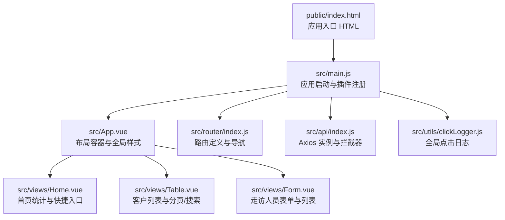
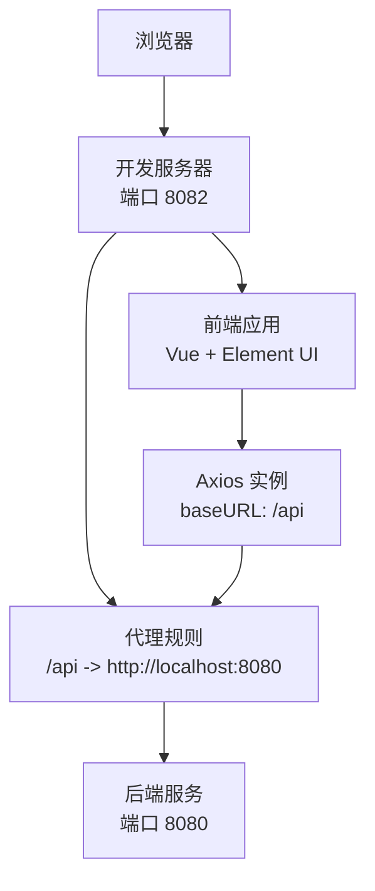
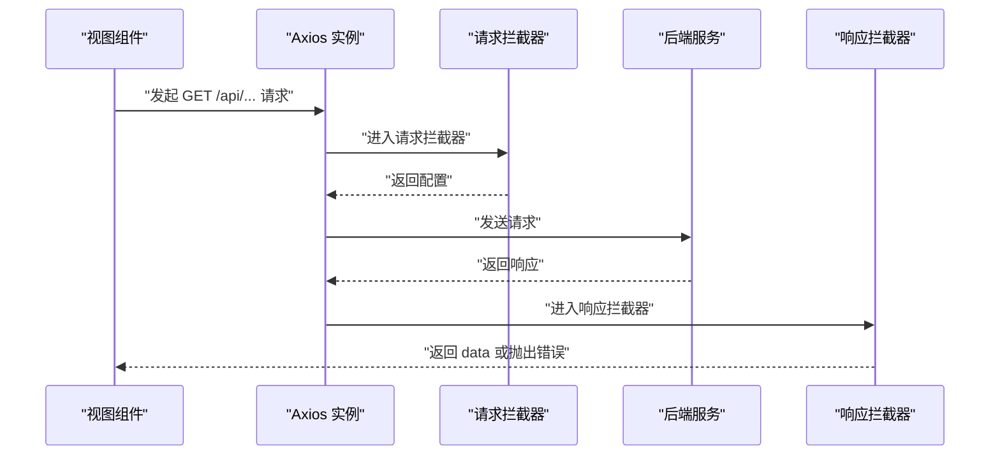
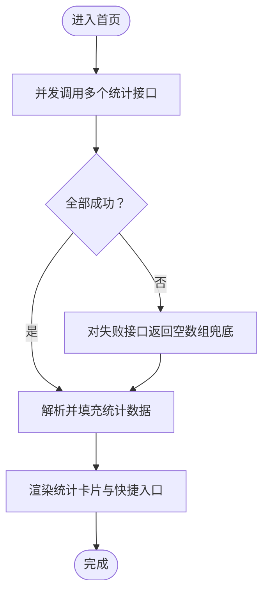
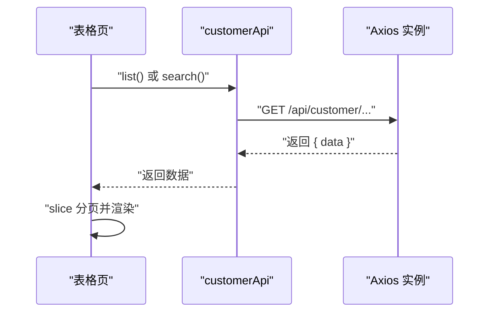
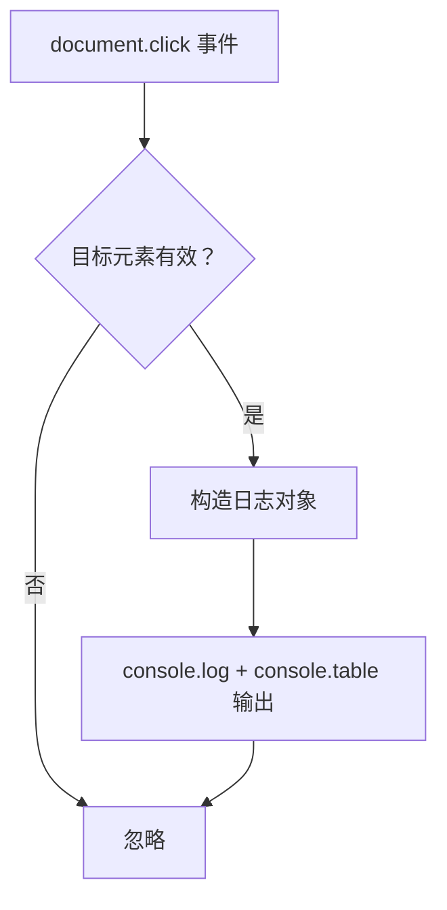
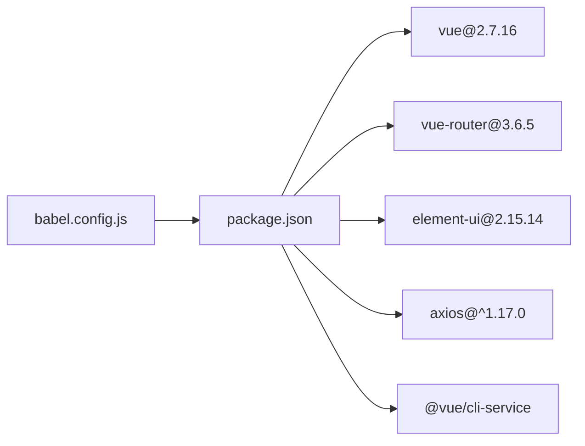

# 故障排除

<cite>
**本文引用的文件**
- [package.json](file://package.json)
- [vue.config.js](file://vue.config.js)
- [babel.config.js](file://babel.config.js)
- [public/index.html](file://public/index.html)
- [src/main.js](file://src/main.js)
- [src/App.vue](file://src/App.vue)
- [src/router/index.js](file://src/router/index.js)
- [src/api/index.js](file://src/api/index.js)
- [src/utils/clickLogger.js](file://src/utils/clickLogger.js)
- [src/views/Home.vue](file://src/views/Home.vue)
- [src/views/Table.vue](file://src/views/Table.vue)
- [src/views/Form.vue](file://src/views/Form.vue)
</cite>

## 目录
1. [简介](#简介)
2. [项目结构](#项目结构)
3. [核心组件](#核心组件)
4. [架构总览](#架构总览)
5. [详细组件分析与排错要点](#详细组件分析与排错要点)
6. [依赖关系分析](#依赖关系分析)
7. [性能考虑与内存泄漏检测](#性能考虑与内存泄漏检测)
8. [故障排除指南](#故障排除指南)
9. [结论](#结论)
10. [附录](#附录)

## 简介
本指南面向使用 Vue.js（2.x + Element UI）开发的后台管理系统，聚焦于开发与运维阶段常见问题的系统化排查方法。内容涵盖依赖冲突、构建错误、运行时异常、API 接口调用失败、数据加载异常、组件渲染问题、浏览器兼容性、性能瓶颈与内存泄漏检测、日志分析与错误监控配置、用户反馈处理流程等，帮助开发者快速定位并解决问题。

## 项目结构
该工程采用 Vue CLI 5 的标准脚手架结构，核心入口为应用挂载点与路由配置，API 层统一通过 Axios 封装，视图层由三个页面组成，配合 Element UI 组件库实现管理界面。

图表来源
- [public/index.html:1-17](file://public/index.html#L1-L17)
- [src/main.js:1-18](file://src/main.js#L1-L18)
- [src/App.vue:1-258](file://src/App.vue#L1-L258)
- [src/router/index.js:1-32](file://src/router/index.js#L1-L32)
- [src/api/index.js:1-110](file://src/api/index.js#L1-L110)
- [src/utils/clickLogger.js:1-71](file://src/utils/clickLogger.js#L1-L71)
- [src/views/Home.vue:1-175](file://src/views/Home.vue#L1-L175)
- [src/views/Table.vue:1-214](file://src/views/Table.vue#L1-L214)
- [src/views/Form.vue:1-143](file://src/views/Form.vue#L1-L143)

章节来源
- [public/index.html:1-17](file://public/index.html#L1-L17)
- [src/main.js:1-18](file://src/main.js#L1-L18)
- [src/App.vue:1-258](file://src/App.vue#L1-L258)
- [src/router/index.js:1-32](file://src/router/index.js#L1-L32)
- [src/api/index.js:1-110](file://src/api/index.js#L1-L110)
- [src/utils/clickLogger.js:1-71](file://src/utils/clickLogger.js#L1-L71)
- [src/views/Home.vue:1-175](file://src/views/Home.vue#L1-L175)
- [src/views/Table.vue:1-214](file://src/views/Table.vue#L1-L214)
- [src/views/Form.vue:1-143](file://src/views/Form.vue#L1-L143)

## 核心组件
- 应用入口与插件
  - 在入口中注册 Element UI 并引入全局点击日志工具，随后挂载根实例。
- 路由系统
  - 使用 hash 模式，定义首页、表格页、表单页三类路由。
- API 层
  - 基于 Axios 创建实例，统一设置基础路径与超时；在响应拦截器中按业务约定校验返回码，非 200 统一抛错。
- 视图组件
  - 首页负责统计聚合与快捷入口；表格页负责客户列表、搜索、分页与增删改；表单页负责走访人员的增删改与列表展示。
- 工具
  - 全局点击日志用于记录点击序列、路由、组件名、元素描述与坐标，便于前端交互问题定位。

章节来源
- [src/main.js:1-18](file://src/main.js#L1-L18)
- [src/router/index.js:1-32](file://src/router/index.js#L1-L32)
- [src/api/index.js:1-110](file://src/api/index.js#L1-L110)
- [src/views/Home.vue:1-175](file://src/views/Home.vue#L1-L175)
- [src/views/Table.vue:1-214](file://src/views/Table.vue#L1-L214)
- [src/views/Form.vue:1-143](file://src/views/Form.vue#L1-L143)
- [src/utils/clickLogger.js:1-71](file://src/utils/clickLogger.js#L1-L71)

## 架构总览
下图展示了从浏览器到后端服务的典型请求链路，以及本地开发代理与跨域策略的关系。

图表来源
- [vue.config.js:1-14](file://vue.config.js#L1-L14)
- [src/api/index.js:1-110](file://src/api/index.js#L1-L110)

章节来源
- [vue.config.js:1-14](file://vue.config.js#L1-L14)
- [src/api/index.js:1-110](file://src/api/index.js#L1-L110)

## 详细组件分析与排错要点

### API 层与请求拦截器
- 关键点
  - 基础路径统一为 /api，结合开发服务器代理转发至后端。
  - 响应拦截器对业务返回码进行校验，非 200 抛出错误，便于上层统一处理。
  - 请求拦截器当前为空实现，如需统一注入 Token 或埋点可在此扩展。
- 常见问题与排查
  - 接口 404/500：检查代理是否生效、后端接口路径是否匹配、返回码是否为 200。
  - 跨域问题：确认代理配置与 changeOrigin 设置，确保 Origin 正确。
  - 超时或网络异常：检查超时阈值与网络连通性。
- 优化建议
  - 在请求拦截器中注入鉴权头；在响应拦截器中增加通用错误提示与重试策略。

图表来源
- [src/api/index.js:1-110](file://src/api/index.js#L1-L110)

章节来源
- [src/api/index.js:1-110](file://src/api/index.js#L1-L110)

### 首页组件（统计与快捷入口）
- 关键点
  - 进入页面即并发拉取多个统计接口，使用 Promise.all 并对每个请求进行兜底。
  - 快捷入口点击后通过路由跳转到对应页面。
- 常见问题与排查
  - 统计数据不显示：检查各接口返回结构是否一致、Promise.all 中任一失败会导致整体失败，确认兜底逻辑是否生效。
  - 路由跳转无效：确认菜单项的路由索引与路由表一致。
- 优化建议
  - 对失败的子请求单独提示，避免“整体失败”导致定位困难。

图表来源
- [src/views/Home.vue:128-156](file://src/views/Home.vue#L128-L156)

章节来源
- [src/views/Home.vue:1-175](file://src/views/Home.vue#L1-L175)

### 表格页（客户管理）
- 关键点
  - 支持搜索、分页、增删改；使用 Element UI 的对话框与表单校验。
  - 加载数据时根据是否存在搜索条件切换不同接口；分页通过切片实现前端分页。
- 常见问题与排查
  - 列表空白：检查接口返回字段与表格列映射是否一致；确认分页起止索引计算。
  - 搜索无结果：确认搜索接口参数与后端一致；检查回车事件绑定是否触发。
  - 删除失败：确认确认对话框返回值与错误分支处理。
- 优化建议
  - 前端分页仅适用于小数据集；大数据建议后端分页并传入 page/size 参数。

图表来源
- [src/views/Table.vue:136-154](file://src/views/Table.vue#L136-L154)
- [src/api/index.js:44-54](file://src/api/index.js#L44-L54)

章节来源
- [src/views/Table.vue:1-214](file://src/views/Table.vue#L1-L214)
- [src/api/index.js:44-54](file://src/api/index.js#L44-L54)

### 表单页（走访人员）
- 关键点
  - 表单校验基于 Element UI 的规则；支持新增与编辑两种模式。
  - 列表展示与删除逻辑清晰，删除前有二次确认。
- 常见问题与排查
  - 表单校验不生效：检查 rules 定义与表单项属性是否匹配。
  - 编辑后未刷新列表：确认提交成功后重新拉取列表。
- 优化建议
  - 提交成功后清空校验状态，提升用户体验。

章节来源
- [src/views/Form.vue:1-143](file://src/views/Form.vue#L1-L143)

### 全局点击日志工具
- 关键点
  - 通过事件委托捕获页面点击，输出结构化日志，包含序号、时间、路由、组件名、元素描述与坐标。
- 常见问题与排查
  - 日志未输出：确认已在入口启用；检查控制台是否有报错。
  - 组件名为空：目标元素未挂载到 Vue 组件树。
- 优化建议
  - 可选关闭功能，避免生产环境过多日志输出。

图表来源
- [src/utils/clickLogger.js:36-60](file://src/utils/clickLogger.js#L36-L60)

章节来源
- [src/utils/clickLogger.js:1-71](file://src/utils/clickLogger.js#L1-L71)
- [src/main.js:16-18](file://src/main.js#L16-L18)

## 依赖关系分析
- 版本与兼容
  - Vue 2.7.16 + Element UI 2.15.14，需关注 Element UI 的兼容性与废弃特性。
  - 开发依赖为 Vue CLI 5，Babel 预设为官方 CLI 预设。
- 浏览器支持
  - browserslist 默认开启现代浏览器，IE 需额外 polyfill 与兼容处理。
- 依赖冲突排查
  - 若出现样式冲突或组件异常，优先检查 Element UI 主题样式是否被覆盖；确认 axios 与拦截器版本兼容。

图表来源
- [package.json:1-29](file://package.json#L1-L29)
- [babel.config.js:1-6](file://babel.config.js#L1-L6)

章节来源
- [package.json:1-29](file://package.json#L1-L29)
- [babel.config.js:1-6](file://babel.config.js#L1-L6)

## 性能考虑与内存泄漏检测
- 性能瓶颈
  - 大列表渲染：Element UI 的表格在大量数据时会成为性能瓶颈，建议后端分页或虚拟滚动。
  - 并发请求：首页统计使用 Promise.all，若接口较多且耗时，建议限流或拆分加载。
  - 图标与样式：暗色主题样式覆盖较多，注意减少不必要的重绘与重排。
- 内存泄漏检测
  - 定期检查组件生命周期钩子中是否遗留定时器、事件监听器或订阅未清理。
  - 使用全局点击日志辅助定位频繁点击导致的重复渲染或事件堆积。
- 浏览器兼容性
  - IE/旧版 Edge：Element UI 2.x 对较新语法支持有限，建议添加 core-js 与 polyfills；必要时降级组件库版本。
  - 移动端：注意触摸事件与点击延迟，确保交互元素尺寸与间距合理。

[本节为通用指导，无需列出章节来源]

## 故障排除指南

### 一、依赖冲突与安装问题
- 现象
  - 安装时报错或模块缺失；运行时报样式丢失或组件不生效。
- 排查步骤
  - 清理缓存并重新安装：删除 node_modules 与 lock 文件后执行安装。
  - 核对 Element UI 与 Vue 版本兼容性；确认主题样式是否正确引入。
  - 检查 axios 与拦截器版本是否与项目约定一致。
- 相关文件
  - [package.json:10-22](file://package.json#L10-L22)

章节来源
- [package.json:10-22](file://package.json#L10-L22)

### 二、构建错误与热更新异常
- 现象
  - npm run serve 启动失败；热更新不生效；打包报错。
- 排查步骤
  - 检查端口占用与 devServer 配置；确认代理目标地址可达。
  - 关闭 ESLint 校验（如需临时验证）或修复 Lint 问题。
  - 更新 @vue/cli-service 至与项目匹配的版本。
- 相关文件
  - [vue.config.js:1-14](file://vue.config.js#L1-L14)
  - [babel.config.js:1-6](file://babel.config.js#L1-L6)

章节来源
- [vue.config.js:1-14](file://vue.config.js#L1-L14)
- [babel.config.js:1-6](file://babel.config.js#L1-L6)

### 三、运行时异常与页面空白
- 现象
  - 页面空白或白屏；控制台报错。
- 排查步骤
  - 检查 public/index.html 是否存在 #app 挂载点；确认入口文件是否正确引入。
  - 查看路由是否正确注册；确认组件导出与命名一致。
  - 检查全局样式是否影响布局；确认 Element UI 主题样式加载顺序。
- 相关文件
  - [public/index.html:14](file://public/index.html#L14)
  - [src/main.js:1-18](file://src/main.js#L1-L18)
  - [src/App.vue:58-257](file://src/App.vue#L58-L257)
  - [src/router/index.js:1-32](file://src/router/index.js#L1-L32)

章节来源
- [public/index.html:14](file://public/index.html#L14)
- [src/main.js:1-18](file://src/main.js#L1-L18)
- [src/App.vue:58-257](file://src/App.vue#L58-L257)
- [src/router/index.js:1-32](file://src/router/index.js#L1-L32)

### 四、API 接口调用失败
- 现象
  - 控制台出现请求失败或业务错误；页面无数据。
- 排查步骤
  - 打开浏览器 Network 面板，确认 /api 前缀请求是否被代理转发到后端。
  - 检查响应拦截器中的返回码判断逻辑，确认错误消息是否正确抛出。
  - 核对接口路径与后端一致；确认查询参数与分页参数传递正确。
- 相关文件
  - [src/api/index.js:1-110](file://src/api/index.js#L1-L110)
  - [vue.config.js:6-12](file://vue.config.js#L6-L12)

章节来源
- [src/api/index.js:1-110](file://src/api/index.js#L1-L110)
- [vue.config.js:6-12](file://vue.config.js#L6-L12)

### 五、数据加载异常与组件渲染问题
- 现象
  - 表格空白、分页无效、搜索无结果、快捷入口点击无反应。
- 排查步骤
  - 首页：确认 Promise.all 中每个接口返回结构一致；检查兜底逻辑。
  - 表格页：核对接口返回字段与表格列映射；检查分页 slice 计算。
  - 表单页：确认表单校验规则与字段一致；提交后刷新列表。
  - 路由：确认菜单项索引与路由表一致；检查 hash 模式下的路径。
- 相关文件
  - [src/views/Home.vue:128-156](file://src/views/Home.vue#L128-L156)
  - [src/views/Table.vue:136-154](file://src/views/Table.vue#L136-L154)
  - [src/views/Form.vue:77-135](file://src/views/Form.vue#L77-L135)
  - [src/router/index.js:7-29](file://src/router/index.js#L7-L29)

章节来源
- [src/views/Home.vue:128-156](file://src/views/Home.vue#L128-L156)
- [src/views/Table.vue:136-154](file://src/views/Table.vue#L136-L154)
- [src/views/Form.vue:77-135](file://src/views/Form.vue#L77-L135)
- [src/router/index.js:7-29](file://src/router/index.js#L7-L29)

### 六、浏览器兼容性问题
- 现象
  - IE/旧版浏览器样式错乱或功能不可用。
- 排查步骤
  - 检查 browserslist 配置；为旧浏览器添加 core-js polyfill。
  - Element UI 2.x 在旧引擎下可能存在语法不兼容，必要时降级或替换组件。
- 相关文件
  - [package.json:23-27](file://package.json#L23-L27)
  - [babel.config.js:1-6](file://babel.config.js#L1-L6)

章节来源
- [package.json:23-27](file://package.json#L23-L27)
- [babel.config.js:1-6](file://babel.config.js#L1-L6)

### 七、日志分析与错误监控
- 日志工具
  - 全局点击日志：记录点击序列、路由、组件名、元素描述与坐标，便于交互问题定位。
- 错误监控建议
  - 在响应拦截器中统一上报错误；在组件中对关键操作增加 try/catch 并上报。
  - 结合浏览器 DevTools 的 Console/Network/Performance 面板进行综合分析。
- 相关文件
  - [src/utils/clickLogger.js:1-71](file://src/utils/clickLogger.js#L1-L71)
  - [src/api/index.js:19-31](file://src/api/index.js#L19-L31)

章节来源
- [src/utils/clickLogger.js:1-71](file://src/utils/clickLogger.js#L1-L71)
- [src/api/index.js:19-31](file://src/api/index.js#L19-L31)

### 八、用户反馈处理流程
- 建议流程
  - 收集：引导用户提供复现步骤、截图、浏览器版本、操作系统。
  - 定位：打开 Network 面板查看请求与响应；打开 Console 查看错误堆栈；使用全局点击日志定位交互路径。
  - 处理：针对不同问题分别处理（接口、样式、路由、兼容性）。
  - 回访：修复后邀请用户验证并关闭工单。
- 相关工具
  - 全局点击日志、Network 面板、Console 面板、Performance 面板。

[本节为通用指导，无需列出章节来源]

## 结论
本指南围绕 Vue 2 + Element UI 的后台管理系统，提供了从入口、路由、API、视图到工具与兼容性的全链路排错方法。建议在开发与运维中结合日志与监控体系，形成“发现问题—定位问题—修复问题—验证问题”的闭环流程，持续提升系统稳定性与可维护性。

## 附录
- 快速检查清单
  - 依赖安装与版本匹配
  - 代理与跨域配置
  - 路由与组件导出一致性
  - 接口返回结构与字段映射
  - 浏览器兼容与 polyfill
  - 日志与监控接入情况

[本节为通用指导，无需列出章节来源]