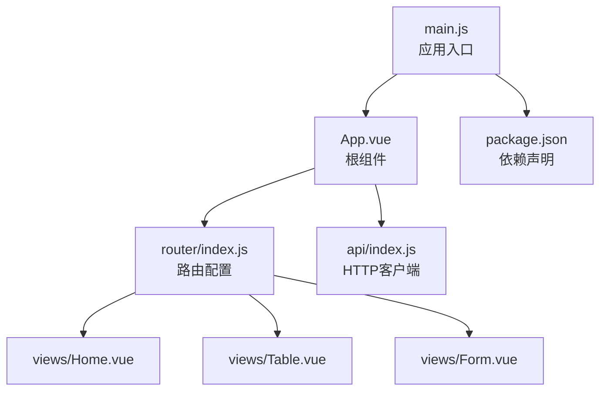
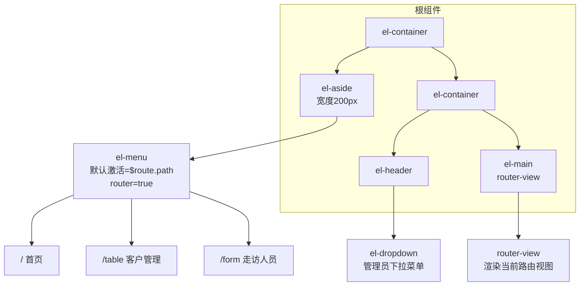
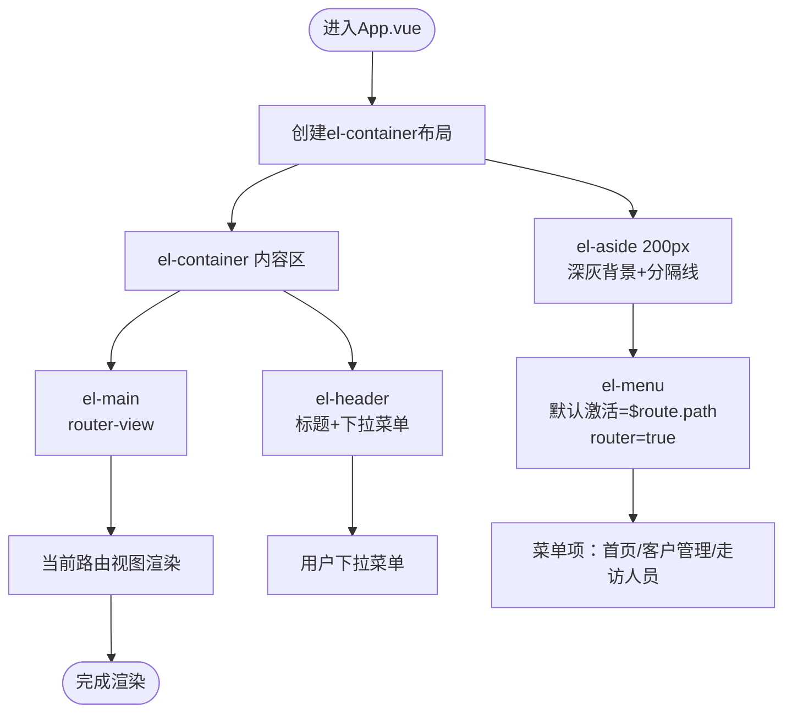
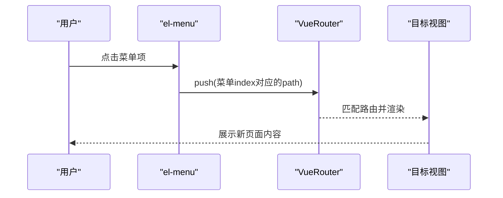
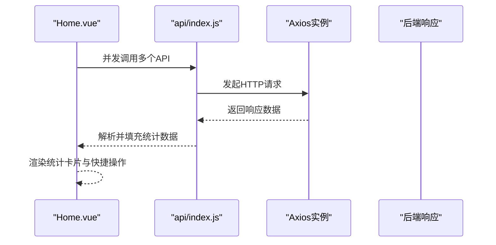
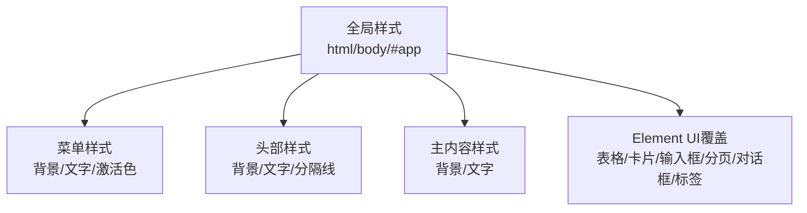
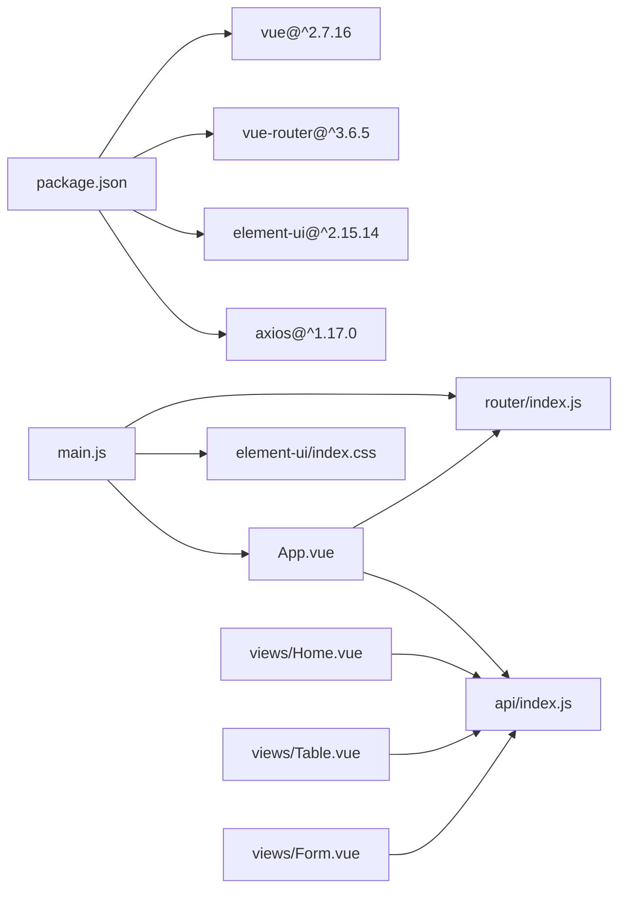

# 应用根组件

<cite>
**本文引用的文件**
- [App.vue](file://src/App.vue)
- [main.js](file://src/main.js)
- [index.js](file://src/router/index.js)
- [Home.vue](file://src/views/Home.vue)
- [Table.vue](file://src/views/Table.vue)
- [Form.vue](file://src/views/Form.vue)
- [index.js](file://src/api/index.js)
- [package.json](file://package.json)
</cite>

## 目录
1. [简介](#简介)
2. [项目结构](#项目结构)
3. [核心组件](#核心组件)
4. [架构总览](#架构总览)
5. [详细组件分析](#详细组件分析)
6. [依赖关系分析](#依赖关系分析)
7. [性能考虑](#性能考虑)
8. [故障排查指南](#故障排查指南)
9. [结论](#结论)
10. [附录](#附录)

## 简介
本文件聚焦于Vue.js应用的根组件App.vue，系统性解析其整体布局架构（侧边栏导航菜单、顶部头部区域、主内容区域）与Element UI布局组件的使用方式；详解路由集成机制（菜单项与路由绑定、活动状态管理、导航跳转）、暗黑主题的全局配置与CSS覆盖策略，并总结组件间通信模式、响应式设计实现与用户体验优化方案。文档面向不同技术背景读者，既提供高层概览也包含代码级细节与可视化图表。

## 项目结构
该应用采用经典的单页应用（SPA）结构：
- 根组件负责页面骨架与主题样式
- 路由定义页面级视图（Home、Table、Form）
- 视图组件通过Element UI构建业务界面
- API模块封装Axios请求与拦截器

**图表来源**
- [main.js:1-18](file://src/main.js#L1-L18)
- [App.vue:1-258](file://src/App.vue#L1-L258)
- [index.js:1-32](file://src/router/index.js#L1-L32)
- [Home.vue:1-175](file://src/views/Home.vue#L1-L175)
- [Table.vue:1-214](file://src/views/Table.vue#L1-L214)
- [Form.vue:1-143](file://src/views/Form.vue#L1-L143)
- [index.js:1-110](file://src/api/index.js#L1-L110)
- [package.json:1-29](file://package.json#L1-L29)

**章节来源**
- [main.js:1-18](file://src/main.js#L1-L18)
- [App.vue:1-258](file://src/App.vue#L1-L258)
- [index.js:1-32](file://src/router/index.js#L1-L32)
- [package.json:1-29](file://package.json#L1-L29)

## 核心组件
- 根组件App.vue：提供el-container/el-aside/el-header/el-main布局容器，内含Logo区、菜单导航、头部下拉菜单与主内容区（router-view）。通过Element UI的菜单组件实现路由联动与活动状态同步。
- 路由模块router/index.js：定义三类页面路径（/, /table, /form），并以hash模式运行。
- 视图组件：Home.vue展示统计卡片与快捷操作；Table.vue提供客户列表、分页与对话框编辑；Form.vue提供走访人员表单与列表。
- API模块：统一的Axios实例，带请求/响应拦截器，按领域导出多个API对象。

**章节来源**
- [App.vue:1-258](file://src/App.vue#L1-L258)
- [index.js:1-32](file://src/router/index.js#L1-L32)
- [Home.vue:1-175](file://src/views/Home.vue#L1-L175)
- [Table.vue:1-214](file://src/views/Table.vue#L1-L214)
- [Form.vue:1-143](file://src/views/Form.vue#L1-L143)
- [index.js:1-110](file://src/api/index.js#L1-L110)

## 架构总览
应用采用“根组件承载布局+路由驱动视图”的经典架构。根组件负责：
- 布局容器：el-container包裹侧边、头部与主内容
- 导航菜单：el-menu绑定当前路由路径，支持router属性自动跳转
- 头部区域：标题与用户下拉菜单
- 主内容区：router-view渲染当前路由对应的视图

**图表来源**
- [App.vue:3-49](file://src/App.vue#L3-L49)

## 详细组件分析

### 根组件App.vue布局与主题
- 布局容器
  - el-container：全高布局，内部嵌套el-aside与el-container
  - el-aside：固定宽度200px，背景色深灰，右侧有细线分隔
  - el-header：深灰背景，底部分隔线，右侧放置标题与下拉菜单
  - el-main：深灰背景，承载router-view
- Logo区：居中标题“个金一体化”，底部分隔线
- 菜单导航
  - 默认激活项绑定为当前路由路径，确保菜单与URL同步
  - 使用router属性开启菜单路由联动，点击即触发路由跳转
  - 菜单项包含图标与中文标题，便于识别
- 头部下拉菜单
  - 右侧显示“管理员”下拉菜单，包含“个人中心”和“退出登录”
- 暗黑主题样式
  - html/body设置深色背景与浅色文字
  - 全局覆盖Element UI组件的表格、卡片、输入框、分页、对话框等颜色
  - 统一字体族与字号，保证可读性

**图表来源**
- [App.vue:3-49](file://src/App.vue#L3-L49)

**章节来源**
- [App.vue:1-258](file://src/App.vue#L1-L258)

### 路由集成与菜单联动
- 路由配置
  - 定义三类路由：首页（懒加载）、客户管理、走访人员
  - 使用hash模式，base指向环境变量
- 菜单与路由绑定
  - el-menu的default-active绑定到$route.path，确保菜单随URL变化而高亮
  - el-menu开启router属性，使菜单项具备路由跳转能力
- 导航跳转
  - 点击菜单项自动切换路由，router-view渲染对应视图
  - 支持面包屑（在后续视图中体现）与页面标题

**图表来源**
- [index.js:7-29](file://src/router/index.js#L7-L29)
- [App.vue:8-27](file://src/App.vue#L8-L27)

**章节来源**
- [index.js:1-32](file://src/router/index.js#L1-L32)
- [App.vue:8-27](file://src/App.vue#L8-L27)

### 视图组件与数据流
- Home.vue
  - 使用Element UI栅格系统展示统计卡片与快捷操作
  - 通过API模块并发加载多类统计数据，错误时降级处理
  - 快捷操作点击后调用$router.push进行页面跳转
- Table.vue
  - 列表页：搜索、分页、加载态、标签渲染、对话框编辑
  - 表单：新增/编辑客户，校验规则，提交与删除确认
- Form.vue
  - 表单页：走访人员新增与列表展示，状态标签化
  - 提交与删除均通过API模块调用后刷新列表

**图表来源**
- [Home.vue:132-147](file://src/views/Home.vue#L132-L147)
- [index.js:10-31](file://src/api/index.js#L10-L31)

**章节来源**
- [Home.vue:1-175](file://src/views/Home.vue#L1-L175)
- [Table.vue:1-214](file://src/views/Table.vue#L1-L214)
- [Form.vue:1-143](file://src/views/Form.vue#L1-L143)
- [index.js:1-110](file://src/api/index.js#L1-L110)

### 暗黑主题样式与CSS覆盖策略
- 全局暗色背景
  - html/body设置深灰背景与浅色文字，根容器#app设置字体族与高度
- Element UI组件覆盖
  - 表格：表头、行悬停、单元格边框、伪元素分隔线
  - 卡片：背景、边框、头部分隔线
  - 下拉菜单：背景、项悬停、箭头颜色
  - 输入框：背景、边框、焦点高亮
  - 分页：按钮与页码颜色
  - 对话框：背景、标题、关闭按钮
  - 标签：边框颜色
- 菜单与头部
  - 菜单背景、文字、激活色与边框
  - 头部背景、文字、分隔线

**图表来源**
- [App.vue:58-257](file://src/App.vue#L58-L257)

**章节来源**
- [App.vue:58-257](file://src/App.vue#L58-L257)

### 组件间通信模式
- 根组件与路由
  - 菜单通过router属性与$router联动，实现无侵入式导航
  - default-active绑定$route.path，确保菜单高亮与URL一致
- 视图组件与路由
  - Home.vue通过$router.push跳转至客户管理或走访人员
  - Table.vue/Form.vue通过API模块与后端交互，完成后刷新列表
- 视图组件与API
  - 所有视图通过统一的Axios实例发送请求，统一处理响应与错误
  - API模块集中定义各领域接口，降低耦合度

**章节来源**
- [App.vue:8-27](file://src/App.vue#L8-L27)
- [Home.vue:148-154](file://src/views/Home.vue#L148-L154)
- [index.js:10-31](file://src/api/index.js#L10-L31)

### 响应式设计与用户体验优化
- 响应式布局
  - 使用Element UI栅格系统（el-row/el-col）适配不同屏幕尺寸
  - 表单与表格列宽在移动端可能需要进一步优化（建议结合媒体查询）
- 用户体验
  - 加载态：表格与列表页使用v-loading指示加载状态
  - 错误提示：统一使用$messsage提示错误与成功信息
  - 删除确认：使用$confirm进行二次确认，避免误删
  - 搜索与分页：支持回车搜索与分页切换，提升操作效率
  - 快捷操作：首页提供快速跳转，减少层级

**章节来源**
- [Home.vue:159-174](file://src/views/Home.vue#L159-L174)
- [Table.vue:23-60](file://src/views/Table.vue#L23-L60)
- [Form.vue:33-52](file://src/views/Form.vue#L33-L52)

## 依赖关系分析
- 运行时依赖
  - Vue 2.7.16、Vue Router 3.6.5、Element UI 2.15.14、Axios ^1.17.0
- 构建依赖
  - @vue/cli-service、@vue/cli-plugin-babel、@vue/cli-plugin-router
- 关键导入链
  - main.js引入App.vue、router、Element UI与全局点击日志
  - App.vue依赖Element UI布局组件与路由
  - 视图组件依赖API模块与Element UI业务组件
  - router/index.js定义路由并导出给main.js

**图表来源**
- [package.json:10-22](file://package.json#L10-L22)
- [main.js:1-18](file://src/main.js#L1-L18)
- [App.vue:1-258](file://src/App.vue#L1-L258)
- [index.js:1-32](file://src/router/index.js#L1-L32)
- [index.js:1-110](file://src/api/index.js#L1-L110)

**章节来源**
- [package.json:1-29](file://package.json#L1-L29)
- [main.js:1-18](file://src/main.js#L1-L18)

## 性能考虑
- 路由懒加载
  - 客户管理与走访人员视图采用动态导入，减小首屏体积
- 并发请求
  - 首页统计使用Promise.all并发请求，缩短等待时间
- 加载与错误处理
  - 列表与表单均使用v-loading与错误提示，避免页面空白与异常阻塞
- 样式覆盖
  - 通过集中覆盖Element UI组件样式，减少重复计算与渲染抖动

**章节来源**
- [index.js:16-22](file://src/router/index.js#L16-L22)
- [Home.vue:132-147](file://src/views/Home.vue#L132-L147)
- [App.vue:127-257](file://src/App.vue#L127-L257)

## 故障排查指南
- 菜单不跳转或高亮异常
  - 检查el-menu的index值与路由path是否一致
  - 确认router属性已开启且路由配置正确
- 页面空白或样式错乱
  - 检查Element UI样式是否正确引入
  - 确认暗黑主题覆盖样式未被其他样式覆盖
- 接口请求失败
  - 查看Axios拦截器对响应码的处理逻辑
  - 检查后端基础路径与跨域配置
- 删除确认无效
  - 确认$confirm返回值处理逻辑与消息提示

**章节来源**
- [App.vue:8-27](file://src/App.vue#L8-L27)
- [index.js:10-31](file://src/api/index.js#L10-L31)
- [Table.vue:191-206](file://src/views/Table.vue#L191-L206)
- [Form.vue:120-135](file://src/views/Form.vue#L120-L135)

## 结论
App.vue作为应用根组件，通过Element UI布局组件实现了清晰的侧边导航、头部与主内容区域划分，并借助路由实现菜单与视图的强关联。配合暗黑主题的全局样式覆盖与统一的API模块，应用在视觉一致性与开发可维护性上取得良好平衡。建议后续可在移动端适配、主题切换与国际化方面继续完善。

## 附录
- 快速定位
  - 根组件布局与样式：[App.vue:3-49](file://src/App.vue#L3-L49)、[App.vue:58-257](file://src/App.vue#L58-L257)
  - 路由配置与懒加载：[index.js:7-29](file://src/router/index.js#L7-L29)
  - 视图组件与API交互：[Home.vue:108-156](file://src/views/Home.vue#L108-L156)、[Table.vue:99-208](file://src/views/Table.vue#L99-L208)、[Form.vue:57-137](file://src/views/Form.vue#L57-L137)
  - Axios拦截器与领域API：[index.js:10-31](file://src/api/index.js#L10-L31)、[index.js:44-97](file://src/api/index.js#L44-L97)