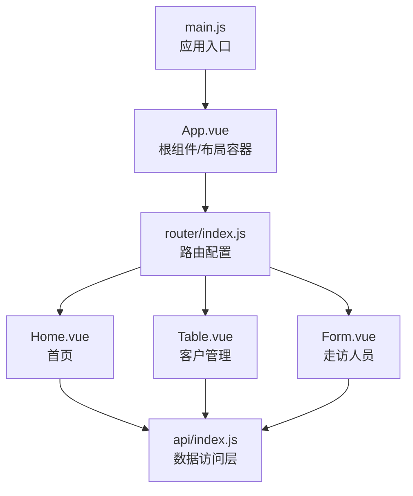
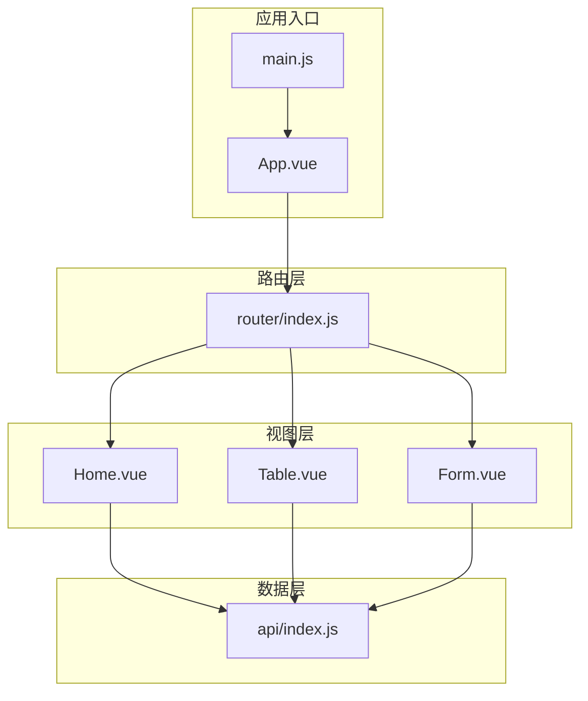
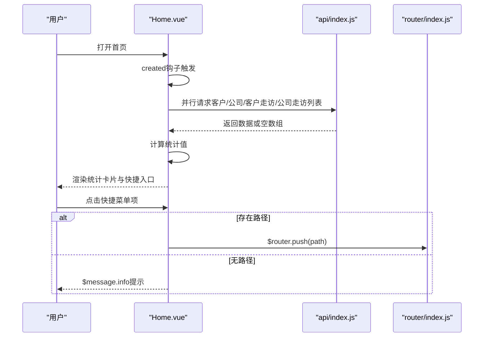
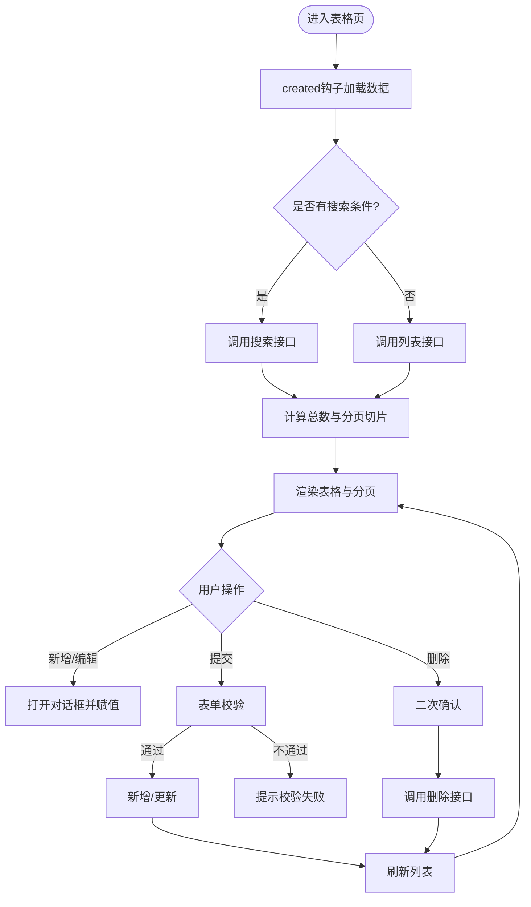
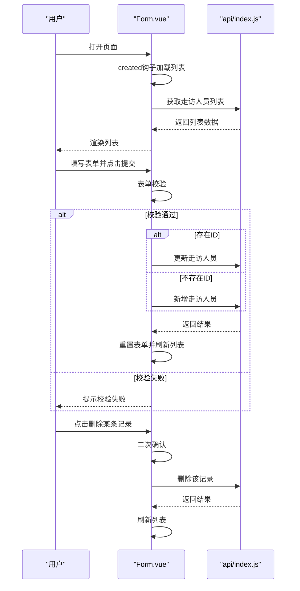
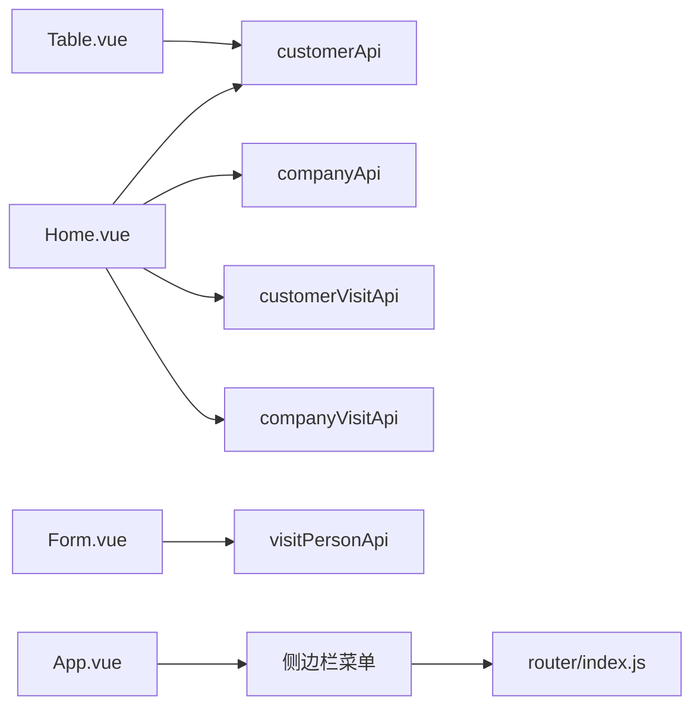

# 核心组件

<cite>
**本文引用的文件**
- [Home.vue](file://src/views/Home.vue)
- [Table.vue](file://src/views/Table.vue)
- [Form.vue](file://src/views/Form.vue)
- [App.vue](file://src/App.vue)
- [main.js](file://src/main.js)
- [index.js](file://src/api/index.js)
- [index.js](file://src/router/index.js)
</cite>

## 目录
1. [简介](#简介)
2. [项目结构](#项目结构)
3. [核心组件](#核心组件)
4. [架构总览](#架构总览)
5. [详细组件分析](#详细组件分析)
6. [依赖关系分析](#依赖关系分析)
7. [性能考虑](#性能考虑)
8. [故障排查指南](#故障排查指南)
9. [结论](#结论)
10. [附录](#附录)

## 简介
本文件面向Vue.js后台管理系统的核心组件，围绕三个页面组件进行深入解析：
- 首页组件（Home.vue）：负责数据统计、仪表板与快捷入口布局。
- 表格组件（Table.vue）：负责客户管理、分页与数据操作。
- 表单组件（Form.vue）：负责走访人员信息录入、表单校验与提交流程。

文档同时涵盖组件间通信机制、状态管理与生命周期钩子使用，并提供可复用模式与最佳实践建议。

## 项目结构
项目采用基于视图的模块化组织方式，核心文件分布如下：
- 应用入口与全局样式：main.js、App.vue
- 页面组件：Home.vue、Table.vue、Form.vue
- 路由配置：router/index.js
- API封装：api/index.js

图表来源
- [main.js:1-14](file://src/main.js#L1-L14)
- [App.vue:1-258](file://src/App.vue#L1-L258)
- [index.js:1-32](file://src/router/index.js#L1-L32)
- [Home.vue:1-175](file://src/views/Home.vue#L1-L175)
- [Table.vue:1-214](file://src/views/Table.vue#L1-L214)
- [Form.vue:1-143](file://src/views/Form.vue#L1-L143)
- [index.js:1-110](file://src/api/index.js#L1-L110)

章节来源
- [main.js:1-14](file://src/main.js#L1-L14)
- [App.vue:1-258](file://src/App.vue#L1-L258)
- [index.js:1-32](file://src/router/index.js#L1-L32)

## 核心组件
本节概述三个核心组件的主要职责与交互关系：
- 首页组件（Home.vue）
  - 统计卡片：展示客户总数、公司总数、客户走访记录、公司走访记录。
  - 快捷入口：支持跳转到“客户管理”、“走访人员”等页面。
  - 系统信息：显示框架版本、UI版本、后端服务等信息。
- 表格组件（Table.vue）
  - 列表展示：客户ID、编号、姓名、手机号、身份证号、客户等级、AUM、状态等。
  - 搜索与分页：支持按姓名搜索与分页切换。
  - 数据操作：新增、编辑、删除，配合对话框与表单校验。
- 表单组件（Form.vue）
  - 走访人员信息录入：姓名、角色类型、状态。
  - 列表展示与操作：列表展示、编辑、删除。
  - 提交与重置：统一的表单校验与提交流程。

章节来源
- [Home.vue:1-175](file://src/views/Home.vue#L1-L175)
- [Table.vue:1-214](file://src/views/Table.vue#L1-L214)
- [Form.vue:1-143](file://src/views/Form.vue#L1-L143)

## 架构总览
系统采用“视图组件 + API封装 + 路由导航”的分层架构：
- 视图组件：负责UI渲染与用户交互。
- API封装：统一处理HTTP请求、响应拦截与错误处理。
- 路由导航：通过菜单与快捷入口在页面间跳转。
- 全局样式：基于暗色主题，覆盖Element UI组件样式以适配深色界面。

图表来源
- [main.js:1-14](file://src/main.js#L1-L14)
- [App.vue:1-258](file://src/App.vue#L1-L258)
- [index.js:1-32](file://src/router/index.js#L1-L32)
- [Home.vue:1-175](file://src/views/Home.vue#L1-L175)
- [Table.vue:1-214](file://src/views/Table.vue#L1-L214)
- [Form.vue:1-143](file://src/views/Form.vue#L1-L143)
- [index.js:1-110](file://src/api/index.js#L1-L110)

## 详细组件分析

### 首页组件（Home.vue）
- 功能实现
  - 统计卡片：通过并行请求四个API，分别获取客户、公司、客户走访、公司走访的数据长度，填充统计值。
  - 快捷入口：遍历快捷菜单项，点击时若存在路径则通过路由跳转，否则提示信息。
  - 系统信息：展示框架版本、UI版本、后端服务、端口与主题等信息。
- 数据绑定
  - 使用响应式数据对象保存统计值与快捷菜单项。
  - 通过模板插值绑定到统计卡片与信息列表。
- 用户交互
  - 点击快捷菜单项触发路由跳转或消息提示。
- 生命周期
  - 在created钩子中调用加载统计方法，确保页面渲染前完成数据准备。
- 错误处理
  - 对每个API请求使用异常捕获，避免单点失败导致整体异常。
- 性能特性
  - 并行请求四个API，减少总等待时间；对异常进行兜底处理，保证界面稳定。

图表来源
- [Home.vue:128-154](file://src/views/Home.vue#L128-L154)
- [index.js:45-87](file://src/api/index.js#L45-L87)
- [index.js:1-32](file://src/router/index.js#L1-L32)

章节来源
- [Home.vue:1-175](file://src/views/Home.vue#L1-L175)
- [index.js:45-87](file://src/api/index.js#L45-L87)
- [index.js:1-32](file://src/router/index.js#L1-L32)

### 表格组件（Table.vue）
- 功能实现
  - 搜索与分页：支持按姓名搜索与分页大小/当前页切换。
  - 列表展示：展示客户基础信息与状态标签，等级映射为不同标签类型。
  - 数据操作：新增/编辑弹窗、表单校验、提交与删除确认。
- 数据绑定
  - 表格数据、分页参数、对话框可见性与表单模型均通过data定义。
  - 通过计算属性或方法映射等级与状态显示。
- 用户交互
  - 输入框回车与清空事件触发数据刷新。
  - 分页控件变更触发分页逻辑。
  - 弹窗内表单提交触发新增/更新。
- 生命周期
  - created钩子初始化并加载数据。
- 处理流程
  - 加载数据：根据是否存在搜索条件选择不同的API；分页通过切片实现本地分页。
  - 提交表单：先进行表单校验，再根据是否存在ID判断新增或更新。
  - 删除：二次确认后调用删除API并刷新列表。

图表来源
- [Table.vue:128-206](file://src/views/Table.vue#L128-L206)
- [index.js:45-54](file://src/api/index.js#L45-L54)

章节来源
- [Table.vue:1-214](file://src/views/Table.vue#L1-L214)
- [index.js:45-54](file://src/api/index.js#L45-L54)

### 表单组件（Form.vue）
- 功能实现
  - 走访人员信息录入：姓名、角色类型、状态开关。
  - 列表展示：展示ID、姓名、角色类型、状态与创建时间。
  - 数据操作：新增/编辑、删除确认与列表刷新。
- 数据绑定
  - 表单模型与规则通过data定义，列表数据通过API拉取。
- 用户交互
  - 提交按钮触发表单校验与提交；重置按钮清空并清除校验。
  - 编辑时复制行数据到表单；删除时二次确认。
- 生命周期
  - created钩子加载列表数据。
- 处理流程
  - 提交：先校验，再根据是否存在ID判断新增或更新，最后重置表单并刷新列表。
  - 删除：二次确认后调用删除接口并刷新列表。

图表来源
- [Form.vue:77-135](file://src/views/Form.vue#L77-L135)
- [index.js:89-97](file://src/api/index.js#L89-L97)

章节来源
- [Form.vue:1-143](file://src/views/Form.vue#L1-L143)
- [index.js:89-97](file://src/api/index.js#L89-L97)

## 依赖关系分析
- 组件依赖
  - Home.vue依赖customerApi、companyApi、customerVisitApi、companyVisitApi四个API。
  - Table.vue依赖customerApi。
  - Form.vue依赖visitPersonApi。
- 路由依赖
  - App.vue中的侧边栏菜单与router配置共同决定页面导航。
- 样式依赖
  - App.vue提供全局暗色主题样式，覆盖Element UI组件的默认样式。

图表来源
- [Home.vue:108](file://src/views/Home.vue#L108)
- [Table.vue:99](file://src/views/Table.vue#L99)
- [Form.vue:57](file://src/views/Form.vue#L57)
- [index.js:45-87](file://src/api/index.js#L45-L87)
- [index.js:1-32](file://src/router/index.js#L1-L32)
- [App.vue:8-27](file://src/App.vue#L8-L27)

章节来源
- [Home.vue:108](file://src/views/Home.vue#L108)
- [Table.vue:99](file://src/views/Table.vue#L99)
- [Form.vue:57](file://src/views/Form.vue#L57)
- [index.js:45-87](file://src/api/index.js#L45-L87)
- [index.js:1-32](file://src/router/index.js#L1-L32)
- [App.vue:8-27](file://src/App.vue#L8-L27)

## 性能考虑
- 并发请求优化：首页统计使用Promise.all并发请求多个API，缩短首屏等待时间。
- 本地分页：表格组件通过切片实现本地分页，减少不必要的网络请求。
- 加载状态：表格与表单组件在请求期间显示加载指示，提升用户体验。
- 样式覆盖：全局暗色主题一次性覆盖大量组件样式，避免重复定义。

## 故障排查指南
- 首页统计为空
  - 检查API返回格式是否符合预期；确认响应拦截器未过滤掉正常数据。
  - 章节来源
    - [Home.vue:132-147](file://src/views/Home.vue#L132-L147)
    - [index.js:20-31](file://src/api/index.js#L20-L31)
- 表格搜索无效
  - 确认搜索条件传递给API的参数名一致；检查分页切片逻辑。
  - 章节来源
    - [Table.vue:136-154](file://src/views/Table.vue#L136-L154)
- 表单提交失败
  - 查看控制台错误信息；确认表单校验规则与后端字段一致。
  - 章节来源
    - [Table.vue:173-190](file://src/views/Table.vue#L173-L190)
    - [Form.vue:92-112](file://src/views/Form.vue#L92-L112)
- 删除操作未生效
  - 确认二次确认逻辑与API调用顺序；检查列表刷新是否执行。
  - 章节来源
    - [Table.vue:191-206](file://src/views/Table.vue#L191-L206)
    - [Form.vue:120-135](file://src/views/Form.vue#L120-L135)

## 结论
本系统通过清晰的分层架构与规范的组件职责划分，实现了高效的数据展示与用户交互。首页统计、表格管理与表单录入三大核心组件相互协作，结合路由导航与API封装，形成了完整的后台管理能力。建议在后续迭代中引入集中式状态管理（如Vuex/Pinia）以进一步提升复杂场景下的可维护性与可测试性。

## 附录
- 组件复用模式
  - 将通用的分页逻辑抽取为可复用的混入或工具函数，供表格类组件复用。
  - 将通用的表单校验规则抽象为可复用的校验器，减少重复代码。
- 最佳实践
  - 统一错误处理：在API封装中集中处理错误，组件仅关注业务提示。
  - 保持组件单一职责：视图组件专注UI与交互，数据访问统一通过API层。
  - 合理使用生命周期：在created阶段发起数据请求，避免在mounted中做过多DOM操作。
  - 明确的命名约定：组件名称、变量与方法命名保持一致性，便于团队协作与维护。