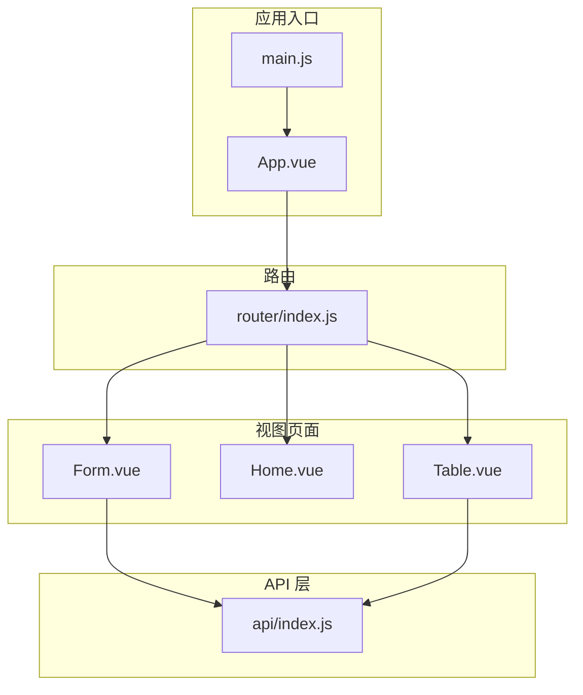
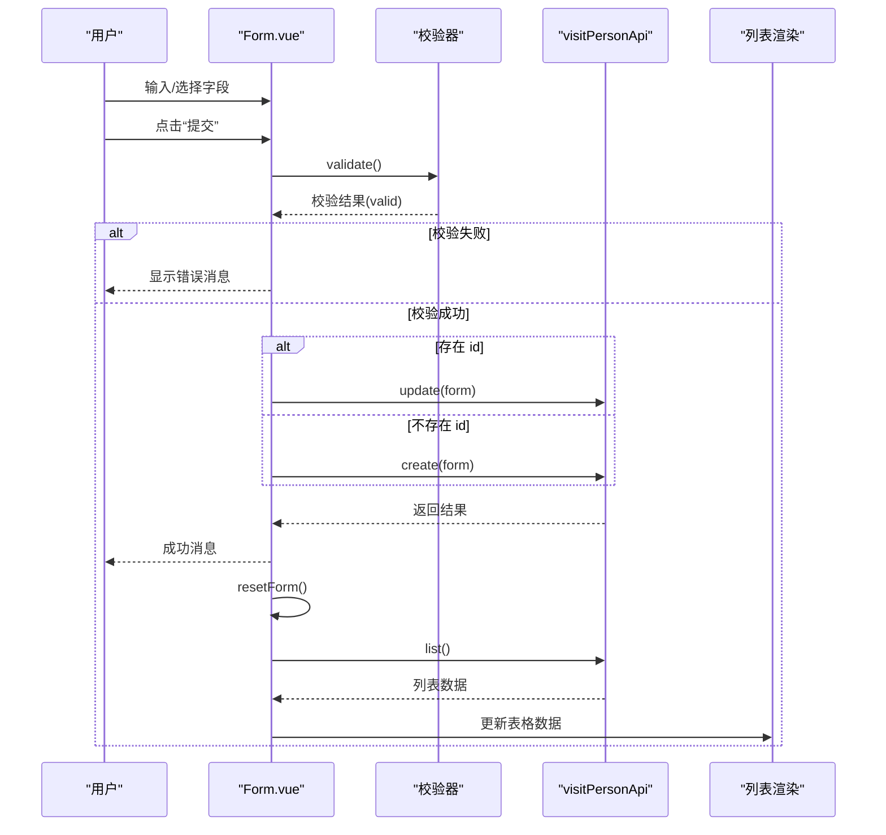
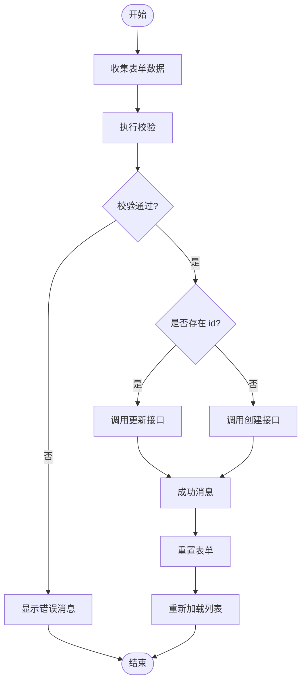
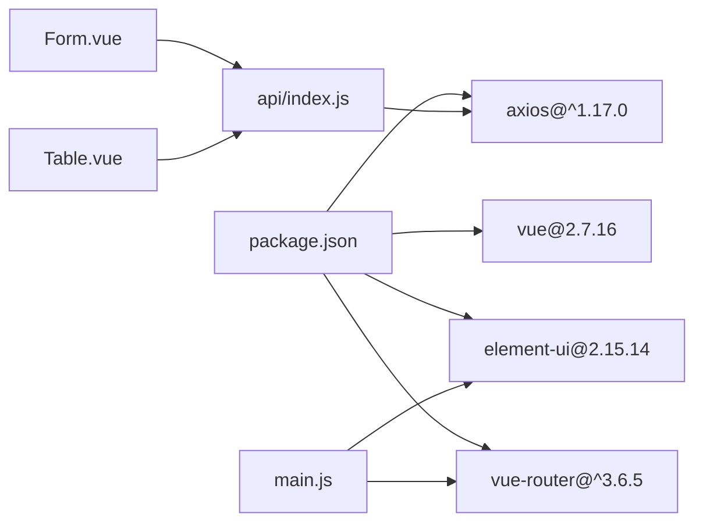

# 表单组件

<cite>
**本文引用的文件**
- [Form.vue](file://src/views/Form.vue)
- [App.vue](file://src/App.vue)
- [main.js](file://src/main.js)
- [router/index.js](file://src/router/index.js)
- [api/index.js](file://src/api/index.js)
- [Home.vue](file://src/views/Home.vue)
- [Table.vue](file://src/views/Table.vue)
- [package.json](file://package.json)
</cite>

## 目录
1. [简介](#简介)
2. [项目结构](#项目结构)
3. [核心组件](#核心组件)
4. [架构总览](#架构总览)
5. [详细组件分析](#详细组件分析)
6. [依赖分析](#依赖分析)
7. [性能考虑](#性能考虑)
8. [故障排查指南](#故障排查指南)
9. [结论](#结论)
10. [附录](#附录)

## 简介
本文件围绕“走访人员”信息录入表单组件 Form.vue 进行系统化技术文档梳理，目标是帮助开发者与产品人员快速理解该表单的字段设计、数据校验、提交流程、动态生成与联动逻辑、状态管理与回显策略，并给出优化建议与最佳实践。该表单采用 Element UI 组件库与 Axios 封装的 API 层，结合 Vue 2 的响应式数据模型，实现了从表单输入到后端接口调用的完整闭环。

## 项目结构
该项目基于 Vue CLI 构建，采用路由驱动的页面组织方式，Form.vue 作为独立视图页面，通过路由注册在应用中可访问。整体结构清晰，职责分离明确：
- 视图层：Form.vue、Home.vue、Table.vue
- 路由层：router/index.js
- 应用入口：main.js
- API 层：api/index.js（统一封装 axios 并按业务域导出）
- 根组件：App.vue（侧边导航、头部、主内容区）

图表来源
- [main.js:1-18](file://src/main.js#L1-L18)
- [App.vue:1-258](file://src/App.vue#L1-L258)
- [router/index.js:1-32](file://src/router/index.js#L1-L32)
- [Form.vue:1-143](file://src/views/Form.vue#L1-L143)
- [Table.vue:1-214](file://src/views/Table.vue#L1-L214)
- [api/index.js:1-110](file://src/api/index.js#L1-L110)

章节来源
- [main.js:1-18](file://src/main.js#L1-L18)
- [router/index.js:1-32](file://src/router/index.js#L1-L32)
- [App.vue:1-258](file://src/App.vue#L1-L258)

## 核心组件
本节聚焦 Form.vue 的核心功能与实现要点，包括：
- 表单字段与布局：姓名、角色类型、状态开关
- 校验规则与触发时机：必填校验
- 提交流程：新增/编辑切换、提交按钮、重置按钮
- 列表展示与交互：表格、分页、编辑/删除
- 错误提示与加载状态：消息提示、表格加载

章节来源
- [Form.vue:56-137](file://src/views/Form.vue#L56-L137)

## 架构总览
Form.vue 的运行时架构如下：用户在表单中输入或选择，通过 Element UI 的表单校验器进行实时校验；点击提交后，根据是否存在 id 决定调用新增或更新接口；成功后刷新列表并清空表单；异常时统一通过消息提示反馈。

图表来源
- [Form.vue:92-112](file://src/views/Form.vue#L92-L112)
- [api/index.js:89-97](file://src/api/index.js#L89-L97)

## 详细组件分析

### 表单字段设计与控件配置
- 字段一：姓名（文本输入）
  - 控件：ElInput
  - 绑定：v-model="form.name"
  - 标签：姓名
- 字段二：角色类型（下拉选择）
  - 控件：ElSelect + ElOption
  - 绑定：v-model="form.roleType"
  - 可选项：二分行领导、客户经理、渠道专员、其他
- 字段三：状态（开关）
  - 控件：ElSwitch
  - 绑定：v-model="form.status"
  - 开关值：启用=1，禁用=0
- 操作区：提交、重置按钮
  - 提交：调用 submitForm
  - 重置：调用 resetForm

章节来源
- [Form.vue:7-26](file://src/views/Form.vue#L7-L26)

### 数据验证与错误提示机制
- 校验规则定义
  - 姓名：必填，失焦触发
  - 角色类型：必填，变更触发
- 触发与提示
  - 提交时统一调用 validate 回调
  - 校验失败：显示错误消息
  - 成功后：进入提交分支

章节来源
- [Form.vue:71-74](file://src/views/Form.vue#L71-L74)
- [Form.vue:92-97](file://src/views/Form.vue#L92-L97)

### 动态表单生成与条件显示
- 当前实现为静态表单，未包含动态字段生成逻辑
- 条件显示与联动
  - 无基于字段联动的条件显示逻辑
  - 若需扩展，可在 v-if/v-show 或计算属性中根据 form.roleType 等字段控制显示隐藏

章节来源
- [Form.vue:7-26](file://src/views/Form.vue#L7-L26)

### 表单数据收集、验证与提交流程
- 数据收集
  - 使用响应式对象 form 收集字段值
- 验证
  - 使用 Element UI 表单校验器 validate
- 提交
  - 若存在 id：调用更新接口
  - 若不存在 id：调用创建接口
  - 成功后：清空表单并重新加载列表
- 异常处理
  - 通过消息提示反馈错误

图表来源
- [Form.vue:92-112](file://src/views/Form.vue#L92-L112)
- [api/index.js:89-97](file://src/api/index.js#L89-L97)

章节来源
- [Form.vue:92-112](file://src/views/Form.vue#L92-L112)

### 编辑/删除与列表交互
- 编辑
  - 点击“编辑”后将当前行深拷贝到 form，实现数据回显
- 删除
  - 点击“删除”弹出确认框，确认后调用删除接口并刷新列表
- 列表加载
  - 页面创建时自动加载列表数据，支持加载状态指示

章节来源
- [Form.vue:117-135](file://src/views/Form.vue#L117-L135)
- [Form.vue:77-91](file://src/views/Form.vue#L77-L91)

### 状态管理与数据回显策略
- 表单状态
  - 使用 data 中的 form 对象维护表单状态
  - 重置时恢复默认值并清除校验
- 列表状态
  - 使用 personList 维护列表数据
  - 加载时设置 loading，finally 中关闭
- 数据回显
  - 编辑时使用浅拷贝将行数据赋给 form

章节来源
- [Form.vue:61-76](file://src/views/Form.vue#L61-L76)
- [Form.vue:113-116](file://src/views/Form.vue#L113-L116)
- [Form.vue:117-119](file://src/views/Form.vue#L117-L119)

### API 调用与响应处理
- API 封装
  - 通过 axios 实例统一配置 baseURL 与超时
  - 响应拦截器统一校验 code=200，否则抛错
- 访问人员 API
  - list/getById/create/update/delete/batchDelete
- 表单调用点
  - 加载列表：visitPersonApi.list()
  - 新增/更新：visitPersonApi.create/update()
  - 删除：visitPersonApi.delete()

章节来源
- [api/index.js:1-31](file://src/api/index.js#L1-L31)
- [api/index.js:89-97](file://src/api/index.js#L89-L97)
- [Form.vue:84](file://src/views/Form.vue#L84)
- [Form.vue:100](file://src/views/Form.vue#L100)
- [Form.vue:103](file://src/views/Form.vue#L103)
- [Form.vue:127](file://src/views/Form.vue#L127)

### 与路由与菜单的集成
- 路由注册
  - /form 对应 Form.vue
- 导航集成
  - App.vue 侧边菜单项“走访人员”指向 /form
  - Home.vue 快捷操作也包含“走访人员”跳转

章节来源
- [router/index.js:18-22](file://src/router/index.js#L18-L22)
- [App.vue:23](file://src/App.vue#L23)
- [Home.vue:122](file://src/views/Home.vue#L122)

## 依赖分析
- 运行时依赖
  - Vue 2.7.16、Element UI 2.15.14、Axios 1.x、Vue Router 3.x
- 构建与开发依赖
  - @vue/cli-service、@vue/cli-plugin-babel、vue-template-compiler
- 外部集成点
  - Element UI 主题与暗色风格覆盖
  - Axios 拦截器统一处理响应码

图表来源
- [package.json:10-22](file://package.json#L10-L22)
- [main.js:1-18](file://src/main.js#L1-L18)
- [api/index.js:1-110](file://src/api/index.js#L1-L110)
- [Form.vue:57](file://src/views/Form.vue#L57)
- [Table.vue:99](file://src/views/Table.vue#L99)

章节来源
- [package.json:10-22](file://package.json#L10-L22)

## 性能考虑
- 列表加载优化
  - 使用 v-loading 在表格上显示加载状态，避免重复请求
  - 建议：在频繁刷新场景下增加防抖或节流
- 表单提交
  - 提交前统一校验，减少无效请求
  - 建议：在提交按钮上增加禁用状态与加载指示
- 渲染优化
  - 列表使用 v-if/v-show 控制复杂区域显示
  - 表格列使用模板作用域，避免不必要的计算

## 故障排查指南
- 表单校验失败
  - 现象：点击提交后提示错误
  - 排查：检查 rules 中的 required 与 trigger 是否匹配输入行为
- 接口调用失败
  - 现象：消息提示“操作失败”
  - 排查：查看响应拦截器返回的错误信息；确认 baseURL 与后端接口路径一致
- 删除确认
  - 现象：删除弹窗未出现或报错
  - 排查：确认 $confirm 的参数与 Element UI 版本兼容性
- 列表不刷新
  - 现象：提交成功但列表未更新
  - 排查：确认 loadList 是否被调用；检查 API 返回的数据结构

章节来源
- [Form.vue:92-112](file://src/views/Form.vue#L92-L112)
- [Form.vue:120-134](file://src/views/Form.vue#L120-L134)
- [api/index.js:20-31](file://src/api/index.js#L20-L31)

## 结论
Form.vue 实现了一个简洁而完整的“走访人员”信息录入与管理界面，具备清晰的表单字段、基础的校验规则、完善的提交与列表刷新流程。其架构以 Element UI 与 Axios 为核心，配合 Vue 的响应式数据模型，满足日常业务需求。后续可在此基础上扩展动态字段、联动逻辑与更丰富的校验规则，进一步提升用户体验与可维护性。

## 附录

### 最佳实践与优化建议
- 表单优化
  - 在提交按钮上增加 loading 状态，防止重复提交
  - 对长列表分页加载，避免一次性渲染过多数据
- 用户体验
  - 在必填字段旁添加星标提示
  - 对关键字段提供输入示例或占位符
- 可靠性
  - 在 API 层增加统一的错误映射与重试策略
  - 对网络异常与接口超时进行明确提示

### 与其它页面的对比参考
- 与 Table.vue 的差异
  - Form.vue 为单页表单+列表，Table.vue 为弹窗编辑+分页列表
  - 两者均使用 Element UI 表单与消息提示，风格保持一致

章节来源
- [Table.vue:63-95](file://src/views/Table.vue#L63-L95)
- [Form.vue:7-26](file://src/views/Form.vue#L7-L26)