# CRUD操作

<cite>
**本文档引用的文件**
- [Table.vue](file://src/views/Table.vue)
- [Form.vue](file://src/views/Form.vue)
- [index.js](file://src/api/index.js)
- [index.js](file://src/router/index.js)
- [main.js](file://src/main.js)
- [App.vue](file://src/App.vue)
- [Home.vue](file://src/views/Home.vue)
</cite>

## 目录
1. [简介](#简介)
2. [项目结构](#项目结构)
3. [核心组件](#核心组件)
4. [架构概览](#架构概览)
5. [详细组件分析](#详细组件分析)
6. [依赖关系分析](#依赖关系分析)
7. [性能考虑](#性能考虑)
8. [故障排除指南](#故障排除指南)
9. [结论](#结论)

## 简介

本项目是一个基于Vue.js 2.7.16和Element UI 2.15.14构建的客户管理系统，专注于演示完整的CRUD（创建、读取、更新、删除）操作实现。系统提供了两个主要功能模块：客户信息管理和走访人员管理，每个模块都实现了完整的增删改查功能，包括数据验证、状态管理、错误处理和用户交互优化。

## 项目结构

项目采用标准的Vue CLI项目结构，主要包含以下核心目录和文件：

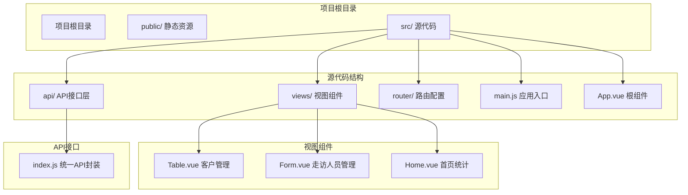

**图表来源**
- [main.js:1-18](file://src/main.js#L1-L18)
- [App.vue:1-258](file://src/App.vue#L1-L258)
- [router/index.js:1-32](file://src/router/index.js#L1-L32)

**章节来源**
- [main.js:1-18](file://src/main.js#L1-L18)
- [App.vue:1-258](file://src/App.vue#L1-L258)
- [router/index.js:1-32](file://src/router/index.js#L1-L32)

## 核心组件

### 客户管理组件 (Table.vue)

客户管理组件是系统的核心CRUD操作实现，提供了完整的客户信息管理功能：

#### 主要功能特性：
- **数据展示**：使用Element UI表格组件展示客户列表，支持分页和搜索
- **新增功能**：通过对话框实现客户信息的创建
- **编辑功能**：支持对现有客户信息进行修改
- **删除功能**：提供安全的删除确认机制
- **搜索功能**：支持按客户姓名进行模糊搜索
- **状态管理**：统一管理对话框显示状态和表单数据

#### 数据模型：
```javascript
// 编辑表单数据结构
{
  id: null,           // 客户ID
  customerNo: '',     // 客户编号
  name: '',           // 姓名
  phone: '',          // 手机号
  idCard: '',         // 身份证号
  customerLevel: '普通', // 客户等级
  status: 1           // 状态 (1启用, 0禁用)
}
```

**章节来源**
- [Table.vue:103-127](file://src/views/Table.vue#L103-L127)

### 走访人员管理组件 (Form.vue)

走访人员管理组件展示了另一个CRUD操作的完整实现，具有相似的功能架构但针对不同的业务实体。

#### 主要差异：
- **业务实体不同**：管理走访人员而非客户信息
- **表单字段不同**：包含角色类型等特定字段
- **操作逻辑类似**：保持一致的CRUD模式

**章节来源**
- [Form.vue:61-75](file://src/views/Form.vue#L61-L75)

## 架构概览

系统采用分层架构设计，清晰分离了表现层、业务逻辑层和数据访问层：

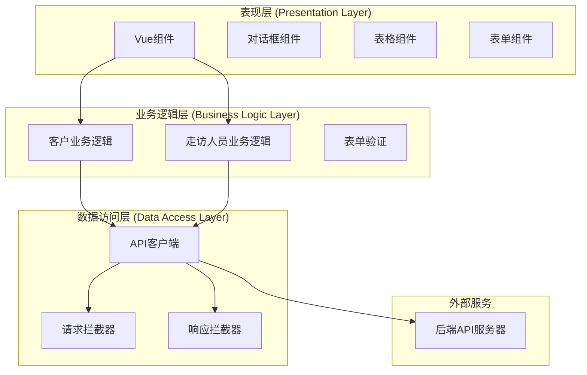

**图表来源**
- [index.js:1-110](file://src/api/index.js#L1-L110)
- [Table.vue:99-208](file://src/views/Table.vue#L99-L208)
- [Form.vue:57-137](file://src/views/Form.vue#L57-L137)

### API架构设计

API层采用统一的封装模式，为所有业务实体提供一致的CRUD接口：

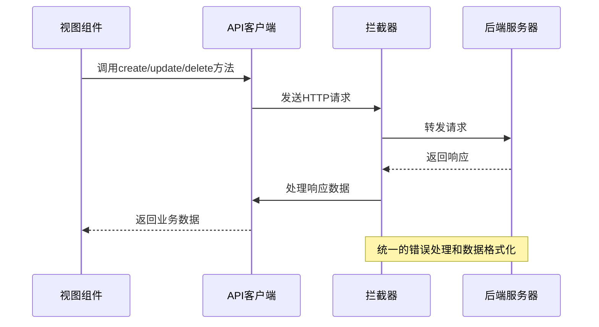

**图表来源**
- [index.js:10-31](file://src/api/index.js#L10-L31)

**章节来源**
- [index.js:1-110](file://src/api/index.js#L1-L110)

## 详细组件分析

### 客户管理CRUD实现

#### 新增对话框实现

新增对话框是客户管理的核心交互组件，实现了完整的新增流程：

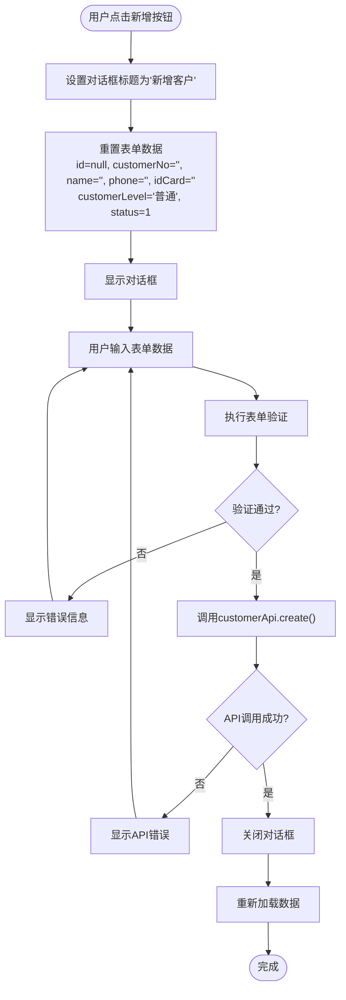

**图表来源**
- [Table.vue:163-190](file://src/views/Table.vue#L163-L190)

#### 编辑表单实现

编辑模式与新增模式共享相同的对话框界面，但通过不同的数据初始化方式实现：

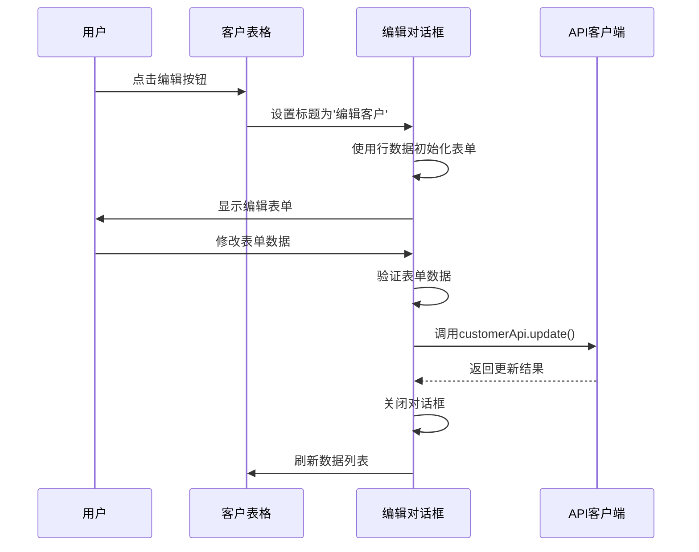

**图表来源**
- [Table.vue:168-172](file://src/views/Table.vue#L168-L172)

#### 删除确认流程

删除操作实现了严格的安全防护机制：

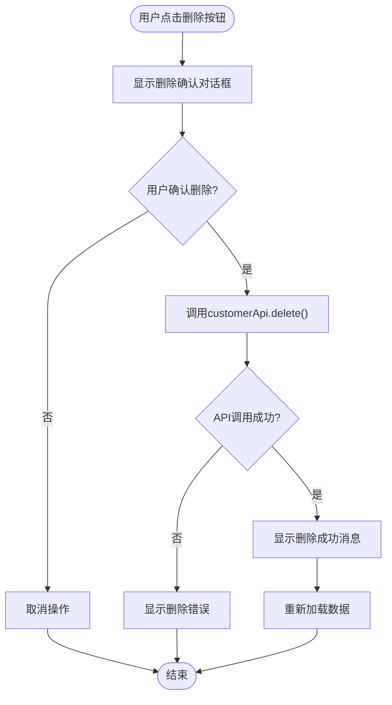

**图表来源**
- [Table.vue:191-206](file://src/views/Table.vue#L191-L206)

**章节来源**
- [Table.vue:163-206](file://src/views/Table.vue#L163-L206)

### 表单验证机制

系统实现了多层次的表单验证机制，确保数据的完整性和准确性：

#### 必填字段验证

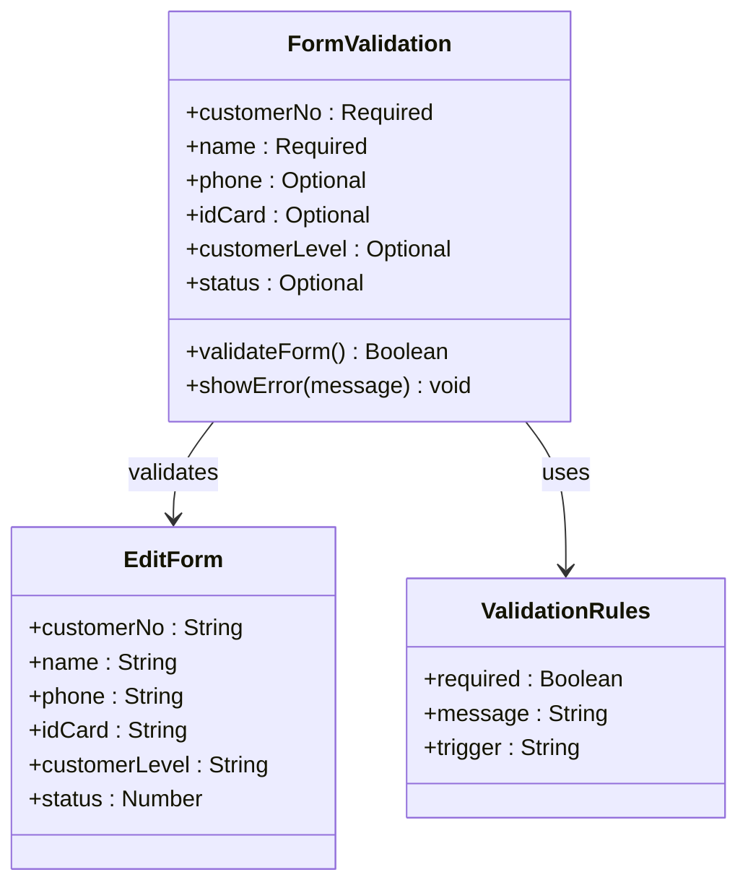

**图表来源**
- [Table.vue:122-125](file://src/views/Table.vue#L122-L125)

#### 错误提示处理

系统提供了完善的错误处理和用户反馈机制：

**章节来源**
- [Table.vue:122-125](file://src/views/Table.vue#L122-L125)

### 对话框状态管理

对话框的状态管理是CRUD操作的关键组成部分，实现了新增和编辑模式的无缝切换：

#### 状态切换流程

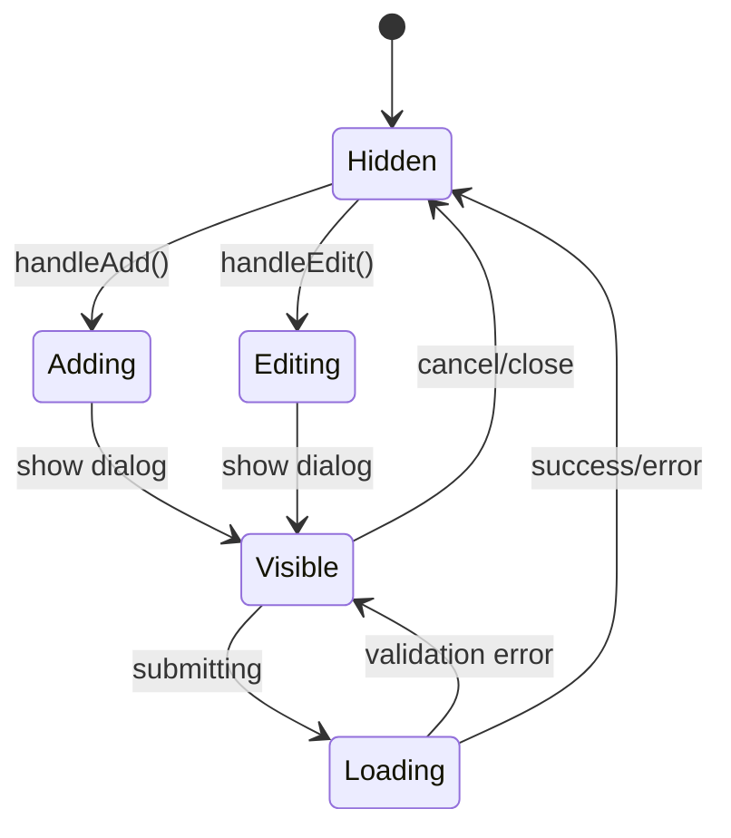

**图表来源**
- [Table.vue:163-172](file://src/views/Table.vue#L163-L172)

#### 数据初始化策略

系统采用了智能的数据初始化策略来支持两种模式：

**章节来源**
- [Table.vue:163-172](file://src/views/Table.vue#L163-L172)

### API调用时机和错误处理

#### API调用时序

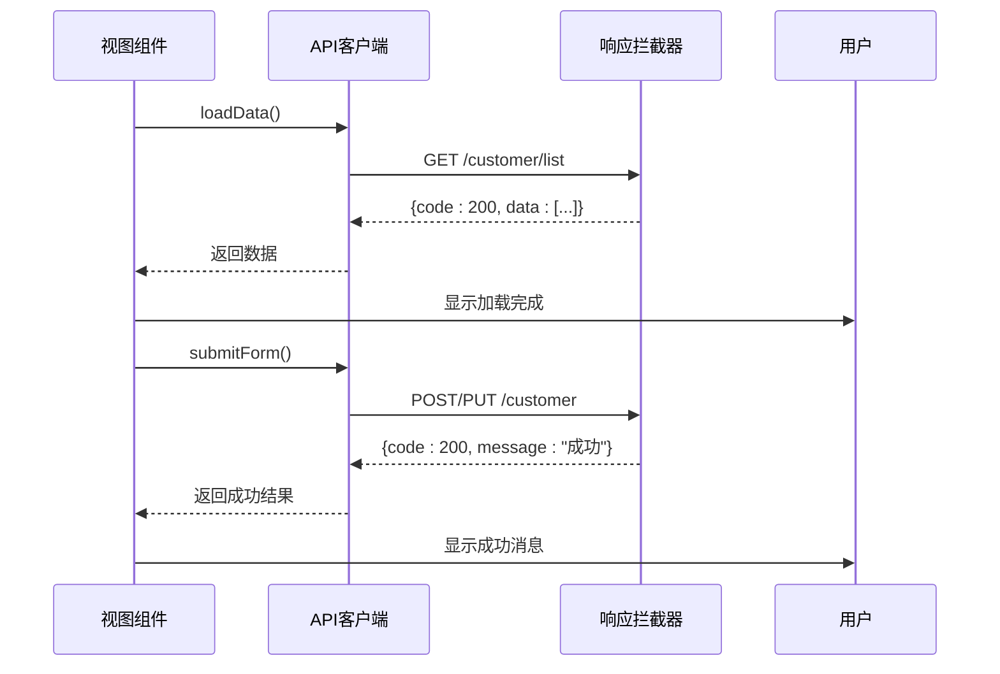

**图表来源**
- [index.js:45-54](file://src/api/index.js#L45-L54)

#### 错误处理策略

系统实现了多层次的错误处理机制：

**章节来源**
- [index.js:19-31](file://src/api/index.js#L19-L31)

## 依赖关系分析

### 组件间依赖关系

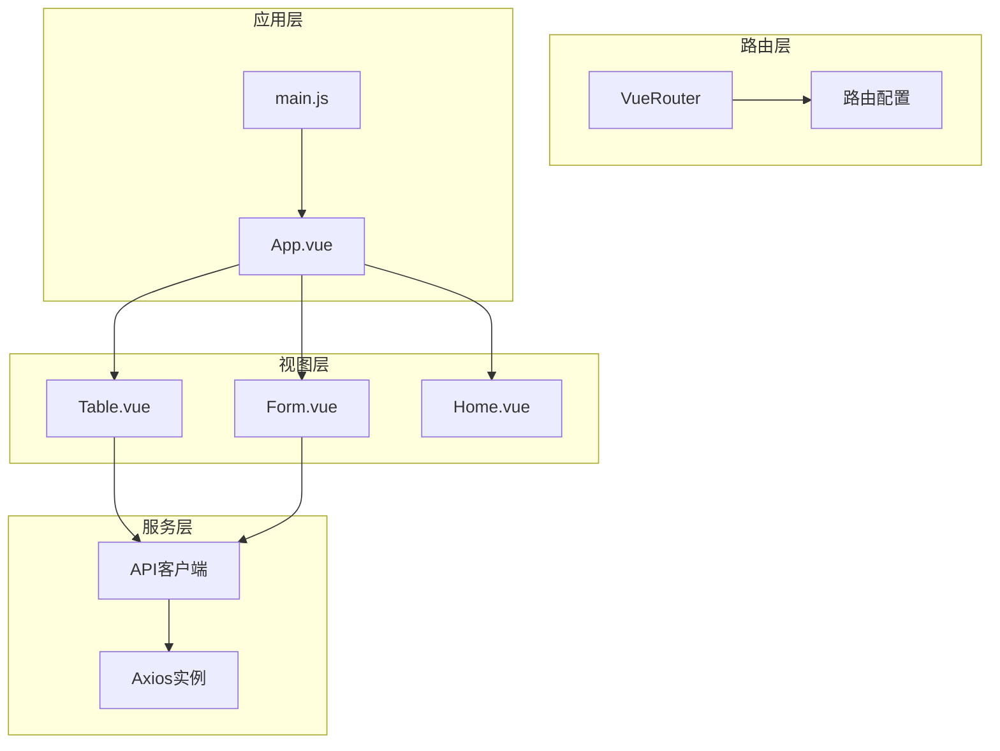

**图表来源**
- [router/index.js:1-32](file://src/router/index.js#L1-L32)
- [main.js:1-18](file://src/main.js#L1-L18)

### 外部依赖

系统主要依赖以下外部库：

| 依赖项 | 版本 | 用途 |
|--------|------|------|
| Vue.js | 2.7.16 | 核心框架 |
| Element UI | 2.15.14 | UI组件库 |
| Axios | 0.27.2 | HTTP客户端 |
| Vue Router | 3.5.4 | 路由管理 |

**章节来源**
- [main.js:1-18](file://src/main.js#L1-L18)

## 性能考虑

### 数据加载优化

系统在数据加载方面采用了多种优化策略：

1. **分页加载**：默认每页10条记录，支持10/20/50条切换
2. **懒加载**：路由组件采用动态导入
3. **并发请求**：首页统计使用Promise.all并发加载多个数据源

### 用户体验优化

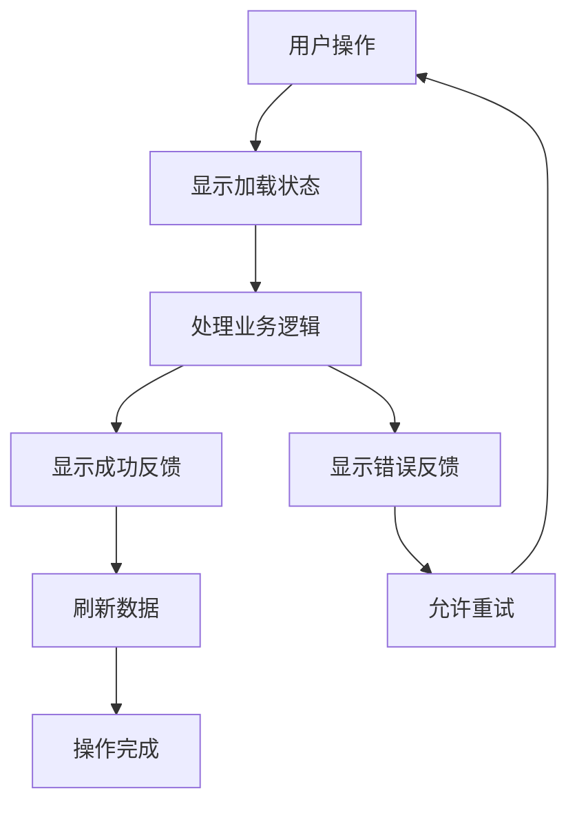

**图表来源**
- [Table.vue:136-154](file://src/views/Table.vue#L136-L154)

## 故障排除指南

### 常见问题及解决方案

#### API调用失败

**问题症状**：操作后没有收到任何反馈或出现错误消息

**可能原因**：
1. 后端服务不可用
2. 网络连接问题
3. 认证令牌过期

**解决步骤**：
1. 检查浏览器开发者工具的网络面板
2. 验证后端服务状态
3. 重新登录系统

#### 表单验证不工作

**问题症状**：表单提交时没有显示验证错误

**可能原因**：
1. 表单引用未正确设置
2. 验证规则配置错误
3. Element UI版本兼容性问题

**解决步骤**：
1. 确认`ref="editForm"`正确设置
2. 检查`editRules`对象结构
3. 更新到最新版本的Element UI

#### 数据不刷新

**问题症状**：新增/编辑/删除操作后列表没有更新

**可能原因**：
1. 数据加载函数调用失败
2. API响应格式不正确
3. 错误处理中断了流程

**解决步骤**：
1. 检查控制台是否有JavaScript错误
2. 验证API响应格式符合预期
3. 确保`loadData()`在所有成功路径上都被调用

**章节来源**
- [Table.vue:149-150](file://src/views/Table.vue#L149-L150)
- [Table.vue:186-188](file://src/views/Table.vue#L186-L188)

## 结论

本项目成功展示了Vue.js中CRUD操作的最佳实践，通过清晰的架构设计和完善的错误处理机制，为用户提供了流畅的操作体验。系统的主要优势包括：

1. **完整的CRUD实现**：涵盖了从数据展示到操作反馈的全流程
2. **严格的验证机制**：确保数据质量和用户体验
3. **安全的删除流程**：通过二次确认防止误操作
4. **优雅的错误处理**：提供清晰的错误反馈和恢复机制
5. **良好的扩展性**：统一的API设计便于添加新的业务实体

通过分析这些实现细节，开发者可以借鉴其中的设计模式和最佳实践，构建更加健壮和用户友好的Web应用程序。