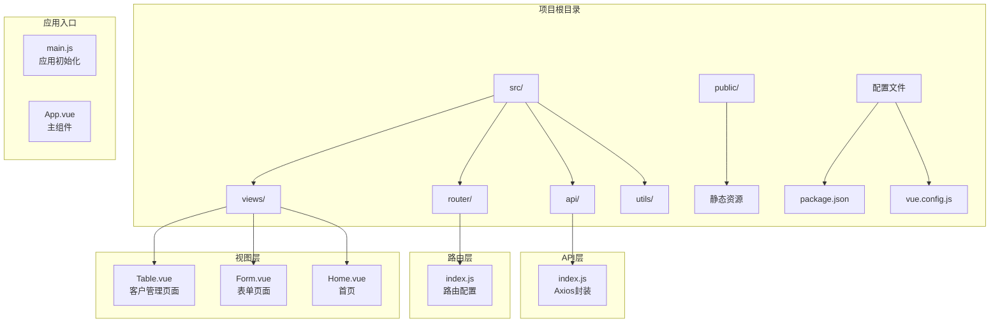
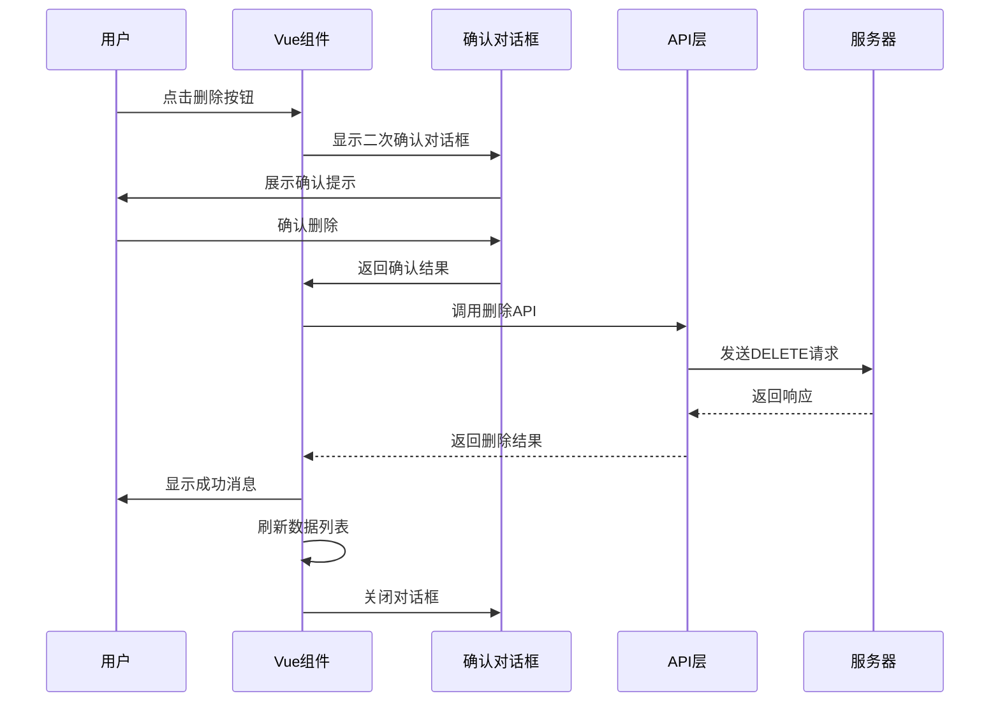
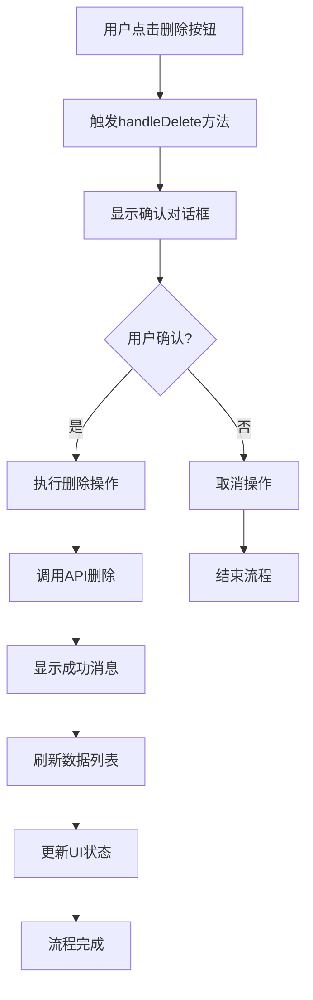
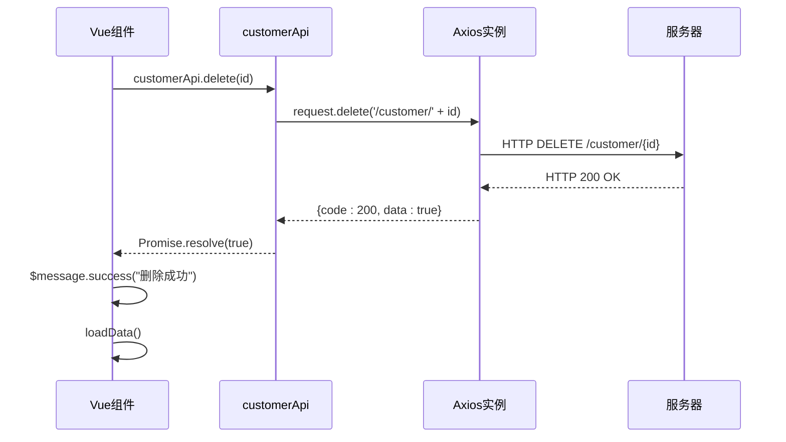
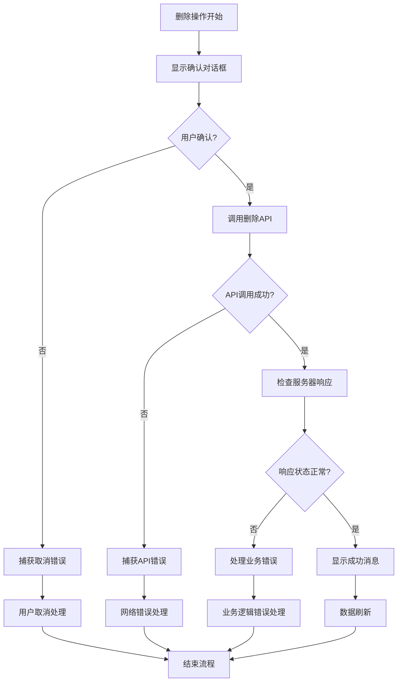
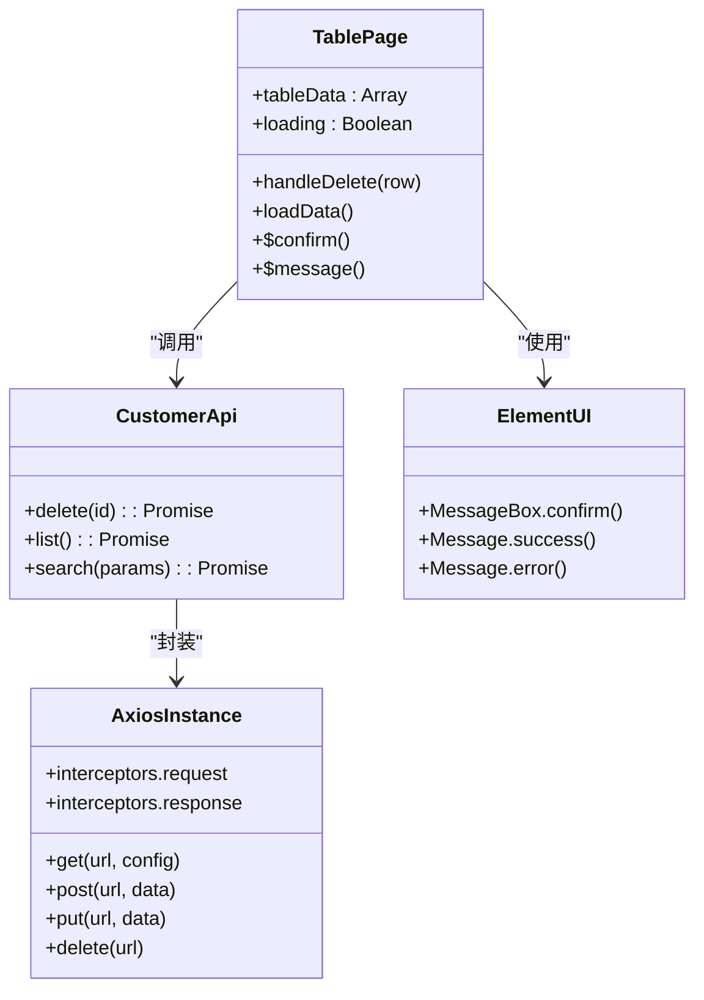

# 删除操作

<cite>
**本文档引用的文件**
- [Table.vue](file://src/views/Table.vue)
- [index.js](file://src/api/index.js)
- [index.js](file://src/router/index.js)
- [main.js](file://src/main.js)
- [App.vue](file://src/App.vue)
- [package.json](file://package.json)
</cite>

## 目录
1. [简介](#简介)
2. [项目结构](#项目结构)
3. [核心组件](#核心组件)
4. [架构概览](#架构概览)
5. [详细组件分析](#详细组件分析)
6. [依赖关系分析](#依赖关系分析)
7. [性能考虑](#性能考虑)
8. [故障排除指南](#故障排除指南)
9. [结论](#结论)

## 简介

本文件详细解析了客户信息删除功能的完整实现，涵盖从用户界面交互到后端API调用的全过程。该系统采用Vue.js + Element UI技术栈构建，实现了完整的删除操作流程，包括二次确认机制、异步处理策略、错误处理和状态更新等关键特性。

## 项目结构

该项目采用标准的Vue.js单页应用架构，主要包含以下核心目录结构：



**图表来源**
- [main.js:1-18](file://src/main.js#L1-L18)
- [App.vue:1-258](file://src/App.vue#L1-L258)
- [router/index.js:1-32](file://src/router/index.js#L1-L32)

**章节来源**
- [main.js:1-18](file://src/main.js#L1-L18)
- [package.json:1-29](file://package.json#L1-L29)

## 核心组件

### 删除操作核心实现

删除功能在Table.vue组件中实现，包含完整的用户交互流程和错误处理机制。该组件负责展示客户数据表格，并提供删除操作的完整生命周期管理。

### API接口层

通过index.js文件中的customerApi对象提供统一的API访问接口，封装了所有客户相关的HTTP请求操作，包括删除功能。

### 路由集成

删除操作与Vue Router深度集成，确保用户能够在正确的页面上下文中执行删除操作。

**章节来源**
- [Table.vue:191-206](file://src/views/Table.vue#L191-L206)
- [index.js:44-54](file://src/api/index.js#L44-L54)
- [router/index.js:13-22](file://src/router/index.js#L13-L22)

## 架构概览

删除操作采用分层架构设计，确保各层职责清晰分离：



**图表来源**
- [Table.vue:191-206](file://src/views/Table.vue#L191-L206)
- [index.js:44-54](file://src/api/index.js#L44-L54)

## 详细组件分析

### 删除按钮触发逻辑

删除按钮位于表格的"操作"列中，使用Element UI的文本按钮样式，颜色设置为红色以突出危险操作的性质。



**图表来源**
- [Table.vue:42-47](file://src/views/Table.vue#L42-L47)
- [Table.vue:191-206](file://src/views/Table.vue#L191-L206)

### 确认对话框和安全防护机制

系统实现了严格的二次确认机制，防止误删操作：

#### 对话框配置参数
- **标题**: "提示"
- **内容**: "确认删除客户 [客户姓名]？"
- **确认按钮**: "确定"（绿色）
- **取消按钮**: "取消"（灰色）
- **对话框类型**: "warning"（红色警告图标）

#### 安全防护特性
1. **用户确认**: 必须明确点击确认按钮才能执行删除
2. **取消处理**: 点击取消或关闭对话框会中断删除流程
3. **错误隔离**: 删除失败不会影响其他功能模块
4. **状态保护**: 删除过程中保持UI状态稳定

**章节来源**
- [Table.vue:191-206](file://src/views/Table.vue#L191-L206)

### 删除API调用流程

删除API调用采用异步处理模式，确保用户体验流畅：



**图表来源**
- [index.js:44-54](file://src/api/index.js#L44-L54)
- [Table.vue:198](file://src/views/Table.vue#L198)

### 异步处理策略

系统采用现代JavaScript的async/await语法处理异步操作，提供清晰的错误处理机制：

#### 加载状态管理
- **加载指示器**: 在删除操作期间显示loading状态
- **用户反馈**: 提供即时的操作结果反馈
- **状态恢复**: 操作完成后自动恢复正常状态

#### 错误处理策略
1. **网络错误**: 捕获Axios请求异常
2. **业务错误**: 处理服务器返回的业务逻辑错误
3. **用户取消**: 区分用户主动取消和系统错误

**章节来源**
- [Table.vue:136-154](file://src/views/Table.vue#L136-L154)
- [index.js:19-31](file://src/api/index.js#L19-L31)

### 数据刷新和状态更新策略

删除操作完成后，系统会自动刷新数据以反映最新的状态：

#### 刷新机制
1. **数据重新加载**: 调用loadData()方法重新获取客户列表
2. **分页状态保持**: 维持当前页码和页面大小设置
3. **搜索条件保留**: 如果存在搜索条件，继续使用相同的过滤条件

#### 状态更新
- **表格数据**: 更新为最新的客户列表
- **总数统计**: 重新计算总记录数
- **UI反馈**: 显示删除成功的消息提示

**章节来源**
- [Table.vue:199-200](file://src/views/Table.vue#L199-L200)
- [Table.vue:136-154](file://src/views/Table.vue#L136-L154)

### 错误处理和异常捕获机制

系统实现了多层次的错误处理机制，确保各种异常情况都能得到妥善处理：



**图表来源**
- [Table.vue:191-206](file://src/views/Table.vue#L191-L206)
- [index.js:19-31](file://src/api/index.js#L19-L31)

#### 错误分类处理

1. **用户取消错误** (`error === 'cancel'`)
   - 不显示错误消息
   - 直接结束删除流程
   - 保持当前页面状态

2. **网络请求错误**
   - 捕获Axios异常
   - 显示友好的错误提示
   - 记录错误日志

3. **业务逻辑错误**
   - 检查服务器响应状态码
   - 处理权限验证失败
   - 处理数据完整性约束错误

#### 异常捕获机制

系统使用try-catch块确保所有异步操作都有适当的错误处理：

- **确认对话框**: 使用Promise.catch处理用户取消
- **API调用**: 使用try-catch处理网络异常
- **数据处理**: 使用finally块确保状态清理

**章节来源**
- [Table.vue:191-206](file://src/views/Table.vue#L191-L206)
- [index.js:19-31](file://src/api/index.js#L19-L31)

## 依赖关系分析

### 技术栈依赖

```mermaid
graph LR
subgraph "前端框架"
A[Vue.js 2.7.16] --> B[组件化开发]
C[Vue Router 3.6.5] --> D[路由管理]
end
subgraph "UI库"
E[Element UI 2.15.14] --> F[组件库]
G[Axios 1.17.0] --> H[HTTP客户端]
end
subgraph "构建工具"
I[@vue/cli-service] --> J[开发环境]
K[Babel] --> L[代码转换]
end
A --> E
C --> G
E --> G
```

**图表来源**
- [package.json:10-22](file://package.json#L10-L22)

### 组件间依赖关系

删除功能涉及多个组件的协作：



**图表来源**
- [Table.vue:98-208](file://src/views/Table.vue#L98-L208)
- [index.js:1-118](file://src/api/index.js#L1-L118)

**章节来源**
- [package.json:10-22](file://package.json#L10-L22)
- [Table.vue:98-208](file://src/views/Table.vue#L98-L208)

## 性能考虑

### 异步操作优化

1. **并发控制**: 删除操作采用串行执行，避免同时发起多个删除请求
2. **状态缓存**: 使用loading状态避免重复提交
3. **内存管理**: 及时清理事件监听器和定时器

### 网络性能

1. **超时设置**: Axios实例设置15秒超时时间
2. **重试机制**: 当前版本未实现自动重试，但可扩展支持
3. **连接复用**: 使用Axios实例复用HTTP连接

### 用户体验优化

1. **即时反馈**: 删除操作立即显示确认对话框
2. **进度指示**: 加载状态提供视觉反馈
3. **错误友好**: 用户友好的错误消息显示

## 故障排除指南

### 常见问题及解决方案

#### 删除操作无响应
1. **检查网络连接**: 确保能够访问后端API
2. **查看浏览器控制台**: 检查是否有JavaScript错误
3. **验证权限**: 确认用户具有删除权限

#### 确认对话框不显示
1. **检查Element UI导入**: 确保Element UI正确安装和配置
2. **验证Vue实例**: 确保Vue实例正常运行
3. **检查CSS样式**: 确保Element UI样式正确加载

#### 删除失败但无错误提示
1. **检查API响应**: 验证后端API是否返回正确的响应格式
2. **查看拦截器**: 确认Axios响应拦截器正常工作
3. **检查错误处理**: 验证错误处理逻辑是否正确执行

#### 数据未刷新
1. **检查loadData方法**: 确认数据重新加载逻辑正常
2. **验证分页状态**: 确保分页参数正确传递
3. **检查表格渲染**: 确认表格组件正确响应数据变化

**章节来源**
- [Table.vue:191-206](file://src/views/Table.vue#L191-L206)
- [index.js:19-31](file://src/api/index.js#L19-L31)

## 结论

该删除操作实现展现了现代Web应用的最佳实践：

### 设计优势
1. **安全性**: 严格的二次确认机制防止误操作
2. **用户体验**: 流畅的异步处理和及时的状态反馈
3. **错误处理**: 完善的异常捕获和用户友好的错误提示
4. **可维护性**: 清晰的代码结构和模块化设计

### 技术特点
1. **现代化语法**: 使用async/await简化异步代码
2. **组件化架构**: 良好的模块分离和职责划分
3. **错误处理**: 分层次的错误处理策略
4. **性能优化**: 合理的状态管理和资源控制

### 改进建议
1. **添加重试机制**: 为网络不稳定的情况添加自动重试
2. **增强日志记录**: 添加详细的操作日志便于审计
3. **优化批量删除**: 扩展批量删除功能支持
4. **添加撤销机制**: 提供删除操作的撤销功能

该实现为类似的企业级应用提供了优秀的参考模板，展示了如何在保证安全性的前提下提供良好的用户体验。