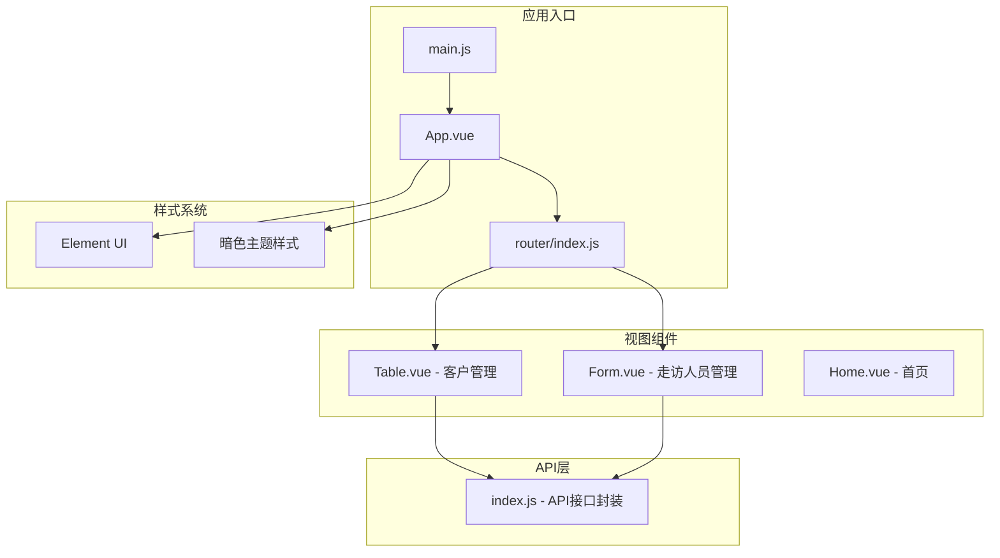
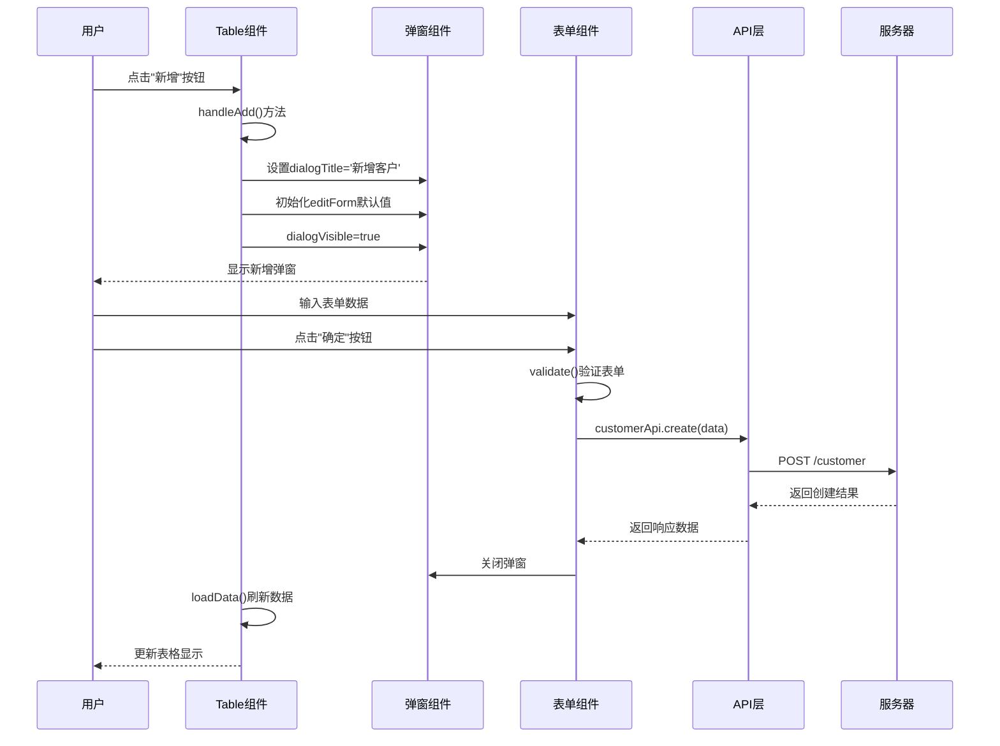
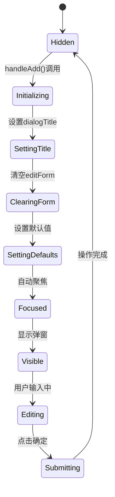
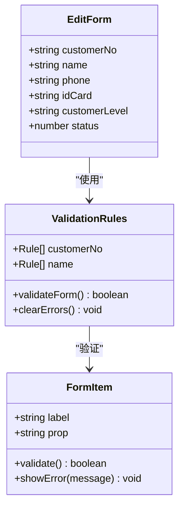
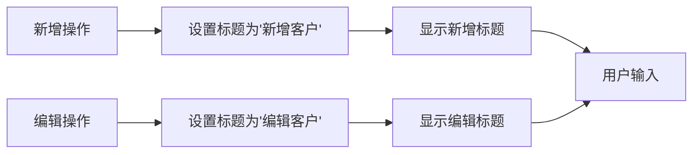
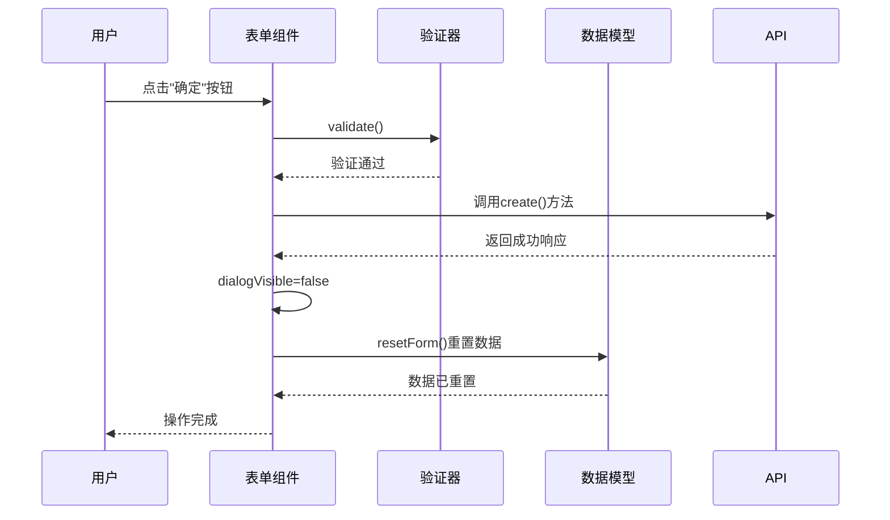
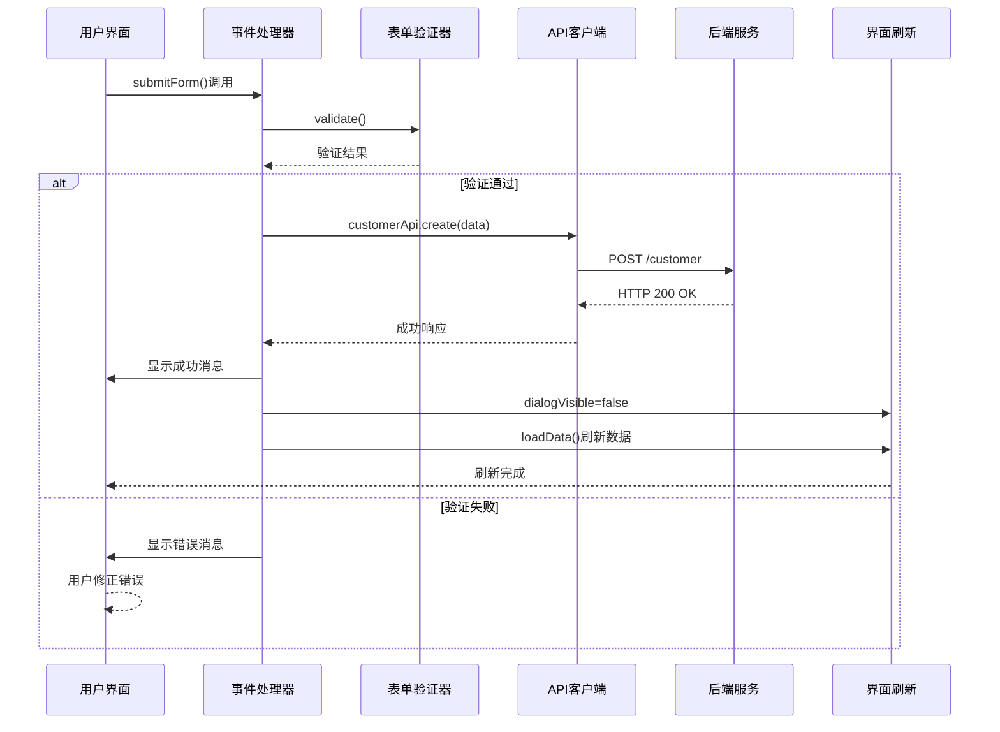
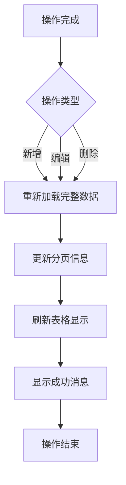
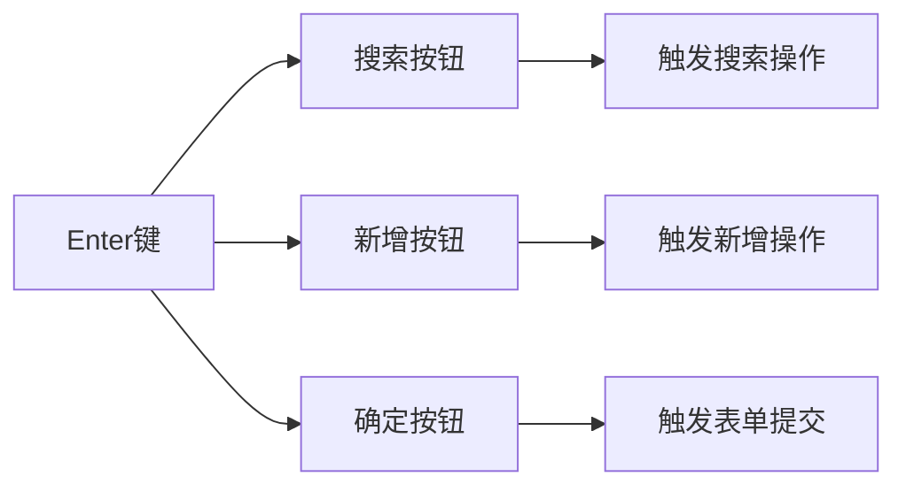
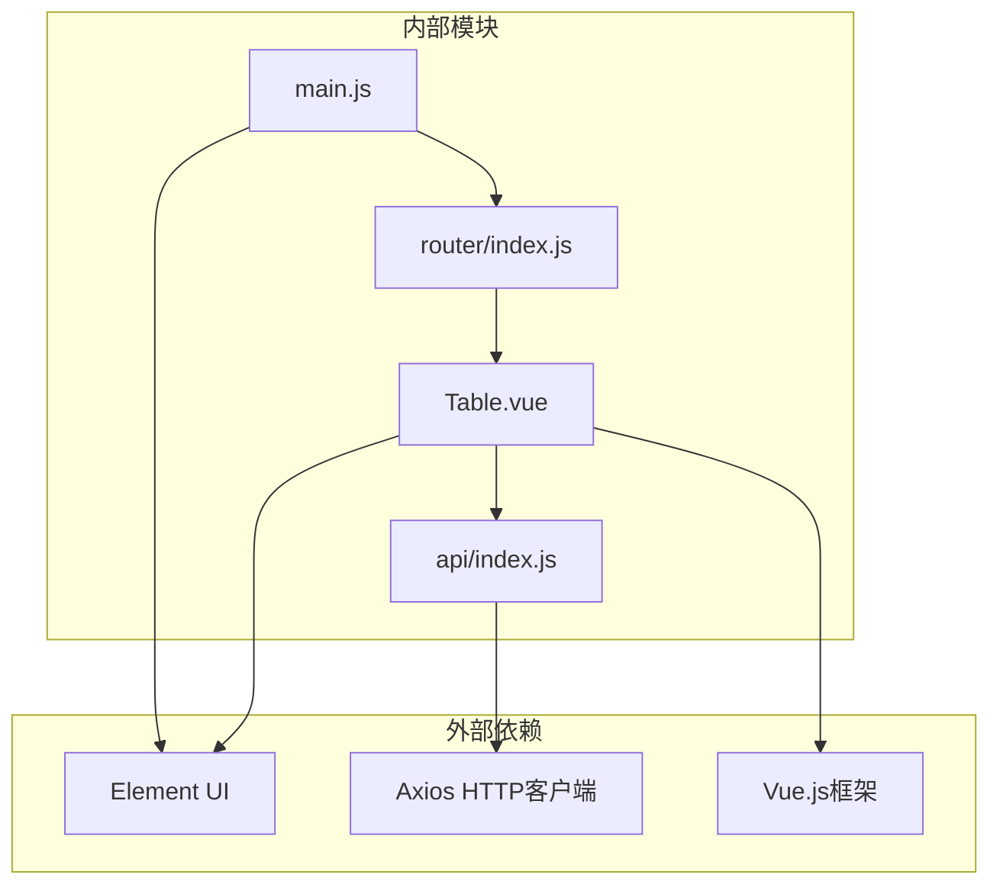

# 新增操作

<cite>
**本文档引用的文件**
- [Table.vue](file://src/views/Table.vue)
- [index.js](file://src/api/index.js)
- [index.js](file://src/router/index.js)
- [main.js](file://src/main.js)
- [App.vue](file://src/App.vue)
</cite>

## 目录
1. [简介](#简介)
2. [项目结构](#项目结构)
3. [核心组件](#核心组件)
4. [架构概览](#架构概览)
5. [详细组件分析](#详细组件分析)
6. [依赖关系分析](#依赖关系分析)
7. [性能考虑](#性能考虑)
8. [故障排除指南](#故障排除指南)
9. [结论](#结论)

## 简介

本文档深入解析客户信息新增功能的完整实现，这是一个基于Vue.js和Element UI构建的企业级应用中的核心业务功能。该功能提供了完整的客户信息管理能力，包括新增、编辑、删除和查询等操作。本文档将详细说明新增按钮触发逻辑、对话框初始化、表单字段清空和默认值设置、表单验证规则、对话框标题动态变化、表单状态重置机制、新增API调用流程以及用户体验优化等方面。

## 项目结构

该项目采用模块化架构设计，主要包含以下核心模块：



**图表来源**
- [main.js:1-18](file://src/main.js#L1-L18)
- [App.vue:1-258](file://src/App.vue#L1-L258)
- [router/index.js:1-32](file://src/router/index.js#L1-L32)

**章节来源**
- [main.js:1-18](file://src/main.js#L1-L18)
- [router/index.js:1-32](file://src/router/index.js#L1-L32)
- [App.vue:1-258](file://src/App.vue#L1-L258)

## 核心组件

### 客户管理页面（Table.vue）

客户管理页面是本次新增功能的核心实现位置，包含了完整的客户信息管理界面。该页面采用了响应式布局设计，集成了表格展示、分页控制、搜索功能和弹窗表单等多种交互元素。

#### 主要功能特性

1. **数据展示与管理**
   - 支持客户信息的增删改查操作
   - 提供分页浏览功能
   - 集成搜索过滤机制

2. **用户界面设计**
   - 采用Element UI组件库构建
   - 实现暗色主题适配
   - 支持键盘快捷键操作

3. **业务流程控制**
   - 完整的新增/编辑弹窗机制
   - 表单验证与错误处理
   - 数据持久化与刷新策略

**章节来源**
- [Table.vue:1-214](file://src/views/Table.vue#L1-L214)

## 架构概览

整个新增操作的实现遵循MVVM架构模式，通过清晰的层次分离实现了业务逻辑与视图层的解耦。



**图表来源**
- [Table.vue:163-190](file://src/views/Table.vue#L163-L190)
- [index.js:44-54](file://src/api/index.js#L44-L54)

## 详细组件分析

### 新增按钮触发逻辑

新增功能的触发点位于Table.vue组件的工具栏区域，通过一个带有加号图标的主要操作按钮实现快速访问。

#### 触发流程分析

```mermaid
flowchart TD
Start([用户点击"新增"按钮]) --> CheckDialog{"弹窗是否已打开?"}
CheckDialog --> |是| CloseExisting["关闭现有弹窗"]
CheckDialog --> |否| InitDefaults["初始化默认值"]
CloseExisting --> InitDefaults
InitDefaults --> SetTitle["设置对话框标题为'新增客户'"]
SetTitle --> ClearForm["清空表单内容"]
ClearForm --> SetStatus["设置状态为启用"]
SetStatus --> ShowDialog["显示弹窗"]
ShowDialog --> FocusFirstField["自动聚焦到第一个输入框"]
FocusFirstField --> End([等待用户输入])
```

**图表来源**
- [Table.vue:163-167](file://src/views/Table.vue#L163-L167)

#### 关键实现要点

1. **状态管理**: 通过`dialogVisible`属性控制弹窗显示状态
2. **数据初始化**: 使用默认值对象初始化表单数据
3. **标题动态化**: 根据操作模式动态设置对话框标题
4. **用户体验**: 自动聚焦到首个可输入字段

**章节来源**
- [Table.vue:163-167](file://src/views/Table.vue#L163-L167)

### 对话框初始化与表单字段设置

对话框初始化过程涉及多个关键步骤，确保用户获得一致且友好的使用体验。

#### 初始化流程



**图表来源**
- [Table.vue:163-172](file://src/views/Table.vue#L163-L172)

#### 默认值配置策略

| 字段名称 | 默认值 | 设置位置 | 作用说明 |
|---------|--------|----------|----------|
| customerNo | '' | editForm对象 | 客户编号，新增时为空 |
| name | '' | editForm对象 | 客户姓名，必填字段 |
| phone | '' | editForm对象 | 手机号码，可选字段 |
| idCard | '' | editForm对象 | 身份证号，可选字段 |
| customerLevel | '普通' | editForm对象 | 客户等级，默认普通级别 |
| status | 1 | editForm对象 | 状态值，默认启用 |

**章节来源**
- [Table.vue:113-121](file://src/views/Table.vue#L113-L121)

### 表单验证规则与错误处理

表单验证是确保数据质量的关键环节，采用Element UI的表单验证机制实现。

#### 验证规则定义



**图表来源**
- [Table.vue:122-125](file://src/views/Table.vue#L122-L125)

#### 验证规则详解

| 字段名称 | 验证规则 | 触发时机 | 错误消息 |
|---------|----------|----------|----------|
| customerNo | 必填验证 | 失去焦点 | 请输入客户编号 |
| name | 必填验证 | 失去焦点 | 请输入姓名 |
| phone | 可选验证 | 失去焦点 | 请输入手机号 |
| idCard | 可选验证 | 失去焦点 | 请输入身份证号 |
| customerLevel | 默认值验证 | 选择变更 | 请选择客户等级 |
| status | 数值验证 | 状态切换 | 状态值验证失败 |

**章节来源**
- [Table.vue:122-125](file://src/views/Table.vue#L122-L125)

### 对话框标题动态变化机制

标题动态变化是区分新增和编辑操作的重要视觉标识，通过简单的字符串替换实现。

#### 标题切换逻辑



**图表来源**
- [Table.vue:164-171](file://src/views/Table.vue#L164-L171)

#### 标题切换实现

```javascript
// 新增时设置标题
handleAdd() {
  this.dialogTitle = '新增客户'
  // ... 其他初始化逻辑
}

// 编辑时设置标题  
handleEdit(row) {
  this.dialogTitle = '编辑客户'
  // ... 其他初始化逻辑
}
```

**章节来源**
- [Table.vue:164-171](file://src/views/Table.vue#L164-L171)

### 表单状态重置机制

表单状态重置是确保用户能够连续进行多次新增操作的关键机制。

#### 重置流程分析



**图表来源**
- [Table.vue:173-190](file://src/views/Table.vue#L173-L190)

#### 重置策略实现

1. **数据重置**: 将表单数据恢复到初始状态
2. **验证清除**: 清除之前的验证错误状态
3. **弹窗关闭**: 关闭对话框窗口
4. **状态同步**: 确保所有相关状态都得到正确更新

**章节来源**
- [Table.vue:173-190](file://src/views/Table.vue#L173-L190)

### 新增API调用流程

新增操作的API调用遵循标准的异步处理模式，确保良好的用户体验和错误处理。

#### API调用序列



**图表来源**
- [Table.vue:173-190](file://src/views/Table.vue#L173-L190)
- [index.js:44-54](file://src/api/index.js#L44-L54)

#### API调用参数结构

```javascript
// 新增请求参数格式
{
  customerNo: string,      // 客户编号
  name: string,           // 姓名
  phone: string,          // 手机号
  idCard: string,         // 身份证号
  customerLevel: string,  // 客户等级
  status: number          // 状态值
}
```

**章节来源**
- [Table.vue:173-190](file://src/views/Table.vue#L173-L190)
- [index.js:44-54](file://src/api/index.js#L44-L54)

### 数据刷新策略

数据刷新是确保用户界面与后端数据保持同步的关键机制。

#### 刷新策略分析



**图表来源**
- [Table.vue:184-186](file://src/views/Table.vue#L184-L186)

#### 刷新实现机制

1. **数据重新获取**: 调用`loadData()`方法重新从服务器获取最新数据
2. **分页信息更新**: 更新总记录数和当前页码
3. **表格内容刷新**: 自动更新表格显示内容
4. **状态指示器**: 显示加载状态直到数据完全加载

**章节来源**
- [Table.vue:184-186](file://src/views/Table.vue#L184-L186)

### 用户体验优化

系统在多个方面进行了用户体验优化，提升用户的操作效率和满意度。

#### 快捷键支持



**图表来源**
- [Table.vue:15-16](file://src/views/Table.vue#L15-L16)

#### 自动聚焦机制

1. **首次输入聚焦**: 新增弹窗打开时自动聚焦到第一个输入框
2. **错误定位**: 验证失败时自动定位到第一个错误字段
3. **键盘导航**: 支持Tab键在表单字段间导航

#### 错误处理优化

1. **即时反馈**: 表单验证错误立即显示
2. **友好提示**: 使用用户友好的错误消息
3. **状态恢复**: 操作失败后保持界面状态稳定

**章节来源**
- [Table.vue:15-16](file://src/views/Table.vue#L15-L16)

## 依赖关系分析

### 组件依赖关系



**图表来源**
- [main.js:1-18](file://src/main.js#L1-L18)
- [index.js:1-118](file://src/api/index.js#L1-L118)

### API接口依赖

系统通过统一的API封装层提供服务访问能力，确保了良好的可维护性和扩展性。

#### API接口分类

| 接口组别 | 主要用途 | 接口数量 |
|---------|----------|----------|
| 客户管理 | 客户信息CRUD操作 | 7个 |
| 用户管理 | 用户账户管理 | 6个 |
| 公司管理 | 公司信息管理 | 6个 |
| 走访管理 | 走访活动管理 | 7个 |
| 网格员管理 | 网格员信息管理 | 6个 |
| 点击日志 | 用户行为追踪 | 3个 |

**章节来源**
- [index.js:1-118](file://src/api/index.js#L1-L118)

## 性能考虑

### 加载性能优化

1. **懒加载策略**: 路由组件采用动态导入实现按需加载
2. **分页加载**: 大数据量场景下采用分页加载减少内存占用
3. **缓存机制**: 合理利用浏览器缓存和HTTP缓存

### 响应性能优化

1. **异步处理**: 所有网络请求采用异步方式避免阻塞UI线程
2. **并发控制**: 合理控制同时进行的请求数量
3. **错误恢复**: 实现优雅的错误恢复机制

## 故障排除指南

### 常见问题及解决方案

#### 表单验证问题

**问题描述**: 表单验证不生效或验证结果异常

**可能原因**:
1. 表单字段绑定错误
2. 验证规则配置不当
3. Element UI版本兼容性问题

**解决步骤**:
1. 检查表单字段的`prop`属性与数据模型对应关系
2. 验证`editRules`对象的结构和语法
3. 确认Element UI版本与Vue版本兼容

#### API调用失败

**问题描述**: 新增操作调用API失败

**可能原因**:
1. 网络连接异常
2. 服务器端错误
3. 认证令牌过期

**解决步骤**:
1. 检查网络连接状态
2. 查看浏览器开发者工具的网络面板
3. 验证服务器状态和API端点可用性

#### 数据刷新问题

**问题描述**: 新增成功后界面未更新

**可能原因**:
1. 数据加载函数调用失败
2. 分页状态不同步
3. 错误处理逻辑异常

**解决步骤**:
1. 确认`loadData()`方法正常执行
2. 检查`total`和`currentPage`状态更新
3. 验证错误处理分支的正确性

**章节来源**
- [Table.vue:184-206](file://src/views/Table.vue#L184-L206)

## 结论

客户信息新增功能作为系统的核心业务功能，展现了现代前端开发的最佳实践。通过精心设计的架构和完善的用户体验优化，该功能不仅满足了业务需求，还提供了优秀的使用体验。

### 主要成就

1. **完整的功能实现**: 覆盖了新增操作的所有关键环节
2. **良好的用户体验**: 通过多种优化措施提升用户满意度
3. **健壮的错误处理**: 实现了全面的异常处理和恢复机制
4. **可维护的代码结构**: 清晰的模块划分和职责分离

### 技术亮点

1. **响应式设计**: 适配不同屏幕尺寸和设备
2. **暗色主题**: 提供舒适的视觉体验
3. **键盘快捷键**: 支持高效的键盘操作
4. **异步处理**: 确保流畅的用户体验

该实现为类似的企业级应用开发提供了优秀的参考模板，展示了如何在保证功能完整性的同时，最大化提升用户体验。