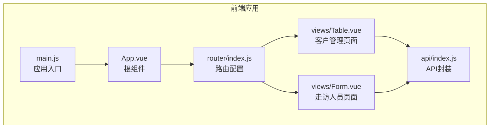
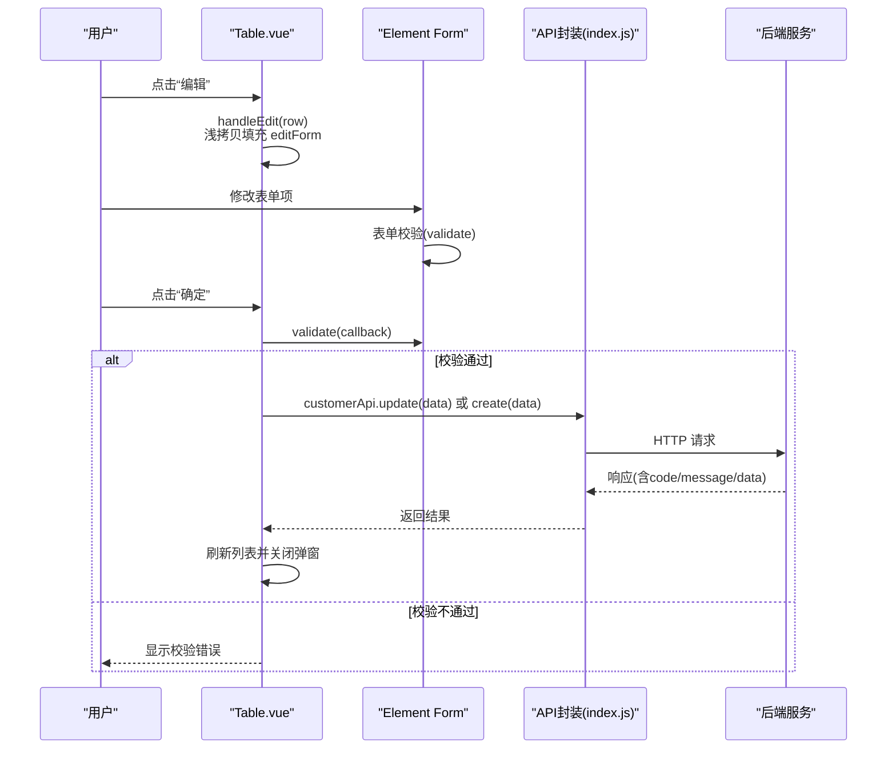
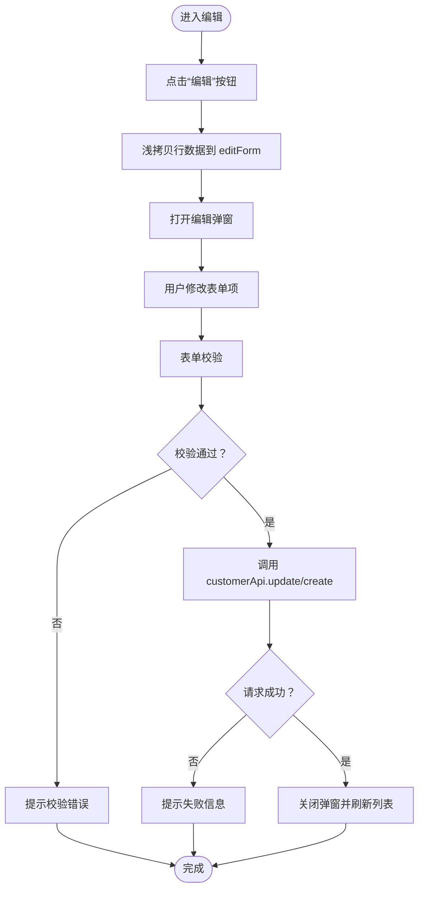
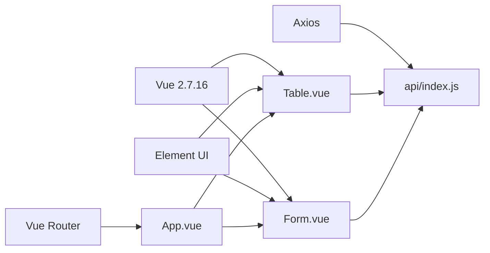

# 编辑操作

<cite>
**本文档引用的文件**
- [Table.vue](file://src/views/Table.vue)
- [Form.vue](file://src/views/Form.vue)
- [index.js](file://src/api/index.js)
- [index.js](file://src/router/index.js)
- [main.js](file://src/main.js)
- [App.vue](file://src/App.vue)
- [package.json](file://package.json)
</cite>

## 目录
1. [简介](#简介)
2. [项目结构](#项目结构)
3. [核心组件](#核心组件)
4. [架构总览](#架构总览)
5. [详细组件分析](#详细组件分析)
6. [依赖关系分析](#依赖关系分析)
7. [性能考虑](#性能考虑)
8. [故障排除指南](#故障排除指南)
9. [结论](#结论)

## 简介
本文件聚焦于编辑操作的完整实现，围绕“客户信息编辑”展开，系统性解析以下关键环节：
- 编辑按钮触发逻辑与数据行读取
- 表单填充与双向数据绑定机制
- 深拷贝避免引用污染的实践
- 编辑API调用时机与更新后数据同步策略
- 表单验证与错误处理机制
- 数据一致性与并发冲突处理方案

该实现基于 Vue 2 + Element UI + Axios 的技术栈，采用组件化设计与模块化的 API 层，确保编辑流程清晰、可维护且具备良好的用户体验。

## 项目结构
该项目采用典型的 Vue 单页应用结构，主要目录与职责如下：
- src/views：页面级组件（Table.vue、Form.vue）
- src/api：统一的 API 封装层（index.js）
- src/router：路由配置（index.js）
- src：入口与全局配置（main.js、App.vue）
- package.json：依赖声明

图表来源
- [main.js:1-18](file://src/main.js#L1-L18)
- [App.vue:1-258](file://src/App.vue#L1-L258)
- [index.js:1-32](file://src/router/index.js#L1-L32)
- [Table.vue:1-214](file://src/views/Table.vue#L1-L214)
- [Form.vue:1-143](file://src/views/Form.vue#L1-L143)
- [index.js:1-118](file://src/api/index.js#L1-L118)

章节来源
- [main.js:1-18](file://src/main.js#L1-L18)
- [App.vue:1-258](file://src/App.vue#L1-L258)
- [index.js:1-32](file://src/router/index.js#L1-L32)

## 核心组件
本节聚焦“客户信息编辑”的核心实现，涉及的关键组件与职责：
- Table.vue：负责客户列表展示、搜索、分页、编辑弹窗与提交
- Form.vue：提供另一个编辑场景（走访人员），用于对比与参考
- api/index.js：封装所有业务 API，统一响应拦截与错误处理

在 Table.vue 中，编辑流程的关键点包括：
- 编辑按钮触发：通过表格行作用域插槽中的“编辑”按钮触发 handleEdit
- 数据行读取与表单填充：handleEdit 使用浅拷贝将当前行数据赋给 editForm
- 双向数据绑定：表单字段直接绑定到 editForm，支持实时校验与提交
- 提交流程：submitForm 调用表单校验，根据是否存在 id 决定新增或更新，并刷新列表

章节来源
- [Table.vue:168-172](file://src/views/Table.vue#L168-L172)
- [Table.vue:173-190](file://src/views/Table.vue#L173-L190)
- [index.js:44-54](file://src/api/index.js#L44-L54)

## 架构总览
下图展示了从用户交互到后端 API 的完整调用链路，以及数据流向与控制流。

图表来源
- [Table.vue:168-190](file://src/views/Table.vue#L168-L190)
- [index.js:44-54](file://src/api/index.js#L44-L54)

## 详细组件分析

### 客户信息编辑组件（Table.vue）深度解析
- 编辑按钮触发逻辑
  - 在表格列中为每个数据行渲染“编辑”按钮，点击时传入当前行对象
  - 触发 handleEdit(row)，将当前行浅拷贝到 editForm，同时设置弹窗标题为“编辑客户”，并打开对话框
- 数据行读取与表单填充
  - 浅拷贝使用扩展运算符，避免直接引用原数组项，防止编辑过程中影响原始数据
  - 弹窗内使用 Element Form 组件，字段与 editForm 对象一一对应，形成双向数据绑定
- 编辑模式下的数据绑定机制
  - 表单字段通过 v-model 绑定到 editForm，Element UI 的表单控件会自动与 model 同步
  - 由于是浅拷贝，修改表单不会直接影响表格中的原始数据
- 提交与 API 调用时机
  - submitForm 首先执行表单校验，校验通过后判断 editForm 是否包含 id
  - 若存在 id，则调用 customerApi.update；否则调用 customerApi.create
  - 成功后关闭弹窗并重新加载列表，使 UI 与后端数据保持一致
- 更新后的数据同步策略
  - 通过 loadData 方法重新拉取数据并截取当前页，确保表格显示最新状态
  - 分页参数（currentPage、pageSize）在提交后仍保持不变，避免跳转导致的体验问题

图表来源
- [Table.vue:168-190](file://src/views/Table.vue#L168-L190)

章节来源
- [Table.vue:42-47](file://src/views/Table.vue#L42-L47)
- [Table.vue:168-172](file://src/views/Table.vue#L168-L172)
- [Table.vue:173-190](file://src/views/Table.vue#L173-L190)

### 表单验证与错误处理机制
- 表单验证
  - 使用 Element Form 的 validate 方法进行异步校验
  - 校验规则定义在 editRules 中，针对必填字段进行校验
  - 校验失败时，表单会高亮错误字段并显示提示信息
- 错误处理
  - API 层在响应拦截器中统一校验返回码，非 200 时抛出错误
  - 页面层捕获错误并提示用户，避免异常冒泡
  - 删除操作使用 $confirm 进行二次确认，防止误删

章节来源
- [Table.vue:122-125](file://src/views/Table.vue#L122-L125)
- [Table.vue:173-190](file://src/views/Table.vue#L173-L190)
- [index.js:19-31](file://src/api/index.js#L19-L31)

### 数据一致性与并发冲突处理
- 数据一致性
  - 编辑完成后立即重新加载列表，确保 UI 与后端数据一致
  - 使用浅拷贝隔离 editForm 与表格数据，避免引用污染
- 并发冲突处理
  - 当前实现未显式处理版本号或乐观锁等并发冲突机制
  - 建议在实际生产环境中引入以下改进：
    - 后端返回数据时携带版本号或时间戳
    - 前端在提交时附带版本号，后端进行条件更新
    - 若检测到版本不匹配，提示用户并重新加载数据

章节来源
- [Table.vue:173-190](file://src/views/Table.vue#L173-L190)

### 对比组件：走访人员编辑（Form.vue）
- 与 Table.vue 的相似点
  - 均使用 Element Form 进行表单校验与提交
  - 均通过浅拷贝将行数据填充到表单模型
  - 均在提交后刷新列表
- 差异点
  - Form.vue 的表单字段较少，且包含状态切换开关
  - Form.vue 的提交逻辑与 Table.vue 类似，但未使用弹窗，而是直接在页面内编辑

章节来源
- [Form.vue:117-119](file://src/views/Form.vue#L117-L119)
- [Form.vue:92-112](file://src/views/Form.vue#L92-L112)

## 依赖关系分析
- 技术栈与依赖
  - Vue 2.7.16：框架基础
  - Element UI 2.15.14：UI 组件库
  - Axios 1.17.0：HTTP 客户端
  - Vue Router 3.6.5：路由管理
- 模块耦合
  - 页面组件仅依赖 API 封装层，解耦了视图与网络层
  - API 封装层集中处理请求/响应拦截，统一错误处理
  - 路由层负责页面导航，与业务逻辑解耦

图表来源
- [package.json:10-22](file://package.json#L10-L22)
- [main.js:1-18](file://src/main.js#L1-L18)
- [index.js:1-32](file://src/router/index.js#L1-L32)
- [Table.vue:1-214](file://src/views/Table.vue#L1-L214)
- [Form.vue:1-143](file://src/views/Form.vue#L1-L143)
- [index.js:1-118](file://src/api/index.js#L1-L118)

章节来源
- [package.json:1-29](file://package.json#L1-L29)
- [main.js:1-18](file://src/main.js#L1-L18)
- [index.js:1-32](file://src/router/index.js#L1-L32)

## 性能考虑
- 渲染优化
  - 表格使用 v-loading 控制加载状态，避免频繁重绘
  - 列表分页通过 slice 截取当前页数据，减少一次性渲染量
- 网络优化
  - API 层统一拦截器，减少重复代码
  - 搜索场景按需调用 search 接口，避免全量加载
- 建议
  - 大列表场景可考虑虚拟滚动或懒加载
  - 表单提交前可增加防抖，避免重复提交

## 故障排除指南
- 编辑弹窗无法打开
  - 检查 handleEdit 是否被正确绑定到按钮事件
  - 确认 dialogVisible 已设置为 true
- 表单校验不生效
  - 确认 editRules 已正确定义
  - 检查表单项的 prop 与 editForm 字段名一致
- 提交失败
  - 查看 API 响应拦截器是否返回非 200 状态
  - 检查后端接口是否正常，网络请求是否超时
- 数据未更新
  - 确认提交成功后是否调用了 loadData 刷新列表
  - 检查分页参数是否被意外重置

章节来源
- [Table.vue:168-190](file://src/views/Table.vue#L168-L190)
- [index.js:19-31](file://src/api/index.js#L19-L31)

## 结论
本项目在“客户信息编辑”方面实现了清晰、可维护的流程：通过浅拷贝隔离数据、利用 Element UI 的双向绑定与表单校验、在 API 层统一错误处理，并在提交后及时刷新列表以保证数据一致性。对于并发冲突处理，建议引入版本号或乐观锁机制以提升可靠性。整体架构简洁明了，便于后续扩展与维护。