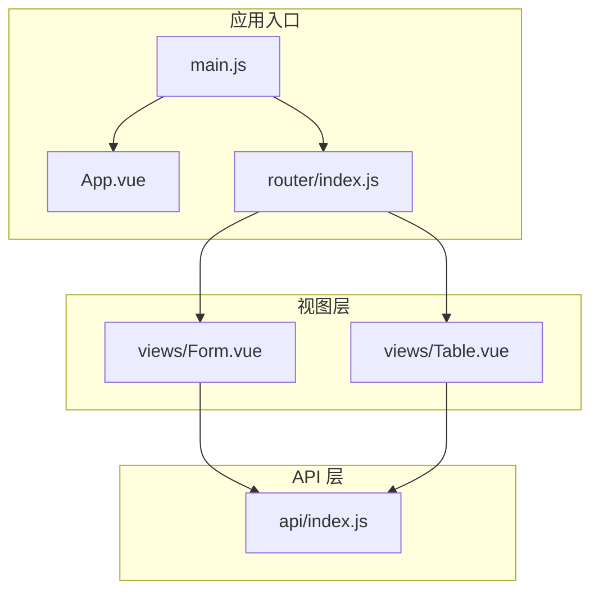
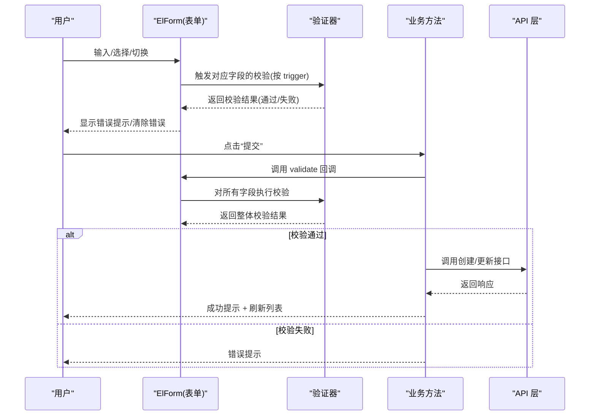
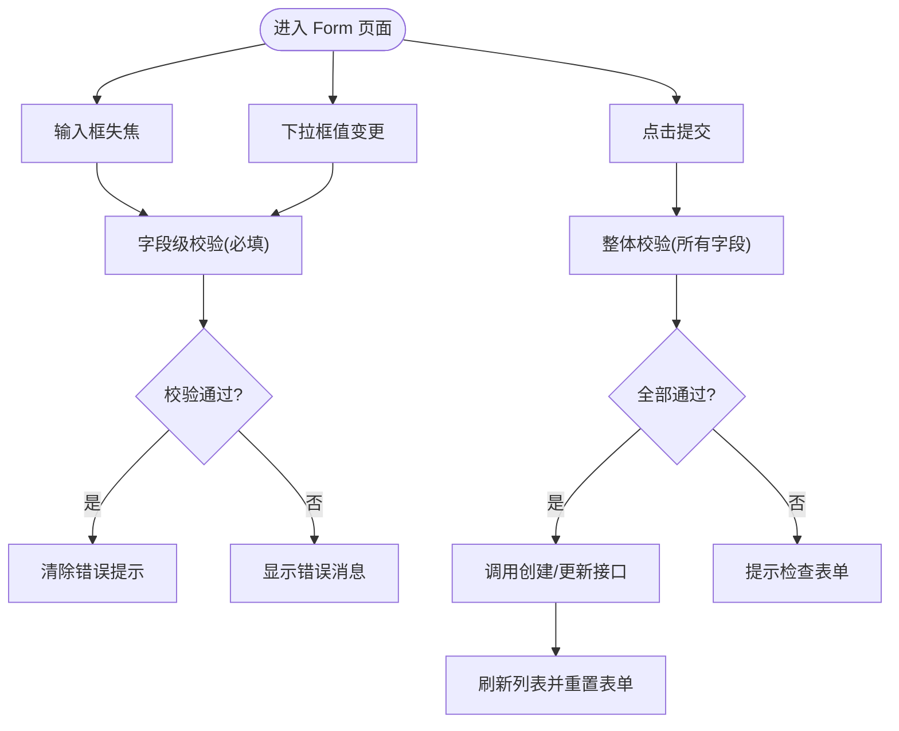
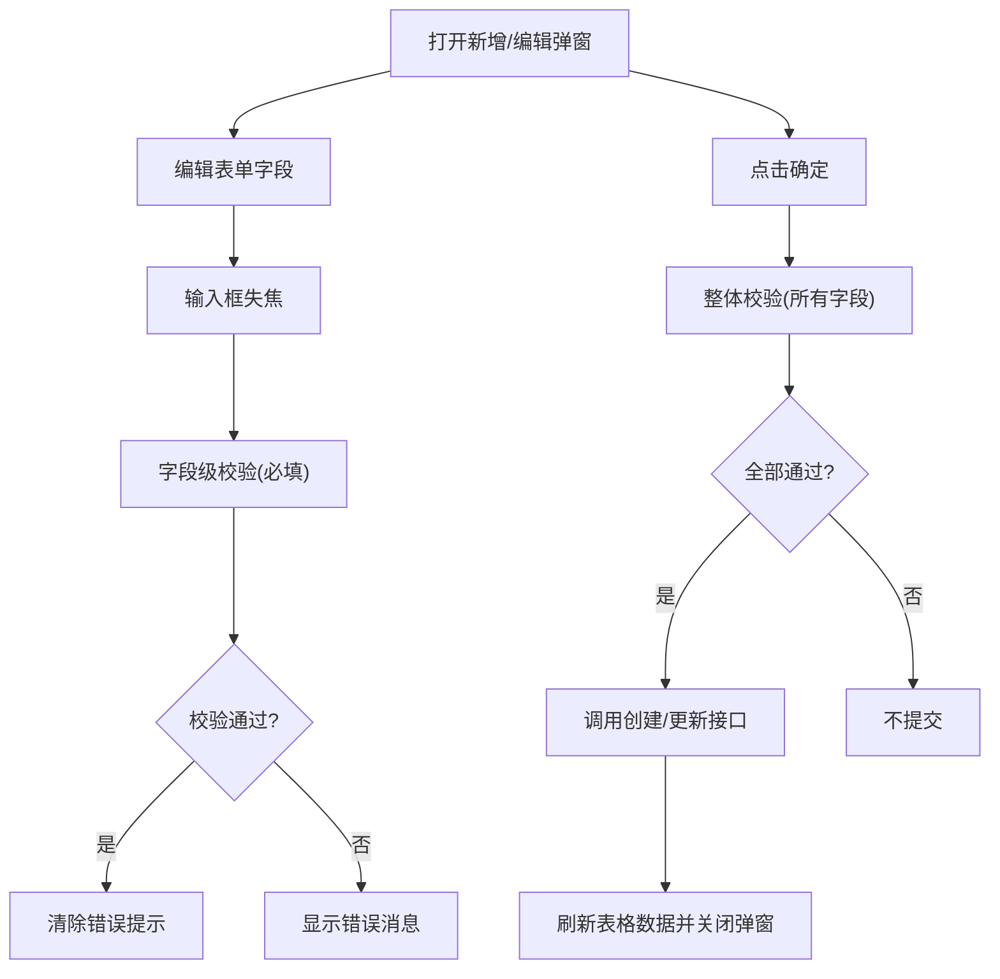
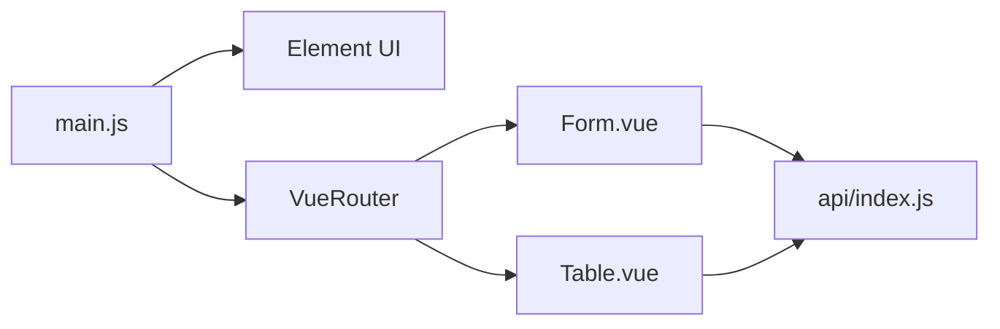

# 表单验证

<cite>
**本文引用的文件**
- [Form.vue](file://src/views/Form.vue)
- [Table.vue](file://src/views/Table.vue)
- [index.js（API）](file://src/api/index.js)
- [index.js（路由）](file://src/router/index.js)
- [main.js](file://src/main.js)
- [App.vue](file://src/App.vue)
- [package.json](file://package.json)
</cite>

## 目录
1. [简介](#简介)
2. [项目结构](#项目结构)
3. [核心组件](#核心组件)
4. [架构总览](#架构总览)
5. [详细组件分析](#详细组件分析)
6. [依赖关系分析](#依赖关系分析)
7. [性能考量](#性能考量)
8. [故障排查指南](#故障排查指南)
9. [结论](#结论)
10. [附录](#附录)

## 简介
本文件聚焦于项目中“客户信息表单”与“走访人员表单”的验证实现，系统性梳理以下内容：
- 必填字段验证规则与触发时机
- 实时验证与错误提示处理
- Element UI 表单验证组件的使用方式（验证器配置与自定义规则）
- 验证时机控制（失焦验证 vs 提交验证）
- 错误消息的国际化与友好展示
- 大量数据场景下的验证性能优化策略

## 项目结构
该项目采用 Vue 2 + Element UI 的前端架构，表单验证主要分布在两个页面组件中：
- 走访人员表单：位于 Form.vue
- 客户信息表单：位于 Table.vue（对话框内）

图表来源
- [main.js:1-18](file://src/main.js#L1-L18)
- [App.vue:1-258](file://src/App.vue#L1-L258)
- [index.js（路由）:1-32](file://src/router/index.js#L1-L32)
- [Form.vue:1-143](file://src/views/Form.vue#L1-L143)
- [Table.vue:1-214](file://src/views/Table.vue#L1-L214)
- [index.js（API）:1-118](file://src/api/index.js#L1-L118)

章节来源
- [main.js:1-18](file://src/main.js#L1-L18)
- [App.vue:1-258](file://src/App.vue#L1-L258)
- [index.js（路由）:1-32](file://src/router/index.js#L1-L32)
- [Form.vue:1-143](file://src/views/Form.vue#L1-L143)
- [Table.vue:1-214](file://src/views/Table.vue#L1-L214)
- [index.js（API）:1-118](file://src/api/index.js#L1-L118)

## 核心组件
- 走访人员表单（Form.vue）
  - 使用 ElForm/ElFormItem 组织字段与规则
  - 基于必填规则进行失焦与变更触发的实时校验
  - 提交时统一调用 validate 进行整体校验
- 客户信息表单（Table.vue）
  - 弹窗内的 ElForm/ElFormItem，包含多个输入项
  - 同样基于必填规则与触发时机控制
  - 提交时统一校验并执行创建或更新操作

章节来源
- [Form.vue:71-74](file://src/views/Form.vue#L71-L74)
- [Form.vue:92-112](file://src/views/Form.vue#L92-L112)
- [Table.vue:122-125](file://src/views/Table.vue#L122-L125)
- [Table.vue:173-189](file://src/views/Table.vue#L173-L189)

## 架构总览
下图展示了从用户交互到后端 API 的表单验证流程，涵盖实时校验与提交校验两条路径。

图表来源
- [Form.vue:92-112](file://src/views/Form.vue#L92-L112)
- [Table.vue:173-189](file://src/views/Table.vue#L173-L189)
- [index.js（API）:89-97](file://src/api/index.js#L89-L97)

## 详细组件分析

### 走访人员表单验证（Form.vue）
- 字段与规则
  - 姓名：必填，失焦触发
  - 角色类型：必填，值变更触发
- 实时验证
  - 失焦触发：在输入框失去焦点时即时反馈
  - 变更触发：在下拉框值变化时即时反馈
- 提交验证
  - 点击“提交”按钮时，统一调用 ElForm 的 validate 方法
  - 若任一字段未通过，阻止提交并提示用户检查
- 错误提示
  - Element UI 默认在表单项下方显示错误消息
  - 提交失败时，额外通过消息组件给出明确提示

图表来源
- [Form.vue:71-74](file://src/views/Form.vue#L71-L74)
- [Form.vue:92-112](file://src/views/Form.vue#L92-L112)

章节来源
- [Form.vue:7-26](file://src/views/Form.vue#L7-L26)
- [Form.vue:71-74](file://src/views/Form.vue#L71-L74)
- [Form.vue:92-112](file://src/views/Form.vue#L92-L112)

### 客户信息表单验证（Table.vue）
- 字段与规则
  - 客户编号：必填，失焦触发
  - 姓名：必填，失焦触发
- 实时验证
  - 失焦触发：在输入框失去焦点时即时反馈
- 提交验证
  - 点击“确定”按钮时，统一调用 ElForm 的 validate 方法
  - 若任一字段未通过，阻止提交
- 错误提示
  - Element UI 默认在表单项下方显示错误消息
  - 成功/失败通过消息组件提示

图表来源
- [Table.vue:122-125](file://src/views/Table.vue#L122-L125)
- [Table.vue:173-189](file://src/views/Table.vue#L173-L189)

章节来源
- [Table.vue:63-94](file://src/views/Table.vue#L63-L94)
- [Table.vue:122-125](file://src/views/Table.vue#L122-L125)
- [Table.vue:173-189](file://src/views/Table.vue#L173-L189)

### Element UI 表单验证组件使用要点
- 验证器配置
  - 在组件 data 中定义 rules，每个字段对应一个规则数组
  - 规则对象包含 required、message、trigger 等属性
- 自定义验证规则
  - 当前代码使用内置 required 规则；如需扩展可参考 Element UI 文档为 rules 添加自定义函数
- 触发时机
  - blur：输入框失焦时触发
  - change：选择类组件值变更时触发
- 错误提示
  - 表单项下方自动显示错误消息
  - 提交失败时可通过消息组件补充提示

章节来源
- [Form.vue:71-74](file://src/views/Form.vue#L71-L74)
- [Table.vue:122-125](file://src/views/Table.vue#L122-L125)

### 验证时机控制（失焦 vs 提交）
- 失焦验证（blur）
  - 适用于输入类字段，及时反馈输入问题
  - 减少无效提交，提升用户体验
- 变更验证（change）
  - 适用于选择类字段，及时反馈选择问题
- 提交验证
  - 在点击提交/确定按钮时进行整体校验
  - 保证提交前的完整性

章节来源
- [Form.vue:72-73](file://src/views/Form.vue#L72-L73)
- [Table.vue:123-124](file://src/views/Table.vue#L123-L124)
- [Form.vue:92-112](file://src/views/Form.vue#L92-L112)
- [Table.vue:173-189](file://src/views/Table.vue#L173-L189)

### 错误国际化与用户友好提示
- 错误消息本地化
  - 当前代码直接使用中文消息字符串
  - 如需国际化，建议将 message 提取为 i18n 键值，并在不同语言环境下渲染
- 用户友好提示
  - 表单项下方显示错误消息
  - 提交失败时通过消息组件给出明确提示
  - 成功时提供成功提示，便于用户确认操作结果

章节来源
- [Form.vue:72-73](file://src/views/Form.vue#L72-L73)
- [Table.vue:123-124](file://src/views/Table.vue#L123-L124)
- [Form.vue:95](file://src/views/Form.vue#L95)
- [Table.vue:178-182](file://src/views/Table.vue#L178-L182)

## 依赖关系分析
- Element UI
  - 在入口文件中全局安装，提供 ElForm、ElFormItem、ElInput、ElSelect、ElSwitch、ElButton、ElDialog、ElMessage 等组件
- 路由
  - 通过 VueRouter 将 Form.vue 与 Table.vue 注册为路由组件
- API 层
  - 通过 axios 实例封装各模块接口，表单提交后调用相应接口完成创建/更新

图表来源
- [main.js:1-18](file://src/main.js#L1-L18)
- [index.js（路由）:1-32](file://src/router/index.js#L1-L32)
- [Form.vue:57](file://src/views/Form.vue#L57)
- [Table.vue:99](file://src/views/Table.vue#L99)
- [index.js（API）:1-118](file://src/api/index.js#L1-L118)

章节来源
- [main.js:1-18](file://src/main.js#L1-L18)
- [index.js（路由）:1-32](file://src/router/index.js#L1-L32)
- [Form.vue:57](file://src/views/Form.vue#L57)
- [Table.vue:99](file://src/views/Table.vue#L99)
- [index.js（API）:1-118](file://src/api/index.js#L1-L118)

## 性能考量
- 触发时机优化
  - 对高频输入字段使用 blur 触发，避免频繁校验导致的性能损耗
  - 对选择类字段使用 change 触发，兼顾实时性与性能
- 批量数据场景
  - 大列表分页加载，减少一次性渲染与校验压力
  - 表单弹窗内仅对当前编辑项进行校验，避免全局校验开销
- 提交阶段集中校验
  - 将整体校验集中在提交按钮，降低频繁校验带来的抖动
- 可选优化点
  - 对复杂自定义规则可引入防抖（debounce），避免高频触发
  - 对长列表场景，可考虑延迟初始化校验器，仅在用户交互时激活

章节来源
- [Form.vue:72-73](file://src/views/Form.vue#L72-L73)
- [Table.vue:123-124](file://src/views/Table.vue#L123-L124)
- [Table.vue:173-189](file://src/views/Table.vue#L173-L189)

## 故障排查指南
- 常见问题
  - 表单未显示错误消息
    - 检查 ElFormItem 的 prop 是否与 model 字段一致
    - 确认 rules 中是否存在对应字段的规则
  - 提交按钮点击无反应
    - 检查 ElForm 的 ref 是否正确绑定
    - 确认 validate 回调逻辑是否被调用
  - 接口调用失败
    - 查看响应拦截器返回的错误信息
    - 确认网络请求与后端接口连通性
- 建议排查步骤
  - 在 validate 回调中打印参数，确认整体校验结果
  - 在提交成功/失败分支中分别添加日志输出
  - 使用浏览器开发者工具查看网络请求与响应

章节来源
- [Form.vue:92-112](file://src/views/Form.vue#L92-L112)
- [Table.vue:173-189](file://src/views/Table.vue#L173-L189)
- [index.js（API）:19-31](file://src/api/index.js#L19-L31)

## 结论
本项目在两个核心表单中实现了简洁而高效的验证机制：
- 基于 Element UI 的 ElForm/ElFormItem，结合必填规则与触发时机控制，实现了良好的用户体验
- 提交阶段统一校验，确保数据完整性
- 错误提示直观明确，配合消息组件提升用户感知
- 在大量数据场景下，通过分页与弹窗内校验等策略，兼顾了性能与可用性

后续可在以下方面进一步增强：
- 引入国际化消息键值，支持多语言
- 扩展自定义规则，满足更复杂的业务约束
- 对高频输入字段增加防抖策略，优化性能

## 附录
- 依赖版本
  - Vue 2.7.16
  - Element UI 2.15.14
  - Vue Router 3.6.5
  - Axios 1.17.0

章节来源
- [package.json:10-22](file://package.json#L10-L22)