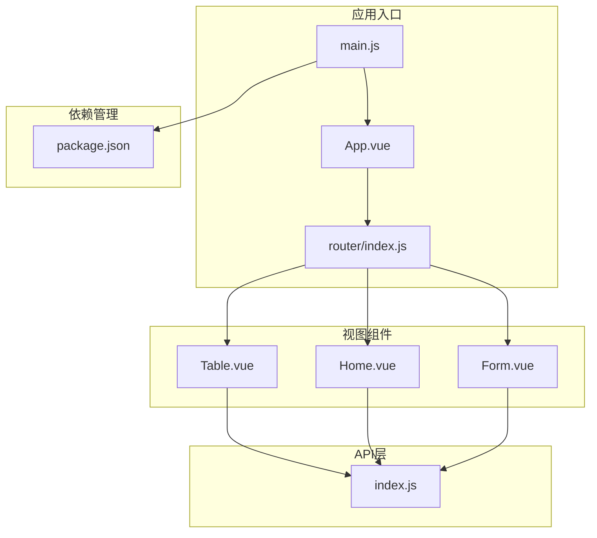
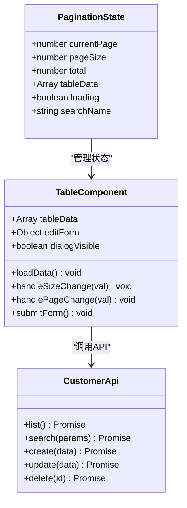
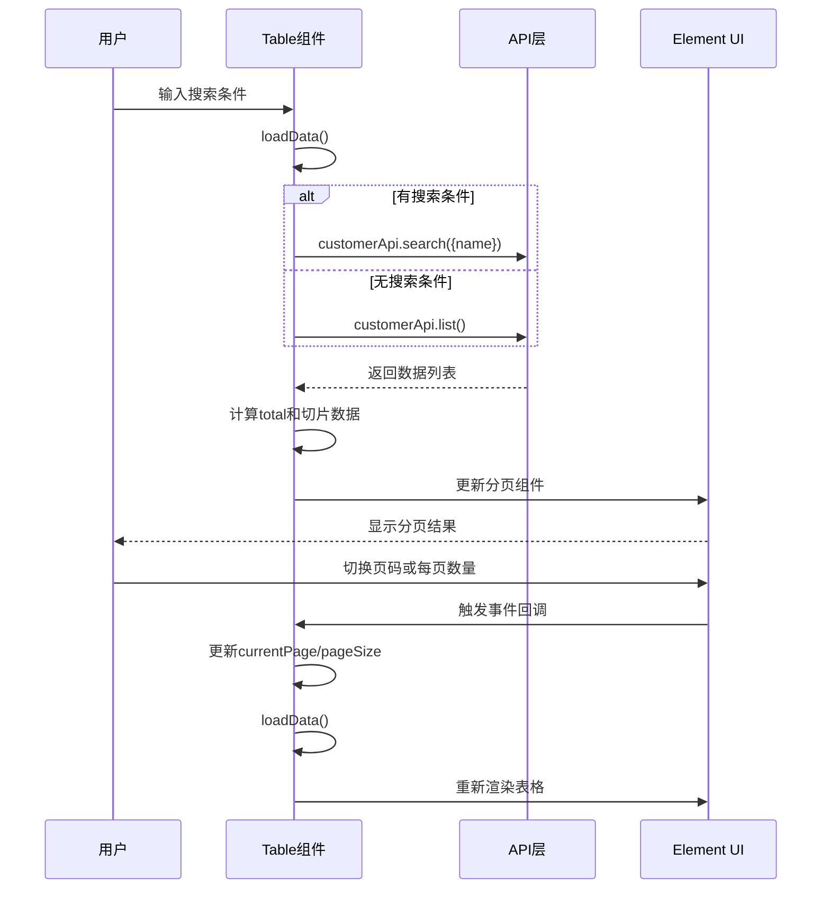
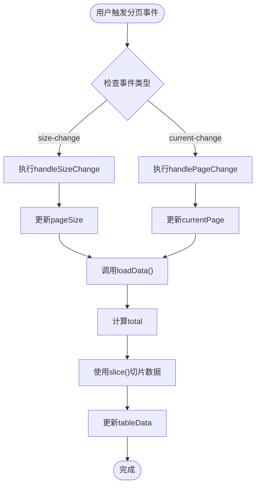
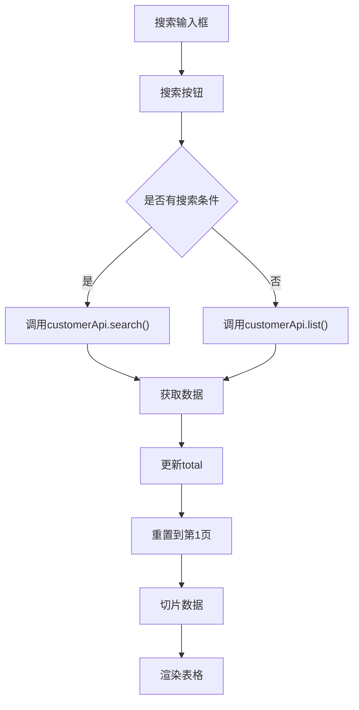
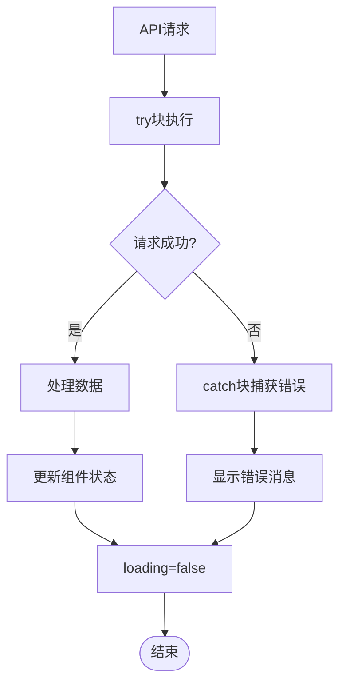
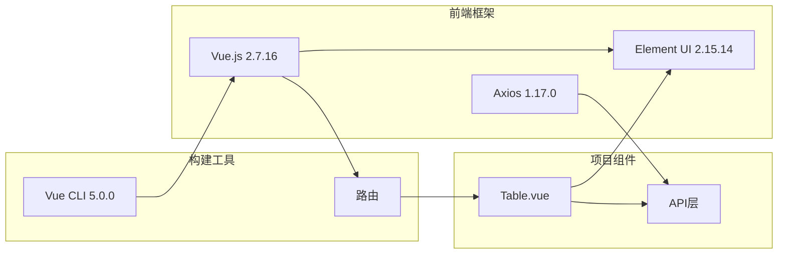

# 分页功能

<cite>
**本文档引用的文件**
- [Table.vue](file://src/views/Table.vue)
- [index.js](file://src/api/index.js)
- [main.js](file://src/main.js)
- [package.json](file://package.json)
- [App.vue](file://src/App.vue)
- [Home.vue](file://src/views/Home.vue)
- [Form.vue](file://src/views/Form.vue)
- [index.js](file://src/router/index.js)
</cite>

## 目录
1. [简介](#简介)
2. [项目结构](#项目结构)
3. [核心组件](#核心组件)
4. [架构概览](#架构概览)
5. [详细组件分析](#详细组件分析)
6. [依赖关系分析](#依赖关系分析)
7. [性能考虑](#性能考虑)
8. [故障排除指南](#故障排除指南)
9. [结论](#结论)

## 简介

本项目实现了基于Element UI的分页功能，为用户提供了完整的数据分页体验。该功能集成了搜索、分页切换、每页数量调整等核心特性，支持前后端分离的数据处理模式。通过本地数据切片的方式实现客户端分页，确保了良好的用户体验和响应速度。

## 项目结构

该项目采用Vue.js + Element UI的技术栈，主要包含以下关键模块：



**图表来源**
- [main.js:1-18](file://src/main.js#L1-L18)
- [App.vue:1-258](file://src/App.vue#L1-L258)
- [router/index.js:1-32](file://src/router/index.js#L1-L32)

**章节来源**
- [main.js:1-18](file://src/main.js#L1-L18)
- [package.json:1-29](file://package.json#L1-L29)

## 核心组件

### 分页组件配置

项目中的分页功能主要集中在Table.vue组件中，实现了完整的Element UI分页组件配置：

| 配置项 | 值 | 描述 |
|--------|-----|------|
| current-page | `currentPage` | 当前页码，初始值为1 |
| page-sizes | `[10, 20, 50]` | 每页显示数量选项 |
| page-size | `pageSize` | 当前每页显示数量，初始值为10 |
| layout | `"total, sizes, prev, pager, next"` | 分页布局，包含总数、每页数量选择、上一页、页码、下一页 |
| total | `total` | 总记录数 |

### 数据模型



**图表来源**
- [Table.vue:103-127](file://src/views/Table.vue#L103-L127)
- [Table.vue:136-162](file://src/views/Table.vue#L136-L162)
- [index.js:45-54](file://src/api/index.js#L45-L54)

**章节来源**
- [Table.vue:50-60](file://src/views/Table.vue#L50-L60)
- [Table.vue:103-127](file://src/views/Table.vue#L103-L127)

## 架构概览

分页功能的整体架构采用MVC模式，结合Element UI的组件化设计：



**图表来源**
- [Table.vue:136-162](file://src/views/Table.vue#L136-L162)
- [index.js:45-54](file://src/api/index.js#L45-L54)

## 详细组件分析

### 分页事件处理机制

分页组件通过Element UI的事件系统实现双向绑定：

#### 事件绑定配置

| 事件类型 | 回调函数 | 触发时机 | 功能描述 |
|----------|----------|----------|----------|
| size-change | `handleSizeChange` | 每页数量改变时 | 更新pageSize并重新加载数据 |
| current-change | `handlePageChange` | 页码改变时 | 更新currentPage并重新加载数据 |

#### 事件处理流程



**图表来源**
- [Table.vue:155-162](file://src/views/Table.vue#L155-L162)
- [Table.vue:136-154](file://src/views/Table.vue#L136-L154)

**章节来源**
- [Table.vue:155-162](file://src/views/Table.vue#L155-L162)

### 数据分页算法实现

#### 切片操作策略

分页算法采用JavaScript原生数组切片方法实现数据截取：

```javascript
// 计算起始索引
const start = (this.currentPage - 1) * this.pageSize

// 使用slice()方法进行数据截取
this.tableData = list.slice(start, start + this.pageSize)
```

#### 复杂度分析

| 操作 | 时间复杂度 | 空间复杂度 | 说明 |
|------|------------|------------|------|
| 切片操作 | O(n) | O(n) | n为pageSize大小 |
| 总数计算 | O(1) | O(1) | 直接使用数组长度 |
| 数据更新 | O(n) | O(n) | n为切片数据量 |

#### 边界情况处理

算法能够正确处理以下边界情况：
- 空数据列表：返回空数组
- 超出范围的页码：自动调整到有效范围
- 每页数量为0：防止除零错误

**章节来源**
- [Table.vue:147-148](file://src/views/Table.vue#L147-L148)

### 搜索功能协同工作

#### 搜索与分页的集成

搜索功能与分页系统深度集成，实现了智能的状态管理：



**图表来源**
- [Table.vue:136-154](file://src/views/Table.vue#L136-L154)

#### 状态管理策略

| 操作场景 | currentPage | pageSize | total | 行为说明 |
|----------|-------------|----------|-------|----------|
| 初始加载 | 1 | 10 | 0 | 加载全部数据 |
| 搜索触发 | 1 | 10 | 搜索结果数量 | 自动重置到第1页 |
| 页码切换 | 新页码 | 不变 | 不变 | 保持搜索条件 |
| 每页数量变更 | 不变 | 新数量 | 不变 | 保持搜索条件 |

**章节来源**
- [Table.vue:136-154](file://src/views/Table.vue#L136-L154)

### 错误处理机制

#### 异常捕获与处理

分页功能实现了完善的错误处理机制：



**图表来源**
- [Table.vue:149-153](file://src/views/Table.vue#L149-L153)

**章节来源**
- [Table.vue:149-153](file://src/views/Table.vue#L149-L153)

## 依赖关系分析

### 技术栈依赖



**图表来源**
- [package.json:10-16](file://package.json#L10-L16)
- [main.js:1-9](file://src/main.js#L1-L9)

### 组件间依赖关系

| 组件 | 依赖组件 | 用途 | 重要性 |
|------|----------|------|--------|
| Table.vue | Element UI | 分页展示 | 核心 |
| Table.vue | API层 | 数据获取 | 核心 |
| API层 | Axios | HTTP通信 | 基础 |
| App.vue | Element UI | 主题样式 | 基础 |
| Router | Vue Router | 页面导航 | 基础 |

**章节来源**
- [package.json:10-16](file://package.json#L10-L16)
- [main.js:1-9](file://src/main.js#L1-L9)

## 性能考虑

### 当前实现的性能特点

1. **内存使用**：采用客户端分页，所有数据一次性加载到内存中
2. **响应速度**：本地切片操作，响应速度快
3. **网络开销**：每次切换页面都会重新请求数据

### 性能优化建议

#### 1. 服务器端分页（推荐）

```javascript
// 服务器端分页示例
async loadData() {
  this.loading = true
  try {
    let res
    if (this.searchName) {
      // 服务器端搜索和分页
      res = await customerApi.search({
        name: this.searchName,
        page: this.currentPage,
        size: this.pageSize
      })
    } else {
      res = await customerApi.list({
        page: this.currentPage,
        size: this.pageSize
      })
    }
    this.total = res.total
    this.tableData = res.data
  } catch (error) {
    this.showMessage('error', error.message)
  } finally {
    this.loading = false
  }
}
```

#### 2. 缓存策略

```javascript
// 添加缓存机制
data() {
  return {
    tableData: [],
    cache: new Map(), // 缓存已加载的数据
    // ...
  }
}

async loadData() {
  const cacheKey = `${this.searchName}-${this.currentPage}-${this.pageSize}`
  
  if (this.cache.has(cacheKey)) {
    // 从缓存获取数据
    const cached = this.cache.get(cacheKey)
    this.total = cached.total
    this.tableData = cached.data
    return
  }
  
  // 执行API请求
  // ...
  
  // 存储到缓存
  this.cache.set(cacheKey, { total: this.total, data: this.tableData })
}
```

#### 3. 防抖优化

```javascript
// 搜索防抖
import debounce from 'lodash/debounce'

export default {
  data() {
    return {
      searchName: '',
      searchDebounce: debounce(this.handleSearch, 300)
    }
  },
  methods: {
    handleSearch() {
      this.currentPage = 1
      this.loadData()
    }
  }
}
```

#### 4. 虚拟滚动

对于大量数据的场景，可以考虑实现虚拟滚动：

```javascript
// 虚拟滚动思路
data() {
  return {
    visibleData: [], // 只渲染可见区域的数据
    scrollTop: 0,
    itemHeight: 48, // 行高
    visibleCount: 20 // 可见行数
  }
}

// 监听滚动事件
onScroll(event) {
  const scrollTop = event.target.scrollTop
  const startIndex = Math.floor(scrollTop / this.itemHeight)
  const endIndex = Math.min(startIndex + this.visibleCount, this.total)
  
  this.visibleData = this.tableData.slice(startIndex, endIndex)
}
```

## 故障排除指南

### 常见问题及解决方案

#### 1. 分页数据不更新

**问题现象**：切换页码后数据没有变化

**可能原因**：
- 未正确调用loadData()方法
- 事件回调函数名不匹配

**解决方法**：
```javascript
// 确保事件绑定正确
<el-pagination
  @size-change="handleSizeChange"
  @current-change="handlePageChange"
>

// 确保方法定义正确
methods: {
  handleSizeChange(val) {
    this.pageSize = val
    this.loadData() // 必须调用loadData
  },
  handlePageChange(val) {
    this.currentPage = val
    this.loadData() // 必须调用loadData
  }
}
```

#### 2. 搜索功能异常

**问题现象**：搜索后分页状态不正确

**解决方法**：
```javascript
// 确保搜索后重置到第1页
async loadData() {
  this.loading = true
  try {
    let res
    if (this.searchName) {
      res = await customerApi.search({ name: this.searchName })
    } else {
      res = await customerApi.list()
    }
    const list = res.data || []
    this.total = list.length
    this.tableData = list.slice(
      (this.currentPage - 1) * this.pageSize,
      this.currentPage * this.pageSize
    )
  } catch (error) {
    this.$message.error('加载数据失败：' + error.message)
  } finally {
    this.loading = false
  }
}
```

#### 3. 性能问题

**问题现象**：大数据量时页面响应缓慢

**解决方法**：
- 实现服务器端分页
- 添加数据缓存机制
- 使用虚拟滚动技术

**章节来源**
- [Table.vue:155-162](file://src/views/Table.vue#L155-L162)
- [Table.vue:136-154](file://src/views/Table.vue#L136-L154)

### 调试技巧

#### 1. 开发者工具调试

使用浏览器开发者工具监控：
- 网络请求：查看API调用频率
- 内存使用：监控数据缓存情况
- 控制台输出：检查错误信息

#### 2. 日志记录

```javascript
// 添加调试日志
async loadData() {
  console.log('开始加载数据', {
    currentPage: this.currentPage,
    pageSize: this.pageSize,
    searchName: this.searchName
  })
  
  // ... 数据加载逻辑
  
  console.log('数据加载完成', {
    total: this.total,
    dataLength: this.tableData.length
  })
}
```

## 结论

本项目的分页功能实现了完整的客户端分页解决方案，具有以下特点：

### 优势
1. **用户体验良好**：即时响应的本地分页操作
2. **功能完整**：支持搜索、分页切换、每页数量调整
3. **代码简洁**：基于Element UI的标准实现
4. **易于维护**：清晰的组件结构和事件处理

### 改进建议
1. **服务器端分页**：对于大数据量场景，建议迁移到服务器端分页
2. **缓存机制**：添加数据缓存以提升重复访问性能
3. **虚拟滚动**：实现虚拟滚动以支持超大数据集
4. **防抖优化**：对搜索功能添加防抖处理

### 最佳实践
- 在生产环境中优先考虑服务器端分页
- 实现适当的错误处理和加载状态
- 考虑数据缓存和性能优化
- 提供友好的用户反馈和错误提示

该分页功能为用户提供了流畅的数据浏览体验，通过合理的架构设计和性能优化，能够满足大多数业务场景的需求。