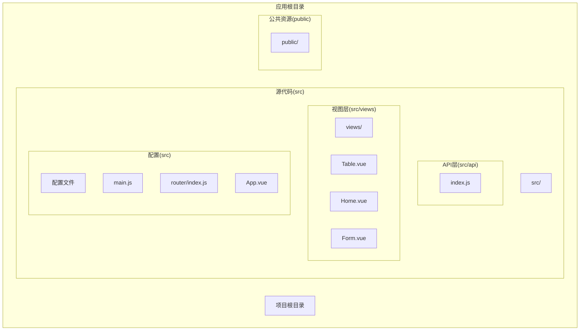
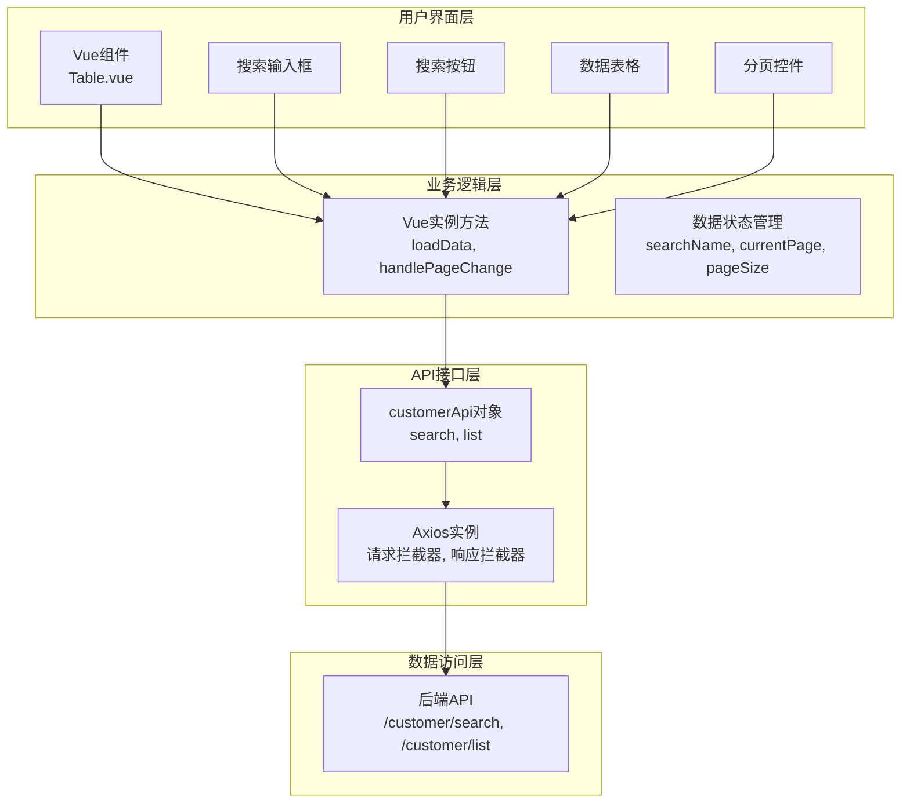
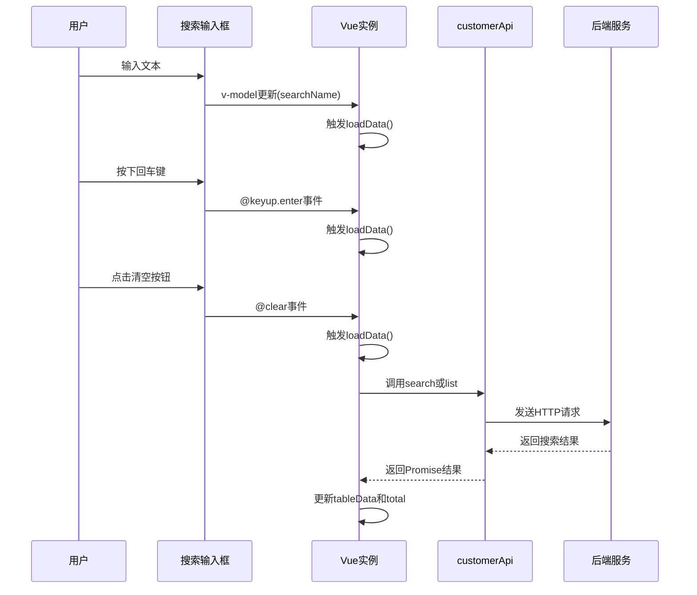
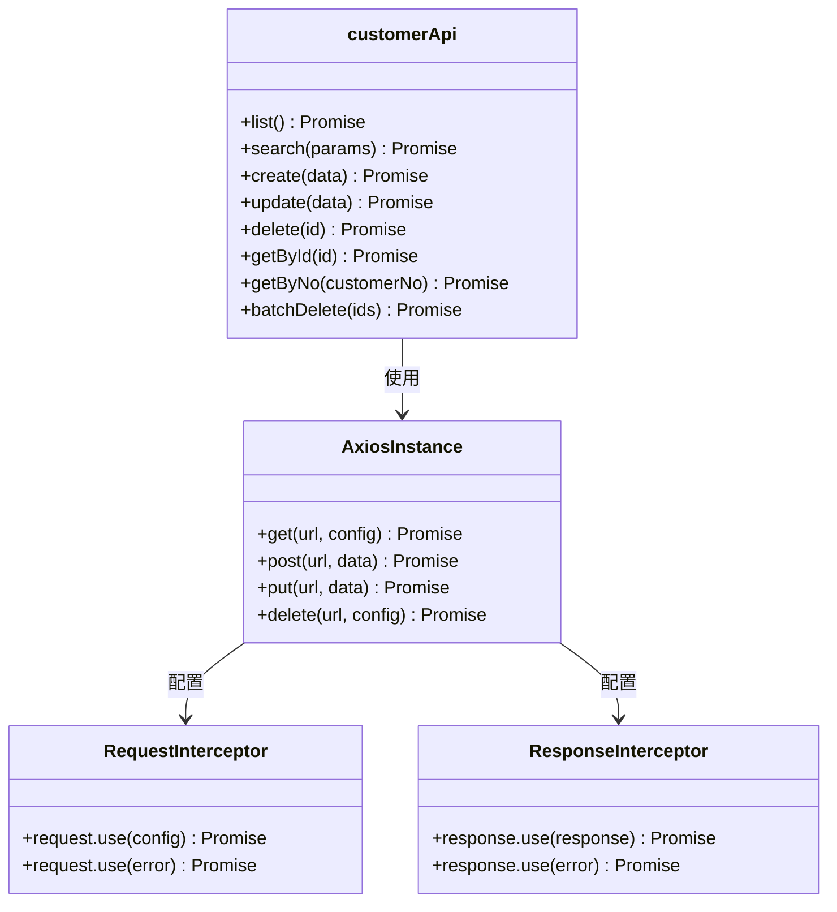
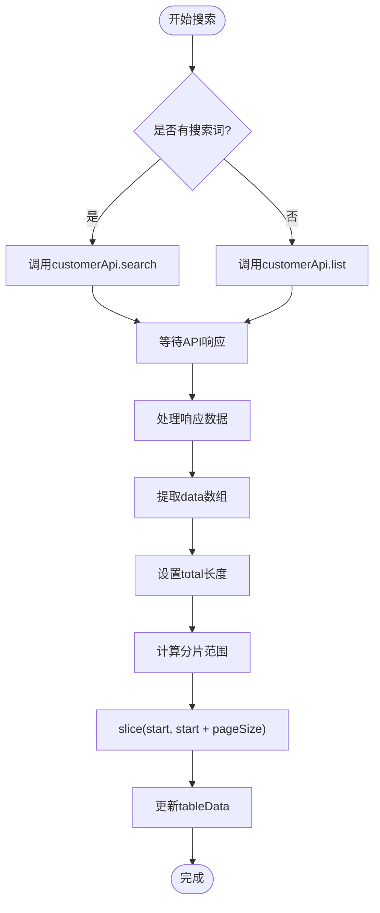
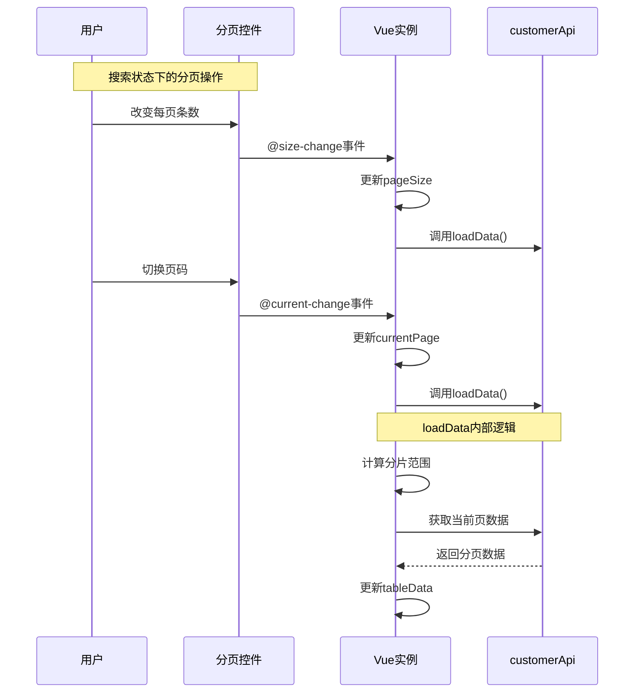
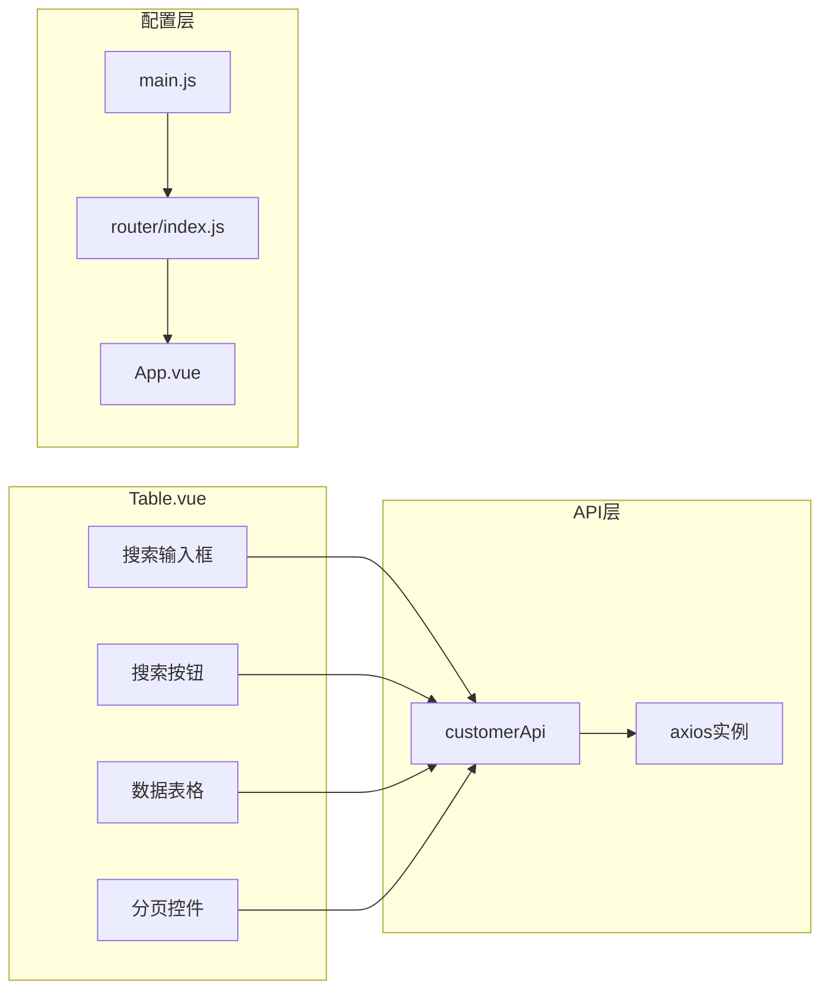

# 搜索过滤

<cite>
**本文档引用的文件**
- [Table.vue](file://src/views/Table.vue)
- [index.js](file://src/api/index.js)
- [main.js](file://src/main.js)
- [App.vue](file://src/App.vue)
- [index.js](file://src/router/index.js)
- [Home.vue](file://src/views/Home.vue)
- [Form.vue](file://src/views/Form.vue)
</cite>

## 目录
1. [简介](#简介)
2. [项目结构](#项目结构)
3. [核心组件](#核心组件)
4. [架构概览](#架构概览)
5. [详细组件分析](#详细组件分析)
6. [依赖分析](#依赖分析)
7. [性能考虑](#性能考虑)
8. [故障排除指南](#故障排除指南)
9. [结论](#结论)

## 简介

本项目实现了完整的搜索过滤功能，主要集中在客户管理模块中。该功能提供了直观的用户界面，支持关键词搜索、实时数据展示和分页导航。搜索功能采用Vue.js响应式数据绑定，结合Element UI组件库，为用户提供流畅的交互体验。

搜索过滤功能的核心特性包括：
- 实时搜索输入监听
- 回车键触发搜索
- 清空按钮重置搜索
- 分页与搜索状态的协同工作
- 错误处理和加载状态管理

## 项目结构

该项目采用标准的Vue.js单页应用架构，主要文件组织如下：



**图表来源**
- [main.js:1-18](file://src/main.js#L1-L18)
- [index.js:1-32](file://src/router/index.js#L1-L32)

**章节来源**
- [main.js:1-18](file://src/main.js#L1-L18)
- [index.js:1-32](file://src/router/index.js#L1-L32)

## 核心组件

搜索过滤功能主要由以下核心组件构成：

### 搜索输入组件
- **El-Input组件**：提供文本输入功能，支持清空和回车事件
- **双向数据绑定**：使用v-model绑定searchName数据属性
- **事件处理**：@keyup.enter.native和@clear事件监听

### 数据表格组件
- **El-Table**：展示搜索结果数据
- **加载状态**：v-loading指令控制加载指示器
- **数据渲染**：基于tableData属性动态渲染

### 分页组件
- **El-Pagination**：提供分页导航功能
- **参数绑定**：current-page、page-size等属性绑定
- **事件处理**：@size-change和@current-change事件

**章节来源**
- [Table.vue:8-18](file://src/views/Table.vue#L8-L18)
- [Table.vue:23-48](file://src/views/Table.vue#L23-L48)
- [Table.vue:50-60](file://src/views/Table.vue#L50-L60)

## 架构概览

搜索过滤功能的整体架构采用分层设计，从用户界面到数据访问形成清晰的层次结构：



**图表来源**
- [Table.vue:99-208](file://src/views/Table.vue#L99-L208)
- [index.js:45-54](file://src/api/index.js#L45-L54)

## 详细组件分析

### 搜索输入框实现

搜索输入框是整个搜索功能的核心交互组件，采用了多种用户友好的特性：

#### 输入监听机制
- **实时监听**：通过v-model实现双向数据绑定，自动同步输入值
- **事件绑定**：@keyup.enter.native监听回车键事件
- **清空功能**：@clear事件处理清空按钮点击

#### 交互逻辑设计


**图表来源**
- [Table.vue:8-18](file://src/views/Table.vue#L8-L18)
- [Table.vue:136-154](file://src/views/Table.vue#L136-L154)

#### 数据流处理
搜索功能的数据流遵循以下模式：
1. 用户输入触发数据绑定更新
2. loadData方法根据是否有搜索词决定调用路径
3. API层处理请求并返回数据
4. Vue实例更新本地状态和UI

**章节来源**
- [Table.vue:8-18](file://src/views/Table.vue#L8-L18)
- [Table.vue:136-154](file://src/views/Table.vue#L136-L154)

### 搜索API调用机制

搜索功能通过customerApi对象实现，该对象封装了所有客户相关的API操作：

#### API接口定义


**图表来源**
- [index.js:45-54](file://src/api/index.js#L45-L54)
- [index.js:10-31](file://src/api/index.js#L10-L31)

#### 关键词传递机制
搜索API调用的关键流程：
1. **参数构建**：将searchName作为{name}参数传递
2. **URL构造**：使用/customer/search端点
3. **HTTP请求**：GET方法携带查询参数
4. **响应处理**：Axios响应拦截器统一处理

**章节来源**
- [index.js:45-54](file://src/api/index.js#L45-L54)
- [index.js:10-31](file://src/api/index.js#L10-L31)

### 搜索结果处理

搜索结果的处理逻辑体现了Vue.js响应式编程的优势：

#### 数据处理流程


**图表来源**
- [Table.vue:136-154](file://src/views/Table.vue#L136-L154)

#### 分页参数重置逻辑
搜索状态下分页参数的重置策略：
- **currentPage重置**：每次搜索时自动回到第1页
- **pageSize保持不变**：保留用户选择的每页条数
- **total更新**：根据搜索结果数量更新总条目数

**章节来源**
- [Table.vue:136-154](file://src/views/Table.vue#L136-L154)

### 分页协作机制

分页组件与搜索功能的深度集成确保了良好的用户体验：

#### 分页事件处理


**图表来源**
- [Table.vue:155-162](file://src/views/Table.vue#L155-L162)

#### 性能优化策略
分页与搜索的协作实现了以下优化：
- **按需加载**：只加载当前页的数据
- **内存优化**：避免一次性加载所有数据
- **响应式更新**：局部更新UI，提升性能

**章节来源**
- [Table.vue:155-162](file://src/views/Table.vue#L155-L162)

## 依赖分析

搜索过滤功能涉及多个层面的依赖关系：

### 外部依赖
- **Vue.js 2.7.16**：核心框架，提供响应式数据绑定
- **Element UI 2.15.14**：UI组件库，提供搜索输入框、表格等组件
- **Axios**：HTTP客户端，处理API请求

### 内部依赖关系


**图表来源**
- [Table.vue:99-208](file://src/views/Table.vue#L99-L208)
- [index.js:45-54](file://src/api/index.js#L45-L54)
- [main.js:1-18](file://src/main.js#L1-L18)

**章节来源**
- [Table.vue:99-208](file://src/views/Table.vue#L99-L208)
- [index.js:45-54](file://src/api/index.js#L45-L54)
- [main.js:1-18](file://src/main.js#L1-L18)

## 性能考虑

### 当前实现的性能特点

#### 优势
- **响应式更新**：Vue的响应式系统确保UI与数据的高效同步
- **按需加载**：分页机制避免一次性加载大量数据
- **错误处理**：完善的错误处理机制提升用户体验
- **加载状态**：v-loading指令提供明确的加载反馈

#### 潜在优化点
- **防抖处理**：缺少输入防抖，可能导致频繁的API调用
- **缓存机制**：未实现搜索结果缓存
- **并发控制**：未限制同时进行的API请求数量

### 性能优化建议

#### 防抖实现方案
```javascript
// 建议的防抖实现
debounce(func, delay) {
  let timer = null
  return function(...args) {
    clearTimeout(timer)
    timer = setTimeout(() => func.apply(this, args), delay)
  }
}

// 在loadData中使用
const debouncedLoadData = this.debounce(this.loadData, 300)
```

#### 缓存策略
- **结果缓存**：缓存最近的搜索结果
- **参数标识**：使用搜索词和分页参数作为缓存键
- **过期机制**：设置合理的缓存过期时间

## 故障排除指南

### 常见问题及解决方案

#### 搜索无结果
**问题描述**：输入关键词后没有显示任何结果
**可能原因**：
- API端点配置错误
- 网络连接问题
- 后端服务异常

**解决步骤**：
1. 检查浏览器开发者工具的网络面板
2. 验证API端点是否可达
3. 确认后端服务正常运行

#### 加载状态异常
**问题描述**：加载指示器不消失或持续显示
**可能原因**：
- API响应异常
- Promise错误处理不当
- 异步操作中断

**解决步骤**：
1. 检查loadData方法的finally块执行情况
2. 验证错误处理逻辑
3. 确认异步操作的完整执行

#### 分页功能失效
**问题描述**：分页控件无法正常切换页面
**可能原因**：
- 事件处理器绑定错误
- 数据状态更新异常
- API调用参数错误

**解决步骤**：
1. 检查handleSizeChange和handlePageChange方法
2. 验证currentPage和pageSize的状态更新
3. 确认API调用的参数传递

**章节来源**
- [Table.vue:136-154](file://src/views/Table.vue#L136-L154)
- [Table.vue:155-162](file://src/views/Table.vue#L155-L162)

## 结论

搜索过滤功能在本项目中实现了完整的用户需求，具有以下特点：

### 成功实现的功能
- **直观的用户界面**：基于Element UI的搜索输入框提供良好的用户体验
- **响应式数据处理**：Vue的响应式系统确保数据与UI的实时同步
- **完整的错误处理**：提供完善的错误处理和用户反馈机制
- **高效的分页协作**：搜索与分页的无缝集成提升了性能表现

### 可改进的方向
- **防抖优化**：添加输入防抖机制减少不必要的API调用
- **缓存策略**：实现搜索结果缓存提升重复搜索的性能
- **高级搜索**：扩展多条件筛选和高级搜索功能
- **性能监控**：添加搜索性能指标监控

### 技术架构优势
- **清晰的分层设计**：从UI到API的层次化架构便于维护
- **模块化的组件设计**：独立的Vue组件便于复用和测试
- **标准化的API接口**：统一的API调用模式便于扩展

该搜索过滤功能为后续的功能扩展奠定了良好的基础，特别是防抖处理、缓存机制和高级搜索功能的实现将显著提升用户体验和系统性能。