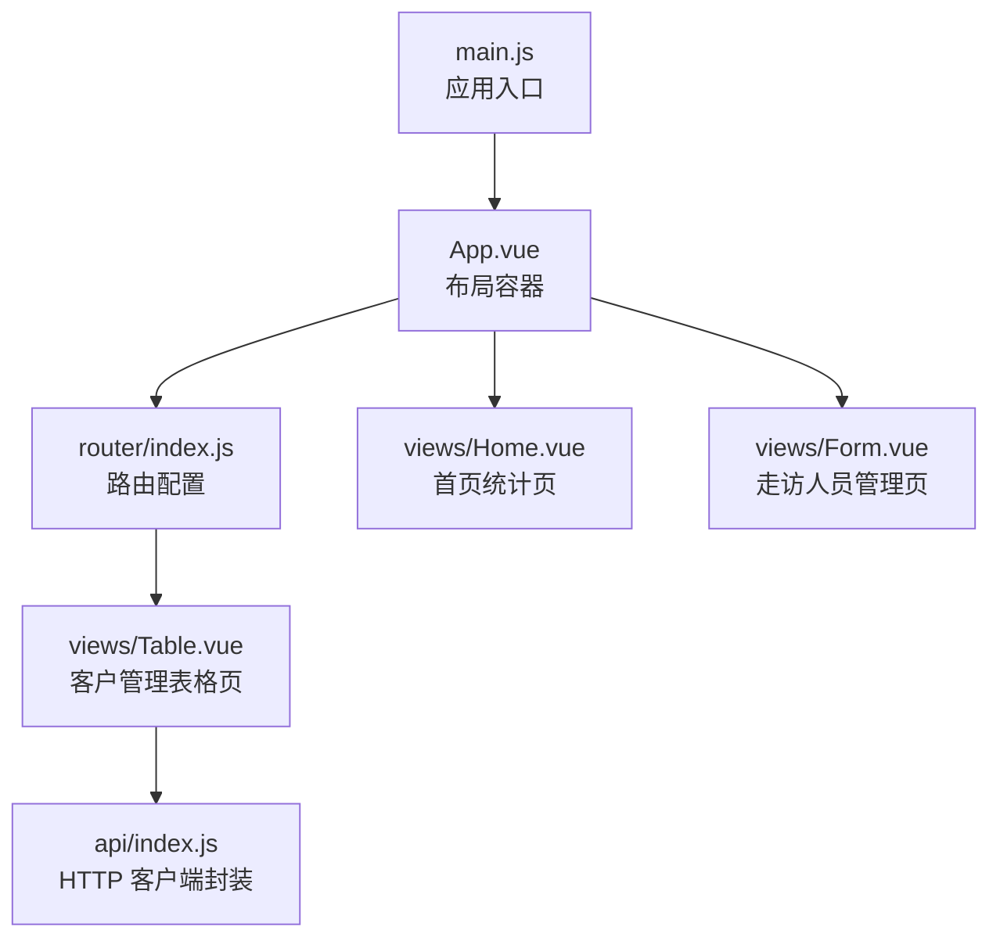
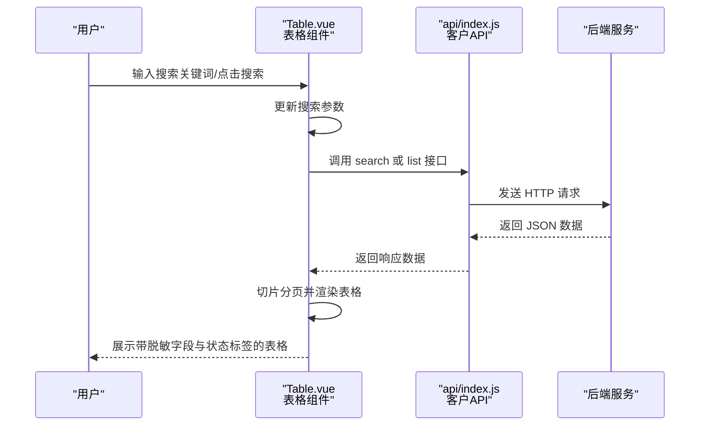
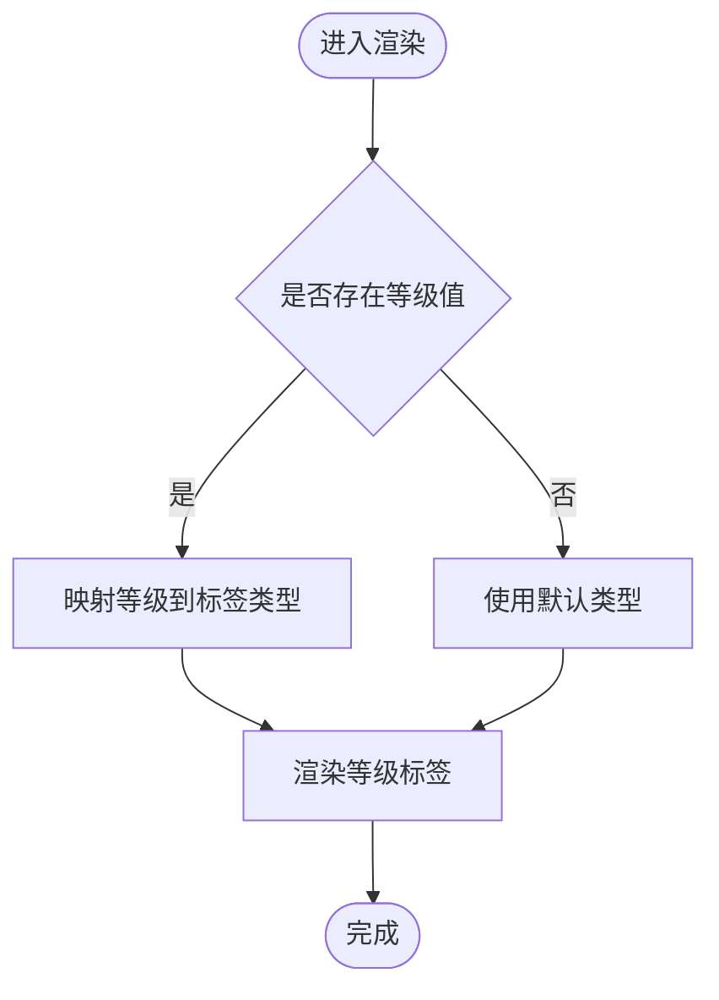
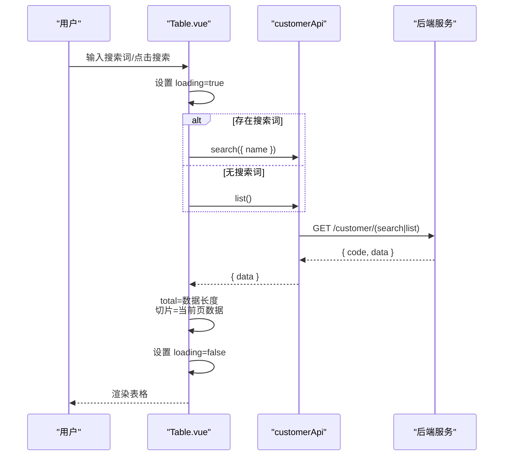
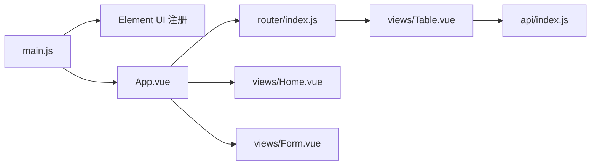

# 数据表格展示

<cite>
**本文档引用的文件**
- [Table.vue](file://src/views/Table.vue)
- [App.vue](file://src/App.vue)
- [main.js](file://src/main.js)
- [index.js](file://src/api/index.js)
- [index.js](file://src/router/index.js)
- [Home.vue](file://src/views/Home.vue)
- [Form.vue](file://src/views/Form.vue)
</cite>

## 目录
1. [简介](#简介)
2. [项目结构](#项目结构)
3. [核心组件](#核心组件)
4. [架构总览](#架构总览)
5. [详细组件分析](#详细组件分析)
6. [依赖关系分析](#依赖关系分析)
7. [性能考虑](#性能考虑)
8. [故障排除指南](#故障排除指南)
9. [结论](#结论)

## 简介
本文件聚焦于项目中基于 Element UI 的数据表格展示功能，围绕客户管理页面的表格组件进行深入解析。内容涵盖：
- 表格列定义与字段含义
- 数据绑定与显示格式化（含敏感信息脱敏）
- 状态标签渲染与样式配置
- 分页与加载状态处理
- 性能优化与大数据量处理建议

## 项目结构
该项目采用 Vue 2 + Element UI 技术栈，表格功能位于“客户管理”页面，通过路由 `/table` 访问。整体结构如下：

图表来源
- [main.js:1-18](file://src/main.js#L1-L18)
- [App.vue:1-258](file://src/App.vue#L1-L258)
- [index.js:1-32](file://src/router/index.js#L1-L32)
- [Table.vue:1-214](file://src/views/Table.vue#L1-L214)
- [index.js:1-110](file://src/api/index.js#L1-L110)
- [Home.vue:1-175](file://src/views/Home.vue#L1-L175)
- [Form.vue:1-143](file://src/views/Form.vue#L1-L143)

章节来源
- [main.js:1-18](file://src/main.js#L1-L18)
- [App.vue:1-258](file://src/App.vue#L1-L258)
- [index.js:1-32](file://src/router/index.js#L1-L32)

## 核心组件
- 客户管理表格页：负责展示客户列表、支持搜索、分页、新增/编辑/删除等操作。
- API 封装层：统一处理请求与响应拦截，提供客户管理接口方法。
- 应用布局与主题：提供暗色主题样式覆盖，确保表格在深色背景下的可读性。

章节来源
- [Table.vue:1-214](file://src/views/Table.vue#L1-L214)
- [index.js:1-110](file://src/api/index.js#L1-L110)
- [App.vue:127-257](file://src/App.vue#L127-L257)

## 架构总览
下图展示了从用户交互到数据渲染的整体流程：

图表来源
- [Table.vue:136-154](file://src/views/Table.vue#L136-L154)
- [index.js:45-54](file://src/api/index.js#L45-L54)

## 详细组件分析

### 表格列定义与字段含义
表格列由多个列组件构成，每个列绑定不同的数据属性并具备特定展示逻辑。以下为各列的字段与含义说明：

- ID：展示唯一标识，宽度固定，便于定位与调试。
- 客户编号：展示客户唯一编号，宽度固定，用于业务识别。
- 姓名：展示脱敏后的姓名字段（nameMasked），保护隐私。
- 手机号：展示脱敏后的手机号字段（phoneMasked），保护隐私。
- 身份证号：展示脱敏后的身份证号字段（idCardMasked），保护隐私。
- 客户等级：根据等级值渲染不同类型的标签，映射关系见“等级类型映射”。
- AUM(万元)：展示资产总额（AUM）数值，单位为万元。
- 状态：根据状态值渲染“启用/禁用”标签，颜色区分状态。
- 操作：包含“编辑”和“删除”按钮，触发相应操作。

章节来源
- [Table.vue:23-48](file://src/views/Table.vue#L23-L48)

### 数据绑定与显示格式化
- 数据绑定：表格数据通过 `:data="tableData"` 绑定，分页通过 `currentPage`、`pageSize` 和 `total` 控制。
- 显示格式化：
  - 敏感信息脱敏：姓名、手机号、身份证号均使用脱敏字段（nameMasked、phoneMasked、idCardMasked）进行展示，避免直接暴露原始敏感信息。
  - 等级标签渲染：通过 `getLevelType` 方法将等级字符串映射为标签类型，再在模板中使用 `el-tag` 渲染。
  - 状态标签渲染：根据状态值（1/0）渲染“启用/禁用”，并使用不同颜色区分。
- 分页与切片：前端分页通过计算起始索引并使用数组切片方式截取当前页数据，避免一次性渲染全部数据。

章节来源
- [Table.vue:103-127](file://src/views/Table.vue#L103-L127)
- [Table.vue:132-135](file://src/views/Table.vue#L132-L135)
- [Table.vue:136-154](file://src/views/Table.vue#L136-L154)

### 等级类型映射与状态标签渲染
- 等级类型映射：普通/富嘉/钻石/私行 对应不同标签类型，用于视觉区分等级。
- 状态标签渲染：状态值为 1 时渲染“启用”，0 时渲染“禁用”，并使用不同颜色标识。

图表来源
- [Table.vue:132-135](file://src/views/Table.vue#L132-L135)

章节来源
- [Table.vue:132-135](file://src/views/Table.vue#L132-L135)
- [Table.vue:35-41](file://src/views/Table.vue#L35-L41)

### 表格样式配置与主题适配
- 斑马纹：通过 `stripe` 属性开启，提升长列表的可读性。
- 加载状态：通过 `v-loading="loading"` 在数据加载期间显示加载指示器。
- 主题适配：应用内提供大量 Element UI 暗色主题覆盖样式，确保表格在深色背景下具有良好的对比度与可读性。

章节来源
- [Table.vue:23](file://src/views/Table.vue#L23)
- [App.vue:127-257](file://src/App.vue#L127-L257)

### 分页与搜索流程
- 搜索：支持按姓名搜索，输入框支持清空与回车触发，调用搜索接口或列表接口。
- 分页：支持切换每页条数与页码，每次变更均重新加载数据并切片渲染。
- 数据加载：统一通过 `loadData` 方法控制，异常时弹出错误消息，最终关闭加载状态。

图表来源
- [Table.vue:136-154](file://src/views/Table.vue#L136-L154)
- [index.js:45-54](file://src/api/index.js#L45-L54)

章节来源
- [Table.vue:136-154](file://src/views/Table.vue#L136-L154)
- [index.js:45-54](file://src/api/index.js#L45-L54)

### 表单弹窗与 CRUD 操作
- 新增/编辑：打开对话框，表单字段与编辑数据双向绑定；校验通过后调用对应接口，成功后刷新表格。
- 删除：二次确认后调用删除接口，成功后刷新表格。
- 表单字段：包含客户编号、姓名、手机号、身份证号、客户等级、状态等。

章节来源
- [Table.vue:163-206](file://src/views/Table.vue#L163-L206)
- [Table.vue:64-94](file://src/views/Table.vue#L64-L94)

### 与其他页面的关联
- 首页统计页：通过并行请求多个 API 获取统计数据，体现系统数据概览能力。
- 走访人员管理页：同样使用 Element UI 表格组件，展示不同业务实体的数据。

章节来源
- [Home.vue:132-147](file://src/views/Home.vue#L132-L147)
- [Form.vue:33-51](file://src/views/Form.vue#L33-L51)

## 依赖关系分析
- 组件依赖：Table.vue 依赖 customerApi 进行数据访问；依赖 Element UI 的表格、分页、对话框、表单等组件。
- 应用依赖：main.js 引入 Element UI 并全局注册；App.vue 提供暗色主题样式覆盖。
- 路由依赖：router/index.js 将 Table.vue 作为 `/table` 路由组件。

图表来源
- [main.js:1-18](file://src/main.js#L1-L18)
- [App.vue:1-258](file://src/App.vue#L1-L258)
- [index.js:1-32](file://src/router/index.js#L1-L32)
- [Table.vue:1-214](file://src/views/Table.vue#L1-L214)
- [index.js:1-110](file://src/api/index.js#L1-L110)
- [Home.vue:1-175](file://src/views/Home.vue#L1-L175)
- [Form.vue:1-143](file://src/views/Form.vue#L1-L143)

章节来源
- [main.js:1-18](file://src/main.js#L1-L18)
- [App.vue:1-258](file://src/App.vue#L1-L258)
- [index.js:1-32](file://src/router/index.js#L1-L32)
- [Table.vue:1-214](file://src/views/Table.vue#L1-L214)
- [index.js:1-110](file://src/api/index.js#L1-L110)

## 性能考虑
- 前端分页策略：当前实现为一次性拉取全量数据并在前端切片渲染，适合中小规模数据集。对于大规模数据，建议改为后端分页（携带 page/size 参数），减少前端内存占用与渲染压力。
- 列宽与渲染：固定列宽有助于稳定渲染性能；对超长文本建议使用省略号或悬浮提示，避免布局抖动。
- 加载状态：合理使用 `v-loading`，在复杂计算或网络请求期间提供反馈，提升用户体验。
- 样式优化：深色主题下注意对比度与可读性，避免过多层级阴影导致视觉疲劳。
- 大数据量处理建议：
  - 后端分页：接口支持 page/size 参数，前端仅请求当前页数据。
  - 虚拟滚动：在极大数据量场景下可考虑虚拟滚动方案（需引入第三方库或自研）。
  - 缓存策略：对不频繁变化的数据进行缓存，减少重复请求。
  - 异步渲染：对首屏以外的次要内容采用懒加载策略。

## 故障排除指南
- 数据加载失败：当接口返回非 200 状态或抛出异常时，会弹出错误消息。检查网络请求与后端接口返回结构。
- 表单校验失败：编辑表单存在必填项校验，若未通过则阻止提交。检查表单项规则与输入内容。
- 删除确认：删除操作需要二次确认，避免误删。确认后调用删除接口并刷新列表。
- 搜索无结果：确认搜索关键词与后端接口是否匹配，检查接口返回数据结构。

章节来源
- [Table.vue:149-153](file://src/views/Table.vue#L149-L153)
- [Table.vue:174-189](file://src/views/Table.vue#L174-L189)
- [Table.vue:191-206](file://src/views/Table.vue#L191-L206)

## 结论
该表格组件通过清晰的列定义、合理的数据脱敏与标签渲染，结合分页与加载状态，提供了良好的用户体验。在当前数据规模下运行稳定；针对更大体量数据，建议采用后端分页与虚拟滚动等优化手段，进一步提升性能与稳定性。