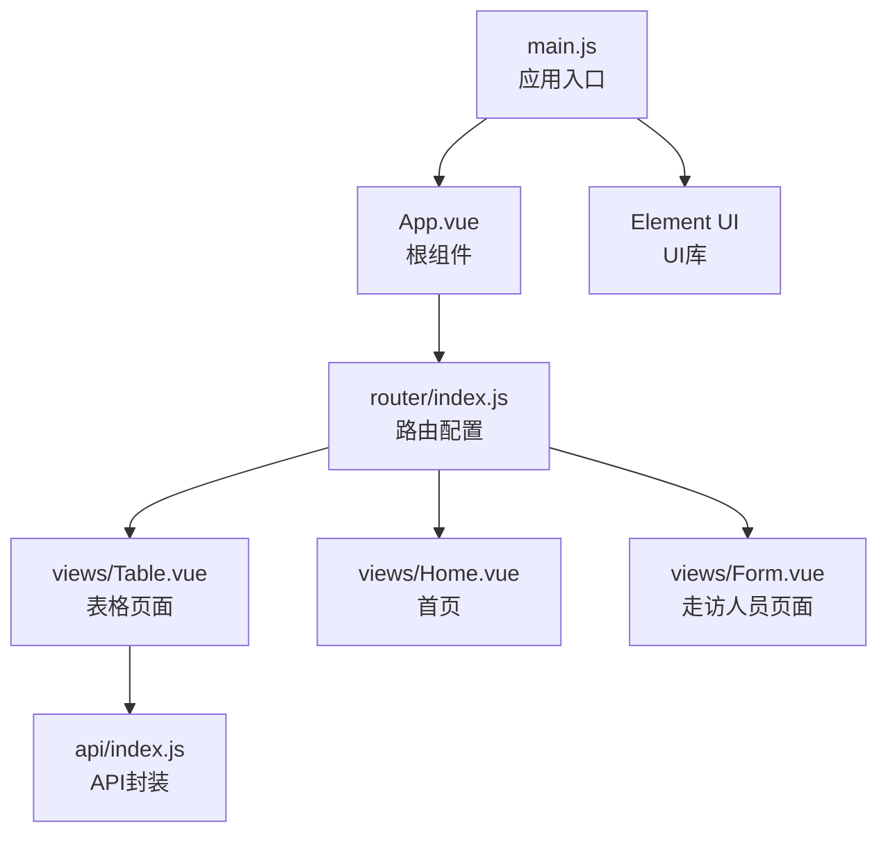
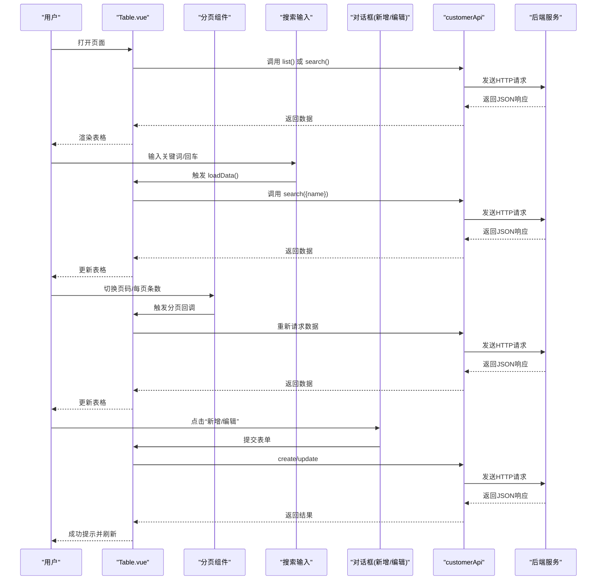
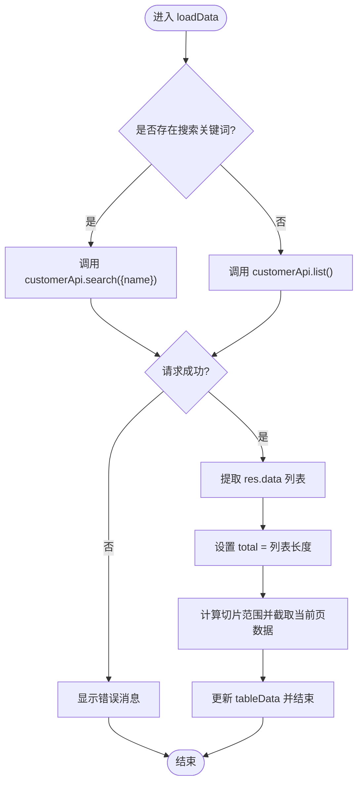
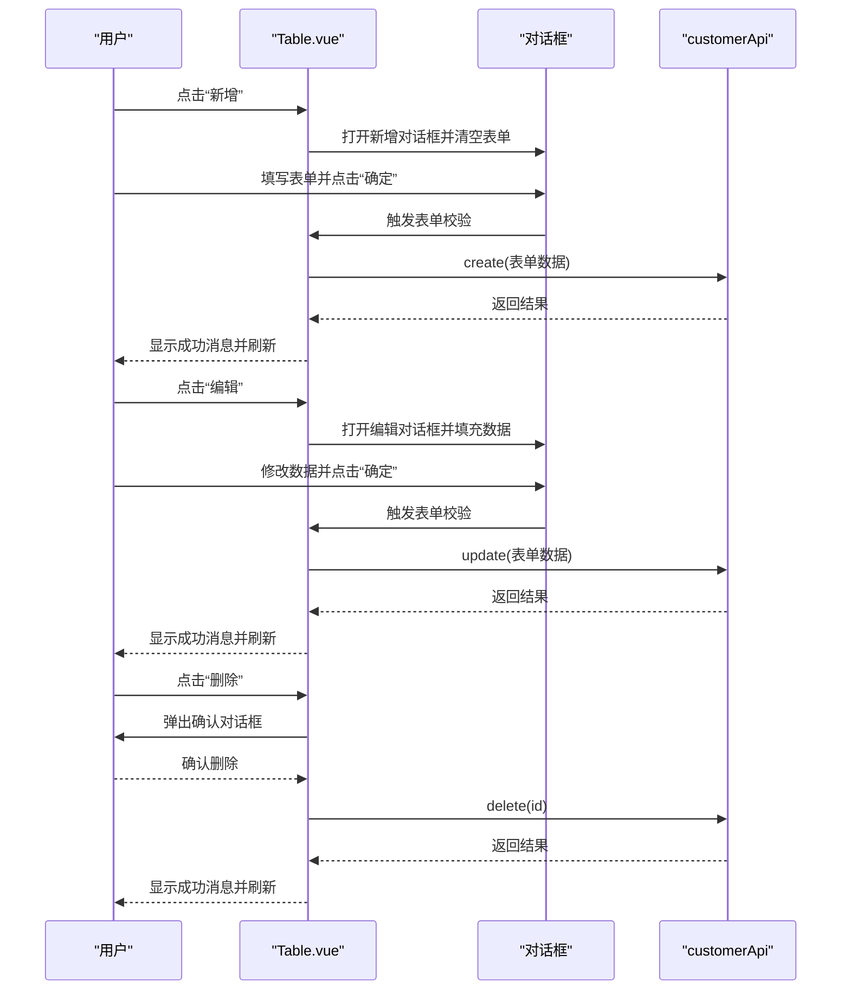
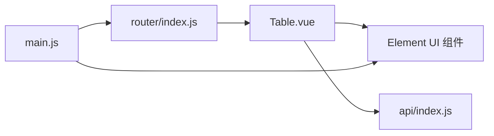

# 表格组件

<cite>
**本文引用的文件**
- [Table.vue](file://src/views/Table.vue)
- [index.js（路由）](file://src/router/index.js)
- [index.js（API封装）](file://src/api/index.js)
- [App.vue](file://src/App.vue)
- [main.js](file://src/main.js)
- [Home.vue](file://src/views/Home.vue)
- [Form.vue](file://src/views/Form.vue)
- [package.json](file://package.json)
</cite>

## 目录
1. [简介](#简介)
2. [项目结构](#项目结构)
3. [核心组件](#核心组件)
4. [架构总览](#架构总览)
5. [详细组件分析](#详细组件分析)
6. [依赖关系分析](#依赖关系分析)
7. [性能考虑](#性能考虑)
8. [故障排查指南](#故障排查指南)
9. [结论](#结论)
10. [附录](#附录)

## 简介
本文件围绕表格组件Table.vue展开，系统性解析客户信息管理的完整实现，涵盖：
- 数据表格展示与列定义
- 分页功能与每页数量控制
- 搜索过滤与实时查询机制
- CRUD操作（新增、编辑、删除）
- 数据绑定与排序机制
- 性能优化与大数据量处理建议
- 用户体验改进方案

该组件基于Vue 2 + Element UI构建，通过统一的API封装层访问后端接口，采用懒加载路由与暗色主题风格，提供完整的客户数据管理能力。

## 项目结构
该项目采用典型的Vue SPA结构，Table.vue位于views目录中，配合路由按需加载；API封装在独立模块中，便于复用与维护。

图表来源
- [main.js:1-18](file://src/main.js#L1-L18)
- [App.vue:1-50](file://src/App.vue#L1-L50)
- [router/index.js:1-32](file://src/router/index.js#L1-L32)
- [Table.vue:1-96](file://src/views/Table.vue#L1-L96)
- [api/index.js:1-110](file://src/api/index.js#L1-L110)

章节来源
- [main.js:1-18](file://src/main.js#L1-L18)
- [router/index.js:1-32](file://src/router/index.js#L1-L32)
- [Table.vue:1-96](file://src/views/Table.vue#L1-L96)
- [api/index.js:1-110](file://src/api/index.js#L1-L110)

## 核心组件
- 表格页面组件：负责渲染表格、分页、搜索、新增/编辑弹窗以及CRUD交互。
- API封装模块：集中管理HTTP请求、拦截器与各业务域的REST接口。
- 路由配置：按需加载Table.vue，确保首屏性能。
- 应用根组件：提供暗色主题与菜单导航。

章节来源
- [Table.vue:101-208](file://src/views/Table.vue#L101-L208)
- [api/index.js:44-54](file://src/api/index.js#L44-L54)
- [router/index.js:13-17](file://src/router/index.js#L13-L17)
- [App.vue:1-50](file://src/App.vue#L1-L50)

## 架构总览
下图展示了从用户交互到后端请求的整体调用链路，以及表格组件内部的数据流与事件流。

图表来源
- [Table.vue:136-154](file://src/views/Table.vue#L136-L154)
- [Table.vue:155-162](file://src/views/Table.vue#L155-L162)
- [Table.vue:163-172](file://src/views/Table.vue#L163-L172)
- [Table.vue:173-190](file://src/views/Table.vue#L173-L190)
- [api/index.js:44-54](file://src/api/index.js#L44-L54)

## 详细组件分析

### 表格列定义与数据绑定
- 列定义：包含基础字段（ID、客户编号、姓名、手机号、身份证号）、业务字段（客户等级、AUM）、状态字段与操作列。
- 数据绑定：表格数据来自本地状态tableData，通过v-for渲染；部分列使用作用域插槽进行格式化显示（如状态标签、等级标签）。
- 掩码字段：姓名、手机号、身份证号等敏感字段使用掩码显示，提升安全性与隐私保护。

章节来源
- [Table.vue:23-48](file://src/views/Table.vue#L23-L48)

### 分页组件配置与数据加载策略
- 配置项：当前页、页大小数组、每页条数、布局（total, sizes, prev, pager, next）、总条目数。
- 加载策略：每次分页或尺寸变更时触发loadData，根据当前页与每页条数计算切片范围，仅返回当前页数据。
- 注意事项：当前实现为前端分页（后端返回全量数据），total直接取列表长度；若后端支持分页，应改为后端返回total与分页数据。

图表来源
- [Table.vue:136-154](file://src/views/Table.vue#L136-L154)

章节来源
- [Table.vue:50-60](file://src/views/Table.vue#L50-L60)
- [Table.vue:136-154](file://src/views/Table.vue#L136-L154)

### 搜索过滤与实时查询机制
- 绑定与触发：搜索输入框绑定searchName，支持清空与回车键触发loadData。
- 查询逻辑：当存在关键词时调用search接口，否则走list接口；搜索结果同样参与前端分页。
- 实时性：回车即查，清空即恢复全量列表，保证交互即时反馈。

章节来源
- [Table.vue:8-18](file://src/views/Table.vue#L8-L18)
- [Table.vue:136-154](file://src/views/Table.vue#L136-L154)
- [api/index.js](file://src/api/index.js#L49)

### CRUD操作与交互流程
- 新增：打开对话框，清空表单，提交时调用create接口，成功后关闭对话框并刷新列表。
- 编辑：复制选中行数据到表单，提交时调用update接口，成功后关闭对话框并刷新列表。
- 删除：二次确认对话框，确认后调用delete接口，成功后刷新列表。
- 表单校验：使用Element UI表单规则进行必填校验，校验失败阻止提交。

图表来源
- [Table.vue:163-172](file://src/views/Table.vue#L163-L172)
- [Table.vue:173-190](file://src/views/Table.vue#L173-L190)
- [Table.vue:191-206](file://src/views/Table.vue#L191-L206)
- [api/index.js:50-52](file://src/api/index.js#L50-L52)

章节来源
- [Table.vue:163-206](file://src/views/Table.vue#L163-L206)
- [api/index.js:44-54](file://src/api/index.js#L44-L54)

### 数据绑定与排序机制
- 数据绑定：表格数据tableData直接绑定到el-table；状态字段通过计算映射为标签类型与文案。
- 排序机制：当前未实现列级排序；如需排序，可在el-table-column上开启sortable，并在方法中处理排序参数传递给后端。

章节来源
- [Table.vue:132-135](file://src/views/Table.vue#L132-L135)
- [Table.vue:23-48](file://src/views/Table.vue#L23-L48)

### 对话框与表单校验
- 对话框：标题随操作动态变化，表单字段覆盖客户编号、姓名、手机号、身份证号、客户等级、状态。
- 校验规则：客户编号与姓名为必填；提交前统一校验，失败则提示错误。
- 提交行为：区分新增与编辑，分别调用对应接口并刷新列表。

章节来源
- [Table.vue:63-94](file://src/views/Table.vue#L63-L94)
- [Table.vue:113-125](file://src/views/Table.vue#L113-L125)
- [Table.vue:173-190](file://src/views/Table.vue#L173-L190)

## 依赖关系分析
- 组件依赖：Table.vue依赖customerApi进行数据访问，依赖Element UI组件（表格、分页、对话框、表单、标签、按钮等）。
- 路由依赖：路由按需加载Table.vue，避免首屏资源压力。
- 外部依赖：axios用于HTTP通信，Element UI提供UI组件库。

图表来源
- [Table.vue](file://src/views/Table.vue#L99)
- [api/index.js:1-110](file://src/api/index.js#L1-L110)
- [router/index.js:13-17](file://src/router/index.js#L13-L17)
- [main.js:1-18](file://src/main.js#L1-L18)

章节来源
- [Table.vue](file://src/views/Table.vue#L99)
- [api/index.js:1-110](file://src/api/index.js#L1-L110)
- [router/index.js:13-17](file://src/router/index.js#L13-L17)
- [main.js:1-18](file://src/main.js#L1-L18)
- [package.json:10-16](file://package.json#L10-L16)

## 性能考虑
- 当前实现为前端分页：后端返回全量数据，前端按页切片。优点是实现简单，缺点是大数据量时内存占用高、首屏渲染慢。
- 优化建议：
  - 后端分页：让后端返回total与分页数据，前端仅渲染当前页，显著降低内存与网络压力。
  - 虚拟滚动：对于超大表格，可引入虚拟滚动以减少DOM节点数量。
  - 懒加载：结合路由懒加载与图片/复杂列内容的延迟渲染。
  - 缓存策略：对搜索结果与常用筛选条件进行缓存，减少重复请求。
  - 防抖搜索：对搜索输入增加防抖，避免频繁请求。
  - 列宽自适应：合理设置列宽，避免横向滚动带来的性能问题。

[本节为通用性能指导，不直接分析具体文件]

## 故障排查指南
- 数据加载失败：检查API封装中的响应拦截器与错误提示，确认后端接口可用与网络连通性。
- 搜索无结果：确认search接口参数与后端一致，检查关键词是否为空。
- 分页异常：确认total与切片逻辑，避免页码越界；若改为后端分页，需同步修改total来源。
- 表单校验失败：检查表单规则与必填字段，确保提交前完成校验。
- 删除确认：确认二次确认对话框逻辑，避免误删。

章节来源
- [Table.vue:149-150](file://src/views/Table.vue#L149-L150)
- [Table.vue:191-206](file://src/views/Table.vue#L191-L206)
- [api/index.js:20-31](file://src/api/index.js#L20-L31)

## 结论
Table.vue提供了完整的客户信息管理界面，具备搜索、分页、CRUD等核心功能。当前实现简洁清晰，适合中小规模数据场景。建议后续引入后端分页与虚拟滚动等优化手段，以支撑更大体量的数据与更佳的用户体验。

[本节为总结性内容，不直接分析具体文件]

## 附录

### API接口一览（与表格相关）
- 获取列表：GET /customer/list
- 按名称搜索：GET /customer/search?name=xxx
- 新增客户：POST /customer
- 更新客户：PUT /customer
- 删除客户：DELETE /customer/{id}

章节来源
- [api/index.js:44-54](file://src/api/index.js#L44-L54)

### 路由与页面映射
- 路由路径：/table
- 页面组件：按需加载Table.vue
- 导航入口：App.vue侧边栏“客户管理”

章节来源
- [router/index.js:13-17](file://src/router/index.js#L13-L17)
- [App.vue:19-22](file://src/App.vue#L19-L22)