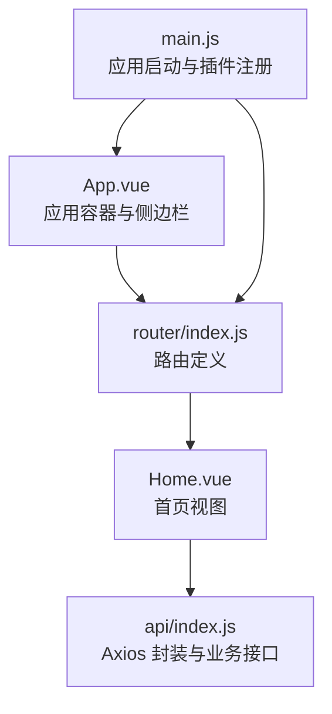
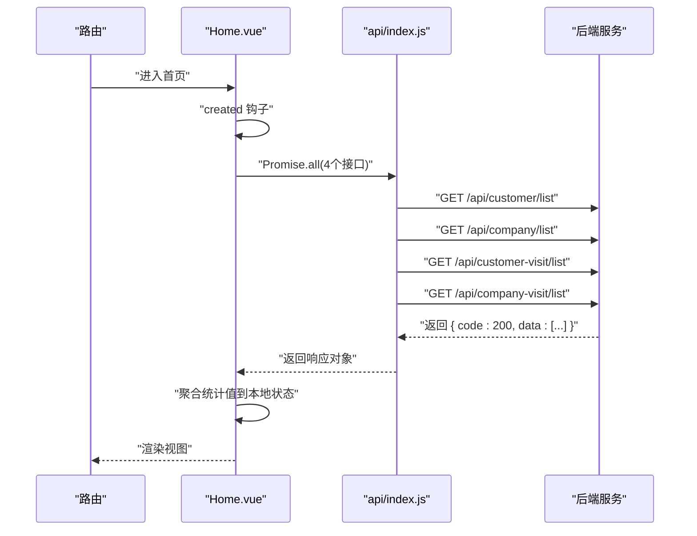
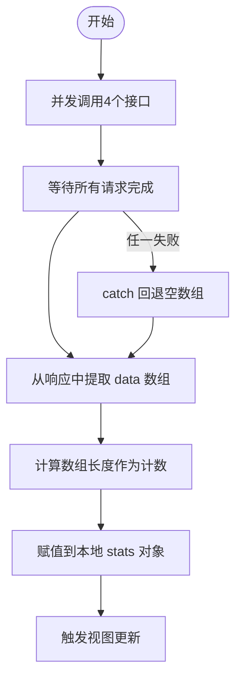
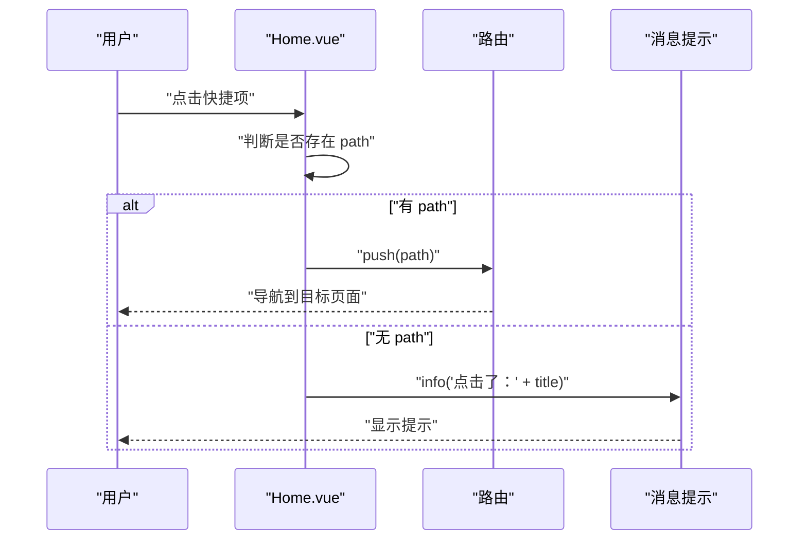
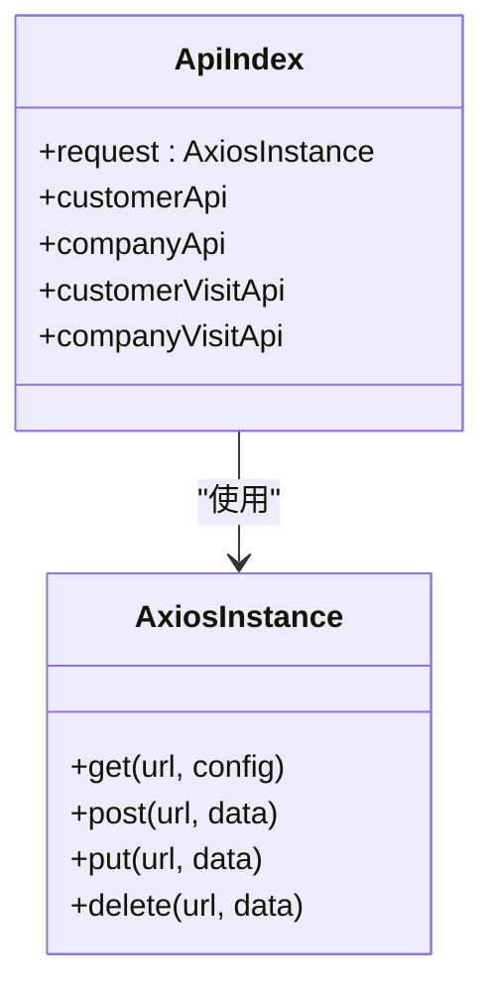
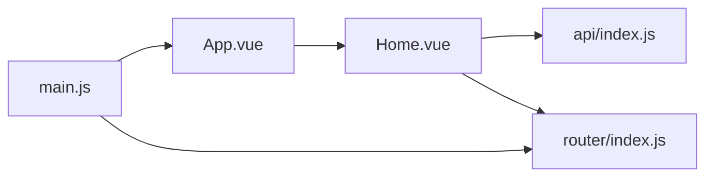

# 首页组件

<cite>
**本文引用的文件列表**
- [Home.vue](file://src/views/Home.vue)
- [index.js](file://src/api/index.js)
- [index.js](file://src/router/index.js)
- [main.js](file://src/main.js)
- [App.vue](file://src/App.vue)
- [package.json](file://package.json)
</cite>

## 目录
1. [简介](#简介)
2. [项目结构](#项目结构)
3. [核心组件](#核心组件)
4. [架构总览](#架构总览)
5. [详细组件分析](#详细组件分析)
6. [依赖关系分析](#依赖关系分析)
7. [性能考虑](#性能考虑)
8. [故障排查指南](#故障排查指南)
9. [结论](#结论)
10. [附录](#附录)

## 简介
本文件聚焦于首页组件 Home.vue 的实现与使用，围绕以下目标展开：
- 数据统计面板：客户总数、公司总数、客户走访记录、公司走访记录的展示与计算逻辑
- 图表展示：当前版本未包含可视化图表，但提供了扩展空间与建议
- 快捷操作：四个快捷入口的布局、交互与路由跳转
- 数据获取流程：并行请求四个接口，统一聚合到本地状态
- 状态管理：组件内局部状态，无外部状态库
- 生命周期钩子：created 钩子触发初始化加载
- 错误处理与加载状态：异常捕获与降级处理
- 设计与体验：暗黑主题下的布局、颜色与可点击反馈

## 项目结构
首页组件位于 views 层，配合 API 封装、路由与应用入口共同构成页面渲染链路。整体采用 Vue 2 + Element UI 的前端技术栈，后端通过代理前缀访问。

**图表来源**
- [App.vue:1-50](file://src/App.vue#L1-L50)
- [index.js:1-32](file://src/router/index.js#L1-L32)
- [Home.vue:107-157](file://src/views/Home.vue#L107-L157)
- [index.js:1-110](file://src/api/index.js#L1-L110)
- [main.js:1-18](file://src/main.js#L1-L18)

**章节来源**
- [Home.vue:1-175](file://src/views/Home.vue#L1-L175)
- [index.js:1-110](file://src/api/index.js#L1-L110)
- [index.js:1-32](file://src/router/index.js#L1-L32)
- [main.js:1-18](file://src/main.js#L1-L18)
- [App.vue:1-258](file://src/App.vue#L1-L258)
- [package.json:1-29](file://package.json#L1-L29)

## 核心组件
- 统计卡片：四个统计项分别来自不同接口，使用 Element UI 卡片与栅格布局进行排列
- 快捷操作区：四个图标按钮，支持点击跳转或提示
- 系统信息区：展示框架版本、UI 版本、后端服务等静态信息
- 数据来源：通过 Axios 实例封装的业务接口并行获取

**章节来源**
- [Home.vue:1-175](file://src/views/Home.vue#L1-L175)

## 架构总览
首页组件的调用链路如下：路由匹配到首页 -> created 钩子触发数据加载 -> 并行请求四个接口 -> 成功时写入本地状态 -> 视图自动更新；快捷操作点击触发路由跳转或消息提示。

**图表来源**
- [Home.vue:128-147](file://src/views/Home.vue#L128-L147)
- [index.js:10-31](file://src/api/index.js#L10-L31)
- [index.js:45-87](file://src/api/index.js#L45-L87)

## 详细组件分析

### 组件结构与布局
- 使用 Element UI 的 Row/Col 栅格系统实现两行布局：统计卡片四列、快捷操作+系统信息组合
- 统计卡片采用 Flex 布局，左侧图标区域与右侧数值标签分离，便于扩展
- 快捷操作区为四列等宽，每个条目垂直居中显示图标与文字
- 系统信息区为纯文本列表，用于展示环境信息

**章节来源**
- [Home.vue:1-175](file://src/views/Home.vue#L1-L175)

### 数据统计面板
- 统计字段：客户总数、公司总数、客户走访记录、公司走访记录
- 计算逻辑：对各接口返回的 data 数组取长度作为计数
- 并行加载：使用 Promise.all 并发请求四个接口，提升首屏速度
- 异常容错：每个接口调用包裹 catch，失败时回退为空数组，避免单点失败影响整体

**图表来源**
- [Home.vue:132-147](file://src/views/Home.vue#L132-L147)

**章节来源**
- [Home.vue:112-127](file://src/views/Home.vue#L112-L127)
- [Home.vue:132-147](file://src/views/Home.vue#L132-L147)

### 快捷操作功能
- 快捷项定义：包含标题、图标、颜色与可选路径
- 点击行为：若存在 path 则通过 $router.push 跳转；否则弹出提示消息
- 交互反馈：鼠标悬停降低透明度，增强可点击感知

**图表来源**
- [Home.vue:148-154](file://src/views/Home.vue#L148-L154)
- [index.js:13-22](file://src/router/index.js#L13-L22)

**章节来源**
- [Home.vue:120-125](file://src/views/Home.vue#L120-L125)
- [Home.vue:148-154](file://src/views/Home.vue#L148-L154)

### 系统信息展示
- 展示内容：框架版本、UI 框架、后端服务、后端端口、主题
- 渲染方式：固定列表项，使用 Flex 布局在暗色背景下保持可读性

**章节来源**
- [Home.vue:74-102](file://src/views/Home.vue#L74-L102)

### 生命周期与数据获取
- created 钩子：组件创建完成后立即调用 loadStats 进行数据加载
- loadStats 方法：并发请求四个接口，聚合结果到本地状态
- 错误处理：catch 回退空数组，保证统计值至少为 0

**章节来源**
- [Home.vue:128-147](file://src/views/Home.vue#L128-L147)

### 与 API 服务层的集成
- Axios 实例：统一配置 baseURL 与超时时间，拦截器处理通用逻辑
- 接口封装：按模块导出多个 API 对象（客户、公司、走访等）
- 响应校验：响应拦截器检查 code 字段，非 200 抛出错误，便于上层统一处理

**图表来源**
- [index.js:1-110](file://src/api/index.js#L1-L110)

**章节来源**
- [index.js:1-110](file://src/api/index.js#L1-L110)

### 主题与样式
- 应用级暗黑主题：App.vue 中定义全局背景、边框与组件颜色
- 卡片与表格：针对 Element UI 组件进行暗色覆盖
- 首页卡片：统计卡片与快捷项使用独立 scoped 样式，确保视觉一致性

**章节来源**
- [App.vue:58-257](file://src/App.vue#L58-L257)
- [Home.vue:159-175](file://src/views/Home.vue#L159-L175)

## 依赖关系分析
- 组件依赖：Home.vue 依赖 api/index.js 提供的接口方法
- 路由依赖：Home.vue 通过 $router.push 导航至其他页面
- 应用依赖：main.js 注册 Element UI 插件，App.vue 提供全局样式

**图表来源**
- [Home.vue:108](file://src/views/Home.vue#L108)
- [index.js:1-110](file://src/api/index.js#L1-L110)
- [index.js:1-32](file://src/router/index.js#L1-L32)
- [main.js:1-18](file://src/main.js#L1-L18)
- [App.vue:1-50](file://src/App.vue#L1-L50)

**章节来源**
- [Home.vue:108](file://src/views/Home.vue#L108)
- [index.js:1-110](file://src/api/index.js#L1-L110)
- [index.js:1-32](file://src/router/index.js#L1-L32)
- [main.js:1-18](file://src/main.js#L1-L18)
- [App.vue:1-50](file://src/App.vue#L1-L50)

## 性能考虑
- 并行请求：使用 Promise.all 并发获取四个接口，减少总等待时间
- 降级策略：每个接口 catch 回退空数组，避免单点失败阻塞整体渲染
- 视图更新：响应式数据变更触发局部重绘，无需额外手动刷新
- 样式隔离：scoped 样式避免全局污染，提高渲染效率

[本节为通用性能建议，不直接分析具体文件]

## 故障排查指南
- 接口返回 code 非 200：响应拦截器会抛出错误，可在上层统一处理或增加错误提示
- 网络超时或断网：Axios 超时时间为 15 秒，需在网络层与后端联调确认
- 路由跳转无效：检查路由配置与路径是否正确
- 统计值始终为 0：确认后端接口返回结构与 data 字段命名一致

**章节来源**
- [index.js:20-31](file://src/api/index.js#L20-L31)
- [Home.vue:132-147](file://src/views/Home.vue#L132-L147)

## 结论
首页组件通过简洁的布局与并行数据加载，实现了快速的首屏展示与良好的交互体验。组件内部状态管理清晰，错误处理具备降级能力。未来可在此基础上引入图表组件以增强数据可视化，并完善加载状态与错误提示，进一步提升用户体验。

[本节为总结性内容，不直接分析具体文件]

## 附录

### 数据可视化方案（建议）
- 可视化库选择：推荐使用基于 Canvas 或 SVG 的图表库（如 ECharts、Chart.js），与 Element UI 兼容
- 统计卡片扩展：将现有统计值转换为图表数据源，例如柱状图、饼图或折线图
- 实时更新：结合定时器或 WebSocket 推送，周期性刷新数据或订阅增量更新
- 性能优化：图表渲染采用虚拟滚动、懒加载与数据分页，避免大数据量导致卡顿

[本节为概念性建议，不直接分析具体文件]

### 用户体验设计原则
- 明确的视觉层级：使用颜色与字号区分主次信息
- 一致的交互反馈：按钮悬停、点击状态统一
- 可读性优先：在暗色主题下确保对比度满足可访问性要求
- 响应式布局：在小屏设备上合理调整列宽与间距

[本节为通用设计原则，不直接分析具体文件]