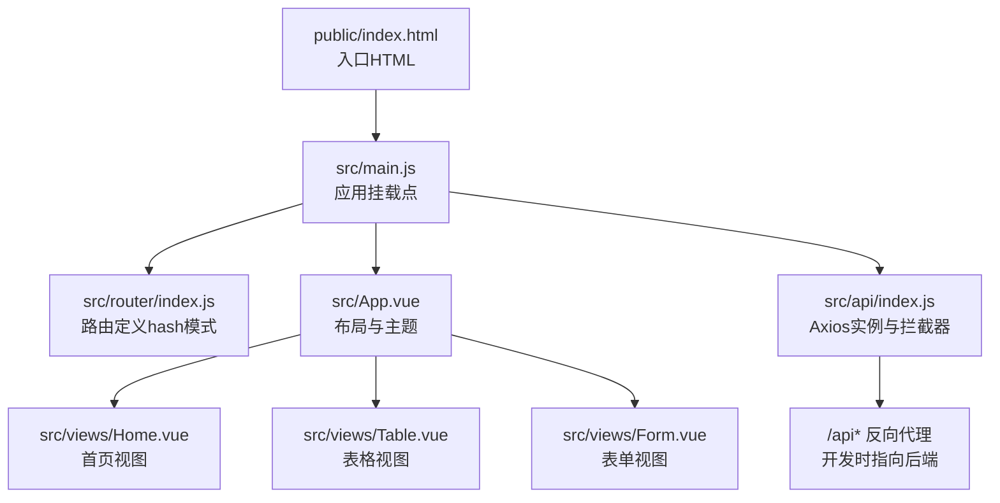
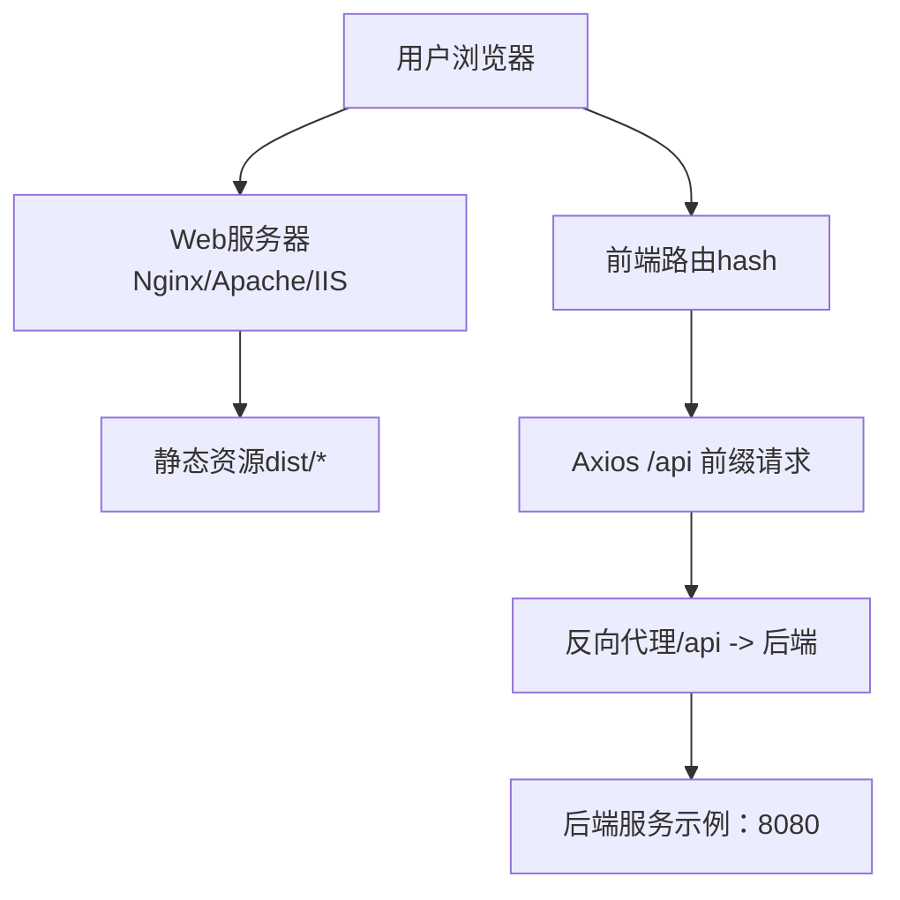
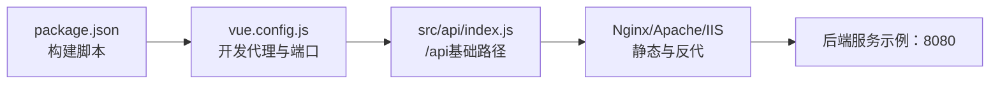

# 服务器部署

<cite>
**本文引用的文件**
- [package.json](file://package.json)
- [vue.config.js](file://vue.config.js)
- [public/index.html](file://public/index.html)
- [src/main.js](file://src/main.js)
- [src/router/index.js](file://src/router/index.js)
- [src/api/index.js](file://src/api/index.js)
- [src/views/Home.vue](file://src/views/Home.vue)
- [src/views/Table.vue](file://src/views/Table.vue)
- [src/views/Form.vue](file://src/views/Form.vue)
</cite>

## 目录
1. [简介](#简介)
2. [项目结构](#项目结构)
3. [核心组件](#核心组件)
4. [架构总览](#架构总览)
5. [详细组件分析](#详细组件分析)
6. [依赖关系分析](#依赖关系分析)
7. [性能考虑](#性能考虑)
8. [故障排查指南](#故障排查指南)
9. [结论](#结论)
10. [附录](#附录)

## 简介
本文件面向Vue.js后台管理系统，提供从构建产物到Nginx/Apache/IIS等Web服务器的完整部署指南。内容涵盖静态文件服务、反向代理与HTTPS配置、域名绑定、子目录部署、多环境策略、性能优化与安全加固，以及部署后的验证方法与常见问题处理。

## 项目结构
该Vue 2.x项目采用Vue CLI 5生成的标准单页应用（SPA）结构，前端通过路由进行页面切换，开发时使用本地代理将/api前缀转发至后端服务。生产构建会输出静态资源，需由Web服务器提供服务。

图表来源
- [public/index.html:1-17](file://public/index.html#L1-L17)
- [src/main.js:1-18](file://src/main.js#L1-L18)
- [src/router/index.js:1-32](file://src/router/index.js#L1-L32)
- [src/App.vue:1-258](file://src/App.vue#L1-L258)
- [src/views/Home.vue:1-175](file://src/views/Home.vue#L1-L175)
- [src/views/Table.vue:1-214](file://src/views/Table.vue#L1-L214)
- [src/views/Form.vue:1-143](file://src/views/Form.vue#L1-L143)
- [src/api/index.js:1-110](file://src/api/index.js#L1-L110)

章节来源
- [package.json:1-29](file://package.json#L1-L29)
- [vue.config.js:1-14](file://vue.config.js#L1-L14)
- [public/index.html:1-17](file://public/index.html#L1-L17)
- [src/main.js:1-18](file://src/main.js#L1-L18)
- [src/router/index.js:1-32](file://src/router/index.js#L1-L32)
- [src/api/index.js:1-110](file://src/api/index.js#L1-L110)

## 核心组件
- 构建与开发服务器
  - 生产构建命令用于产出静态资源目录，供Web服务器托管。
  - 开发服务器配置包含端口与/api反向代理规则，便于前后端联调。
- 路由与页面
  - 使用hash路由模式，利于静态部署；页面包含首页、表格与表单三大功能模块。
- API层
  - Axios实例统一设置基础路径为/api，配合开发代理或生产反向代理访问后端接口。
- 入口与模板
  - HTML模板定义标题、图标与根容器，确保应用在浏览器中正确渲染。

章节来源
- [package.json:5-9](file://package.json#L5-L9)
- [vue.config.js:1-14](file://vue.config.js#L1-L14)
- [src/router/index.js:25-29](file://src/router/index.js#L25-L29)
- [src/api/index.js:4-7](file://src/api/index.js#L4-L7)
- [public/index.html:1-17](file://public/index.html#L1-L17)

## 架构总览
下图展示从浏览器到后端服务的典型请求链路。前端静态资源由Web服务器提供；SPA路由在客户端解析；API请求通过反向代理转发至后端服务。

图表来源
- [vue.config.js:6-11](file://vue.config.js#L6-L11)
- [src/api/index.js:4-7](file://src/api/index.js#L4-L7)
- [src/router/index.js:25-29](file://src/router/index.js#L25-L29)

## 详细组件分析

### Nginx 部署与配置要点
- 静态文件服务
  - 将Nginx站点根目录指向构建产物目录（dist），确保index.html可被直接访问。
  - 配置默认首页与错误页，避免404时出现裸目录。
- 反向代理
  - 将/api前缀的请求转发至后端服务地址（如http://127.0.0.1:8080），保持跨域与路径一致性。
  - 建议开启gzip压缩与缓存头，提升传输效率。
- HTTPS与安全
  - 强制HTTPS重定向，配置现代TLS参数与安全响应头（如Strict-Transport-Security、Content-Security-Policy）。
  - 使用Let’s Encrypt自动签发证书，定期续期。
- 子目录部署
  - 若部署于子目录（如/example），需在Nginx中将location匹配到该路径，并在构建时设置正确的publicPath（见“附录”）。
- 多环境策略
  - 通过不同server块或include文件区分开发/测试/生产环境；或使用变量注入方式按环境切换后端代理目标。

章节来源
- [vue.config.js:6-11](file://vue.config.js#L6-L11)
- [src/api/index.js:4-7](file://src/api/index.js#L4-L7)

### Apache 部署方案
- 静态文件服务
  - 在虚拟主机中设置DocumentRoot为dist目录，启用DirectoryIndex与Options。
- 反向代理
  - 使用mod_proxy与mod_proxy_http，将/api前缀代理至后端服务地址。
  - 注意在.htaccess或虚拟主机配置中保留SPA路由回退至index.html（见“附录”）。
- HTTPS与安全
  - 启用SSL模块，配置HSTS与安全头；结合防火墙与限流策略增强防护。
- 子目录与多环境
  - 通过Alias与Location指令实现子目录映射；使用条件判断按环境选择代理目标。

章节来源
- [vue.config.js:6-11](file://vue.config.js#L6-L11)
- [src/api/index.js:4-7](file://src/api/index.js#L4-L7)

### IIS 配置示例
- 静态文件服务
  - 设置默认文档为index.html，确保静态资源与图标可访问。
- 反向代理
  - 使用ARR与URL重写模块，将/api前缀重写并反代至后端服务地址。
  - 配置自定义错误页与MIME类型，避免资源加载异常。
- HTTPS与安全
  - 启用HTTPS绑定与重定向；配置HTTP严格传输安全与安全头。
- 子目录与多环境
  - 在子应用程序或子目录中部署；通过web.config分环境切换代理目标。

章节来源
- [vue.config.js:6-11](file://vue.config.js#L6-L11)
- [src/api/index.js:4-7](file://src/api/index.js#L4-L7)

### 域名绑定与子目录部署
- 域名绑定
  - 在DNS中为域名添加A/AAAA记录；在Web服务器中配置server_name或虚拟主机。
- 子目录部署
  - 将站点根指向dist；在Nginx/Apache/IIS中通过location/Alias将/example映射到dist。
  - 构建时设置publicPath为/example，确保静态资源与路由链接正确。
- 多环境部署
  - 通过环境变量或构建参数控制publicPath与后端代理目标；CI/CD流水线中按环境注入配置。

章节来源
- [public/index.html:1-17](file://public/index.html#L1-L17)
- [vue.config.js:1-14](file://vue.config.js#L1-L14)

### 性能优化与安全加固
- 性能优化
  - 启用Gzip/Brotli压缩；配置静态资源长缓存与ETag；开启浏览器缓存与CDN加速。
  - 合理拆分与懒加载（当前路由已使用异步组件）；减少首屏体积。
- 安全加固
  - 强制HTTPS；配置安全响应头（HSTS、X-Frame-Options、X-Content-Type-Options、Referrer-Policy）。
  - 限制HTTP方法与来源；对敏感路径进行访问控制与速率限制。

章节来源
- [src/router/index.js:16-22](file://src/router/index.js#L16-L22)

### 部署后验证方法
- 功能验证
  - 打开首页，检查导航菜单与快捷操作可用；进入表格与表单页面，验证数据加载与交互。
- 接口连通性
  - 在网络面板中确认/api请求已成功转发至后端；检查响应状态码与业务字段。
- 路由与回退
  - 刷新页面或直接访问二级路由，确认不会返回404；检查hash路由是否正常工作。
- HTTPS与安全头
  - 使用浏览器开发者工具与在线检测工具验证HTTPS证书与安全头是否生效。

章节来源
- [src/views/Home.vue:128-156](file://src/views/Home.vue#L128-L156)
- [src/views/Table.vue:136-154](file://src/views/Table.vue#L136-L154)
- [src/views/Form.vue:81-91](file://src/views/Form.vue#L81-L91)
- [src/api/index.js:20-31](file://src/api/index.js#L20-L31)

## 依赖关系分析
前端应用的运行依赖于构建脚本、开发代理与API层配置。生产部署时，Web服务器承担静态资源与反向代理职责，后端服务负责业务接口。

图表来源
- [package.json:5-9](file://package.json#L5-L9)
- [vue.config.js:3-12](file://vue.config.js#L3-L12)
- [src/api/index.js:4-7](file://src/api/index.js#L4-L7)

章节来源
- [package.json:5-9](file://package.json#L5-L9)
- [vue.config.js:1-14](file://vue.config.js#L1-L14)
- [src/api/index.js:1-110](file://src/api/index.js#L1-L110)

## 性能考虑
- 静态资源
  - 启用长期缓存与版本化命名；合理设置Cache-Control与ETag。
- 网络传输
  - 开启压缩（Gzip/Brotli）；优先使用HTTP/2或HTTP/3；CDN就近分发。
- 应用层面
  - 组件懒加载与按需加载；减少第三方包体积；移除未使用代码。
- 服务器层面
  - 合理设置worker进程与连接数；开启keep-alive与缓冲区优化。

## 故障排查指南
- 访问白屏或404
  - 检查Web服务器根目录是否指向dist；确认index.html存在且默认文档已启用。
- 路由刷新后404
  - 确认已配置SPA回退至index.html；Nginx需将所有非API与静态资源请求回退到index.html。
- API请求失败
  - 检查反向代理规则是否正确；确认后端服务可达；核对CORS与鉴权设置。
- HTTPS证书或安全头问题
  - 使用在线工具检测证书链与过期时间；逐项核对安全头配置。
- 性能瓶颈
  - 分析资源大小与加载时间；启用缓存与压缩；评估CDN与边缘节点覆盖。

章节来源
- [vue.config.js:6-11](file://vue.config.js#L6-L11)
- [src/api/index.js:20-31](file://src/api/index.js#L20-L31)

## 结论
本部署文档基于项目现有配置，提供了Nginx/Apache/IIS的通用部署路径与最佳实践。建议在生产环境中统一使用HTTPS、完善的缓存与安全头策略，并结合CDN与监控体系持续优化用户体验与安全性。

## 附录
- 构建产物与部署位置
  - 使用构建脚本生成静态资源目录（dist），将其部署至Web服务器根目录或子目录。
- 子目录部署与publicPath
  - 若部署于子目录（如/example），需在构建时设置publicPath为/example，确保静态资源与路由链接正确。
- 开发代理与生产反代对照
  - 开发时通过/devServer.proxy将/api转发至后端；生产时通过Web服务器location/proxy_pass实现相同效果。
- 多环境配置
  - 通过环境变量或构建参数控制publicPath与后端代理目标；在CI/CD中按环境注入配置。

章节来源
- [package.json:5-9](file://package.json#L5-L9)
- [vue.config.js:1-14](file://vue.config.js#L1-L14)
- [public/index.html:1-17](file://public/index.html#L1-L17)