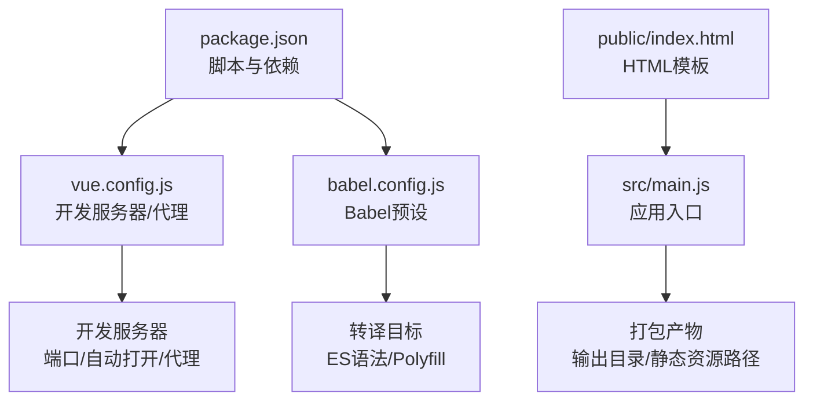
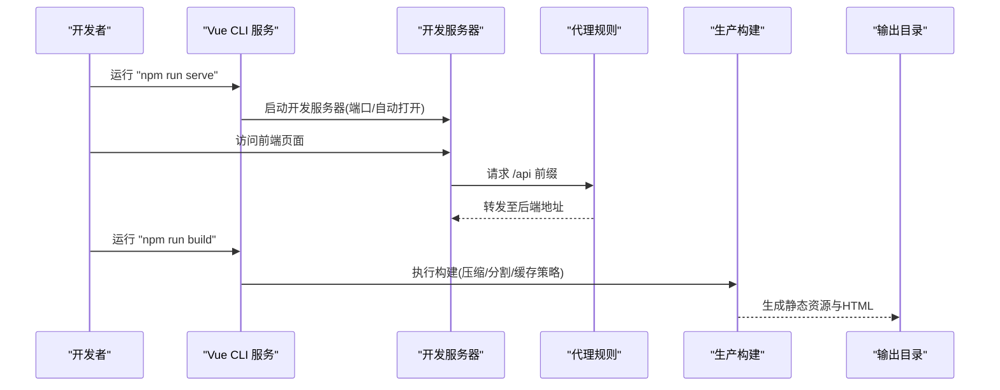
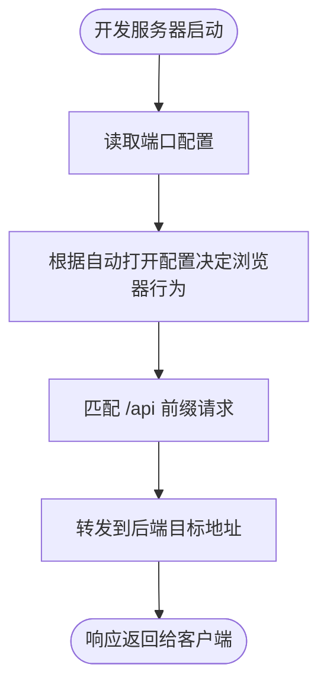
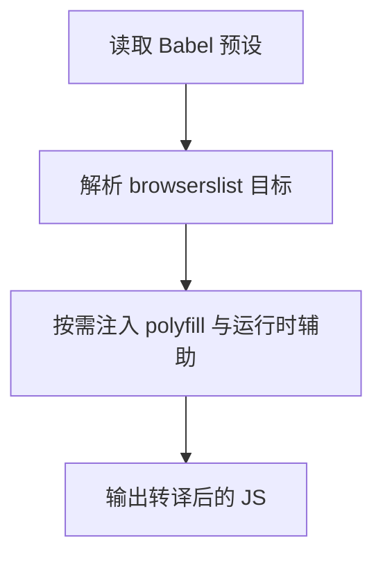
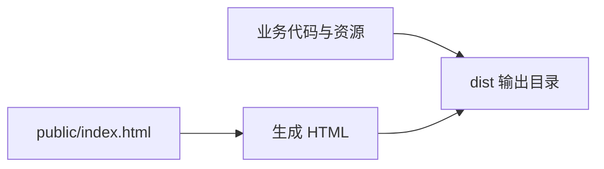
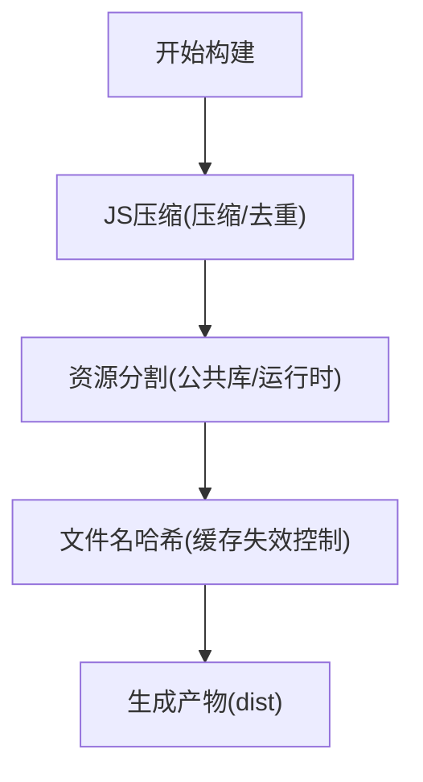
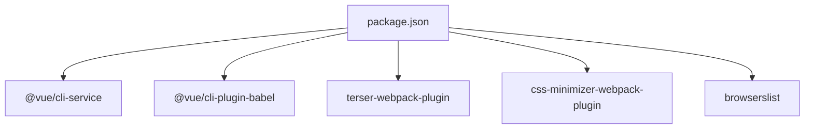

# 构建配置

<cite>
**本文引用的文件**
- [vue.config.js](file://vue.config.js)
- [babel.config.js](file://babel.config.js)
- [package.json](file://package.json)
- [public/index.html](file://public/index.html)
- [src/main.js](file://src/main.js)
</cite>

## 目录
1. [简介](#简介)
2. [项目结构](#项目结构)
3. [核心组件](#核心组件)
4. [架构总览](#架构总览)
5. [详细组件分析](#详细组件分析)
6. [依赖关系分析](#依赖关系分析)
7. [性能考量](#性能考量)
8. [故障排查指南](#故障排查指南)
9. [结论](#结论)
10. [附录](#附录)

## 简介
本文件面向Vue.js后台管理系统，系统化梳理与说明项目的构建配置与优化策略，覆盖以下方面：
- 输出目录与静态资源路径
- 开发服务器与代理配置
- Babel转译与浏览器兼容性
- 生产构建优化（代码压缩、资源分割、缓存）
- 构建脚本使用与自定义配置示例

本项目基于Vue CLI 5.x，采用默认的Webpack链式配置能力，通过vue.config.js进行扩展；Babel使用@vue/cli-plugin-babel预设；浏览器兼容性由browserslist控制。

## 项目结构
该仓库采用标准Vue CLI项目布局，关键构建相关文件如下：
- 配置层：vue.config.js（开发服务器与代理）、babel.config.js（Babel预设）、package.json（脚本与依赖）
- 模板层：public/index.html（HTML模板）
- 入口层：src/main.js（应用入口）

图表来源
- [package.json:1-29](file://package.json#L1-L29)
- [vue.config.js:1-14](file://vue.config.js#L1-L14)
- [babel.config.js:1-6](file://babel.config.js#L1-L6)
- [public/index.html:1-17](file://public/index.html#L1-L17)
- [src/main.js:1-18](file://src/main.js#L1-L18)

章节来源
- [package.json:1-29](file://package.json#L1-L29)
- [vue.config.js:1-14](file://vue.config.js#L1-L14)
- [babel.config.js:1-6](file://babel.config.js#L1-L6)
- [public/index.html:1-17](file://public/index.html#L1-L17)
- [src/main.js:1-18](file://src/main.js#L1-L18)

## 核心组件
- 构建脚本与命令
  - 开发：执行“serve”调用vue-cli-service serve，启动本地开发服务器
  - 构建：执行“build”调用vue-cli-service build，生成生产包
  - 代码检查：执行“lint”调用vue-cli-service lint
- 开发服务器与代理
  - 端口与自动打开
  - 本地API代理到后端服务
- Babel与浏览器兼容
  - 使用@vue/cli-plugin-babel预设
  - browserslist控制目标浏览器范围
- 输出与静态资源
  - 默认输出目录与静态资源路径遵循Vue CLI约定

章节来源
- [package.json:5-9](file://package.json#L5-L9)
- [vue.config.js:3-12](file://vue.config.js#L3-L12)
- [babel.config.js:1-6](file://babel.config.js#L1-L6)
- [package.json:23-27](file://package.json#L23-L27)

## 架构总览
下图展示从开发到生产的典型流程，以及关键配置点如何影响构建行为。

图表来源
- [package.json:6-8](file://package.json#L6-L8)
- [vue.config.js:3-12](file://vue.config.js#L3-L12)

## 详细组件分析

### 开发服务器与代理配置
- 端口与自动打开
  - 通过devServer.port设置本地端口
  - 通过devServer.open控制是否自动打开浏览器
- 代理规则
  - 将以“/api”开头的请求转发到后端服务
  - changeOrigin用于解决跨域Host头问题
- 适用场景
  - 前后端分离开发时，避免同源限制
  - 本地联调阶段统一走代理，减少跨域配置复杂度

图表来源
- [vue.config.js:3-12](file://vue.config.js#L3-L12)

章节来源
- [vue.config.js:3-12](file://vue.config.js#L3-L12)

### Babel转译与浏览器兼容
- Babel预设
  - 使用@vue/cli-plugin-babel预设，确保Vue生态语法正确转译
- 浏览器兼容
  - browserslist在package.json中定义目标范围
  - CLI会据此生成polyfill与目标ES版本
- 影响范围
  - 旧版浏览器的语法降级与运行时辅助函数注入
  - 产物体积与运行时性能的平衡

图表来源
- [babel.config.js:1-6](file://babel.config.js#L1-L6)
- [package.json:23-27](file://package.json#L23-L27)

章节来源
- [babel.config.js:1-6](file://babel.config.js#L1-L6)
- [package.json:23-27](file://package.json#L23-L27)

### 输出目录与静态资源路径
- 输出目录
  - Vue CLI默认输出到dist目录（无需显式配置）
- 静态资源路径
  - public下的静态资源直接复制到输出根目录
  - 业务代码打包产物位于输出根目录或子目录（由CLI默认策略决定）
- HTML模板
  - public/index.html作为入口模板，构建时注入打包产物

图表来源
- [public/index.html:1-17](file://public/index.html#L1-L17)
- [src/main.js:1-18](file://src/main.js#L1-L18)

章节来源
- [public/index.html:1-17](file://public/index.html#L1-L17)
- [src/main.js:1-18](file://src/main.js#L1-L18)

### 生产构建优化策略
- 代码压缩
  - 使用 terser-webpack-plugin 进行JS压缩与混淆
- 资源分割
  - 通过拆分vendor/runtime等实现缓存友好与并行加载
- 缓存策略
  - 通过文件名哈希与长效缓存策略提升CDN命中率
- 可视化分析
  - 可选集成webpack-bundle-analyzer定位大模块

图表来源
- [package.json:17-22](file://package.json#L17-L22)

章节来源
- [package.json:17-22](file://package.json#L17-L22)

### 构建脚本使用方法
- 开发模式
  - npm run serve
  - 自动启动开发服务器，支持热更新与代理
- 生产构建
  - npm run build
  - 产出dist目录，供静态服务器部署
- 代码检查
  - npm run lint
  - 对源码进行风格与潜在问题检查

章节来源
- [package.json:5-9](file://package.json#L5-L9)

### 自定义构建配置示例
以下示例展示了常见的可扩展点（以路径与参数形式给出，便于在vue.config.js中落地）：
- 输出目录与静态资源路径
  - 参考路径：[vue.config.js:1-14](file://vue.config.js#L1-L14)
  - 示例思路：通过chainWebpack或configureWebpack添加输出目录与publicPath配置
- 代理扩展
  - 参考路径：[vue.config.js:6-11](file://vue.config.js#L6-L11)
  - 示例思路：新增更多前缀映射与路径重写规则
- Babel与浏览器兼容
  - 参考路径：[babel.config.js:1-6](file://babel.config.js#L1-L6), [package.json:23-27](file://package.json#L23-L27)
  - 示例思路：调整browserslist目标或引入更多preset
- 生产优化
  - 参考路径：[package.json:17-22](file://package.json#L17-L22)
  - 示例思路：在chainWebpack中接入splitChunks、cache、minimizer等

章节来源
- [vue.config.js:1-14](file://vue.config.js#L1-L14)
- [babel.config.js:1-6](file://babel.config.js#L1-L6)
- [package.json:17-22](file://package.json#L17-L22)
- [package.json:23-27](file://package.json#L23-L27)

## 依赖关系分析
- CLI与插件
  - @vue/cli-service 提供serve/build/lint命令
  - @vue/cli-plugin-babel 提供Babel转译能力
- Webpack相关
  - terser-webpack-plugin、css-minimizer-webpack-plugin等用于生产优化
- 浏览器兼容
  - browserslist定义目标范围，影响polyfill与目标ES版本

图表来源
- [package.json:17-22](file://package.json#L17-L22)
- [package.json:23-27](file://package.json#L23-L27)

章节来源
- [package.json:17-22](file://package.json#L17-L22)
- [package.json:23-27](file://package.json#L23-L27)

## 性能考量
- 代码压缩与混淆
  - 使用terser-webpack-plugin在生产构建中进行压缩与作用域提升
- 资源分割
  - 合理拆分第三方库与运行时，提升缓存命中率
- 缓存策略
  - 文件名哈希与长效缓存结合，避免缓存穿透
- 体积分析
  - 可选集成webpack-bundle-analyzer，定位大模块并优化依赖

## 故障排查指南
- 代理不生效
  - 检查代理前缀与目标地址是否匹配
  - 确认changeOrigin与路径重写规则
  - 参考路径：[vue.config.js:6-11](file://vue.config.js#L6-L11)
- 端口占用
  - 修改devServer.port为未被占用端口
  - 参考路径：[vue.config.js:4](file://vue.config.js#L4)
- 浏览器兼容问题
  - 调整browserslist目标范围
  - 参考路径：[package.json:23-27](file://package.json#L23-L27)
- 构建失败或体积异常
  - 检查terser与css-minimizer配置
  - 参考路径：[package.json:17-22](file://package.json#L17-L22)

章节来源
- [vue.config.js:4](file://vue.config.js#L4)
- [vue.config.js:6-11](file://vue.config.js#L6-L11)
- [package.json:17-22](file://package.json#L17-L22)
- [package.json:23-27](file://package.json#L23-L27)

## 结论
本项目已具备完善的开发与生产构建基础：开发服务器与代理满足前后端联调需求；Babel与browserslist保障多浏览器兼容；生产构建通过压缩与分割提升性能。建议在现有基础上按需扩展输出目录、静态资源路径与更细粒度的缓存策略，以适配更高要求的部署与性能目标。

## 附录
- 关键配置参考路径
  - 开发服务器与代理：[vue.config.js:3-12](file://vue.config.js#L3-L12)
  - Babel预设与浏览器兼容：[babel.config.js:1-6](file://babel.config.js#L1-L6), [package.json:23-27](file://package.json#L23-L27)
  - 构建脚本：[package.json:5-9](file://package.json#L5-L9)
  - HTML模板与入口：[public/index.html:1-17](file://public/index.html#L1-L17), [src/main.js:1-18](file://src/main.js#L1-L18)