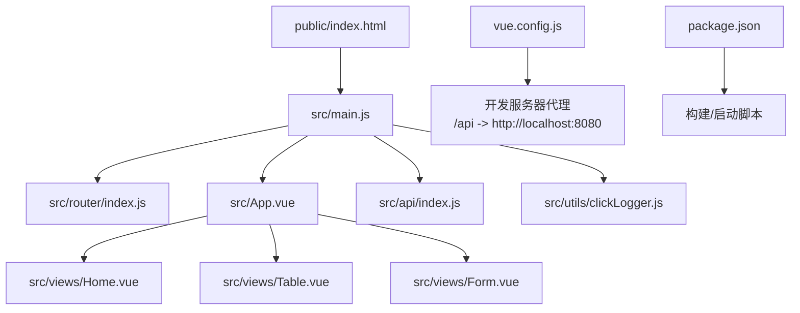
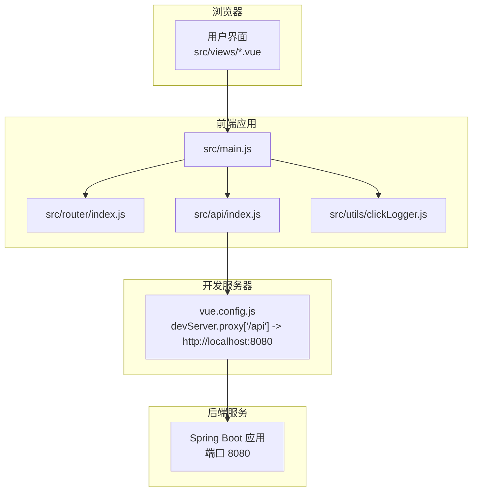
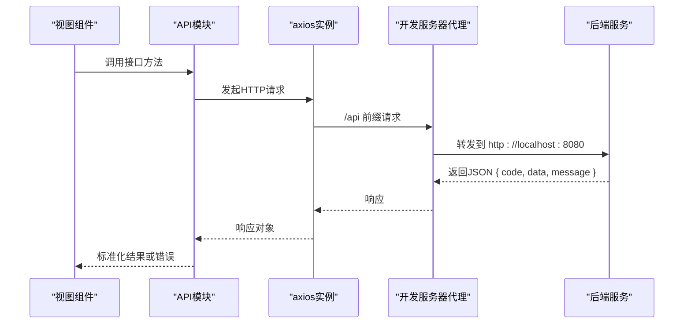
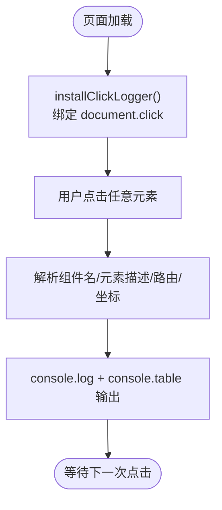
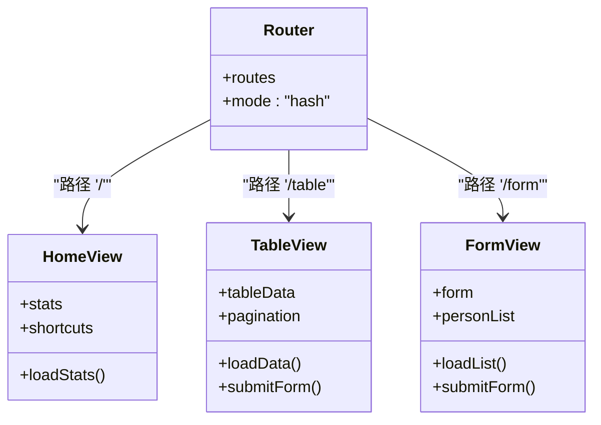
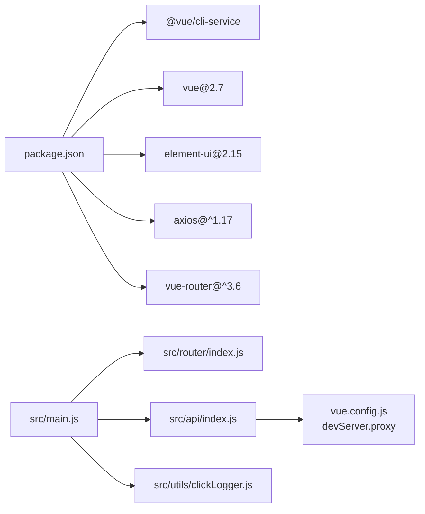

# 监控与维护

<cite>
**本文引用的文件**
- [package.json](file://package.json)
- [vue.config.js](file://vue.config.js)
- [src/main.js](file://src/main.js)
- [src/api/index.js](file://src/api/index.js)
- [src/utils/clickLogger.js](file://src/utils/clickLogger.js)
- [src/router/index.js](file://src/router/index.js)
- [src/views/Home.vue](file://src/views/Home.vue)
- [src/views/Table.vue](file://src/views/Table.vue)
- [src/views/Form.vue](file://src/views/Form.vue)
- [public/index.html](file://public/index.html)
</cite>

## 目录
1. [简介](#简介)
2. [项目结构](#项目结构)
3. [核心组件](#核心组件)
4. [架构总览](#架构总览)
5. [详细组件分析](#详细组件分析)
6. [依赖关系分析](#依赖关系分析)
7. [性能考虑](#性能考虑)
8. [故障排查指南](#故障排查指南)
9. [结论](#结论)
10. [附录](#附录)

## 简介
本文件面向Vue.js后台管理系统，提供一套可落地的监控与维护方案，涵盖运行状态监控、性能指标采集、日志管理策略、部署后的健康检查与故障诊断流程、版本更新与热修复、备份与灾难恢复、运维自动化脚本与告警配置示例，以及安全更新与漏洞修复最佳实践。由于当前仓库未包含生产级监控与日志组件，本文在不改变现有代码的前提下，给出可扩展的实现建议与落地步骤。

## 项目结构
该Vue.js项目采用典型的前端单页应用（SPA）结构，主要目录与职责如下：
- public：静态资源与入口HTML模板
- src：源码
  - api：统一HTTP客户端与接口封装
  - router：路由定义
  - views：页面组件
  - utils：通用工具（如全局点击日志）
  - main.js：应用入口
- 配置：vue.config.js（开发服务器代理）、package.json（脚本与依赖）

**图表来源**
- [public/index.html](file://public/index.html)
- [src/main.js](file://src/main.js)
- [src/router/index.js](file://src/router/index.js)
- [src/App.vue](file://src/App.vue)
- [src/views/Home.vue](file://src/views/Home.vue)
- [src/views/Table.vue](file://src/views/Table.vue)
- [src/views/Form.vue](file://src/views/Form.vue)
- [src/api/index.js](file://src/api/index.js)
- [src/utils/clickLogger.js](file://src/utils/clickLogger.js)
- [vue.config.js](file://vue.config.js)
- [package.json](file://package.json)

**章节来源**
- [package.json](file://package.json)
- [vue.config.js](file://vue.config.js)
- [src/main.js](file://src/main.js)
- [src/router/index.js](file://src/router/index.js)
- [public/index.html](file://public/index.html)

## 核心组件
- 应用入口与初始化
  - 在入口中引入UI库、路由，并安装全局点击日志工具，用于用户交互行为追踪与问题定位。
- API层
  - 统一创建axios实例，设置基础路径与超时；内置响应拦截器对业务错误进行标准化处理。
- 工具模块
  - 全局点击日志：通过事件委托捕获点击，输出结构化日志，便于审计与问题复现。
- 视图组件
  - 首页统计卡片与快捷入口、表格分页与对话框、表单校验与列表展示等，均通过API层调用后端接口。

**章节来源**
- [src/main.js](file://src/main.js)
- [src/api/index.js](file://src/api/index.js)
- [src/utils/clickLogger.js](file://src/utils/clickLogger.js)
- [src/views/Home.vue](file://src/views/Home.vue)
- [src/views/Table.vue](file://src/views/Table.vue)
- [src/views/Form.vue](file://src/views/Form.vue)

## 架构总览
前端通过开发服务器代理将/api前缀转发至后端服务（默认本地8080端口）。生产构建产物由Nginx或CDN提供静态托管，应用通过XHR调用后端REST接口。

**图表来源**
- [vue.config.js](file://vue.config.js)
- [src/api/index.js](file://src/api/index.js)
- [src/main.js](file://src/main.js)
- [src/router/index.js](file://src/router/index.js)
- [src/utils/clickLogger.js](file://src/utils/clickLogger.js)

## 详细组件分析

### API层设计与错误处理
- 统一基地址与超时控制，集中处理请求/响应拦截，提升一致性与可观测性。
- 响应拦截器对非200状态进行标准化抛错，便于上层统一提示与日志记录。

**图表来源**
- [src/api/index.js](file://src/api/index.js)
- [vue.config.js](file://vue.config.js)

**章节来源**
- [src/api/index.js](file://src/api/index.js)
- [vue.config.js](file://vue.config.js)

### 全局点击日志工具
- 通过事件委托捕获页面点击，提取组件名、元素描述、路由路径与坐标，输出结构化日志。
- 提供安装/卸载函数，便于按需启用。

**图表来源**
- [src/utils/clickLogger.js](file://src/utils/clickLogger.js)
- [src/main.js](file://src/main.js)

**章节来源**
- [src/utils/clickLogger.js](file://src/utils/clickLogger.js)
- [src/main.js](file://src/main.js)

### 路由与页面组件
- 路由采用hash模式，定义首页、表格、表单三个页面。
- 页面组件通过API层拉取数据，使用Element UI组件实现表格、分页、对话框与表单校验。

**图表来源**
- [src/router/index.js](file://src/router/index.js)
- [src/views/Home.vue](file://src/views/Home.vue)
- [src/views/Table.vue](file://src/views/Table.vue)
- [src/views/Form.vue](file://src/views/Form.vue)

**章节来源**
- [src/router/index.js](file://src/router/index.js)
- [src/views/Home.vue](file://src/views/Home.vue)
- [src/views/Table.vue](file://src/views/Table.vue)
- [src/views/Form.vue](file://src/views/Form.vue)

## 依赖关系分析
- 运行时依赖
  - Vue 2.7、Element UI 2.15、axios、vue-router
- 开发依赖
  - @vue/cli-service 及相关插件，支持开发服务器与构建
- 关键耦合点
  - API层与开发服务器代理耦合于/baseURL与/devServer.proxy
  - 全局点击日志与应用入口耦合

**图表来源**
- [package.json](file://package.json)
- [src/main.js](file://src/main.js)
- [src/router/index.js](file://src/router/index.js)
- [src/api/index.js](file://src/api/index.js)
- [src/utils/clickLogger.js](file://src/utils/clickLogger.js)
- [vue.config.js](file://vue.config.js)

**章节来源**
- [package.json](file://package.json)
- [vue.config.js](file://vue.config.js)
- [src/main.js](file://src/main.js)

## 性能考虑
- 前端性能
  - 使用分页与懒加载减少首屏渲染压力；对统计类接口采用并发请求合并，降低等待时间。
  - 表单与对话框仅在需要时渲染，避免不必要的DOM开销。
- 网络性能
  - axios统一超时与错误处理，结合开发服务器代理，确保跨域与转发稳定。
- 缓存策略
  - 生产环境建议开启浏览器缓存与CDN缓存，合理设置Cache-Control与ETag。
- 监控指标建议
  - 前端可采集：首屏时间、路由切换耗时、接口成功率与延迟、错误率、用户点击热力图（基于全局点击日志）。

[本节为通用指导，无需列出具体文件来源]

## 故障排查指南
- 健康检查
  - 访问根路径与各页面路由，确认无白屏与空白页。
  - 打开浏览器开发者工具，查看Network面板是否存在跨域错误或404/5xx。
  - 检查Console是否有JavaScript异常与全局点击日志输出。
- 常见问题定位
  - 接口失败：检查/devServer.proxy是否指向正确的后端地址；确认后端服务端口与连通性。
  - 数据为空：确认API返回结构与拦截器逻辑；检查视图组件的数据赋值与分页逻辑。
  - UI显示异常：检查Element UI主题与暗色样式覆盖是否生效。
- 日志与审计
  - 启用全局点击日志，复现用户反馈的问题场景，结合日志中的路由、组件与元素信息快速定位。
- 回滚与临时修复
  - 若发现新版本导致功能异常，优先回退到上一个稳定构建版本，同时发布最小化热修复补丁。

**章节来源**
- [vue.config.js](file://vue.config.js)
- [src/api/index.js](file://src/api/index.js)
- [src/utils/clickLogger.js](file://src/utils/clickLogger.js)
- [src/views/Home.vue](file://src/views/Home.vue)
- [src/views/Table.vue](file://src/views/Table.vue)
- [src/views/Form.vue](file://src/views/Form.vue)

## 结论
本项目具备清晰的前端架构与可扩展的API层，结合全局点击日志与统一错误处理，能够满足日常监控与维护的基本需求。建议在现有基础上逐步引入生产级监控（前端埋点、性能指标采集）、日志聚合、健康检查与自动化告警，并完善备份与灾难恢复流程，以保障系统稳定性与可维护性。

[本节为总结性内容，无需列出具体文件来源]

## 附录

### 运维自动化与监控告警（建议）
- 健康检查
  - Nginx/CDN层面：GET /index.html 返回200；GET /api/health 返回200（若后端提供）。
  - 前端自检：访问首页，断言关键统计卡片与快捷入口存在。
- 日志管理
  - 前端：将全局点击日志与错误堆栈发送至日志服务；后端：统一格式化访问日志与业务日志。
- 告警配置
  - 指标阈值：接口错误率>1%、P95接口延迟>2s、页面白屏率>0.5%、用户点击异常峰值。
  - 通知渠道：邮件/企业微信/钉钉机器人。
- 备份与恢复
  - 前端：构建产物与静态资源定期快照；后端：数据库与文件备份策略。
- 版本更新与热修复
  - 分环境灰度发布：先预发，再灰度，最后全量；回滚机制：一键回退至上一版本。
- 安全更新与漏洞修复
  - 定期扫描依赖漏洞，优先修复高危风险；对axios、Element UI、Vue等核心依赖进行升级测试后再上线。

[本节为通用指导，无需列出具体文件来源]