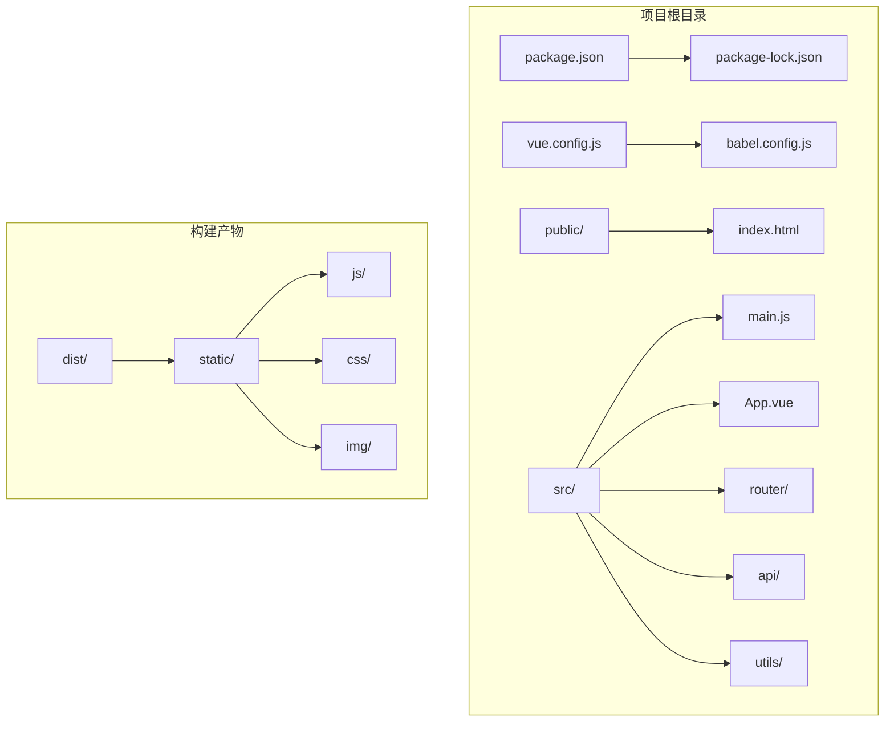
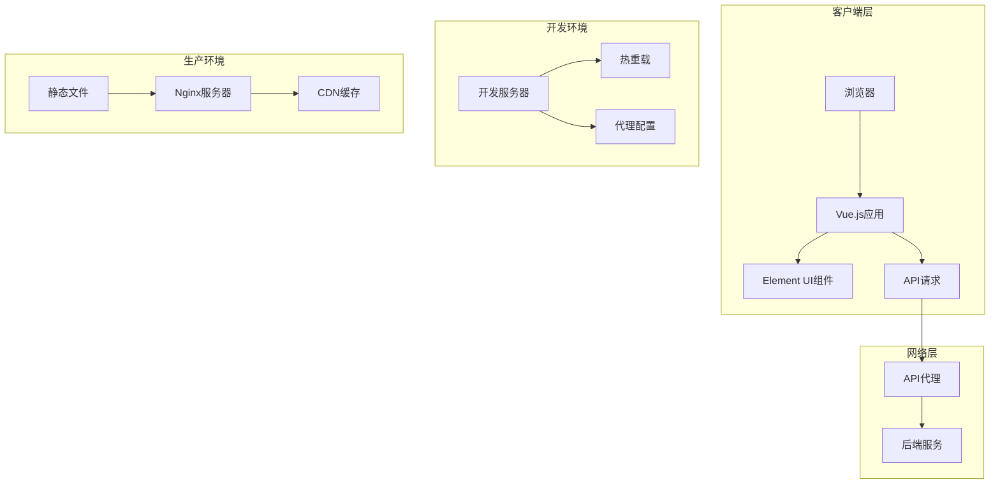
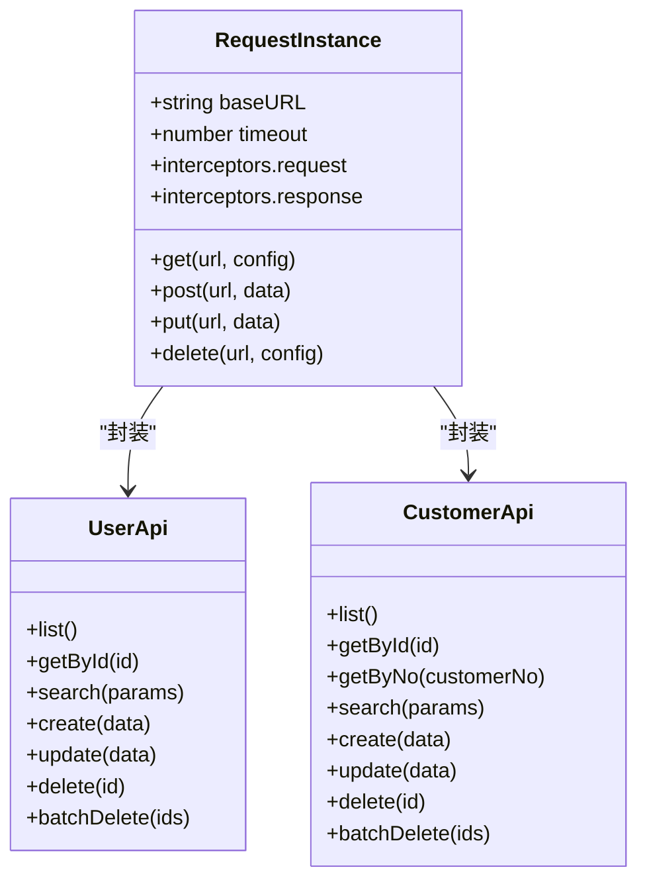
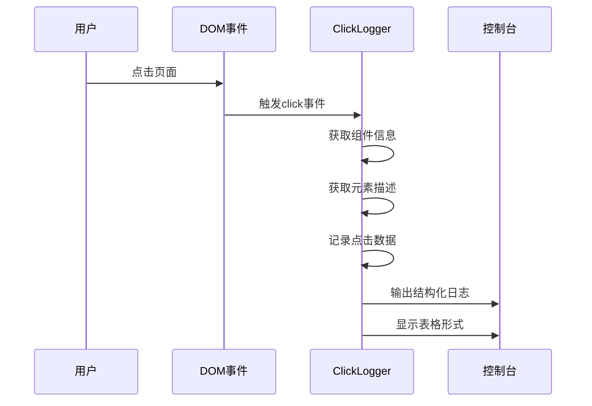
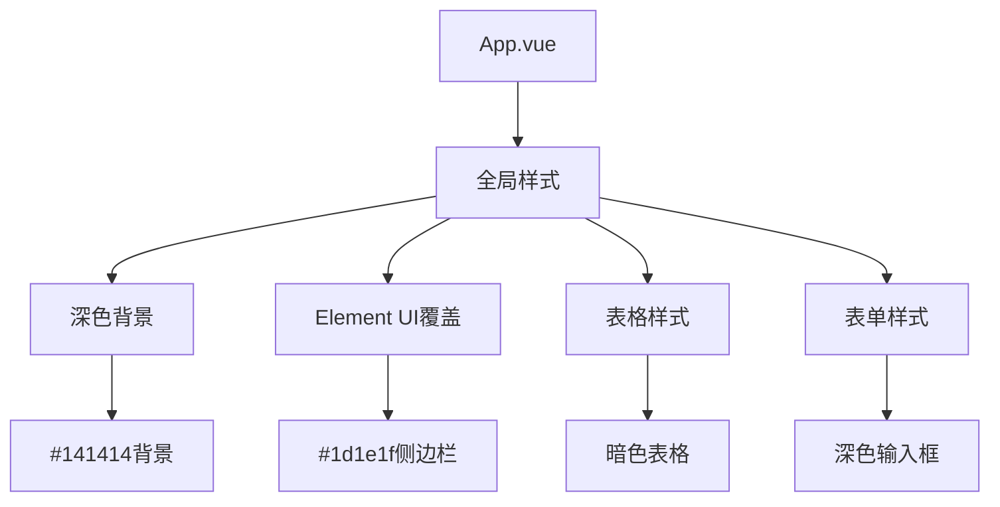

# 部署指南

<cite>
**本文档引用的文件**
- [package.json](file://package.json)
- [vue.config.js](file://vue.config.js)
- [public/index.html](file://public/index.html)
- [src/main.js](file://src/main.js)
- [src/App.vue](file://src/App.vue)
- [src/router/index.js](file://src/router/index.js)
- [src/api/index.js](file://src/api/index.js)
- [src/utils/clickLogger.js](file://src/utils/clickLogger.js)
- [babel.config.js](file://babel.config.js)
</cite>

## 目录
1. [简介](#简介)
2. [项目结构](#项目结构)
3. [核心组件](#核心组件)
4. [架构概览](#架构概览)
5. [详细组件分析](#详细组件分析)
6. [依赖关系分析](#依赖关系分析)
7. [性能考虑](#性能考虑)
8. [故障排查指南](#故障排查指南)
9. [结论](#结论)

## 简介

本指南为Vue.js后台管理系统提供完整的部署文档，涵盖生产环境构建配置、静态资源优化和CDN集成策略。该系统基于Vue 2.7.16和Element UI 2.15.14构建，采用Vue CLI 5.0开发工具链。

## 项目结构

该项目采用标准的Vue CLI项目结构，主要目录和文件如下：



**图表来源**
- [package.json](file://package.json)
- [vue.config.js](file://vue.config.js)
- [public/index.html](file://public/index.html)
- [src/main.js](file://src/main.js)

**章节来源**
- [package.json:1-29](file://package.json#L1-L29)
- [vue.config.js:1-14](file://vue.config.js#L1-L14)
- [public/index.html:1-17](file://public/index.html#L1-L17)

## 核心组件

### 构建配置组件

项目使用Vue CLI提供的默认配置，主要特点包括：

- **开发服务器配置**：端口8082，自动打开浏览器，API代理到本地8080端口
- **构建优化**：默认启用代码分割和压缩
- **浏览器兼容性**：支持现代浏览器

### 应用入口组件

应用入口负责初始化Vue实例和全局配置：

- **Vue实例创建**：挂载到#app元素
- **全局插件注册**：Element UI主题样式导入
- **全局功能**：启动点击日志记录

### 路由组件

采用Hash路由模式，支持多页面导航：

- **路由模式**：hash模式确保静态部署时的兼容性
- **页面组件**：首页、表格页、表单页
- **路由配置**：基础路径从环境变量读取

**章节来源**
- [vue.config.js:1-14](file://vue.config.js#L1-L14)
- [src/main.js:1-18](file://src/main.js#L1-L18)
- [src/router/index.js:1-32](file://src/router/index.js#L1-L32)

## 架构概览

系统采用前后端分离架构，前端Vue应用通过API代理与后端服务通信：



**图表来源**
- [vue.config.js:3-12](file://vue.config.js#L3-L12)
- [src/api/index.js:4-7](file://src/api/index.js#L4-L7)

## 详细组件分析

### API配置组件

API模块提供了统一的HTTP请求封装：



**图表来源**
- [src/api/index.js:4-110](file://src/api/index.js#L4-L110)

API配置的关键特性：

- **基础URL**：设置为'/api'，便于开发环境代理
- **超时设置**：15秒超时时间
- **响应处理**：统一的状态码验证和错误处理
- **模块化设计**：按业务领域分组API接口

**章节来源**
- [src/api/index.js:1-110](file://src/api/index.js#L1-L110)

### 点击日志组件

全局点击行为追踪工具：



**图表来源**
- [src/utils/clickLogger.js:36-60](file://src/utils/clickLogger.js#L36-L60)

组件功能特点：

- **事件委托**：监听整个文档的点击事件
- **组件识别**：通过Vue实例树定位触发组件
- **元素描述**：提取标签、类名和文本内容
- **位置记录**：捕获点击坐标
- **格式化输出**：控制台彩色日志和表格显示

**章节来源**
- [src/utils/clickLogger.js:1-71](file://src/utils/clickLogger.js#L1-L71)

### 主题样式组件

应用采用深色主题设计：



**图表来源**
- [src/App.vue:58-257](file://src/App.vue#L58-L257)

**章节来源**
- [src/App.vue:1-258](file://src/App.vue#L1-L258)

## 依赖关系分析

项目依赖关系图：

```mermaid
graph LR
subgraph "运行时依赖"
A[vue@2.7.16] --> B[element-ui@2.15.14]
A --> C[axios@1.17.0]
A --> D[core-js@3.8.3]
end
subgraph "开发依赖"
E[@vue/cli-service~5.0.0] --> F[@vue/cli-plugin-babel~5.0.0]
E --> G[@vue/cli-plugin-router~5.0.0]
H[Vue CLI 5.0] --> I[Webpack 5]
end
subgraph "构建工具"
J[Babel] --> K[preset-env]
L[Webpack] --> M[代码分割]
L --> N[资源压缩]
end
A --> E
C --> E
B --> E
```

**图表来源**
- [package.json:10-22](file://package.json#L10-L22)

**章节来源**
- [package.json:1-29](file://package.json#L1-L29)
- [babel.config.js:1-6](file://babel.config.js#L1-L6)

## 性能考虑

### 构建优化策略

1. **代码分割**
   - 自动拆分路由组件
   - 第三方库独立打包
   - 动态导入优化

2. **资源压缩**
   - JS代码压缩
   - CSS提取和压缩
   - 图片资源优化

3. **缓存策略**
   - 文件名哈希化
   - 浏览器缓存配置
   - CDN缓存优化

### 运行时性能

1. **组件懒加载**
   - 路由级别的异步组件
   - 减少初始包大小

2. **样式优化**
   - 深色主题减少渲染开销
   - Element UI按需引入

3. **API优化**
   - 统一的错误处理
   - 超时控制
   - 请求拦截器

## 故障排查指南

### 常见问题诊断

1. **开发环境问题**
   ```bash
   # 检查开发服务器状态
   npm run serve
   
   # 查看代理配置
   cat vue.config.js
   ```

2. **构建问题**
   ```bash
   # 清理缓存重新构建
   rm -rf node_modules/.cache
   npm run build
   
   # 检查构建输出
   ls -la dist/
   ```

3. **API连接问题**
   ```javascript
   // 检查API配置
   console.log('Base URL:', process.env.BASE_URL);
   console.log('API Base:', request.defaults.baseURL);
   ```

### 性能监控

1. **构建分析**
   - 使用webpack-bundle-analyzer
   - 分析包大小组成
   - 识别大型依赖

2. **运行时监控**
   - Chrome DevTools性能面板
   - Vue DevTools检查
   - 网络请求分析

**章节来源**
- [vue.config.js:3-12](file://vue.config.js#L3-L12)
- [src/api/index.js:10-31](file://src/api/index.js#L10-L31)

## 结论

本Vue.js后台管理系统具备以下部署优势：

1. **配置简洁**：基于Vue CLI的零配置开发体验
2. **架构清晰**：前后端分离，职责明确
3. **扩展性强**：模块化设计，易于功能扩展
4. **维护友好**：标准化项目结构，便于团队协作

建议在生产环境中重点关注：
- CDN集成策略
- HTTPS配置
- 缓存优化
- 监控告警机制

通过遵循本指南的配置和最佳实践，可以确保系统的稳定部署和高效运行。