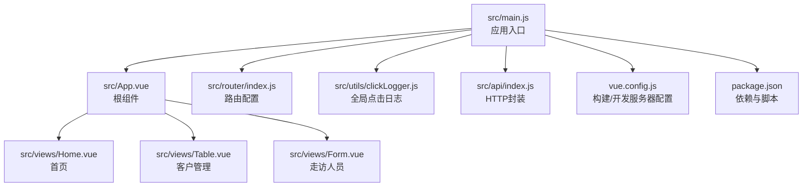
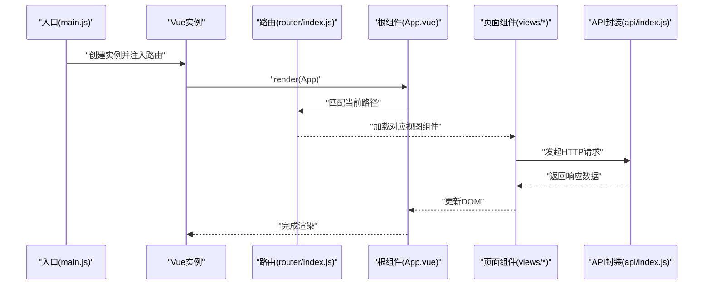
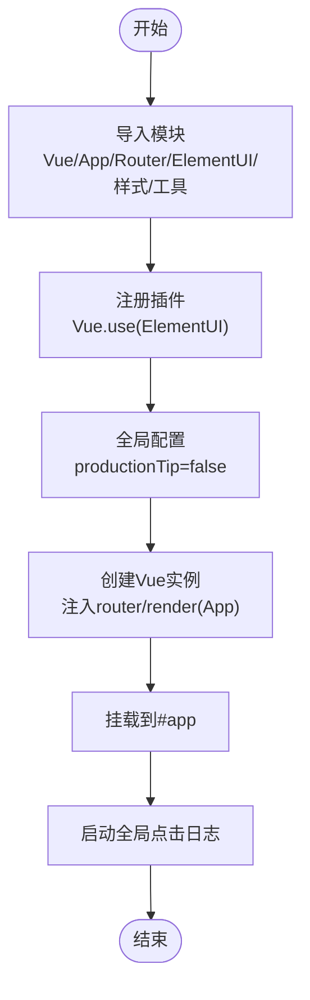
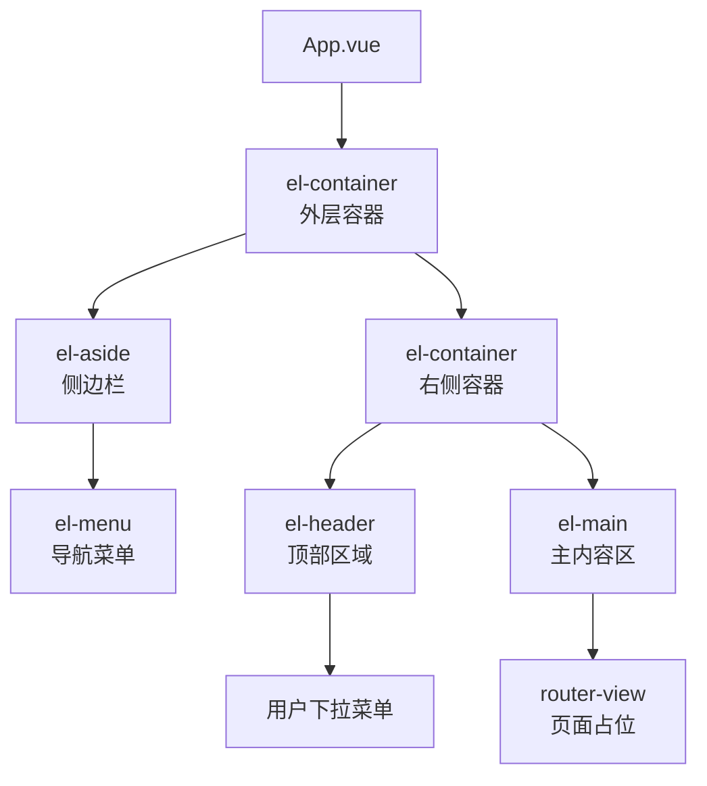
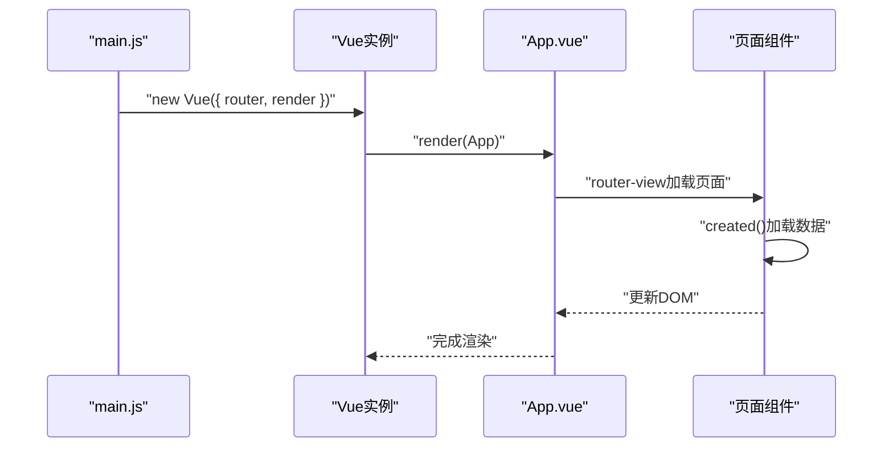
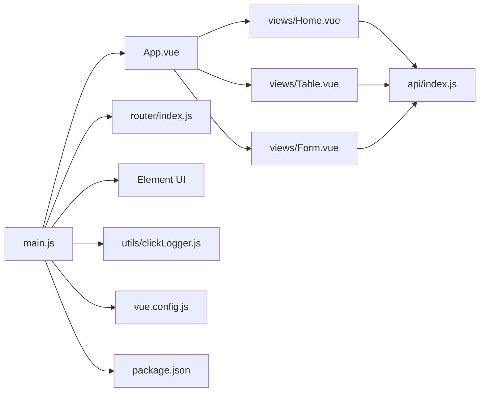

# 应用入口与初始化

<cite>
**本文引用的文件**
- [main.js](file://src/main.js)
- [App.vue](file://src/App.vue)
- [router/index.js](file://src/router/index.js)
- [api/index.js](file://src/api/index.js)
- [utils/clickLogger.js](file://src/utils/clickLogger.js)
- [views/Home.vue](file://src/views/Home.vue)
- [views/Table.vue](file://src/views/Table.vue)
- [views/Form.vue](file://src/views/Form.vue)
- [package.json](file://package.json)
- [vue.config.js](file://vue.config.js)
</cite>

## 目录
1. [简介](#简介)
2. [项目结构](#项目结构)
3. [核心组件](#核心组件)
4. [架构总览](#架构总览)
5. [详细组件分析](#详细组件分析)
6. [依赖关系分析](#依赖关系分析)
7. [性能考虑](#性能考虑)
8. [故障排查指南](#故障排查指南)
9. [结论](#结论)
10. [附录](#附录)

## 简介
本文件聚焦于Vue.js后台管理系统的应用入口与初始化流程，围绕以下目标展开：
- 解析 main.js 的初始化步骤：Vue实例创建、插件注册、全局配置等
- 说明 App.vue 根组件的设计理念与模板结构
- 阐述 Element UI 插件的引入方式与全局配置要点
- 讲解 Vue 实例生命周期钩子与渲染机制
- 对比开发与生产环境差异配置，并给出性能优化建议
- 提供调试技巧与常见问题解决方案

## 项目结构
该工程采用典型的 Vue CLI 项目布局，入口文件位于 src/main.js，根组件为 App.vue，路由在 src/router/index.js 中定义，API 封装在 src/api/index.js，通用工具位于 src/utils，页面组件位于 src/views。

图表来源
- [main.js:1-18](file://src/main.js#L1-L18)
- [App.vue:1-50](file://src/App.vue#L1-L50)
- [router/index.js:1-32](file://src/router/index.js#L1-L32)
- [api/index.js:1-110](file://src/api/index.js#L1-L110)
- [utils/clickLogger.js:1-71](file://src/utils/clickLogger.js#L1-L71)
- [views/Home.vue:1-175](file://src/views/Home.vue#L1-L175)
- [views/Table.vue:1-214](file://src/views/Table.vue#L1-L214)
- [views/Form.vue:1-143](file://src/views/Form.vue#L1-L143)
- [vue.config.js:1-14](file://vue.config.js#L1-L14)
- [package.json:1-29](file://package.json#L1-L29)

章节来源
- [main.js:1-18](file://src/main.js#L1-L18)
- [App.vue:1-50](file://src/App.vue#L1-L50)
- [router/index.js:1-32](file://src/router/index.js#L1-L32)
- [api/index.js:1-110](file://src/api/index.js#L1-L110)
- [utils/clickLogger.js:1-71](file://src/utils/clickLogger.js#L1-L71)
- [views/Home.vue:1-175](file://src/views/Home.vue#L1-L175)
- [views/Table.vue:1-214](file://src/views/Table.vue#L1-L214)
- [views/Form.vue:1-143](file://src/views/Form.vue#L1-L143)
- [vue.config.js:1-14](file://vue.config.js#L1-L14)
- [package.json:1-29](file://package.json#L1-L29)

## 核心组件
本节从应用入口与根组件两个维度，梳理初始化的关键步骤与职责边界。

- 应用入口（main.js）
  - 导入 Vue、App 根组件、路由模块、Element UI 及其样式、自定义全局工具
  - 注册 Element UI 插件
  - 关闭生产提示
  - 创建 Vue 实例，注入路由，使用 render 函数挂载 App 根组件
  - 启动全局点击日志记录

- 根组件（App.vue）
  - 使用 Element UI 布局容器组织页面结构：侧边菜单、头部、主内容区
  - 内嵌路由视图，承载导航与页面切换
  - 提供暗色主题样式覆盖，适配暗黑界面风格

章节来源
- [main.js:1-18](file://src/main.js#L1-L18)
- [App.vue:1-50](file://src/App.vue#L1-L50)

## 架构总览
下图展示了从入口到渲染、路由与API交互的总体流程。

图表来源
- [main.js:11-14](file://src/main.js#L11-L14)
- [router/index.js:25-29](file://src/router/index.js#L25-L29)
- [App.vue:44-46](file://src/App.vue#L44-L46)
- [views/Home.vue:128-147](file://src/views/Home.vue#L128-L147)
- [views/Table.vue:136-154](file://src/views/Table.vue#L136-L154)
- [views/Form.vue:81-91](file://src/views/Form.vue#L81-L91)
- [api/index.js:1-31](file://src/api/index.js#L1-L31)

## 详细组件分析

### 应用入口初始化流程（main.js）
- 模块导入
  - 引入 Vue、App 根组件、路由模块、Element UI 及其样式、自定义全局点击日志工具
- 插件注册
  - 通过 Vue.use(ElementUI) 完成 Element UI 的全局安装
- 全局配置
  - 设置 Vue.config.productionTip = false，关闭生产提示
- 实例创建与挂载
  - 使用 new Vue({ router, render }) 创建实例
  - 通过 render(h => h(App)) 渲染根组件
  - 将实例挂载到 DOM 节点 #app
- 启动全局工具
  - 调用 installClickLogger() 启用全局点击日志记录

图表来源
- [main.js:1-18](file://src/main.js#L1-L18)
- [utils/clickLogger.js:62-65](file://src/utils/clickLogger.js#L62-L65)

章节来源
- [main.js:1-18](file://src/main.js#L1-L18)
- [utils/clickLogger.js:1-71](file://src/utils/clickLogger.js#L1-L71)

### 根组件设计与模板结构（App.vue）
- 设计理念
  - 采用 Element UI 的布局容器组合，形成“侧边菜单 + 头部 + 主内容”的经典后台布局
  - 侧边菜单默认激活项绑定当前路由路径，支持路由跳转
  - 头部包含标题与用户下拉菜单，体现后台管理的统一风格
  - 主内容区通过 router-view 动态渲染各页面组件
- 模板结构
  - el-container/el-aside/el-header/el-main 组合，配合 el-menu 和 el-dropdown
  - 路由视图 router-view 占位，用于承载 Home/Table/Form 等页面
- 样式策略
  - 全局暗色主题覆盖，针对表格、卡片、输入框、分页、对话框等组件进行样式定制
  - 通过 CSS 变量与覆盖类名实现统一视觉风格

图表来源
- [App.vue:1-50](file://src/App.vue#L1-L50)

章节来源
- [App.vue:1-50](file://src/App.vue#L1-L50)

### Element UI 插件引入与全局配置
- 引入方式
  - 在入口文件中导入 Element UI 及其主题样式
  - 通过 Vue.use(ElementUI) 完成全局注册
- 全局配置要点
  - 未在入口显式设置 Element UI 的全局配置对象，但可通过按需引入或全局配置进一步优化
  - 根组件中对大量 Element UI 组件进行了暗色主题覆盖，确保整体风格一致

章节来源
- [main.js:4-5](file://src/main.js#L4-L5)
- [main.js:8-8](file://src/main.js#L8-L8)
- [App.vue:127-257](file://src/App.vue#L127-L257)

### Vue 实例生命周期与渲染机制
- 生命周期阶段
  - 创建阶段：入口创建 Vue 实例，注入 router 与 render
  - 挂载阶段：将实例挂载到 #app，触发根组件渲染
  - 运行阶段：路由根据路径匹配并渲染对应页面组件
- 渲染机制
  - render 函数负责将 App 根组件渲染到 DOM
  - 页面组件在 created 钩子中加载数据，完成后驱动视图更新
  - Element UI 组件在根组件与页面组件中被广泛使用，提升交互体验

图表来源
- [main.js:11-14](file://src/main.js#L11-L14)
- [App.vue:44-46](file://src/App.vue#L44-L46)
- [views/Home.vue:128-130](file://src/views/Home.vue#L128-L130)
- [views/Table.vue:128-130](file://src/views/Table.vue#L128-L130)
- [views/Form.vue:77-79](file://src/views/Form.vue#L77-L79)

章节来源
- [main.js:11-14](file://src/main.js#L11-L14)
- [App.vue:44-46](file://src/App.vue#L44-L46)
- [views/Home.vue:128-130](file://src/views/Home.vue#L128-L130)
- [views/Table.vue:128-130](file://src/views/Table.vue#L128-L130)
- [views/Form.vue:77-79](file://src/views/Form.vue#L77-L79)

### 开发与生产环境差异化配置
- 开发环境
  - 本地开发服务器端口：8082
  - 自动打开浏览器
  - 代理配置：将 /api 前缀转发至 http://localhost:8080，便于前后端分离联调
  - 保存时关闭 ESLint 校验（lintOnSave: false）
- 生产环境
  - 通过 vue-cli-service build 打包构建
  - 依赖与脚本在 package.json 中定义

章节来源
- [vue.config.js:1-14](file://vue.config.js#L1-L14)
- [package.json:5-9](file://package.json#L5-L9)

### 性能优化最佳实践
- 路由懒加载
  - 路由中的页面组件采用动态导入，减少首屏体积
- 组件按需加载
  - 可结合按需引入 Element UI 组件，降低打包体积
- 数据加载优化
  - 页面组件在 created 钩子中加载数据，避免阻塞首屏渲染
- 样式覆盖策略
  - 在根组件集中覆盖 Element UI 样式，避免重复样式计算
- 构建优化
  - 使用 Vue CLI 默认优化策略；如需进一步优化可开启 Tree Shaking、代码分割等

章节来源
- [router/index.js:16-22](file://src/router/index.js#L16-L22)
- [views/Home.vue:128-130](file://src/views/Home.vue#L128-L130)
- [views/Table.vue:128-130](file://src/views/Table.vue#L128-L130)
- [views/Form.vue:77-79](file://src/views/Form.vue#L77-L79)
- [App.vue:127-257](file://src/App.vue#L127-L257)
- [package.json:10-22](file://package.json#L10-L22)

### 调试技巧与常见问题
- 全局点击日志
  - 工具通过事件委托捕获点击行为，输出序列号、时间、路由、组件名、元素描述与坐标
  - 可在控制台启用/停用日志，便于定位交互问题
- 路由与导航
  - 侧边菜单的 default-active 绑定当前路由路径，确保菜单高亮与导航一致
- API 代理
  - 通过 /api 前缀访问后端接口，开发时无需修改业务代码
- 常见问题
  - Element UI 样式冲突：通过根组件集中覆盖解决
  - 首屏加载慢：启用路由懒加载与按需引入
  - 开发时跨域：确认代理配置指向正确的后端地址

章节来源
- [utils/clickLogger.js:36-60](file://src/utils/clickLogger.js#L36-L60)
- [App.vue:8-27](file://src/App.vue#L8-L27)
- [vue.config.js:6-12](file://vue.config.js#L6-L12)
- [api/index.js:4-7](file://src/api/index.js#L4-L7)

## 依赖关系分析
- 入口依赖
  - main.js 依赖 App.vue、router、Element UI、样式与工具
- 组件依赖
  - App.vue 依赖 Element UI 布局与菜单组件，内部通过 router-view 承载页面
  - 页面组件依赖 api 封装与 Element UI 表单/表格/分页等组件
- 路由与视图
  - router/index.js 定义路由表，按需加载视图组件
- 构建与运行
  - package.json 定义依赖与脚本，vue.config.js 提供开发服务器与代理配置

图表来源
- [main.js:1-18](file://src/main.js#L1-L18)
- [App.vue:1-50](file://src/App.vue#L1-L50)
- [router/index.js:1-32](file://src/router/index.js#L1-L32)
- [api/index.js:1-110](file://src/api/index.js#L1-L110)
- [utils/clickLogger.js:1-71](file://src/utils/clickLogger.js#L1-L71)
- [views/Home.vue:1-175](file://src/views/Home.vue#L1-L175)
- [views/Table.vue:1-214](file://src/views/Table.vue#L1-L214)
- [views/Form.vue:1-143](file://src/views/Form.vue#L1-L143)
- [vue.config.js:1-14](file://vue.config.js#L1-L14)
- [package.json:1-29](file://package.json#L1-L29)

章节来源
- [main.js:1-18](file://src/main.js#L1-L18)
- [App.vue:1-50](file://src/App.vue#L1-L50)
- [router/index.js:1-32](file://src/router/index.js#L1-L32)
- [api/index.js:1-110](file://src/api/index.js#L1-L110)
- [utils/clickLogger.js:1-71](file://src/utils/clickLogger.js#L1-L71)
- [views/Home.vue:1-175](file://src/views/Home.vue#L1-L175)
- [views/Table.vue:1-214](file://src/views/Table.vue#L1-L214)
- [views/Form.vue:1-143](file://src/views/Form.vue#L1-L143)
- [vue.config.js:1-14](file://vue.config.js#L1-L14)
- [package.json:1-29](file://package.json#L1-L29)

## 性能考虑
- 路由懒加载：通过动态导入减少首屏资源
- 组件按需引入：仅引入所需 Element UI 组件，降低打包体积
- 数据加载策略：在 created 钩子中异步加载，避免阻塞渲染
- 样式覆盖集中化：在根组件统一处理，减少重复样式计算
- 构建优化：利用 Vue CLI 默认优化策略，必要时开启 Tree Shaking、代码分割

## 故障排查指南
- 控制台无 Element UI 样式
  - 检查是否正确导入 Element UI 样式与插件注册
- 路由跳转无效
  - 检查 el-menu 的 router 属性与 index 值是否与路由 path 匹配
- 开发时接口 404 或跨域
  - 检查 vue.config.js 中代理配置与后端服务是否启动
- 点击日志未生效
  - 确认 installClickLogger 是否在入口执行，且未被卸载

章节来源
- [main.js:4-5](file://src/main.js#L4-L5)
- [main.js:8-8](file://src/main.js#L8-L8)
- [App.vue:8-27](file://src/App.vue#L8-L27)
- [vue.config.js:6-12](file://vue.config.js#L6-L12)
- [utils/clickLogger.js:62-65](file://src/utils/clickLogger.js#L62-L65)

## 结论
本项目以简洁清晰的方式完成了 Vue 应用的初始化与渲染：入口文件完成插件注册与实例挂载，根组件承担布局与导航，路由与页面组件协同完成功能展示，API 封装与代理配置保障前后端联调效率。通过全局点击日志与暗色主题覆盖，提升了开发调试与用户体验。建议后续结合按需引入与路由懒加载进一步优化首屏性能，并完善 Element UI 全局配置以获得更一致的主题表现。

## 附录
- 项目脚本
  - 开发：npm run serve
  - 构建：npm run build
  - Lint：npm run lint
- 依赖概览
  - Vue 2.7.16、Vue Router 3.6.5、Element UI 2.15.14、Axios 1.17.0

章节来源
- [package.json:5-9](file://package.json#L5-L9)
- [package.json:10-22](file://package.json#L10-L22)