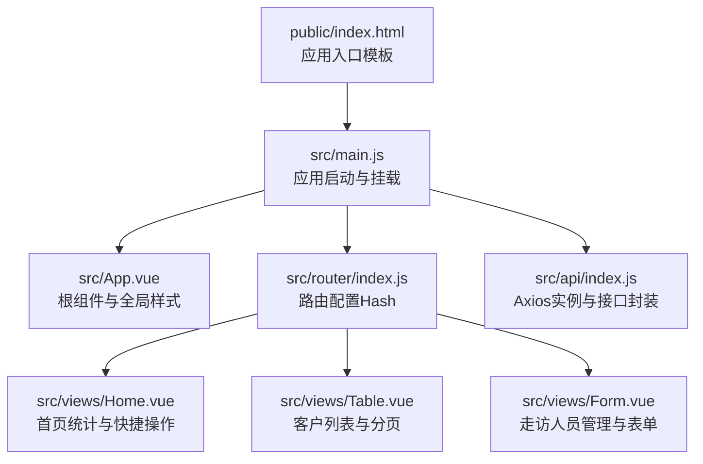
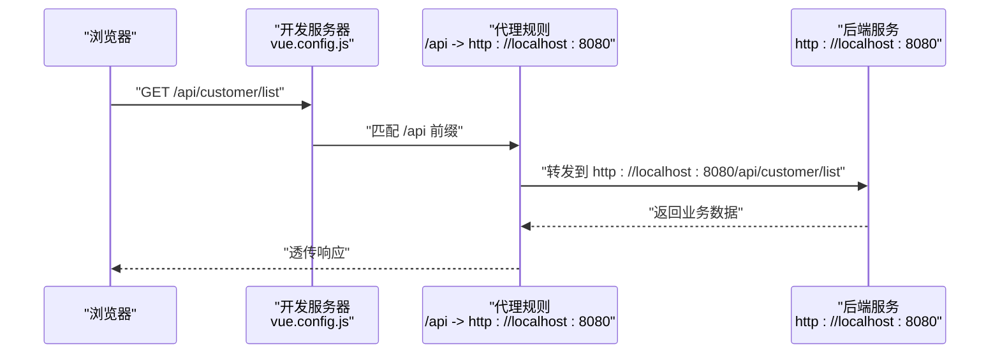
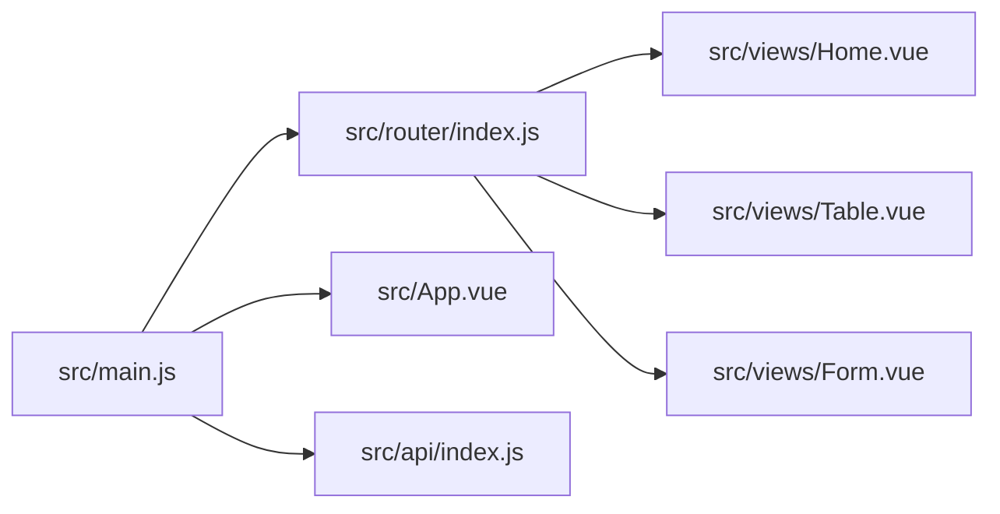

# 构建配置与优化

<cite>
**本文引用的文件**
- [vue.config.js](file://vue.config.js)
- [babel.config.js](file://babel.config.js)
- [package.json](file://package.json)
- [public/index.html](file://public/index.html)
- [src/main.js](file://src/main.js)
- [src/App.vue](file://src/App.vue)
- [src/router/index.js](file://src/router/index.js)
- [src/api/index.js](file://src/api/index.js)
- [src/views/Home.vue](file://src/views/Home.vue)
- [src/views/Table.vue](file://src/views/Table.vue)
- [src/views/Form.vue](file://src/views/Form.vue)
</cite>

## 目录
1. [简介](#简介)
2. [项目结构](#项目结构)
3. [核心组件](#核心组件)
4. [架构总览](#架构总览)
5. [详细组件分析](#详细组件分析)
6. [依赖关系分析](#依赖关系分析)
7. [性能考量](#性能考量)
8. [故障排查指南](#故障排查指南)
9. [结论](#结论)
10. [附录](#附录)

## 简介
本文件面向Vue.js后台管理系统，聚焦于构建配置与优化，系统化解读Vue CLI相关配置（vue.config.js、babel.config.js、package.json）在开发与生产环境下的作用与可扩展点，并结合项目实际源码（路由、API、页面组件）给出可落地的优化建议与最佳实践。内容涵盖：
- 开发服务器与代理配置
- 输出路径与构建优化
- Babel转译与兼容性
- 脚本命令与构建流程
- 性能优化、代码分割与缓存策略
- 高级特性：热重载、Source Map、打包分析

## 项目结构
该项目采用典型的Vue CLI单页应用结构，前端资源位于src目录，模板入口位于public/index.html，运行时通过main.js挂载到DOM。路由采用Hash模式，API统一通过Axios实例进行封装，页面组件按功能拆分至views目录。

图表来源
- [public/index.html:1-17](file://public/index.html#L1-L17)
- [src/main.js:1-18](file://src/main.js#L1-L18)
- [src/App.vue:1-258](file://src/App.vue#L1-L258)
- [src/router/index.js:1-32](file://src/router/index.js#L1-L32)
- [src/api/index.js:1-110](file://src/api/index.js#L1-L110)
- [src/views/Home.vue:1-175](file://src/views/Home.vue#L1-L175)
- [src/views/Table.vue:1-214](file://src/views/Table.vue#L1-L214)
- [src/views/Form.vue:1-143](file://src/views/Form.vue#L1-L143)

章节来源
- [public/index.html:1-17](file://public/index.html#L1-L17)
- [src/main.js:1-18](file://src/main.js#L1-L18)
- [src/router/index.js:1-32](file://src/router/index.js#L1-L32)
- [src/api/index.js:1-110](file://src/api/index.js#L1-L110)

## 核心组件
本节从构建与运行角度梳理关键配置与实现要点。

- Vue CLI服务与脚本
  - serve：启动开发服务器，使用@vue/cli-service提供的serve命令。
  - build：执行生产构建，生成静态资源到默认输出目录。
  - lint：执行代码规范检查。
  
  参考路径：[package.json:5-8](file://package.json#L5-L8)

- 开发服务器与代理
  - 端口与自动打开浏览器。
  - 本地开发时通过代理将/api前缀转发至后端服务地址，避免跨域问题。
  
  参考路径：[vue.config.js:3-12](file://vue.config.js#L3-L12)

- Babel转译与兼容性
  - 使用@vue/cli-plugin-babel预设，确保现代语法在目标浏览器上可用。
  - 浏览器兼容范围由browserslist定义。
  
  参考路径：[babel.config.js:1-5](file://babel.config.js#L1-L5), [package.json:23-27](file://package.json#L23-L27)

- 应用入口与挂载
  - main.js引入路由、UI库与全局样式，创建Vue实例并挂载到#app。
  
  参考路径：[src/main.js:1-18](file://src/main.js#L1-L18), [public/index.html](file://public/index.html#L14)

- 路由与页面
  - Hash路由模式，定义首页、表格、表单三个页面，均采用异步加载提升首屏性能。
  
  参考路径：[src/router/index.js:7-23](file://src/router/index.js#L7-L23), [src/views/Home.vue:1-175](file://src/views/Home.vue#L1-L175), [src/views/Table.vue:1-214](file://src/views/Table.vue#L1-L214), [src/views/Form.vue:1-143](file://src/views/Form.vue#L1-L143)

- API封装与代理联动
  - Axios实例baseURL指向/api，与开发代理一致；响应拦截器统一处理业务错误码。
  
  参考路径：[src/api/index.js:4-31](file://src/api/index.js#L4-L31)

章节来源
- [package.json:5-8](file://package.json#L5-L8)
- [vue.config.js:3-12](file://vue.config.js#L3-L12)
- [babel.config.js:1-5](file://babel.config.js#L1-L5)
- [package.json:23-27](file://package.json#L23-L27)
- [src/main.js:1-18](file://src/main.js#L1-L18)
- [public/index.html](file://public/index.html#L14)
- [src/router/index.js:7-23](file://src/router/index.js#L7-L23)
- [src/api/index.js:4-31](file://src/api/index.js#L4-L31)

## 架构总览
下图展示从浏览器到后端服务的请求链路，以及开发代理如何在本地屏蔽跨域问题。

图表来源
- [vue.config.js:6-11](file://vue.config.js#L6-L11)
- [src/api/index.js:4-7](file://src/api/index.js#L4-L7)

章节来源
- [vue.config.js:6-11](file://vue.config.js#L6-L11)
- [src/api/index.js:4-7](file://src/api/index.js#L4-L7)

## 详细组件分析

### 开发服务器与代理配置
- 端口与自动打开：便于快速预览与调试。
- 代理规则：将/api前缀的请求转发到后端服务，支持跨域场景下的本地联调。
- 关闭ESLint保存时校验：减少开发阶段的阻塞，提高迭代效率。

可扩展建议
- 基于环境变量区分代理目标，实现多环境切换。
- 为不同API前缀配置独立代理，细化路由与权限控制。
- 结合HTTPS与本地证书，模拟真实网络环境。

章节来源
- [vue.config.js:3-12](file://vue.config.js#L3-L12)

### Babel转译与兼容性
- 预设：使用@vue/cli-plugin-babel预设，自动集成常用插件与polyfill策略。
- 浏览器列表：通过browserslist控制目标浏览器范围，影响转译与垫片注入。

可扩展建议
- 在browserslist中明确目标设备与版本，平衡包体与兼容性。
- 如需更细粒度控制，可在.babelrc或babel.config.js中添加插件与选项。

章节来源
- [babel.config.js:1-5](file://babel.config.js#L1-L5)
- [package.json:23-27](file://package.json#L23-L27)

### 构建脚本与流程
- serve：启动开发服务器，支持热重载与实时刷新。
- build：生产构建，输出静态资源到默认目录（通常为dist），用于部署。
- lint：代码规范检查，建议在CI中强制执行。

可扩展建议
- 为不同环境（测试/预发布/生产）定义不同的构建脚本与输出目录。
- 引入构建产物分析工具，持续监控体积变化。

章节来源
- [package.json:5-8](file://package.json#L5-L8)

### 路由与页面组件
- Hash路由：适合无后端支持的静态部署场景。
- 页面组件：采用异步加载，结合路由懒加载减少首屏包体。
- 组件职责清晰：Home负责统计与快捷入口，Table负责数据列表与分页，Form负责表单与列表。

章节来源
- [src/router/index.js:7-23](file://src/router/index.js#L7-L23)
- [src/views/Home.vue:1-175](file://src/views/Home.vue#L1-L175)
- [src/views/Table.vue:1-214](file://src/views/Table.vue#L1-L214)
- [src/views/Form.vue:1-143](file://src/views/Form.vue#L1-L143)

### API封装与拦截器
- Axios实例：统一baseURL与超时时间。
- 请求拦截器：可用于注入鉴权头、埋点等。
- 响应拦截器：统一处理业务错误码，简化调用方逻辑。

章节来源
- [src/api/index.js:4-31](file://src/api/index.js#L4-L31)

## 依赖关系分析
下图展示应用启动与路由加载的关键依赖关系。

图表来源
- [src/main.js:1-18](file://src/main.js#L1-L18)
- [src/router/index.js:1-32](file://src/router/index.js#L1-L32)
- [src/App.vue:1-258](file://src/App.vue#L1-L258)
- [src/api/index.js:1-110](file://src/api/index.js#L1-L110)
- [src/views/Home.vue:1-175](file://src/views/Home.vue#L1-L175)
- [src/views/Table.vue:1-214](file://src/views/Table.vue#L1-L214)
- [src/views/Form.vue:1-143](file://src/views/Form.vue#L1-L143)

章节来源
- [src/main.js:1-18](file://src/main.js#L1-L18)
- [src/router/index.js:1-32](file://src/router/index.js#L1-L32)

## 性能考量
以下为基于现有配置与源码的优化建议，不直接修改当前文件，仅提供可落地的改进方向。

- 代码分割与路由懒加载
  - 已采用路由级懒加载，建议进一步对大型第三方库进行动态导入，减少首屏依赖。
  - 对高频但非首屏使用的组件，采用异步加载。

- 构建优化
  - 生产构建时开启压缩与Tree Shaking（由@vue/cli-service默认启用）。
  - 通过SplitChunks策略分离公共代码与vendor包，降低重复依赖。
  - 使用长缓存命名策略（如contenthash），结合HTTP缓存头提升二次加载速度。

- 缓存策略
  - HTML与静态资源设置合理的Cache-Control与ETag。
  - 对第三方CDN资源，利用浏览器缓存与版本号控制更新。

- Source Map与调试
  - 开发环境使用cheap-module-eval-source-map，提升编译与调试速度。
  - 生产环境使用隐藏式Source Map或分离映射文件，兼顾调试与安全。

- 打包分析
  - 引入webpack-bundle-analyzer或类似工具，定期分析包体构成，识别大体积依赖与重复模块。

- 热重载与开发体验
  - 保持自动打开与端口配置，必要时启用Host与HTTPS以适配内网联调。
  - 代理规则尽量精确，避免误转发导致的调试成本。

- 代理与跨域
  - 代理目标与Axios baseURL保持一致，避免路径拼接错误。
  - 多环境代理可通过环境变量动态配置，减少手工维护。

- UI与样式
  - 全局样式已集中管理，建议对第三方UI库的主题变量进行定制，减少重复覆盖。

章节来源
- [src/router/index.js:16-22](file://src/router/index.js#L16-L22)
- [src/api/index.js:4-7](file://src/api/index.js#L4-L7)

## 故障排查指南
- 代理无效或404
  - 检查代理前缀与Axios baseURL是否一致。
  - 确认后端服务端口与代理目标一致。
  
  参考路径：[vue.config.js:6-11](file://vue.config.js#L6-L11), [src/api/index.js:4-7](file://src/api/index.js#L4-L7)

- 跨域错误
  - 确保代理已启用且匹配/api前缀。
  - 检查后端CORS配置与代理changeOrigin设置。
  
  参考路径：[vue.config.js:6-11](file://vue.config.js#L6-L11)

- 构建失败或体积异常
  - 检查Babel预设与browserslist配置，避免不必要的polyfill。
  - 使用打包分析工具定位大体积模块。
  
  参考路径：[babel.config.js:1-5](file://babel.config.js#L1-L5), [package.json:23-27](file://package.json#L23-L27)

- 页面空白或挂载失败
  - 确认public/index.html中存在#app节点。
  - 检查main.js挂载逻辑与路由初始化。
  
  参考路径：[public/index.html](file://public/index.html#L14), [src/main.js:11-14](file://src/main.js#L11-L14)

- 路由跳转异常
  - 检查路由模式与菜单项index值是否与路由path一致。
  - 确认路由懒加载组件路径正确。
  
  参考路径：[src/router/index.js:7-23](file://src/router/index.js#L7-L23)

章节来源
- [vue.config.js:6-11](file://vue.config.js#L6-L11)
- [src/api/index.js:4-7](file://src/api/index.js#L4-L7)
- [babel.config.js:1-5](file://babel.config.js#L1-L5)
- [package.json:23-27](file://package.json#L23-L27)
- [public/index.html](file://public/index.html#L14)
- [src/main.js:11-14](file://src/main.js#L11-L14)
- [src/router/index.js:7-23](file://src/router/index.js#L7-L23)

## 结论
本项目在构建配置层面简洁实用：开发服务器与代理满足本地联调需求，Babel与browserslist保障兼容性，脚本命令覆盖开发、构建与规范检查。结合现有源码（路由懒加载、API封装、页面组件职责划分），可进一步完善性能优化与工程化细节，形成稳定高效的前端交付流水线。

## 附录
- 开发与生产差异化配置策略
  - 开发：启用热重载、Source Map、代理；关闭严格校验与压缩。
  - 生产：启用压缩、Tree Shaking、长缓存命名；输出分析报告。
- 高级配置建议
  - 热重载：保持默认行为，必要时调整host与端口。
  - Source Map：开发使用易调试类型，生产使用隐藏或分离映射。
  - 打包分析：定期分析，建立阈值预警机制。