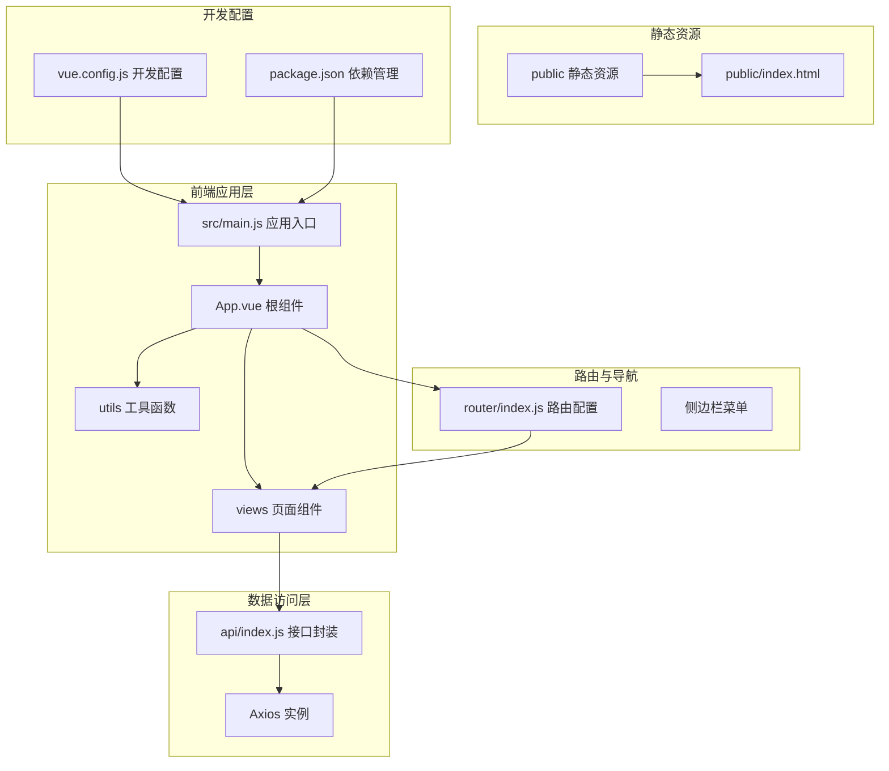
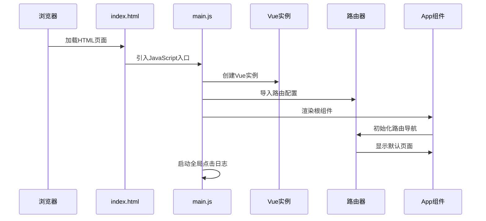
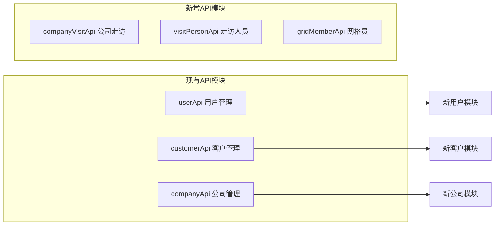

# 目录结构设计

<cite>
**本文档引用的文件**
- [src/main.js](file://src/main.js)
- [src/App.vue](file://src/App.vue)
- [src/router/index.js](file://src/router/index.js)
- [src/api/index.js](file://src/api/index.js)
- [src/views/Home.vue](file://src/views/Home.vue)
- [src/views/Table.vue](file://src/views/Table.vue)
- [src/views/Form.vue](file://src/views/Form.vue)
- [src/utils/clickLogger.js](file://src/utils/clickLogger.js)
- [public/index.html](file://public/index.html)
- [vue.config.js](file://vue.config.js)
- [package.json](file://package.json)
</cite>

## 目录结构设计

### 项目架构概览

该Vue.js后台管理系统采用经典的单页应用(SPA)架构，基于Vue 2.7.16和Element UI 2.15.14构建。整个项目遵循模块化设计理念，通过清晰的目录结构实现关注点分离。

**图表来源**
- [src/main.js:1-18](file://src/main.js#L1-L18)
- [src/App.vue:1-258](file://src/App.vue#L1-L258)
- [src/router/index.js:1-32](file://src/router/index.js#L1-L32)
- [src/api/index.js:1-110](file://src/api/index.js#L1-L110)

### 核心目录职责划分

#### src/api 目录 - 接口封装层

**职责定位**: 统一的数据访问抽象层，提供业务相关的API接口封装

**设计原则**:
- 基于Axios创建统一的HTTP客户端实例
- 实现请求和响应拦截器，处理通用逻辑
- 按业务领域分组导出API模块，便于维护和扩展

**核心功能**:
- 统一的请求前缀配置 `/api`
- 自动化的错误处理机制
- 支持Promise.all并发请求优化
- 模块化的业务API分组设计

**最佳实践**:
- 每个业务实体对应独立的API模块
- 统一的错误处理和消息提示
- 支持批量操作和分页查询
- 清晰的API命名约定

**章节来源**
- [src/api/index.js:1-110](file://src/api/index.js#L1-L110)

#### src/router 目录 - 路由配置层

**职责定位**: 应用路由规则定义和页面导航控制

**设计特点**:
- 基于Vue Router 3.6.5的Hash模式路由
- 动态导入优化首屏加载性能
- 与Element UI菜单的双向绑定

**路由策略**:
- 首页路由 `/` 对应 Home 页面
- 列表页面 `/table` 对应 Table 页面  
- 表单页面 `/form` 对应 Form 页面
- 支持懒加载提升应用启动速度

**章节来源**
- [src/router/index.js:1-32](file://src/router/index.js#L1-L32)

#### src/views 目录 - 页面组件层

**职责定位**: 具体业务页面的实现，包含完整的业务逻辑

**页面设计**:
- **Home.vue**: 仪表板主页，展示统计信息和快捷操作
- **Table.vue**: 数据表格页面，支持搜索、分页、增删改查
- **Form.vue**: 表单页面，处理走访人员管理业务

**组件特性**:
- 基于Element UI的完整UI组件库
- 响应式布局设计
- 表单验证和数据绑定
- 弹窗对话框和分页组件

**章节来源**
- [src/views/Home.vue:1-175](file://src/views/Home.vue#L1-L175)
- [src/views/Table.vue:1-214](file://src/views/Table.vue#L1-L214)
- [src/views/Form.vue:1-143](file://src/views/Form.vue#L1-L143)

#### src/utils 目录 - 工具函数层

**职责定位**: 提供可复用的工具函数和辅助方法

**核心工具**:
- **clickLogger.js**: 全局点击行为日志记录工具
- 支持事件委托捕获页面所有点击行为
- 输出结构化的日志信息到浏览器控制台
- 提供安装和卸载功能

**日志记录功能**:
- 记录点击序列号、时间戳
- 追踪当前路由路径和组件名称
- 获取元素描述和点击坐标位置
- 格式化的控制台输出和表格显示

**章节来源**
- [src/utils/clickLogger.js:1-71](file://src/utils/clickLogger.js#L1-L71)

#### public 目录 - 静态资源层

**职责定位**: 存放不参与构建过程的静态资源文件

**核心文件**:
- **index.html**: 应用的HTML模板文件
- 包含基础的meta标签和应用挂载点
- 支持favicon图标和国际化配置

**使用原则**:
- 文件名保持不变，避免构建时重命名
- 通过相对路径引用，确保部署兼容性
- 适合放置不需要webpack处理的静态资源

**章节来源**
- [public/index.html:1-17](file://public/index.html#L1-L17)

### 应用入口与初始化流程

**图表来源**
- [src/main.js:1-18](file://src/main.js#L1-L18)
- [src/App.vue:1-258](file://src/App.vue#L1-L258)
- [src/router/index.js:1-32](file://src/router/index.js#L1-L32)

### 文件命名规范与组织原则

#### 命名约定标准

**目录命名**:
- 使用小写字母和中划线分隔
- 语义化命名，如 `api`、`router`、`views`、`utils`
- 避免缩写，确保可读性

**文件命名**:
- Vue组件文件使用PascalCase命名，如 `Home.vue`
- JavaScript模块文件使用camelCase命名，如 `index.js`
- 工具函数文件使用小写加下划线命名，如 `clickLogger.js`

**组件分类策略**:
- 页面组件：位于 `views` 目录，包含完整业务逻辑
- 可复用组件：建议单独创建 `components` 目录存放
- 工具函数：位于 `utils` 目录，提供单一职责功能

#### 代码组织原则

**关注点分离**:
- 视图层与逻辑层分离，每个Vue文件职责明确
- API层与视图层解耦，通过接口调用进行通信
- 配置层独立管理，便于环境切换

**模块化设计**:
- 每个业务域独立模块，便于团队协作
- 统一的错误处理和状态管理
- 清晰的依赖关系和导入导出规范

### 扩展性考虑与维护性设计

#### 架构扩展点

**API层扩展**:

**图表来源**
- [src/api/index.js:34-107](file://src/api/index.js#L34-L107)

**路由扩展策略**:
- 新增页面时只需在路由配置中添加条目
- 支持嵌套路由和动态路由参数
- 保持路由命名的一致性和可预测性

**组件复用设计**:
- 将通用UI组件提取到独立文件
- 使用props和events实现组件间通信
- 支持插槽(slots)增强组件灵活性

#### 性能优化考虑

**懒加载实现**:
- 路由级别的代码分割
- 按需加载大型组件
- 减少初始包体积

**开发服务器配置**:
- 代理配置支持前后端分离开发
- 端口自定义和自动打开浏览器
- 热重载和错误提示

**章节来源**
- [vue.config.js:1-14](file://vue.config.js#L1-L14)
- [package.json:1-29](file://package.json#L1-L29)

### 维护性最佳实践

#### 代码质量保证

**依赖管理**:
- 明确的生产环境和开发环境依赖区分
- 版本锁定和安全更新策略
- 清晰的脚本命令定义

**开发工具集成**:
- ESLint代码规范检查
- 自动化测试集成
- 持续集成和部署流程

#### 故障排查指南

**常见问题诊断**:
- API请求失败时检查代理配置
- 路由跳转异常时验证路由定义
- 组件渲染问题时检查props传递

**调试工具使用**:
- 浏览器开发者工具
- Vue DevTools插件
- 全局点击日志分析

通过这种结构化的目录设计，项目实现了良好的可维护性、可扩展性和团队协作效率，为后续的功能扩展和性能优化奠定了坚实基础。