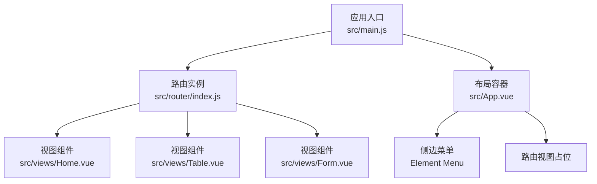
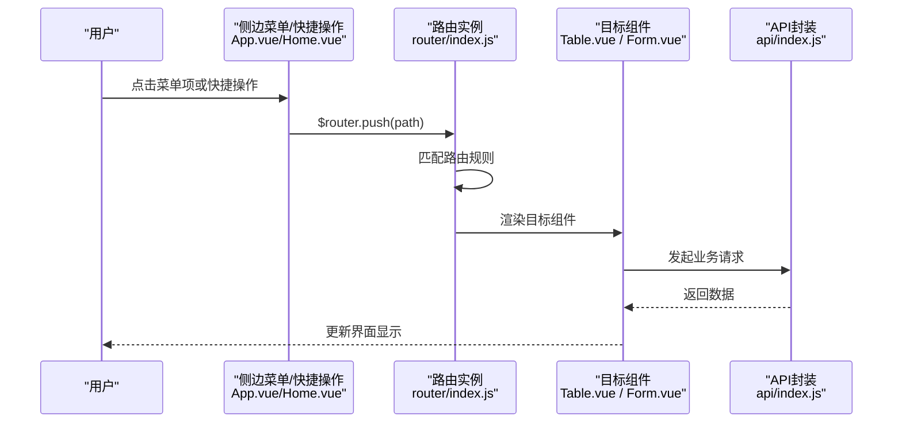
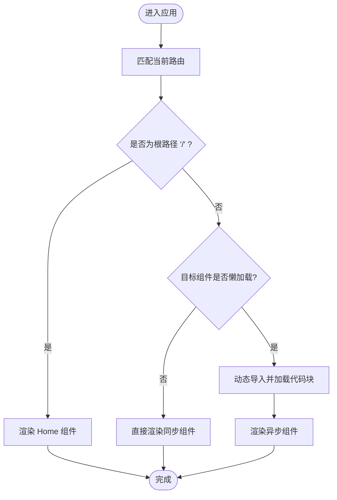
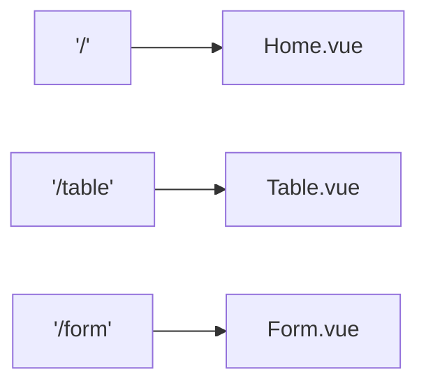
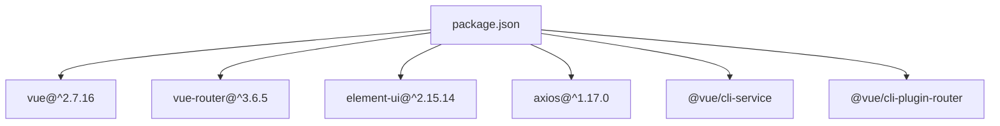

# 路由系统设计

<cite>
**本文引用的文件**
- [src/router/index.js](file://src/router/index.js)
- [src/main.js](file://src/main.js)
- [src/App.vue](file://src/App.vue)
- [src/views/Home.vue](file://src/views/Home.vue)
- [src/views/Table.vue](file://src/views/Table.vue)
- [src/views/Form.vue](file://src/views/Form.vue)
- [package.json](file://package.json)
- [src/api/index.js](file://src/api/index.js)
- [src/utils/clickLogger.js](file://src/utils/clickLogger.js)
</cite>

## 目录
1. [引言](#引言)
2. [项目结构](#项目结构)
3. [核心组件](#核心组件)
4. [架构总览](#架构总览)
5. [详细组件分析](#详细组件分析)
6. [依赖分析](#依赖分析)
7. [性能考虑](#性能考虑)
8. [故障排查指南](#故障排查指南)
9. [结论](#结论)
10. [附录](#附录)

## 引言
本文件面向Vue.js后台管理系统，系统性梳理路由体系的设计与实现，重点覆盖以下方面：
- 路由表定义与懒加载策略
- 路由与页面组件的映射关系
- 导航守卫与权限控制机制（现状与扩展建议）
- 嵌套路由设计与最佳实践
- 路由跳转最佳实践、性能优化与SEO考虑
- 调试工具与常见问题排查

当前仓库采用Vue Router 3.x（Vue 2.7），使用Hash模式进行路由切换，并在部分页面采用动态导入实现组件级懒加载。

## 项目结构
该系统采用“按功能分层”的组织方式，路由配置集中在router目录，页面组件位于views目录，入口在main.js中注入路由实例。

图表来源
- [src/main.js:11-14](file://src/main.js#L11-L14)
- [src/router/index.js:25-29](file://src/router/index.js#L25-L29)
- [src/App.vue:44-46](file://src/App.vue#L44-L46)

章节来源
- [src/main.js:1-18](file://src/main.js#L1-L18)
- [src/router/index.js:1-32](file://src/router/index.js#L1-L32)
- [src/App.vue:1-258](file://src/App.vue#L1-L258)

## 核心组件
- 路由实例与路由表
  - 在路由模块中集中定义routes数组，包含根路径、表格页与表单页。
  - 使用动态导入实现Table与Form组件的懒加载，减少首屏包体。
  - 路由实例以Hash模式创建，便于部署到任意静态服务器。
- 应用入口
  - 在main.js中挂载路由实例，使整个应用具备路由能力。
- 布局与导航
  - App.vue中通过Element Menu的index属性与路由联动，结合默认激活项绑定当前路由路径，形成统一的导航体验。
  - 侧边栏菜单项与路由路径一一对应，点击即触发路由跳转。

章节来源
- [src/router/index.js:7-23](file://src/router/index.js#L7-L23)
- [src/router/index.js:25-29](file://src/router/index.js#L25-L29)
- [src/main.js:11-14](file://src/main.js#L11-L14)
- [src/App.vue:8-27](file://src/App.vue#L8-L27)

## 架构总览
下图展示从用户交互到组件渲染的完整流程：用户点击菜单或快捷操作 → 触发路由跳转 → Vue Router匹配路由 → 渲染对应组件 → 组件内发起API请求并更新状态。

图表来源
- [src/App.vue:15-26](file://src/App.vue#L15-L26)
- [src/views/Home.vue:148-154](file://src/views/Home.vue#L148-L154)
- [src/router/index.js:25-29](file://src/router/index.js#L25-L29)
- [src/views/Table.vue:136-154](file://src/views/Table.vue#L136-L154)
- [src/views/Form.vue:92-112](file://src/views/Form.vue#L92-L112)
- [src/api/index.js:1-42](file://src/api/index.js#L1-L42)

## 详细组件分析

### 路由表与懒加载
- 路由表定义
  - routes数组包含根路径、表格页与表单页，分别映射至不同组件。
  - 首屏组件Home采用同步引入，其余两个页面采用动态导入实现懒加载。
- 懒加载实现原理
  - 动态导入返回Promise，Webpack在打包时将其拆分为独立chunk，首次访问时再按需加载。
  - 优点：降低首屏体积，提升初始加载速度；缺点：首次访问会有轻微延迟。
- Hash模式
  - 通过mode: 'hash'配置，路由使用URL片段标识，无需服务端额外配置即可部署。

图表来源
- [src/router/index.js:7-23](file://src/router/index.js#L7-L23)
- [src/router/index.js:16](file://src/router/index.js#L16)
- [src/router/index.js:20](file://src/router/index.js#L20)

章节来源
- [src/router/index.js:7-23](file://src/router/index.js#L7-L23)
- [src/router/index.js:25-29](file://src/router/index.js#L25-L29)

### 路由与页面组件映射
- 映射关系
  - '/' → Home.vue
  - '/table' → Table.vue（懒加载）
  - '/form' → Form.vue（懒加载）
- 组件职责
  - Home.vue：统计信息展示、快捷操作入口，内部通过$router.push跳转至对应页面。
  - Table.vue：客户列表展示、搜索、分页、新增/编辑/删除等CRUD操作。
  - Form.vue：走访人员管理与列表展示，支持新增/编辑/删除。

图表来源
- [src/router/index.js:7-23](file://src/router/index.js#L7-L23)
- [src/views/Home.vue:120-125](file://src/views/Home.vue#L120-L125)
- [src/views/Table.vue:101-127](file://src/views/Table.vue#L101-L127)
- [src/views/Form.vue:59-76](file://src/views/Form.vue#L59-L76)

章节来源
- [src/views/Home.vue:120-125](file://src/views/Home.vue#L120-L125)
- [src/views/Home.vue:148-154](file://src/views/Home.vue#L148-L154)
- [src/views/Table.vue:101-127](file://src/views/Table.vue#L101-L127)
- [src/views/Form.vue:59-76](file://src/views/Form.vue#L59-L76)

### 导航守卫与权限控制
- 当前实现
  - 项目未配置全局或局部导航守卫，路由跳转逻辑主要通过菜单与组件内的编程式导航实现。
- 权限控制建议
  - 可在路由表中增加meta字段用于标识权限与角色，如meta: { requiresAuth: true, roles: [...] }。
  - 在beforeEach中校验用户状态与路由权限，未授权时重定向至登录页或无权限提示页。
  - 结合路由元信息与后端接口，实现细粒度的按钮级权限控制。
- 注意事项
  - 守卫逻辑应避免阻塞首屏渲染，必要时采用异步守卫。
  - 对于懒加载组件，确保守卫在组件加载前完成鉴权判断。

章节来源
- [src/router/index.js:7-23](file://src/router/index.js#L7-L23)

### 嵌套路由设计
- 当前设计
  - 路由表为扁平结构，未使用嵌套路由。
- 设计建议
  - 将公共布局抽离为父路由，子路由承载具体页面，适合多标签页或多视图场景。
  - 父路由可放置通用头部/侧边栏，子路由负责内容区渲染，提升复用性与一致性。
- 适用场景
  - 大型后台系统常采用“布局路由 + 页面路由”的嵌套结构，便于统一管理面包屑、标题与权限。

章节来源
- [src/router/index.js:7-23](file://src/router/index.js#L7-L23)

### 路由跳转最佳实践
- 编程式导航
  - 使用$router.push进行跳转，配合参数传递与查询字符串，保持URL可分享与可追踪。
- 声明式导航
  - Element Menu通过index与路由联动，简化菜单到页面的映射。
- 快捷操作
  - Home.vue中的快捷操作通过$router.push跳转，提升用户体验与效率。
- 参数与查询
  - 对需要携带参数的页面，优先使用路由参数或查询参数，避免通过全局状态传递复杂数据。

章节来源
- [src/App.vue:15-26](file://src/App.vue#L15-L26)
- [src/views/Home.vue:148-154](file://src/views/Home.vue#L148-L154)

### 性能优化策略
- 代码分割
  - 已对Table与Form采用动态导入，建议对大型页面或第三方库进一步拆分。
- 预加载与预取
  - 对高频访问页面可在空闲时进行预取，提升二次访问速度。
- 路由缓存
  - 结合keep-alive与路由元信息，仅对需要缓存的页面启用缓存，避免内存占用过高。
- 首屏优化
  - 将非关键资源延迟加载，合理安排资源加载顺序，缩短可交互时间。

章节来源
- [src/router/index.js:16](file://src/router/index.js#L16)
- [src/router/index.js:20](file://src/router/index.js#L20)

### SEO考虑
- Hash模式
  - 当前使用Hash模式，利于部署但不利于SEO；若需SEO，建议迁移到History模式并配置服务端回退。
- Meta信息
  - 为不同页面设置独特的<title>与<meta>描述，便于搜索引擎识别。
- 结构化数据
  - 对重要页面可添加结构化数据标记，提升搜索结果丰富度。

章节来源
- [src/router/index.js:26](file://src/router/index.js#L26)
- [src/views/Home.vue:108-156](file://src/views/Home.vue#L108-L156)

## 依赖分析
- 核心依赖
  - Vue 2.7.16：运行时框架
  - Vue Router 3.6.5：路由管理
  - Element UI 2.15.14：UI组件库
  - Axios：HTTP客户端
- 开发依赖
  - @vue/cli-service：构建与开发工具链
  - @vue/cli-plugin-router：路由插件
- 关系图

图表来源
- [package.json:10-22](file://package.json#L10-L22)

章节来源
- [package.json:10-22](file://package.json#L10-L22)

## 性能考虑
- 首屏加载
  - 通过懒加载减少首屏脚本体积，结合路由级别的代码分割，显著改善TTFB与FCP。
- 运行时性能
  - 对频繁切换的页面启用keep-alive缓存，减少重复渲染与请求。
- 资源优化
  - 图片与字体资源按需加载，CSS作用域化避免冲突。
- 调试与监控
  - 使用浏览器开发者工具的Network与Performance面板观察路由切换与资源加载情况。

## 故障排查指南
- 路由无法跳转
  - 检查路由表中是否存在对应路径，确认菜单index与路由path一致。
  - 若使用编程式导航，确认传入的路径格式正确。
- 组件未渲染
  - 确认路由是否匹配，检查动态导入是否返回有效组件。
  - 查看控制台是否有模块加载错误。
- 懒加载失败
  - 检查打包后的chunk命名与路径，确认服务端可访问对应资源。
- API请求异常
  - 检查API封装中的拦截器与错误处理逻辑，确认响应格式符合预期。
- 调试工具
  - 全局点击日志工具：安装后可捕获点击事件并输出结构化日志，辅助定位路由与组件交互问题。
    - 安装位置：main.js中调用installClickLogger
    - 日志字段：序号、时间、路由路径、组件名、元素描述、坐标等
  - 使用建议：在开发阶段开启，生产环境关闭，避免影响性能。

章节来源
- [src/utils/clickLogger.js:62-70](file://src/utils/clickLogger.js#L62-L70)
- [src/main.js:16-18](file://src/main.js#L16-L18)
- [src/api/index.js:9-31](file://src/api/index.js#L9-L31)

## 结论
本项目采用简洁清晰的路由设计：扁平路由表 + Hash模式 + 组件级懒加载，满足后台管理系统的快速迭代需求。建议后续在以下方面持续演进：
- 引入导航守卫与权限控制，强化安全与细粒度权限管理
- 评估History模式与服务端配置，兼顾SEO与部署便利性
- 逐步引入嵌套路由与缓存策略，提升复杂场景下的用户体验
- 完善路由调试与监控手段，保障线上稳定性

## 附录
- 路由表定义参考路径
  - [路由表与实例创建:7-29](file://src/router/index.js#L7-L29)
- 路由与组件映射参考路径
  - [Home.vue:120-125](file://src/views/Home.vue#L120-L125)
  - [Table.vue:101-127](file://src/views/Table.vue#L101-L127)
  - [Form.vue:59-76](file://src/views/Form.vue#L59-L76)
- 布局与导航参考路径
  - [App.vue中的菜单与路由视图:8-27](file://src/App.vue#L8-L27)
  - [App.vue中的路由视图占位:44-46](file://src/App.vue#L44-L46)
- API封装与拦截器参考路径
  - [API封装与拦截器:1-42](file://src/api/index.js#L1-L42)
- 调试工具参考路径
  - [全局点击日志工具安装与使用:62-70](file://src/utils/clickLogger.js#L62-L70)
  - [main.js中启动日志工具:16-18](file://src/main.js#L16-L18)