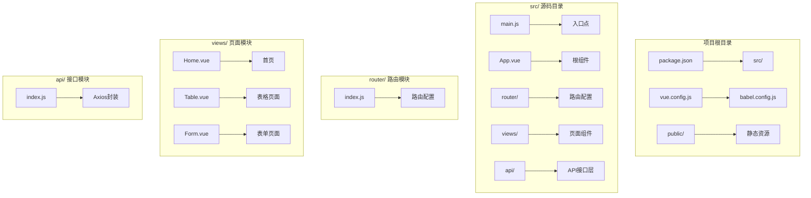
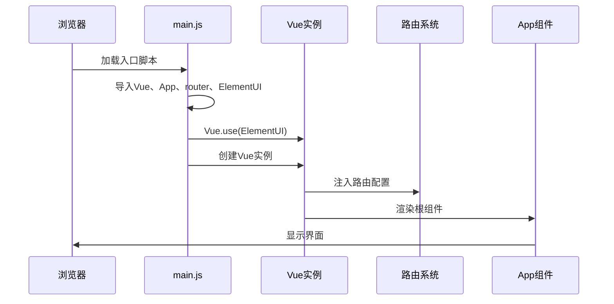
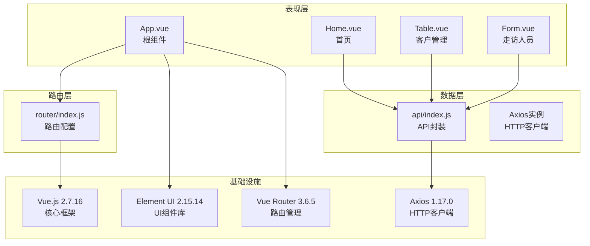
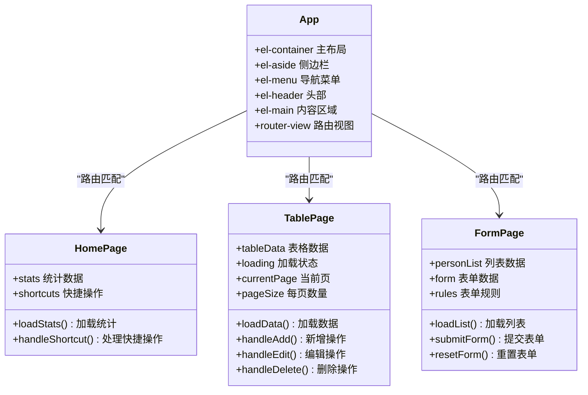
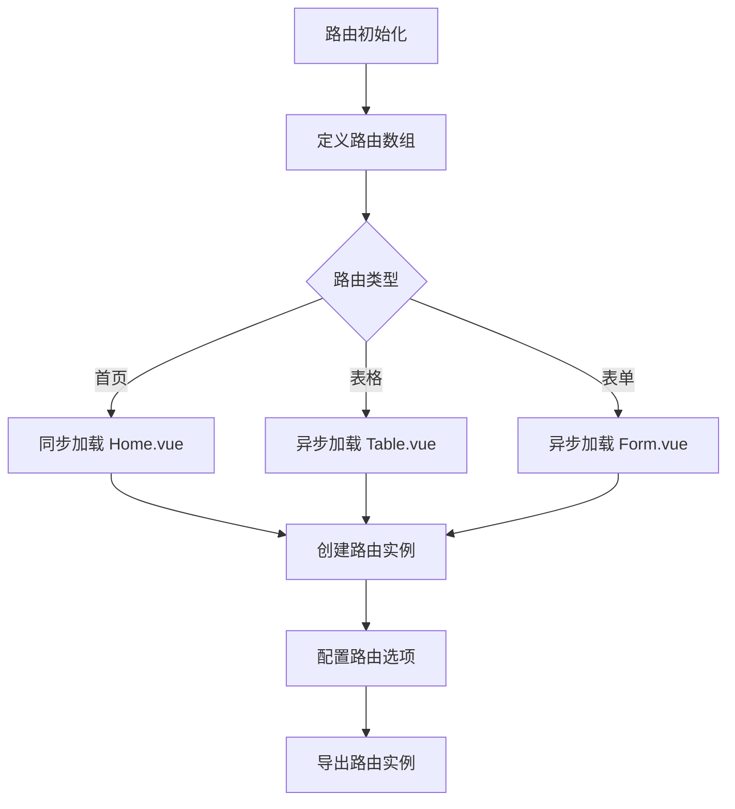
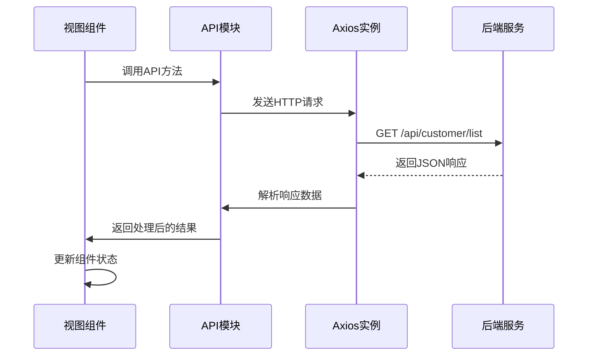
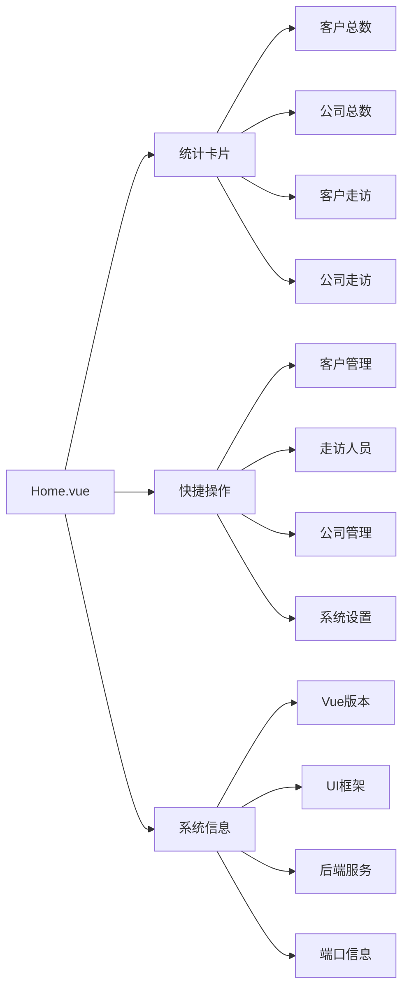
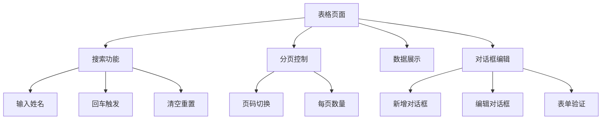
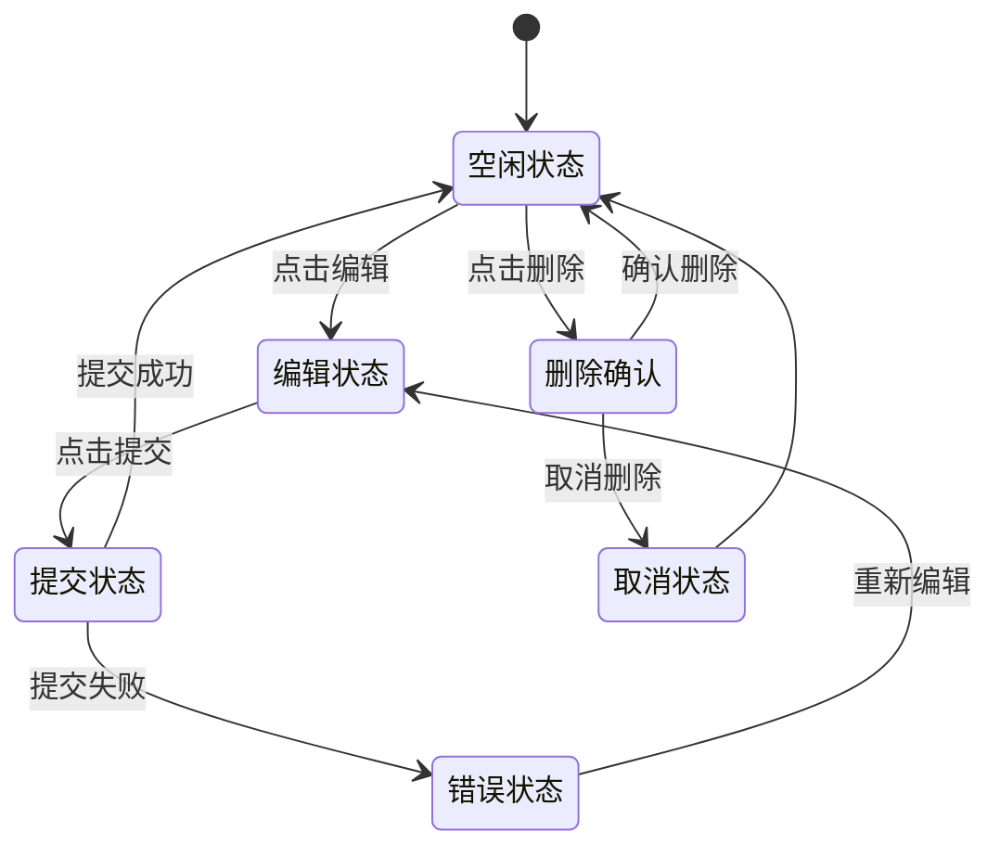

# 项目架构

<cite>
**本文档引用的文件**
- [package.json](file://package.json)
- [main.js](file://src/main.js)
- [App.vue](file://src/App.vue)
- [router/index.js](file://src/router/index.js)
- [views/Home.vue](file://src/views/Home.vue)
- [views/Table.vue](file://src/views/Table.vue)
- [views/Form.vue](file://src/views/Form.vue)
- [api/index.js](file://src/api/index.js)
- [vue.config.js](file://vue.config.js)
- [babel.config.js](file://babel.config.js)
</cite>

## 目录
1. [项目概述](#项目概述)
2. [项目结构](#项目结构)
3. [核心组件](#核心组件)
4. [架构总览](#架构总览)
5. [详细组件分析](#详细组件分析)
6. [依赖关系分析](#依赖关系分析)
7. [性能考虑](#性能考虑)
8. [故障排除指南](#故障排除指南)
9. [结论](#结论)

## 项目概述

这是一个基于Vue.js 2.7.16开发的后台管理系统，采用Element UI 2.15.14作为UI组件库，实现了客户管理、公司管理、走访人员管理等核心业务功能。系统采用模块化架构设计，通过Vue Router实现页面路由管理，使用Axios进行HTTP通信，具备良好的可扩展性和维护性。

## 项目结构

该项目采用标准的Vue CLI项目结构，主要分为以下几个层次：



**图表来源**
- [main.js:1-14](file://src/main.js#L1-L14)
- [router/index.js:1-32](file://src/router/index.js#L1-L32)
- [views/Home.vue:1-175](file://src/views/Home.vue#L1-L175)

### 目录结构设计原理

项目采用按功能模块划分的组织方式，每个模块都有明确的职责边界：

- **src/**: 核心源码目录，包含所有业务逻辑
- **src/router/**: 路由配置模块，集中管理页面路由
- **src/views/**: 视图组件模块，按页面功能划分
- **src/api/**: API接口模块，统一处理HTTP请求
- **public/**: 静态资源目录（未在项目中实际使用）

**章节来源**
- [package.json:1-29](file://package.json#L1-L29)
- [main.js:1-14](file://src/main.js#L1-L14)

## 核心组件

### 应用初始化流程

应用启动采用标准的Vue CLI初始化流程，主要步骤包括：

1. **依赖导入**: 导入Vue核心、路由、UI组件库
2. **插件注册**: 注册Element UI插件
3. **实例创建**: 创建Vue实例并挂载到DOM节点
4. **路由配置**: 初始化路由系统



**图表来源**
- [main.js:1-14](file://src/main.js#L1-L14)
- [App.vue:1-258](file://src/App.vue#L1-L258)

### Element UI集成策略

项目采用全局引入的方式集成Element UI组件库：

- **完整引入**: 引入整个Element UI库，便于使用各种UI组件
- **样式引入**: 引入默认主题样式文件
- **主题定制**: 通过CSS覆盖实现暗黑主题效果

**章节来源**
- [main.js:4-7](file://src/main.js#L4-L7)
- [App.vue:58-257](file://src/App.vue#L58-L257)

## 架构总览

系统采用分层架构设计，各层职责清晰分离：



**图表来源**
- [App.vue:1-258](file://src/App.vue#L1-L258)
- [router/index.js:1-32](file://src/router/index.js#L1-L32)
- [api/index.js:1-110](file://src/api/index.js#L1-L110)

### 组件层次结构

系统采用容器-展示组件模式，组件层次清晰：



**图表来源**
- [App.vue:52-56](file://src/App.vue#L52-L56)
- [views/Home.vue:107-157](file://src/views/Home.vue#L107-L157)
- [views/Table.vue:98-208](file://src/views/Table.vue#L98-L208)
- [views/Form.vue:56-137](file://src/views/Form.vue#L56-L137)

## 详细组件分析

### 路由系统配置

路由系统采用Vue Router实现，支持懒加载和动态导入：



**图表来源**
- [router/index.js:7-29](file://src/router/index.js#L7-L29)

#### 路由配置特点

- **模式选择**: 使用hash模式确保兼容性
- **懒加载**: 对非首页组件采用动态导入优化首屏加载
- **路径映射**: 一对一映射到对应视图组件

**章节来源**
- [router/index.js:1-32](file://src/router/index.js#L1-L32)

### API接口层设计

API层采用Axios封装，提供统一的HTTP通信接口：



**图表来源**
- [api/index.js:44-54](file://src/api/index.js#L44-L54)

#### API设计原则

- **统一基地址**: 所有API请求统一使用`/api`前缀
- **错误处理**: 通过响应拦截器统一处理业务错误
- **模块化**: 按业务领域划分API模块
- **Promise支持**: 所有API方法返回Promise对象

**章节来源**
- [api/index.js:1-110](file://src/api/index.js#L1-L110)

### 视图组件分析

#### 首页组件 (Home.vue)

首页组件采用卡片式布局，展示核心统计数据和快捷操作：



**图表来源**
- [views/Home.vue:3-56](file://src/views/Home.vue#L3-L56)
- [views/Home.vue:120-126](file://src/views/Home.vue#L120-L126)

#### 表格组件 (Table.vue)

表格组件实现完整的CRUD操作，支持分页和搜索：



**图表来源**
- [views/Table.vue:1-96](file://src/views/Table.vue#L1-L96)

#### 表单组件 (Form.vue)

表单组件实现数据录入和管理功能：



**图表来源**
- [views/Form.vue:92-135](file://src/views/Form.vue#L92-L135)

**章节来源**
- [views/Home.vue:1-175](file://src/views/Home.vue#L1-L175)
- [views/Table.vue:1-214](file://src/views/Table.vue#L1-L214)
- [views/Form.vue:1-143](file://src/views/Form.vue#L1-L143)

## 依赖关系分析

### 技术栈依赖

项目采用渐进式技术栈，各依赖项协同工作：

```mermaid
graph TB
subgraph "运行时依赖"
A[Vue 2.7.16<br/>核心框架]
B[Element UI 2.15.14<br/>UI组件库]
C[Vue Router 3.6.5<br/>路由管理]
D[Axios 1.17.0<br/>HTTP客户端]
E[Core-js 3.8.3<br/>Polyfill支持]
end
subgraph "开发时依赖"
F[@vue/cli-service 5.0.0<br/>构建工具]
G[@vue/cli-plugin-babel 5.0.0<br/>Babel支持]
H[@vue/cli-plugin-router 5.0.0<br/>路由插件]
I[Vue Template Compiler<br/>模板编译]
end
A --> C
A --> B
A --> D
B --> A
C --> A
D --> A
```

**图表来源**
- [package.json:10-22](file://package.json#L10-L22)

### 构建配置分析

Vue CLI配置文件提供了开发服务器和代理设置：

```mermaid
flowchart LR
A[vue.config.js] --> B[开发服务器]
B --> C[端口配置: 8082]
B --> D[自动打开浏览器]
B --> E[API代理]
E --> F[/api -> http://localhost:8080]
E --> G[跨域处理]
```

**图表来源**
- [vue.config.js:1-14](file://vue.config.js#L1-L14)

**章节来源**
- [package.json:1-29](file://package.json#L1-L29)
- [vue.config.js:1-14](file://vue.config.js#L1-L14)

## 性能考虑

### 代码分割与懒加载

项目采用动态导入实现代码分割，优化首屏加载性能：

- **路由级懒加载**: 非首页组件使用`() => import()`语法
- **按需加载**: 减少初始包体积
- **缓存策略**: 浏览器自动缓存已加载的模块

### 组件优化策略

- **虚拟滚动**: 对于大量数据的场景可考虑实现虚拟滚动
- **防抖节流**: 搜索和输入事件可添加防抖处理
- **图片懒加载**: 图片资源可采用懒加载优化
- **组件缓存**: 对于复杂计算的组件可添加缓存机制

### 构建优化

- **Tree Shaking**: 确保只打包使用的代码
- **压缩混淆**: 生产环境自动启用代码压缩
- **Source Map**: 开发环境保留调试信息

## 故障排除指南

### 常见问题诊断

#### API请求失败

当遇到API请求失败时，检查以下要点：

1. **代理配置**: 确认`vue.config.js`中的代理设置正确
2. **网络连接**: 验证后端服务是否正常运行
3. **CORS问题**: 检查跨域配置是否正确
4. **响应格式**: 确认后端返回的数据格式符合预期

#### 路由跳转异常

路由跳转问题的排查步骤：

1. **路由配置**: 检查`router/index.js`中的路由定义
2. **路径匹配**: 确认路由路径与组件映射正确
3. **导航守卫**: 检查是否存在路由拦截逻辑
4. **Hash模式**: 确认浏览器兼容性

#### UI组件显示异常

Element UI组件显示问题的解决方法：

1. **样式冲突**: 检查自定义样式的覆盖情况
2. **版本兼容**: 确认Vue和Element UI版本匹配
3. **主题配置**: 验证主题样式文件是否正确引入
4. **组件属性**: 检查组件属性和事件绑定

**章节来源**
- [api/index.js:20-31](file://src/api/index.js#L20-L31)
- [vue.config.js:6-12](file://vue.config.js#L6-L12)

## 结论

该Vue.js后台管理系统采用了清晰的分层架构设计，通过模块化的组件组织实现了良好的可维护性和可扩展性。项目的主要优势包括：

1. **架构清晰**: 分层设计使各模块职责明确，便于团队协作
2. **组件复用**: 通过组件化开发提高了代码复用率
3. **性能优化**: 采用懒加载和代码分割优化了加载性能
4. **开发体验**: 基于Vue CLI的开发工具链提供了良好的开发体验

未来可以考虑的改进方向：
- 升级到Vue 3以获得更好的性能和Composition API
- 添加单元测试和端到端测试提升代码质量
- 实现国际化支持以适应多语言需求
- 添加状态管理方案如Vuex或Pinia