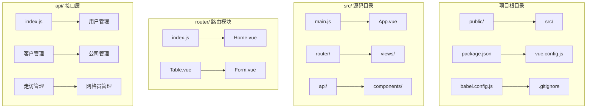
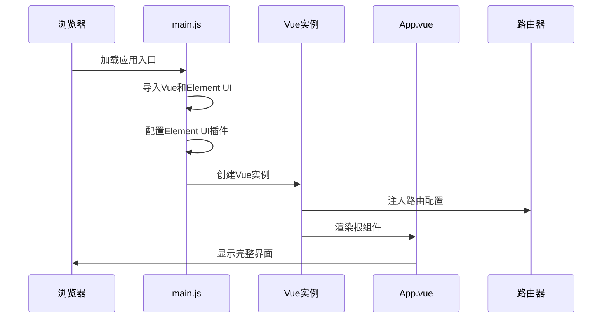
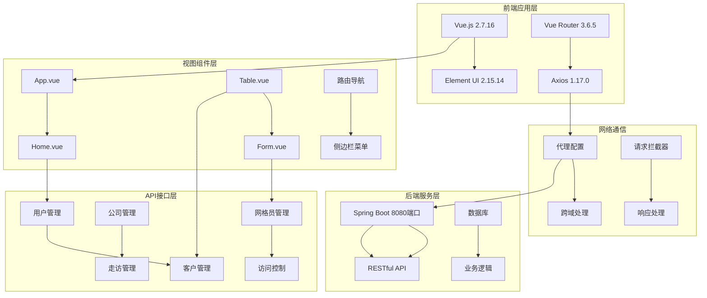
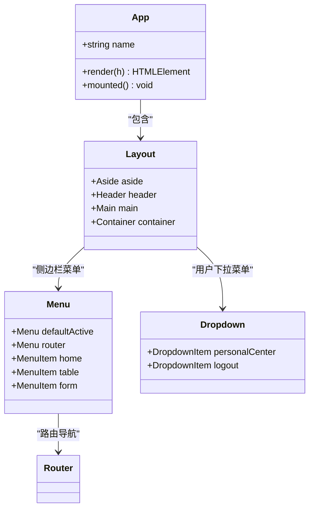
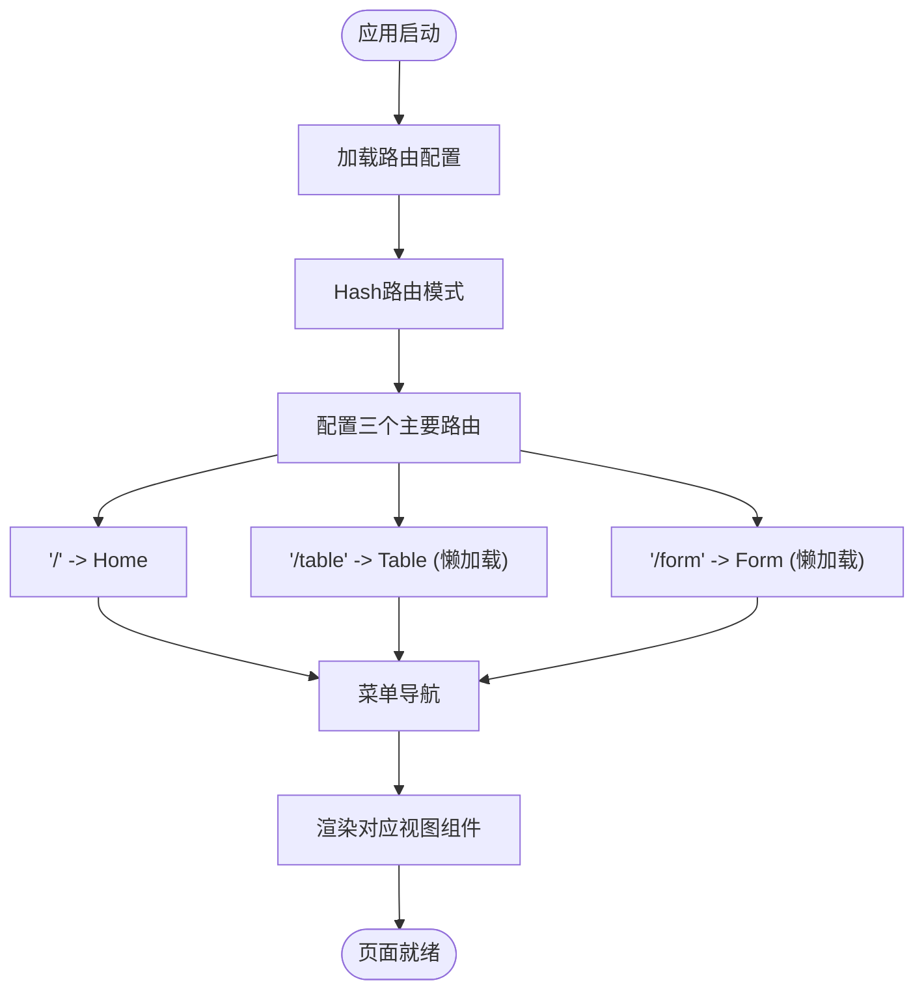
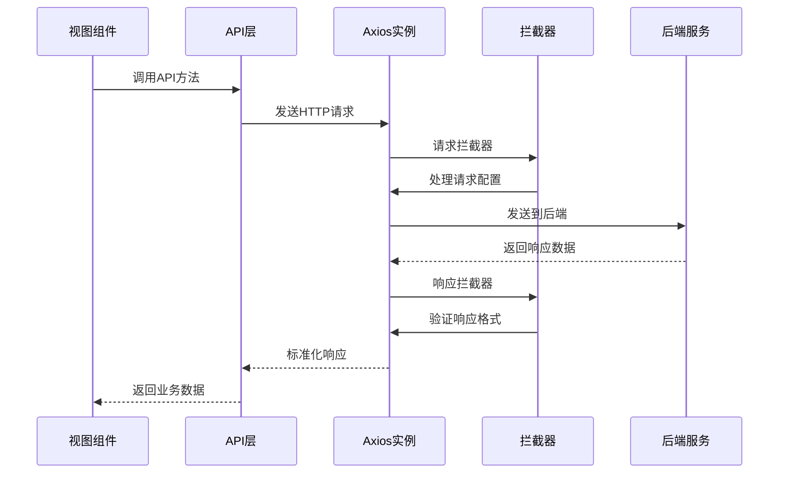
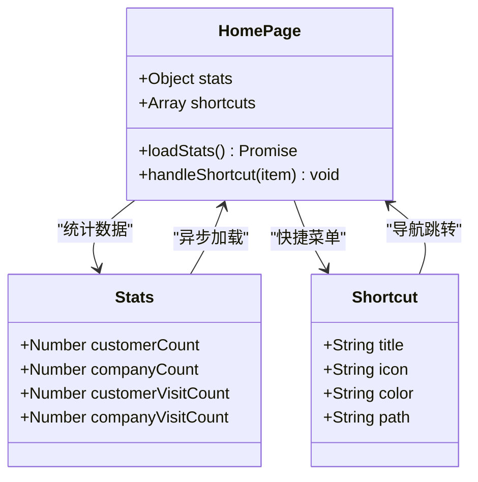
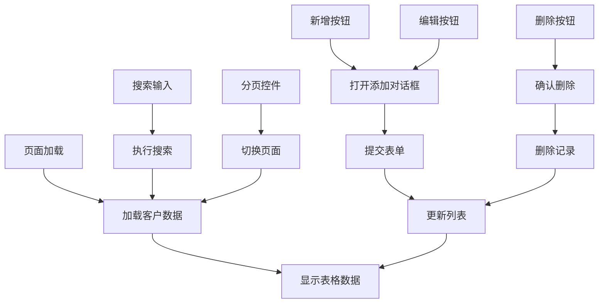
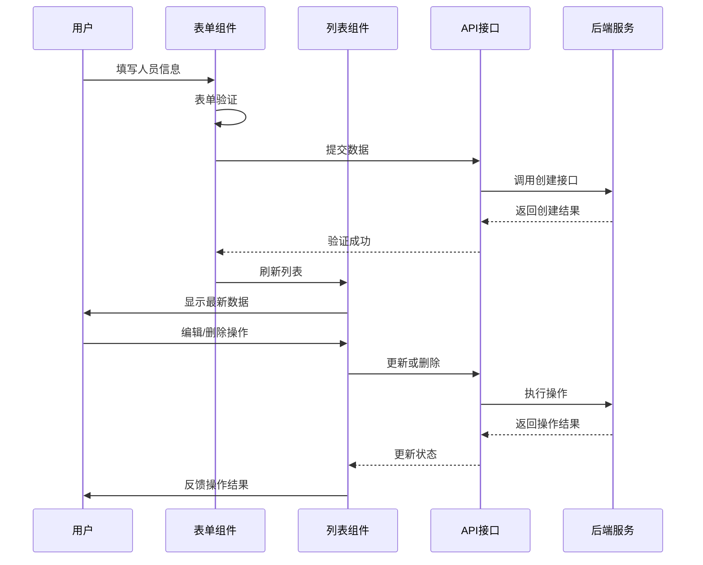

# 项目概述

<cite>
**本文档引用的文件**
- [package.json](file://package.json)
- [main.js](file://src/main.js)
- [App.vue](file://src/App.vue)
- [router/index.js](file://src/router/index.js)
- [api/index.js](file://src/api/index.js)
- [views/Home.vue](file://src/views/Home.vue)
- [views/Table.vue](file://src/views/Table.vue)
- [views/Form.vue](file://src/views/Form.vue)
- [vue.config.js](file://vue.config.js)
- [babel.config.js](file://babel.config.js)
</cite>

## 目录
1. [项目简介](#项目简介)
2. [项目结构](#项目结构)
3. [核心组件](#核心组件)
4. [架构总览](#架构总览)
5. [详细组件分析](#详细组件分析)
6. [依赖关系分析](#依赖关系分析)
7. [性能考虑](#性能考虑)
8. [故障排除指南](#故障排除指南)
9. [结论](#结论)

## 项目简介

本项目是一个基于Vue.js 2.x + Element UI构建的企业级后台管理系统，专注于金融服务领域的客户关系管理与营销支持。系统采用现代化的前端技术栈，提供完整的客户管理、走访人员管理、数据统计分析等功能模块，旨在提升银行个金业务的数字化管理水平。

### 项目定位与业务价值

该系统作为银行个金业务的一体化营销工具，主要服务于以下业务场景：
- **客户生命周期管理**：从客户信息维护到营销活动跟踪的全链路管理
- **营销团队协作**：走访人员的组织管理与工作流程支持
- **数据驱动决策**：通过实时统计分析支持业务决策制定
- **合规风险控制**：完善的权限管理和操作审计机制

### 技术选型优势

选择Vue.js 2.x + Element UI的技术组合具有以下优势：
- **成熟稳定**：Vue.js 2.x经过长期验证，生态完善，社区活跃
- **开发效率**：组件化开发模式大幅提升开发效率
- **用户体验**：Element UI提供丰富的UI组件，保证良好的交互体验
- **学习成本低**：对于前端开发者而言上手相对容易
- **企业级特性**：支持复杂业务场景下的扩展需求

## 项目结构

项目采用标准的Vue CLI项目结构，遵循关注点分离的设计原则：



**图表来源**
- [main.js:1-14](file://src/main.js#L1-L14)
- [router/index.js:1-32](file://src/router/index.js#L1-L32)
- [api/index.js:1-110](file://src/api/index.js#L1-L110)

### 核心目录职责

- **src/**：应用源代码主目录
  - **api/**：统一的API接口封装层
  - **router/**：路由配置与导航管理
  - **views/**：页面级组件集合
  - **main.js**：应用入口文件
  - **App.vue**：根组件

- **public/**：静态资源目录
- **配置文件**：构建和开发环境配置

**章节来源**
- [package.json:1-29](file://package.json#L1-L29)
- [main.js:1-14](file://src/main.js#L1-L14)
- [router/index.js:1-32](file://src/router/index.js#L1-L32)

## 核心组件

### 应用入口与初始化

应用通过main.js进行初始化配置，集成Element UI并启动Vue实例：



**图表来源**
- [main.js:1-14](file://src/main.js#L1-L14)
- [App.vue:1-258](file://src/App.vue#L1-L258)
- [router/index.js:1-32](file://src/router/index.js#L1-L32)

### 主要功能模块

系统包含三个核心功能模块，每个模块都有独立的页面组件和API接口：

| 模块名称 | 页面组件 | 功能描述 | 关键特性 |
|---------|----------|----------|----------|
| **首页仪表盘** | Home.vue | 数据统计与快捷操作 | 统计卡片、快捷菜单、系统信息展示 |
| **客户管理** | Table.vue | 客户信息维护与查询 | 表格展示、分页、搜索、增删改查 |
| **走访人员管理** | Form.vue | 走访人员信息管理 | 表单验证、列表展示、状态管理 |

**章节来源**
- [views/Home.vue:1-175](file://src/views/Home.vue#L1-L175)
- [views/Table.vue:1-214](file://src/views/Table.vue#L1-L214)
- [views/Form.vue:1-143](file://src/views/Form.vue#L1-L143)

## 架构总览

系统采用前后端分离的架构设计，前端负责用户界面展示，后端提供RESTful API服务：



**图表来源**
- [package.json:10-22](file://package.json#L10-L22)
- [api/index.js:1-110](file://src/api/index.js#L1-L110)
- [vue.config.js:3-12](file://vue.config.js#L3-L12)

### 核心架构特性

1. **模块化设计**：每个功能模块独立封装，便于维护和扩展
2. **组件化开发**：采用Vue组件化架构，提高代码复用性
3. **状态管理**：通过props和事件实现组件间通信
4. **异步数据流**：统一的API接口层处理所有HTTP请求
5. **响应式布局**：基于Element UI的响应式设计

## 详细组件分析

### 应用根组件分析

App.vue作为应用的根组件，负责整体布局和全局样式：



**图表来源**
- [App.vue:1-258](file://src/App.vue#L1-L258)

#### 布局特点

- **暗黑主题**：采用深色系配色方案，适合长时间工作环境
- **响应式设计**：适配不同屏幕尺寸的设备
- **导航清晰**：左侧菜单提供明确的功能分类
- **头部信息**：右上角显示用户信息和系统标题

**章节来源**
- [App.vue:1-258](file://src/App.vue#L1-L258)

### 路由系统分析

路由系统采用Vue Router实现，支持动态导入和懒加载：



**图表来源**
- [router/index.js:1-32](file://src/router/index.js#L1-L32)

#### 路由特性

- **Hash模式**：避免页面刷新问题，兼容性更好
- **懒加载**：按需加载组件，提升首屏加载速度
- **菜单同步**：菜单项与路由路径保持一致

**章节来源**
- [router/index.js:1-32](file://src/router/index.js#L1-L32)

### API接口层分析

API层采用Axios封装，提供统一的HTTP请求处理：



**图表来源**
- [api/index.js:1-110](file://src/api/index.js#L1-L110)

#### 接口分类

系统提供多个业务领域的API接口：

| 业务领域 | 接口数量 | 主要功能 | 支持操作 |
|---------|----------|----------|----------|
| **用户管理** | 6个 | 用户信息维护 | 列表、查询、创建、更新、删除 |
| **客户管理** | 6个 | 客户信息管理 | 搜索、详情、批量操作 |
| **公司管理** | 6个 | 企业客户管理 | 分页查询、条件筛选 |
| **走访管理** | 6个 | 营销活动跟踪 | 关联查询、状态管理 |
| **网格员管理** | 6个 | 基层员工管理 | 组织关联、权限控制 |

**章节来源**
- [api/index.js:1-110](file://src/api/index.js#L1-L110)

### 首页仪表盘组件

首页提供数据统计和快捷操作功能：



**图表来源**
- [views/Home.vue:107-156](file://src/views/Home.vue#L107-L156)

#### 统计功能

- **客户总数统计**：实时显示客户数量
- **公司总数统计**：展示企业客户规模
- **走访记录统计**：跟踪营销活动频率
- **快捷操作面板**：快速进入常用功能

**章节来源**
- [views/Home.vue:1-175](file://src/views/Home.vue#L1-L175)

### 客户管理组件

客户管理提供完整的CRUD操作和数据展示：



**图表来源**
- [views/Table.vue:131-207](file://src/views/Table.vue#L131-L207)

#### 核心功能

- **数据表格**：展示客户基本信息和状态
- **搜索功能**：支持按姓名模糊搜索
- **分页处理**：支持多种每页条数配置
- **表单验证**：确保数据完整性
- **批量操作**：支持删除等批量处理

**章节来源**
- [views/Table.vue:1-214](file://src/views/Table.vue#L1-L214)

### 走访人员管理组件

走访人员管理专注于营销团队的组织管理：



**图表来源**
- [views/Form.vue:56-136](file://src/views/Form.vue#L56-L136)

#### 功能特性

- **角色类型管理**：支持多种角色类型的定义
- **状态控制**：启用/禁用状态管理
- **列表展示**：清晰的人员信息展示
- **实时更新**：操作后自动刷新数据

**章节来源**
- [views/Form.vue:1-143](file://src/views/Form.vue#L1-L143)

## 依赖关系分析

项目采用模块化的依赖管理策略，各模块之间保持松耦合：

```mermaid
graph TB
subgraph "核心依赖"
A[Vue 2.7.16] --> B[Element UI 2.15.14]
C[Vue Router 3.6.5] --> D[Axios 1.17.0]
end
subgraph "开发依赖"
E[@vue/cli-service] --> F[@vue/cli-plugin-babel]
G[@vue/cli-plugin-router] --> H[Vue Template Compiler]
end
subgraph "应用模块"
I[main.js] --> J[App.vue]
J --> K[router/index.js]
J --> L[api/index.js]
K --> M[views/Home.vue]
K --> N[views/Table.vue]
K --> O[views/Form.vue]
end
subgraph "运行时依赖"
P[core-js 3.8.3] --> Q[浏览器兼容]
R[Element UI样式] --> S[主题定制]
end
A --> I
D --> L
C --> K
```

**图表来源**
- [package.json:10-22](file://package.json#L10-L22)
- [main.js:1-14](file://src/main.js#L1-L14)

### 依赖层次结构

1. **基础层**：Vue核心框架和运行时依赖
2. **UI层**：Element UI组件库和样式系统
3. **路由层**：Vue Router导航和路由管理
4. **网络层**：Axios HTTP客户端和拦截器
5. **应用层**：业务组件和页面逻辑

### 版本兼容性

- **Vue 2.7.16**：最新的Vue 2.x版本，提供更好的TypeScript支持
- **Element UI 2.15.14**：稳定的企业级UI组件库
- **Vue Router 3.6.5**：成熟的路由解决方案
- **Axios 1.17.0**：功能强大的HTTP客户端

**章节来源**
- [package.json:1-29](file://package.json#L1-L29)

## 性能考虑

### 构建优化

项目采用Vue CLI提供的优化配置，确保生产环境的最佳性能表现：

- **代码分割**：路由级别的懒加载减少初始包体积
- **Tree Shaking**：移除未使用的代码
- **压缩优化**：生产环境自动压缩JS/CSS文件
- **缓存策略**：合理的缓存配置提升加载速度

### 运行时优化

- **虚拟滚动**：对于大量数据的表格可考虑虚拟滚动优化
- **防抖节流**：搜索和输入操作的防抖处理
- **图片优化**：静态资源的压缩和懒加载
- **内存管理**：及时清理定时器和事件监听器

### 开发体验

- **热重载**：开发时的即时反馈
- **错误提示**：友好的编译错误信息
- **调试工具**：Vue DevTools支持
- **代理配置**：本地开发的API代理

## 故障排除指南

### 常见问题诊断

#### 启动问题

**症状**：npm run serve无法启动开发服务器
**排查步骤**：
1. 检查Node.js版本是否满足要求
2. 确认端口8082未被占用
3. 验证依赖安装是否完整
4. 检查网络代理配置

#### API调用失败

**症状**：页面数据加载失败或出现网络错误
**排查步骤**：
1. 检查后端服务是否正常运行
2. 验证代理配置是否正确
3. 查看浏览器开发者工具的网络面板
4. 确认CORS跨域配置

#### 样式显示异常

**症状**：界面元素显示不正确或样式错乱
**排查步骤**：
1. 检查Element UI样式文件是否正确引入
2. 验证自定义CSS覆盖规则
3. 确认浏览器兼容性问题
4. 检查主题变量配置

### 调试技巧

- **Vue DevTools**：使用浏览器扩展调试Vue组件状态
- **浏览器控制台**：查看JavaScript错误和警告信息
- **网络面板**：监控API请求和响应
- **断点调试**：在关键函数处设置断点分析执行流程

**章节来源**
- [vue.config.js:1-14](file://vue.config.js#L1-L14)

## 结论

本Vue.js后台管理系统项目展现了现代前端开发的最佳实践，通过合理的技术选型和架构设计，成功构建了一个功能完备、易于维护的企业级应用。

### 项目优势

1. **技术栈成熟**：Vue.js 2.x + Element UI组合稳定可靠
2. **架构清晰**：模块化设计便于团队协作和代码维护
3. **用户体验**：响应式设计和丰富的UI组件提升使用体验
4. **扩展性强**：良好的架构为后续功能扩展奠定基础

### 发展建议

1. **升级计划**：考虑Vue 3.x的渐进式迁移
2. **测试体系**：建立完善的单元测试和集成测试
3. **性能监控**：添加应用性能监控和错误追踪
4. **文档完善**：补充详细的API文档和开发指南

该系统为企业数字化转型提供了坚实的技术基础，能够有效支撑银行业务的发展需求。